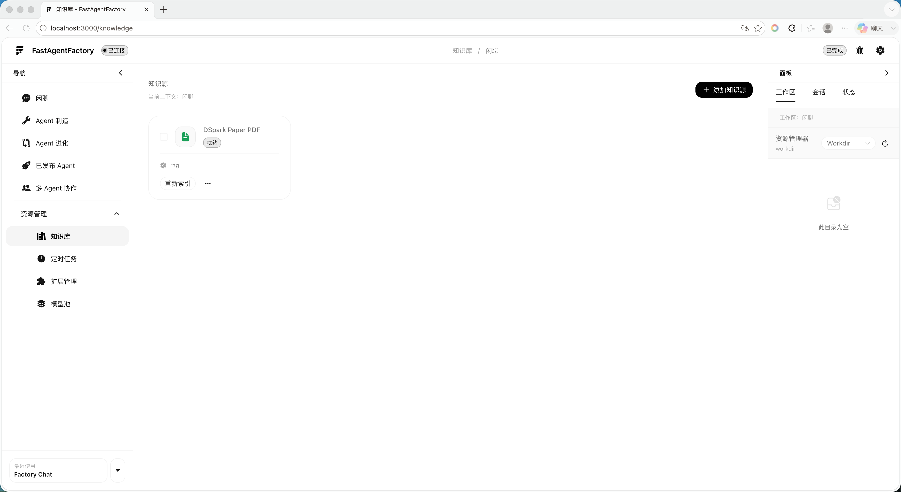
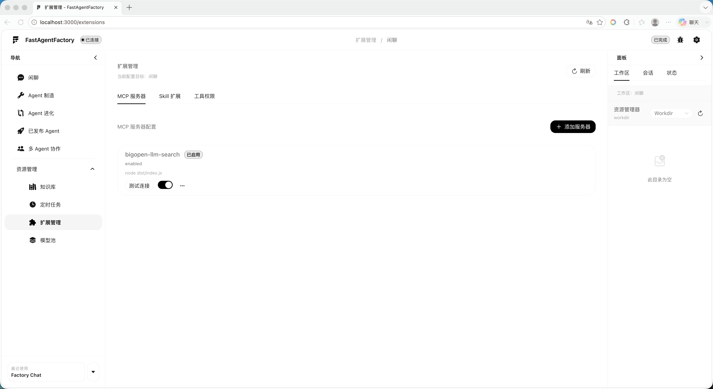
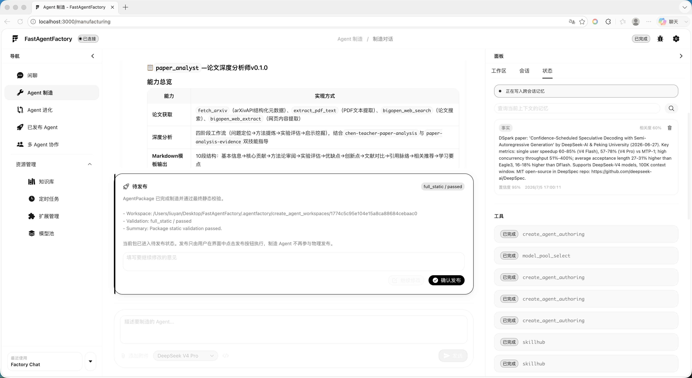

# FastAgentFactory

FastAgentFactory 是面向私有 AI Agent 开发与本地部署的工作台。项目将 Agent 制造、运行、知识库、RAG、工具调用、多轮记忆、权限审批、运行 Trace 与性能 Benchmark 集成在同一套 Web 界面中。

`AMD-Hackson` 分支用于 **2026 AMD AI DevMaster 黑客松赛道二**：

- 本机运行 FastAgentFactory 前端、后端、Agent 工作流与 Docker 隔离运行时。
- RadeonCloud 运行 llama.cpp ROCm Chat 推理、PyTorch ROCm Embedding 和 GPU 遥测。
- 本机通过 SSH 隧道访问远端服务，不向公网暴露模型端口。
- Chat 使用 GGUF；Embedding 使用 SentenceTransformers + PyTorch HIP。
- llama.cpp 源码同时保留在本机，便于后续 AMD 算子、Kernel 和推理参数优化。



## 系统架构

```text
本机
┌────────────────────────────────────────────────────────────┐
│ Browser :3000                                              │
│   │ HTTP + SSE                                             │
│ FastAgentFactory Backend :8000                             │
│   ├─ AgentPackage / RuntimeKernel / RAG / Memory / Tools    │
│   ├─ Model Pool / Benchmark / Trace / Workspace            │
│   └─ Docker Agent Runtime                                  │
│                                                            │
│ SSH Tunnel                                                 │
│   18003 -> remote 8003  Chat OpenAI API                    │
│   18002 -> remote 8002  Embedding API                      │
│   18004 -> remote 8004  Inference control + ROCm telemetry │
└──────────────────────────────┬─────────────────────────────┘
                               │ SSH key only
RadeonCloud                    ▼
┌────────────────────────────────────────────────────────────┐
│ FastAgentFactory Inference Node :8004                      │
│   ├─ llama-server ROCm :8003                               │
│   ├─ SentenceTransformers + PyTorch HIP :8002              │
│   └─ ROCm / VRAM / model runtime telemetry                 │
│                                                            │
│ /root/llama.cpp            editable llama.cpp source       │
│ /root/models               GGUF + mmproj + bge-m3          │
│ /root/.fastagentfactory    registry + PID + logs + venv    │
└────────────────────────────────────────────────────────────┘
```

## 默认模型

首次部署使用以下组合，均可在 `deploy/deploy.env` 修改：

| 用途 | 模型 | 下载方式 | 默认配置 |
| --- | --- | --- | --- |
| Chat | `Qwen3.6-35B-A3B-APEX-I-Quality.gguf` | Hugging Face 国内镜像，断点续传并校验 SHA256 | 256K Context、Q8_0 KV、Flash Attention、单并发、GPU Layers 99 |
| Vision projector | 对应的 `mmproj-...-APEX-F16.gguf` | Hugging Face 国内镜像，断点续传并校验 SHA256 | 随 Chat Profile 加载 |
| Embedding | `BAAI/bge-m3` | ModelScope | 1024 维、归一化、PyTorch HIP |

Chat GGUF 约 23.5 GB，视觉投影器约 0.9 GB，另需 Embedding、llama.cpp 构建目录和运行状态空间。首次部署前请确认 RadeonCloud 持久盘容量充足。

## 环境要求

### 本机控制端

- macOS 或 Linux
- Git
- OpenSSH：`ssh`、`scp`
- `rsync`
- Python 3.11+
- [uv](https://docs.astral.sh/uv/)
- Node.js 18+ 与 npm
- Docker Engine 或 Docker Desktop

Docker 用于 AgentPackage、MCP 和子 Agent 的隔离运行，不用于 RadeonCloud 模型推理。

### RadeonCloud 推理节点

推荐工作空间：

- Image：`amd-oneclick-base:rocm7.2.1-py3.12-v20260416`
- Deploy Type：Notebook（Jupyter / OpenCode）
- GitHub Repo URL：留空
- Notebook Path：留空
- SSH Access：开启

一键脚本要求远端可以通过 SSH Key 登录，并具有 AMD GPU、ROCm 和 PyTorch HIP。脚本只会在缺失时安装 CMake、Ninja、Git、curl、编译器等普通构建工具，**不会升级或重装 ROCm、GPU 驱动或 PyTorch**。

## 一键部署

### 1. 获取项目

```bash
git clone -b AMD-Hackson https://github.com/LiuYan-89937/FastAgentFactory.git
cd FastAgentFactory
```

### 2. 填写 SSH

```bash
cp deploy/deploy.env.example deploy/deploy.env
```

至少填写：

```dotenv
SSH_HOST=<RadeonCloud-IP>
SSH_PORT=<SSH-Port>
SSH_USER=root
SSH_KEY=
```

`SSH_KEY` 可填写私钥绝对路径或 `~/.ssh/...`；如果 ssh-agent 或 OpenSSH 已能自动选择正确密钥，可以留空。

先确认命令本身能登录：

```bash
ssh root@<RadeonCloud-IP> -p <SSH-Port>
```

### 3. 一键准备并启动

```bash
./deploy.sh up
```

首次执行会依次完成：

1. 校验本机配置和 SSH Key 登录。
2. 将固定版本的 llama.cpp 拉到本机 `vendor/llama.cpp`。
3. 探查 RadeonCloud GPU、显存、磁盘、ROCm、PyTorch HIP 与现有 llama-server。
4. 仅在缺失时安装远端普通构建工具。
5. 同步当前 FastAgentFactory 工作树和本机 llama.cpp 源码到远端。
6. 在远端使用 `GGML_HIP=ON` 构建 `llama-server`。
7. 从国内镜像断点续传 Chat GGUF 和 mmproj，并校验官方 SHA256。
8. 从 ModelScope 下载或复用 `BAAI/bge-m3`。
9. 幂等创建远端本地 Profile 和本机 external Profile，设置 `main`、`task`、`compression`、`embedding` 默认角色。
10. 启动远端推理节点，等待 Chat 与 Embedding 都进入 `ready`。
11. 生成本机 `.env` 的 SSH 隧道配置与资源加密密钥。
12. 准备本机 Python/前端依赖和 Docker Agent Runtime，启动前后端。

模型下载支持续传。已校验文件会通过旁路校验标记直接复用，重复执行不会重新下载 20 GB 以上的 GGUF。

启动完成后访问：

```text
http://localhost:3000
```

`deploy.sh up` 在前台运行本机服务。按 `Ctrl+C` 会停止本机前后端和 SSH 隧道，但远端推理节点保持运行；需要释放远端显存时执行 `./deploy.sh down`。

## 部署命令

| 命令 | 作用 |
| --- | --- |
| `./deploy.sh up` | 完成幂等部署，然后启动本机 Web 和 SSH 隧道。 |
| `./deploy.sh bootstrap` | 准备本机与远端、下载模型并启动远端推理，但不启动本机 Web。 |
| `./deploy.sh doctor` | 查看远端 GPU、显存、磁盘、ROCm、PyTorch HIP 和 llama.cpp。 |
| `./deploy.sh status` | 查看远端推理节点、Chat、Embedding 和软件版本状态。 |
| `./deploy.sh logs` | 查看远端推理节点最近 200 行日志。 |
| `./deploy.sh restart` | 重启远端推理节点并等待两个模型 ready。 |
| `./deploy.sh down` | 停止远端推理节点，同时卸载 Chat 与 Embedding、释放显存。 |
| `./deploy.sh models` | 续传/校验模型并更新远端 Profile；节点已运行时自动重启模型，不重装 ROCm。 |
| `./deploy.sh sync` | 同步当前 FastAgentFactory 与本机 llama.cpp 工作树到远端。 |
| `./deploy.sh build-llama` | 在远端对已同步源码增量构建 llama-server。 |

更换 RadeonCloud 实例时只需修改 `deploy/deploy.env` 中的 SSH Host 和 Port，再运行 `./deploy.sh up`。持久盘路径变化时同时修改 `REMOTE_MODEL_ROOT`、`REMOTE_STATE_ROOT` 和 `REMOTE_LLAMA_CPP_DIR`。

## 日常启动

完成过 `bootstrap` 后，日常启动本机工作台也可直接运行：

```bash
./start.sh
```

`start.sh` 会：

- 读取 `.env`。
- 建立并验证 Chat、Embedding、Telemetry 三条 SSH 转发。
- 使用 uv 同步本机 Python Web 依赖。
- 使用 npm 准备前端依赖。
- 检查并构建 Docker Agent Runtime。
- 启动后端 `:8000` 和前端 `:3000`。

它不会重新构建 llama.cpp 或下载模型；这些操作统一由 `deploy.sh` 管理。

## 使用指南

### 模型配置

进入“模型配置”页面可以：

- 查看远端 AMD GPU、ROCm、PyTorch HIP、显存占用和 GPU 利用率。
- 查看 Chat 与 Embedding 的加载阶段、日志和实际 Profile 参数。
- 加载、卸载、重启模型。
- 设置默认 `main`、`task`、`compression` 与 `embedding` Profile。
- 修改 Context、最大输出、压缩阈值、GPU Layers、KV Cache 类型、并发、Flash Attention 和图片输入能力。
- 根据 GGUF 元数据、上下文、并发和 KV Cache 类型查看预计显存占用及余量。

保存一个已经加载的 external Profile 后，本机后端会将配置透传到 RadeonCloud 并重启对应模型，新的 `--ctx-size`、KV Cache、Flash Attention 等参数会真正进入远端 llama-server 命令行。



### 闲聊与 Tool Calling

进入“闲聊”后：

1. 确认 Chat Profile 为 `ready` 且已设为默认 `main`。
2. 发送普通消息验证流式输出。
3. 发送需要文件、知识库或 Workspace 的任务验证结构化 Tool Calling。
4. 在右侧状态栏查看 Thinking、工具调用、权限审批、Token 和 KV Cache 指标。

### 知识库与 RAG

1. 创建知识源并上传文档。
2. 等待文档切分和 Embedding 完成。
3. 将知识源挂载到当前 Agent 或 AgentPackage。
4. 提问内部资料、项目事实或要求引用来源的问题。
5. 在 Trace 中检查 `knowledge search/open/read` 与引用来源，查询无结果时不应伪造内容。

### Agent 制造与运行

在“Agent 制造”中描述目标、输入边界和交付标准。生成的 AgentPackage 保存模型 Profile 引用、工具权限、知识库和运行契约，不保存 GPU 绝对配置。

发布后可以为 Agent 创建独立运行实例。每个实例拥有独立会话、工作区、知识库、长期记忆、工具审批和 Trace。



### Benchmark

“性能测试”页面统一记录：

- TTFT
- Prompt Tokens/s
- Decode Tokens/s
- End-to-End Latency
- Peak VRAM
- Average / Peak GPU Usage
- Power
- KV Cache 命中相关指标

每次优化应使用相同 Prompt、输出上限、Context、并发和采样参数，记录 implementation label 与 revision，再与 Baseline 对比。

## llama.cpp AMD 算子改造

首次 `bootstrap` 后，本机和远端各有一份相同的 llama.cpp 工作树：

```text
本机：vendor/llama.cpp
远端：/root/llama.cpp
```

本机目录是改造源。开始开发前创建独立分支：

```bash
cd vendor/llama.cpp
git switch -c amd-kernel-experiment
```

修改 HIP Kernel 或 llama.cpp 实现后：

```bash
cd ../..
./deploy.sh sync
./deploy.sh build-llama
./deploy.sh restart
```

`sync` 检测到本机 llama.cpp 有未提交修改时会保留当前工作树，不会强制切回固定版本。远端使用增量构建，因此适合反复进行 Kernel 修改、Benchmark 和 rocprofv3 Profiling。

正式提交算子修改时，应将 llama.cpp 改动提交到独立 fork/分支，并将 `LLAMA_CPP_REPOSITORY` 与 `LLAMA_CPP_REVISION` 更新为可复现的提交；不要只保留远端未提交文件。

## 配置与数据目录

### 本机

```text
.env                         本机运行与 SSH 隧道配置，不提交
deploy/deploy.env            一键部署配置，不提交
.agentfactory/               模型池、知识库、记忆与平台状态，不提交
.agent_runtime/              Agent 工作区、Trace 与 Checkpoint，不提交
vendor/llama.cpp/            可编辑 llama.cpp Git 工作树，不提交到主仓库
```

### RadeonCloud

默认目录：

```text
/root/FastAgentFactory       同步的项目源码
/root/.fastagentfactory      Python venv、模型池 SQLite、PID 与日志
/root/models                 GGUF、mmproj 与 ModelScope 模型
/root/llama.cpp              同步的 llama.cpp 源码及 build 目录
```

`/root` 是否持久取决于实例类型。若平台提供持久卷，应在 `deploy/deploy.env` 将模型、状态和 llama.cpp 路径改到其挂载点；否则工作空间到期前必须备份 Benchmark、Profile、Trace、演示材料和 llama.cpp 改动。

## 安全边界

- SSH 必须使用 Key 登录，不在配置文件中保存密码。
- `deploy/deploy.env`、`.env`、模型文件、运行状态和本地 llama.cpp 工作树均已排除 Git 提交。
- 远端 `8002`、`8003`、`8004` 只监听 `127.0.0.1`，不要直接暴露公网。
- `AGENTFACTORY_RESOURCE_MASTER_KEY` 首次部署自动生成并写入本机 `.env`；丢失后旧的加密资源无法恢复。
- 部署脚本不会升级 ROCm、驱动或 PyTorch。基础镜像不兼容时应更换工作空间镜像，而不是在原环境盲目覆盖运行时。

## 排障

### SSH 登录失败

```bash
ssh -vvv root@<host> -p <port>
```

确认 RadeonCloud 已开启 SSH Access、实例内 sshd 正在运行、平台端口已刷新，并且 Profile SSH Public Key 与本机私钥匹配。

`channel ... open failed: connect failed: Connection refused` 通常表示 SSH 本身已连接，但远端 `8002/8003/8004` 尚未启动。执行：

```bash
./deploy.sh status
./deploy.sh logs
./deploy.sh restart
```

### ReadTimeout

先看报错 URL：

- `/models` 超时：检查远端节点是否正在首次解析 GGUF、缓存是否预热、SSH 隧道是否稳定。
- `/v1/chat/completions` 超时：检查模型是否仍在 loading、Context 是否过大、GPU 是否在计算。
- `18004` 连接失败：检查 Telemetry SSH 转发和远端节点 PID。

```bash
./deploy.sh status
./deploy.sh logs
```

### 模型下载中断

直接重新执行：

```bash
./deploy.sh models
```

GGUF 使用 `curl --continue-at -` 续传；完成后必须通过 SHA256 才会写入已验证标记。Embedding 由 ModelScope 缓存复用。

### 模型无法加载或显存不足

检查：

```bash
./deploy.sh doctor
./deploy.sh logs
```

然后在模型配置中降低 Context、并发或 KV Cache 精度，或减少 GPU Layers。修改已加载 Profile 会触发远端重启并应用新参数。

### 本机 Docker 不可用

启动 Docker Desktop 或 Docker Engine后重新运行 `./start.sh`。模型推理仍在 RadeonCloud，但 MCP、AgentPackage 和子 Agent 的隔离运行依赖本机 Docker。

## 静态检查

项目开发约定不通过部署脚本运行 Agent 业务示例。提交前执行语法和静态检查：

```bash
bash -n deploy.sh deploy/remote_runtime.sh start.sh web_frontend/start_backend.sh
python3 -m compileall -q agent_factory web_frontend/backend deploy
git diff --check
```

前端类型检查：

```bash
cd web_frontend/frontend
npm run type-check
```
