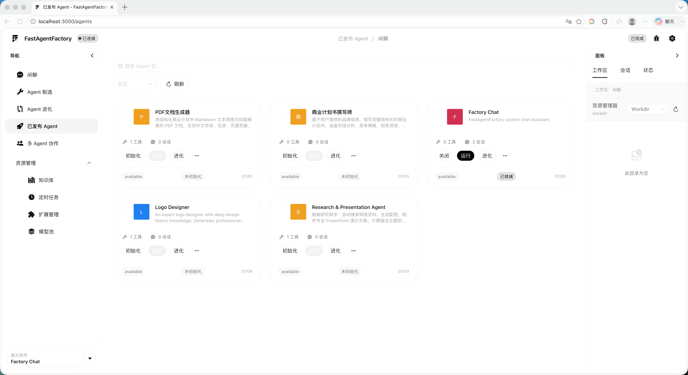
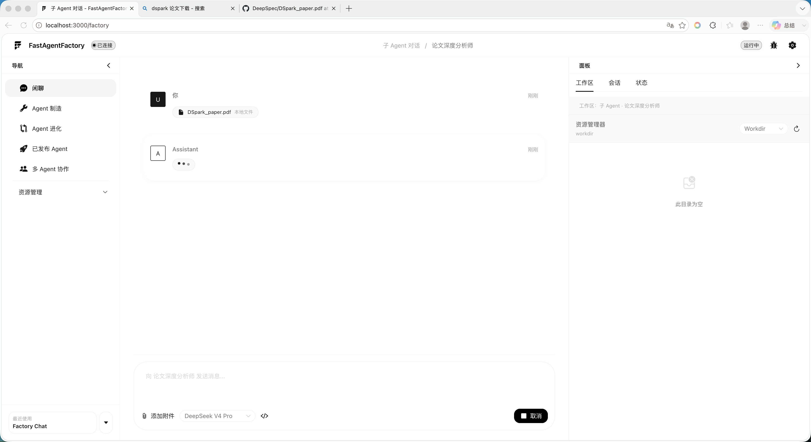
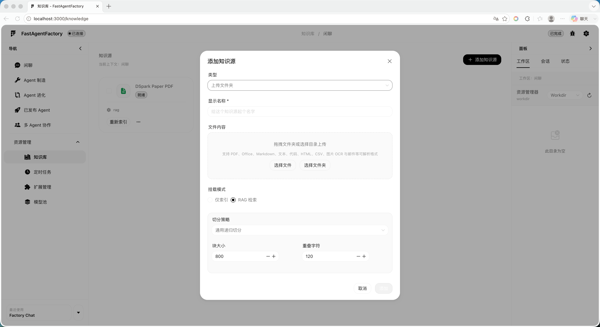
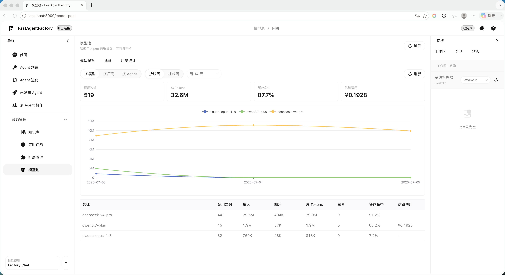
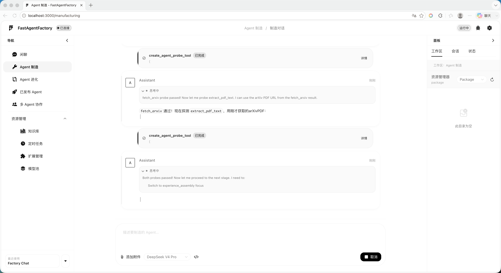
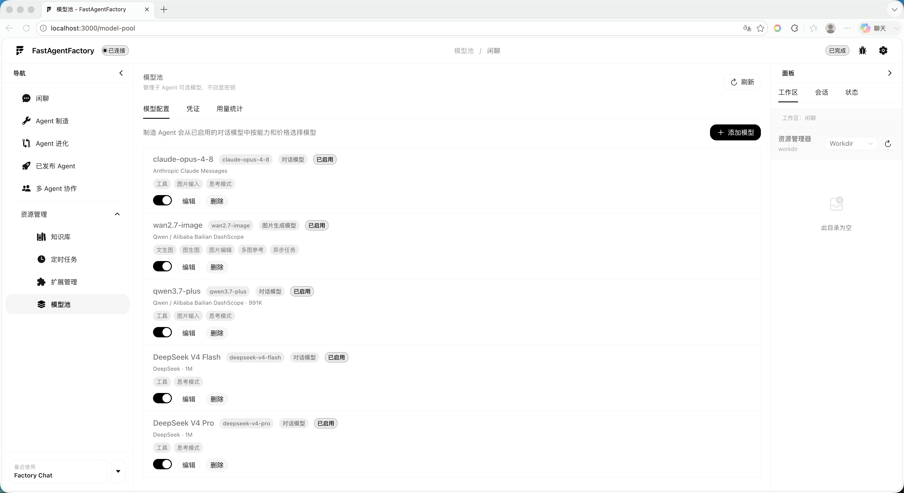
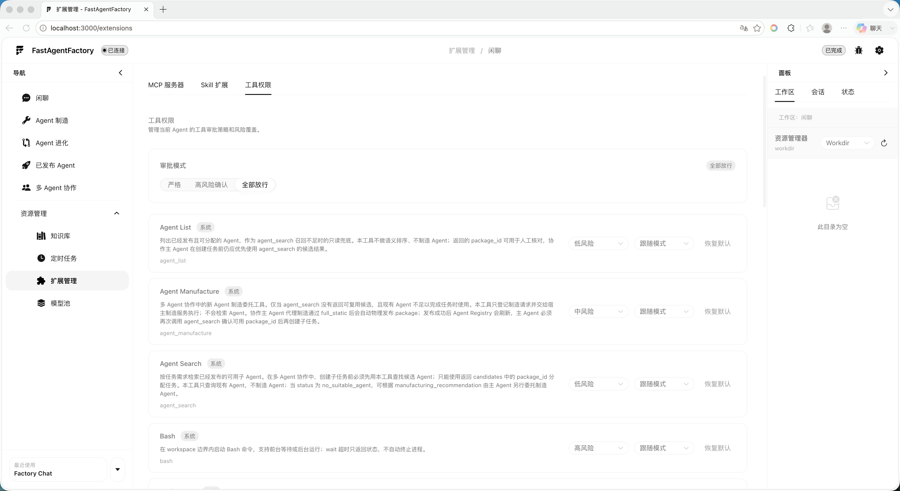

# FastAgentFactory

FastAgentFactory 是一个本地优先的 Agent 工厂系统，用来创建、运行、进化和协作调度可交付的 Agent。它把模型池、工具权限、知识库、MCP/Skill 扩展、工作区、会话、记忆、定时任务和运行 trace 收进同一个 Web 工作台里，让 Agent 从“能聊”走向“能生产、能交付、能复盘”。


## 适合做什么

- 用自然语言制造一个可发布的 AgentPackage。
- 为不同 Agent 配置不同模型、工具、知识库和扩展能力。
- 运行已发布 Agent，并保留独立会话、工作区和产物。
- 对已有 Agent 做进化改造，再验证和发布新版本。
- 用多 Agent 协作完成复杂任务，由主 Agent 拆分、调度、验收和汇总。
- 统一管理本地模型文件、ROCm 推理配置、Token 用量和运行状态。
- 在本地查看每次运行的文件、工具调用、trace、记忆和上下文状态。

## 功能概览

| 能力 | 说明 |
| --- | --- |
| 闲聊助手 | 内置 `factory_chat` 系统包，支持普通对话、工具调用、附件和本地多模态输入。 |
| Agent 制造 | 根据目标自动分析任务、选择模式、装配模型/工具/Skill/知识库并生成 AgentPackage。 |
| 已发布 Agent | 每个 AgentPackage 拥有独立会话、工作区、知识库、定时任务、MCP/Skill 和模型绑定。 |
| Agent 进化 | 对已发布 Agent 做独立上下文改造、验证和重新发布。 |
| 多 Agent 协作 | 主 Agent 检索可用子 Agent，创建任务、管理依赖、验收交付并推进后续步骤。 |
| 本地模型 | 管理模型文件、推理 Profile、能力标签和用量统计。 |
| 知识库与 RAG | 上传文件或文件夹，解析、分块、索引、检索并挂载到指定上下文。 |
| 扩展系统 | 管理 MCP、Skill、SkillHUB 安装结果和工具权限策略。 |
| 工作区 | 查看运行文件、附件、产物、共享材料和 Agent 输出。 |
| 长期记忆 | 按 Agent 写入和查询跨会话记忆，支持置信度排序和删除。 |

## 产品界面

Agent 制造把需求分析、能力装配、工具调用和发布过程放在同一条对话链路里。


本地模型注册中心用于维护模型文件、ROCm 推理配置、能力和用量。AgentPackage 只引用 `profile_id`。


已发布 Agent 可以像普通应用一样进入会话、查看工作区、挂载知识库和管理扩展。



多 Agent 协作让主 Agent 根据任务检索子 Agent，按依赖关系分配工作，并在交付后继续验收和推进。



## 快速开始

### 环境要求

- Python `>= 3.11`
- Node.js `>= 18`
- npm
- uv
- AMD Radeon GPU
- ROCm 软件栈和 ROCm 版 PyTorch
- Docker Engine 或兼容的容器运行时
- 已下载到本机的对话模型和 Embedding 模型

### 初始化本地配置

复制模板：

```bash
cp .env.example .env
```

模型 Profile 和默认角色在“本地模型”页面中配置并保存到模型池数据库，不需要把 Profile ID 写入 `.env`。本机推理服务默认使用 `127.0.0.1:8001/v1`，Embedding 服务默认使用 `127.0.0.1:8002`。

`.env` 最小只需配置资源加密密钥：

```bash
AGENTFACTORY_RESOURCE_MASTER_KEY=
```

说明：

- 主模型用于闲聊、制造、进化和普通 Agent 对话；任务模型用于结构化输出、分类、抽取和意图分析；压缩模型用于上下文压缩。
- 第一个可用的对话 Profile 会自动成为默认值，也可以在“本地模型”页面分别指定主模型、任务模型和压缩模型。
- 第一个可用的 Embedding Profile 会自动成为默认值，也可以在页面中显式指定。
- Embedding 模型由独立的本地 ROCm 服务加载，用于知识库、RAG、长期记忆和 Agent 检索。
- 模型端点支持回环、私有地址以及明确列入允许列表的内部服务主机。
- Profile ID 与推理端点环境变量仍可作为部署级覆盖项，但不是常规配置的必填项。
- `AGENTFACTORY_RESOURCE_MASTER_KEY` 用于加密 Agent 的运行时资源配置；请使用稳定的长随机值，丢失后无法解密已保存的资源。
- `.env` 是本地私有配置，不要提交到 git。

### 启动

在仓库根目录运行：

```bash
./start.sh
```

启动脚本会检查 `.env`、Python 依赖、前端依赖、Docker daemon 和运行时镜像。镜像不存在时会自动构建 `agentfactory-runtime-python:3.12`。Agent 的额外本地依赖会在制造/probe 阶段构建为锁定的派生镜像，运行时不会临时安装依赖。

启动成功后访问：

- 前端：[http://localhost:3000](http://localhost:3000)
- 后端：[http://localhost:8000](http://localhost:8000)
- 健康检查：[http://localhost:8000/health](http://localhost:8000/health)

## 推荐工作流

### 1. 配置模型池

先注册已下载的本地模型目录，再创建可供 Agent 使用的 Chat 或 Embedding 推理 Profile。



模型用量会按模型、推理引擎和 Agent 记录，便于比较本地模型在实际任务中的消耗。



### 2. 制造 Agent

进入「Agent 制造」，描述目标 Agent 的用途、边界和交付标准。系统会完成任务分析、模式选择、工具/Skill/模型装配、验证和发布准备。

制造出的 AgentPackage 会保存：

- Agent 身份和说明。
- 运行模式和节点配置。
- 模型 `profile_id`。
- 工具、MCP、Skill 和知识库配置。
- 工作区和运行契约。

不会写入模型目录、内部端点或运行时环境值。

### 3. 运行 Agent

进入「已发布 Agent」，选择 Agent 后初始化运行实例。每个 Agent 都有自己的会话、工作区、知识库、定时任务、记忆和扩展配置。

你可以上传附件、粘贴图片、调用工具、生成文件，并在右侧工作区查看产物。

### 4. 进化 Agent

进入「Agent 进化」，选择目标 AgentPackage 并描述修改目标。进化过程使用独立会话和上下文，不会混入普通运行会话。



### 5. 组织多 Agent 协作

进入「多 Agent 协作」，主 Agent 会根据任务检索合适的子 Agent，创建任务并声明依赖。子 Agent 默认彼此不可见，共享材料通过协作工作区传递。子 Agent 提交后，主 Agent 会收到协作事件并继续验收或推进后续任务。

第一版重点支持：

- 主 Agent 拆目标和定义交付标准。
- 最多多个子 Agent 并行执行。
- 任务依赖和后续自动推进。
- 协作共享工作区。
- 子 Agent 交付物汇总与主 Agent 验收。

## 知识库、扩展与工具权限

知识库按上下文隔离：闲聊属于 `factory_chat`，子 Agent 属于对应 AgentPackage，进化上下文属于目标包和进化会话。



扩展系统支持 MCP、Skill 和 SkillHUB 安装结果。你可以为每个 Agent 单独启用扩展、配置工具权限、调整风险等级。



工具权限分为两层：

- 粗粒度模式：严格审批、高风险以下自动放行、全部自动放行。
- 细粒度配置：每个 Agent 可以单独调整工具风险等级和审批策略。

建议默认使用中间档：低/中风险工具自动放行，高风险工具保留确认。

## 本地模型运行时

本地模型运行时包含两种推理引擎：

| 模型类型 | 引擎 | 用途 |
| --- | --- | --- |
| 对话模型 | `vllm_rocm` | 对话、工具调用、结构化输出和推理 |
| Embedding | `transformers_rocm` | 知识库、记忆和 Agent 检索 |

模型文件先在“本地模型”页面注册，再建立推理 Profile。Profile 保存 dtype、量化方式、Tensor Parallel、上下文长度和显存策略。模型加载进程会检查 ROCm PyTorch 环境与本地模型目录。

RadeonCloud 上可使用 [docker-compose.rocm.yml](deploy/docker-compose.rocm.yml) 启动对话与 Embedding 服务。部署参数见 [rocm.env.example](deploy/rocm.env.example)。

## 附件与工作区

附件支持：

- 本地文件上传。
- 批量上传，单次消息最多 9 个附件。
- 图片直接粘贴到输入框。
- 文本片段。
- URL。
- 工作区文件。

附件会进入统一导入链路，保存到当前 Agent/闲聊工作区，然后解析为文本、文件引用或图片输入。图片在多模态主模型可用时作为图片输入，否则仍可走文档解析或 OCR 类链路。

运行数据默认写入：

```text
.agentfactory/
.agent_runtime/
```

这些目录包含会话、checkpoint、trace、工作区文件、附件导入文件、知识库索引、定时任务数据库、模型池 SQLite 和子 Agent 运行产物。它们是本地运行状态，不应提交到 git。

## 常用命令

```bash
# 一键启动前后端
./start.sh

# 只启动后端
./web_frontend/start_backend.sh

# 只启动前端
cd web_frontend/frontend
npm run dev

# 同步 Python 依赖
uv sync --extra web

# 前端类型检查
cd web_frontend/frontend
npm run type-check

# 构建前端
cd web_frontend/frontend
npm run build
```

## Web API

后端服务默认运行在 `http://localhost:8000`。

主要 API 分组：

- `/api/runtime`：运行时事件、命令和状态。
- `/api/agent-packages`：已发布 Agent 包、实例和会话。
- `/api/model-pool`：本地模型文件、推理配置、ROCm 状态和用量统计。
- `/api/workspace`：工作区根目录、文件列表、文件读取和原始文件预览。
- `/api/knowledge`：知识源、文档、检索和索引。
- `/api/scheduler`：定时任务、运行记录和立即运行。
- `/api/extensions`：MCP、Skill、工具权限。
- `/api/memory`：跨会话记忆查询和删除。
- `/api/collaboration`：多 Agent 协作会话、任务、消息和共享工作区。

前端通过 HTTP API 和 SSE 事件流与后端通信。普通请求走 HTTP；流式回复、工具审批、状态更新和运行事件走事件流。

## 开发说明

后端：

- Python 包位于 [agent_factory](agent_factory)。
- Web API 位于 [web_frontend/backend](web_frontend/backend)。
- 依赖由 `uv` 管理。

前端：

- Vue 3 + Vite + Pinia。
- 页面和组件位于 [web_frontend/frontend/src](web_frontend/frontend/src)。
- UI 组件基于 Naive UI。
- Markdown、代码块、LaTeX、Mermaid 和图表渲染由前端渲染管线处理。

常用检查：

```bash
python -m py_compile path/to/file.py

cd web_frontend/frontend
npm run type-check
```

如果只改文档，不需要启动前后端。

## 排障

### `.env` 缺少配置

`./start.sh` 会提示缺失的关键变量。服务仍可能启动，但模型调用、RAG、记忆或知识库可能失败。

处理方式：

1. 复制 `.env.example` 到 `.env`。
2. 填写主模型、任务模型、压缩模型和 embedding 模型。
3. 重新运行 `./start.sh`。

### Docker daemon 不可用

报错通常说明 Docker Desktop 没启动，或当前 shell 找不到 `docker`。

处理方式：

1. 启动 Docker Desktop。
2. 确认 `docker info` 可用。
3. 重新运行 `./start.sh`。

### 运行时镜像缺失

`./start.sh` 会自动构建默认镜像：

```text
agentfactory-runtime-python:3.12
```

如需指定镜像名：

```bash
AGENTFACTORY_RUNTIME_IMAGE=your-image:tag ./start.sh
```

### 前端依赖缺失

如果 `node_modules` 存在但 Vite 不可用，启动脚本会自动执行 `npm install`。也可以手动执行：

```bash
cd web_frontend/frontend
npm install
```

### 子 Agent 初始化后无法对话

检查：

- AgentPackage 是否已初始化完成。
- Docker daemon 是否正常。
- 本地模型文件和推理 Profile 是否启用。
- AgentPackage 的模型配置是否引用了存在且启用的 `profile_id`。
- 后端日志和该 Agent 的 trace。

### 思考模式报错

思考模式依赖所选本地模型的 chat template 和工具调用能力。

处理方式：

- 确认模型确实支持 reasoning/thinking。
- 确认本地模型 Profile 的 reasoning 能力声明正确。
- 检查 vLLM 日志和模型 chat template。

## 数据与安全边界

- AgentPackage 只保存本地模型 `profile_id` 和能力要求。
- `.env`、`.agentfactory/`、`.agent_runtime/` 是本地私有运行状态。
- 删除会话会连带清理对应 trace/checkpoint 等运行记录。
- 工具审批策略应按任务风险调整，不建议长期对未知工具全部自动放行。

## 当前定位

FastAgentFactory 面向本地开发、个人工作流和团队内部 Agent 生产实验。它不是只展示单次对话的聊天壳，而是围绕“制造 Agent、运行 Agent、扩展 Agent、观察 Agent、协作 Agent”搭建的一套完整工作台。
