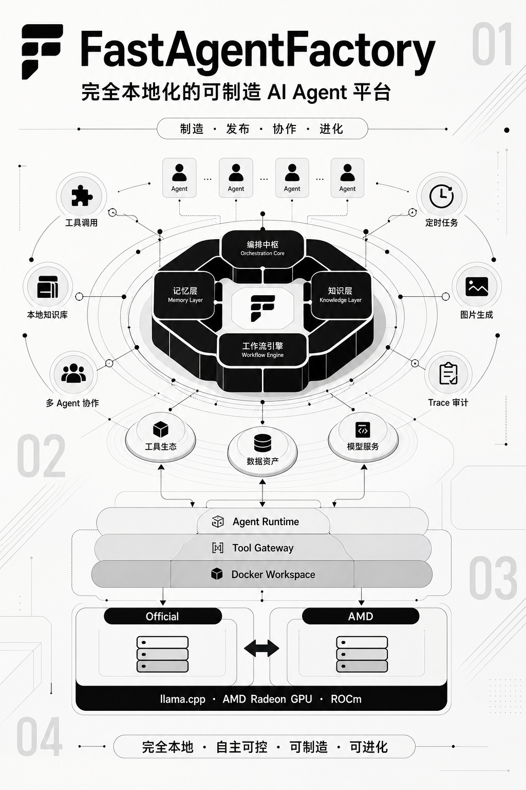

[English](README.md) | [简体中文](README.zh-CN.md)

# FastAgentFactory

FastAgentFactory 是一套完全本地化、可制造、可进化的个人智能助手平台。它把日常对话、跨会话记忆、本地知识库、文档处理、网页检索、定时任务、邮件、图片生成和多 Agent 协作统一到可审计的 AgentPackage 运行体系中，并提供从自然语言需求到 Agent 制造、发布、运行和持续进化的完整生命周期。

平台支持两种部署拓扑：AMD GPU 与 Web 运行在同一台 Linux/ROCm 主机时直接连接本地推理节点；GPU 位于独立主机时，通过 SSH 隧道访问只监听回环地址的推理服务。Chat 使用 GGUF 与 llama.cpp ROCm，Embedding 使用 SentenceTransformers 与 PyTorch HIP，AgentPackage、MCP 和子 Agent 使用 Docker 隔离运行。仓库同时保留 Official 与 AMD 两套 llama.cpp 源码，用于在一致模型和配置下开发、验证 AMD HIP Kernel。



## 文档导航

- [项目说明](project-documentation/ProjectOverview.zh-CN.md)：比赛要求的项目定位、架构、能力、模型与优化总览。
- [部署与验收指南](project-documentation/Deployment.zh-CN.md)：从 SSH 配置到双端启动、模型下载、验收、更新与实例迁移。
- [应用场景](project-documentation/ApplicationScenarios.zh-CN.md)：个人智能助手主场景与金融研究示例。
- [Agent 架构](project-documentation/AgentArchitecture.zh-CN.md)：运行层次、工具网关与隔离边界。
- [核心能力](project-documentation/CoreCapabilities.zh-CN.md)：模型、工具、记忆、知识、调度和交付能力。
- [AMD Radeon GPU 推理优化](project-documentation/performance/ROCmOptimizations.zh-CN.md)：自研 HIP Kernel、融合与 MTP 说明。
- [补充材料](SUPPLEMENTARY_MATERIALS.zh-CN.md)。
- README 当前页面：项目定位、系统架构、主要功能、日常使用和开发入口。

## 应用场景：个人智能助手

FastAgentFactory 将个人智能助手定义为一个长期运行、理解用户偏好、能够调用真实工具并完成交付的本地工作台，而不是只回答问题的聊天窗口。

- **个人知识与事务助手**：检索本地资料，整理文档和附件，保存报告、图片及其他交付物，并通过跨会话记忆延续用户偏好和历史决策。
- **办公自动化助手**：调用网页搜索、文件、日历、定时任务和邮件工具，完成资料收集、报告生成、周期提醒与受控发送。
- **多 Agent 研究助手**：主 Agent 根据目标拆分任务，协调多个专业 Agent 并行取证，再进行语义验收与统一交付。
- **可制造的专属助手**：用户可以用自然语言制造新的 AgentPackage，配置模型、工具、Skill、知识、Resource 和运行 Pattern，并根据 Trace 对其持续进化。

### 金融研究示例

仓库内置三个只面向 A 股的专业 Agent，用于展示个人智能助手在复杂行业任务中的组合能力：

| Agent | 典型任务 | 可交付结果 |
| --- | --- | --- |
| A 股盘面雷达 | 汇总市场宽度、成交额、板块与领涨个股，按计划生成市场简报 | 盘面摘要、异常说明、保存的 Markdown 报告、经用户授权发送的邮件 |
| A 股上市公司研究员 | 围绕单家公司整合行情、财务、趋势和用户资料进行证据化研究 | 数据来源与时间明确的公司研究报告 |
| A 股持仓风险管家 | 读取个人模拟持仓，分析集中度、波动率、回撤、相关性和指定压力情景 | 组合风险报告、风险提示与情景分析 |

三个 Agent 可以由主助手统一编排，例如同时研究市场、贵州茅台、宁德时代和中国平安，再对模拟持仓执行市场下跌 `5%` 与 `10%` 的压力评估，形成完整报告并发送到已配置邮箱。所有金融输出仅用于研究与系统能力演示，不构成投资建议。

## 系统架构

```text
本机
┌────────────────────────────────────────────────────────────┐
│ Browser :3000                                              │
│   │ HTTP + SSE                                             │
│ FastAgentFactory Backend :8000                             │
│   ├─ AgentPackage / RuntimeKernel / RAG / Memory / Tools    │
│   ├─ Model Pool / Benchmark / Trace / Workspace            │
│   └─ Docker Agent Runtime                                  │
│                                                            │
│ SSH Tunnel                                                 │
│   18003 -> remote 8003  Chat OpenAI API                    │
│   18002 -> remote 8002  Embedding API                      │
│   18004 -> remote 8004  Inference control + ROCm telemetry │
└──────────────────────────────┬─────────────────────────────┘
                               │ SSH key only
AMD ROCm inference host       ▼
┌────────────────────────────────────────────────────────────┐
│ FastAgentFactory Inference Node :8004                      │
│   ├─ llama-server ROCm :8003                               │
│   ├─ SentenceTransformers + PyTorch HIP :8002              │
│   └─ ROCm / VRAM / model runtime telemetry                 │
│                                                            │
│ /root/fastagentfactory-llama-sources  official + AMD source│
│ /root/.fastagentfactory/llama         builds + active link │
│ /root/models               GGUF + mmproj + bge-m3          │
│ /root/.fastagentfactory    registry + PID + logs + venv    │
└────────────────────────────────────────────────────────────┘
```

## 默认模型

首次部署使用以下组合；需要覆盖默认值时统一写入根目录 `.env`：

| 用途 | 模型 | 下载方式 | 默认配置 |
| --- | --- | --- | --- |
| Chat | `Qwen3.6-35B-A3B-APEX-I-Quality.gguf` | Hugging Face 国内镜像，断点续传并校验 SHA256 | 256K Context、Q8_0 KV、Flash Attention、单并发、GPU Layers 99 |
| Vision projector | 对应的 `mmproj-...-APEX-F16.gguf` | Hugging Face 国内镜像，断点续传并校验 SHA256 | 随 Chat Profile 加载 |
| Embedding | `BAAI/bge-m3` | ModelScope | 1024 维、归一化、PyTorch HIP |

Chat GGUF 约 23.5 GB，视觉投影器约 0.9 GB，另需 Embedding、llama.cpp 构建目录和运行状态空间。首次部署前请确认推理节点磁盘容量充足。

## 环境要求

### 本机控制端

- macOS 或 Linux
- Git
- OpenSSH：`ssh`、`scp`
- `rsync`
- Python 3.11+
- [uv](https://docs.astral.sh/uv/)
- Node.js 18+ 与 npm
- Docker Engine 或 Docker Desktop

Docker 用于 AgentPackage、MCP 和子 Agent 的隔离运行，不用于 llama.cpp 或 PyTorch ROCm 模型推理。

### AMD ROCm 推理节点

推理节点需要 Linux、可用的 AMD GPU、ROCm 用户态组件、`/dev/kfd` 访问权限，以及与当前 ROCm 版本兼容的 PyTorch HIP。使用 SSH 拓扑时，节点还需要支持 SSH Key 登录。脚本只会在缺失时安装 CMake、Ninja、curl、编译器等普通构建工具，**不会升级或重装 GPU 驱动**。

## 一键部署

### 1. 获取项目

```bash
git clone https://github.com/LiuYan-89937/FastAgentFactory.git
cd FastAgentFactory
```

### 2. 选择推理节点位置

```bash
cp .env.example .env
```

AMD GPU 在另一台机器时保留默认 SSH 模式并填写：

```dotenv
DEPLOY_TARGET=ssh
SSH_HOST=<AMD-Inference-Host>
SSH_PORT=<SSH-Port>
SSH_USER=root
SSH_KEY=
```

`SSH_KEY` 可填写私钥绝对路径或 `~/.ssh/...`；如果 ssh-agent 或 OpenSSH 已能自动选择正确密钥，可以留空。

先确认命令本身能登录：

```bash
ssh root@<AMD-Inference-Host> -p <SSH-Port>
```

AMD GPU 就在当前 Linux 主机时使用：

```dotenv
DEPLOY_TARGET=local
SSH_HOST=
SSH_PORT=22
SSH_USER=
SSH_KEY=
```

并将 `REMOTE_PROJECT_ROOT`、`REMOTE_STATE_ROOT`、`REMOTE_MODEL_ROOT`、
`REMOTE_LLAMA_SOURCE_ROOT`、`REMOTE_LLAMA_RUNTIME_ROOT` 和
`REMOTE_STABLE_DIFFUSION_CPP_DIR` 设置为当前用户可写的本机绝对路径。字段名保留
`REMOTE_` 是为了兼容既有配置，其含义统一为“推理节点路径”。本机模式要求 Linux、
`/dev/kfd` 和可用的 AMD ROCm 驱动；缺失的普通构建工具和 ROCm 用户态组件会按配置安装。

### 3. 一键准备并启动

```bash
./deploy.sh up
```

首次执行会依次完成：

1. 校验部署目标；SSH 模式验证 Key 登录，本机模式验证 Linux 推理主机。
2. 验证仓库内置的官方与 AMD 两套 llama.cpp 源码，不在线拉取 llama.cpp，并分别构建 `llama-server` 与 `llama-bench`。
3. 准备缺失的普通构建工具并验证远端国内下载源的 HTTPS CA 信任链；仅在证书链缺失或损坏时重建并按需重装 `ca-certificates`。
4. 探查推理节点 GPU、显存、磁盘、`/dev/kfd`、ROCm 用户态组件与 PyTorch HIP。
5. 仅在缺失时安装 ROCm 用户态构建组件和配置指定的 PyTorch HIP 包；云平台 GPU 驱动不会在工作空间内安装。
6. 仅同步推理控制、模型池所需的最小 Python bundle，以及三套完整原生推理源码到推理节点；本机路径与仓库路径相同时直接复用，不自我复制。
7. 独立构建 `official` 与 `amd` 两个 ROCm llama-server，并从本机完整 vendor 源码构建 HIPBLAS `sd-server`；远端不访问 GitHub。
8. 从国内镜像断点续传 Chat GGUF 和 mmproj，并校验官方 SHA256。
9. 从 ModelScope 下载或复用 `BAAI/bge-m3`。
10. 从 ModelScope 国内直链断点续传并校验 FLUX.1-dev Q4_0、VAE、CLIP-L 与 T5XXL。
11. 幂等同步 Chat、Embedding、Image Generation 的推理节点 Profile 和 Web 端 external Profile，并清理不属于当前部署清单的旧模型与推理配置。
12. 激活配置指定的 llama.cpp 实现并启动推理节点，等待 Chat、Embedding 与已启用的 Image Generation 都进入 `ready`。
13. 从统一的 `.env` 派生本机节点连接参数并按需生成资源加密密钥；SSH 模式使用隧道，本机模式直连回环端口。
14. 准备本机 Python/前端依赖和 Docker Agent Runtime，启动前后端。

模型下载支持续传。已校验文件会通过旁路校验标记直接复用，重复执行不会重新下载 20 GB 以上的 GGUF。

启动完成后访问：

```text
http://localhost:3000
```

`deploy.sh up` 在前台运行 Web 服务。按 `Ctrl+C` 会停止前后端以及可能存在的 SSH 隧道，但推理节点保持运行；需要释放显存时执行 `./deploy.sh down`。

## 部署命令

| 命令 | 作用 |
| --- | --- |
| `./deploy.sh up` | 按 `DEPLOY_TARGET` 幂等部署推理节点，然后启动 Web；SSH 模式同时建立隧道。 |
| `./deploy.sh up --no-web` | 完成相同的推理节点部署，但不启动前后端。 |
| `./deploy.sh bootstrap` | 准备推理节点、下载模型并启动推理服务，不启动 Web。 |
| `./deploy.sh doctor` | 查看推理节点 GPU、显存、磁盘、ROCm、PyTorch HIP 和 llama.cpp。 |
| `./deploy.sh status` | 查看推理节点、Chat、Embedding 和软件版本状态。 |
| `./deploy.sh logs` | 查看推理节点最近 200 行日志。 |
| `./deploy.sh restart` | 重启推理节点并等待两个模型 ready。 |
| `./deploy.sh down` | 停止推理节点，同时卸载 Chat 与 Embedding、释放显存。 |
| `./deploy.sh models` | 续传/校验模型并更新远端 Profile；节点已运行时自动重启模型，不重装 ROCm。 |
| `./deploy.sh sync` | 同步最小推理 bundle 与本机 llama.cpp 工作树到远端。 |
| `./deploy.sh build-llama [official\|amd\|all]` | 独立增量构建指定 llama-server；省略参数时构建两者。 |
| `./deploy.sh switch-llama <official\|amd>` | 切换活动实现并使用相同 Profile 重载模型，失败时恢复原实现。 |
| `./deploy.sh list-llama-builds` | 查看两套构建的 revision、源码与二进制校验值及活动状态。 |
| `./deploy.sh rollback-llama` | 切回上一次活动实现。 |
| `./deploy.sh build-sd` | 在远端同步固定 revision 及完整子模块并增量构建 sd-server。 |

更换实例时只需修改 SSH Host 和 Port。持久盘路径变化时同时修改 `REMOTE_MODEL_ROOT`、`REMOTE_STATE_ROOT`、`REMOTE_LLAMA_SOURCE_ROOT`、`REMOTE_LLAMA_RUNTIME_ROOT` 和 `REMOTE_STABLE_DIFFUSION_CPP_DIR`。

## 日常启动

完成过 `bootstrap` 后，日常启动本机工作台也可直接运行：

```bash
./start.sh
```

`start.sh` 会：

- 读取 `.env`。
- 建立并验证 Chat、Embedding、Image、Telemetry 四条 SSH 转发。
- 使用 uv 同步本机 Python Web 依赖。
- 使用 npm 准备前端依赖。
- 检查并构建 Docker Agent Runtime。
- 启动后端 `:8000` 和前端 `:3000`。

它不会重新构建 llama.cpp 或下载模型；这些操作统一由 `deploy.sh` 管理。

## 使用指南

### 网页搜索 MCP

内置 Web Search MCP 支持 Tavily、SearXNG 和 DuckDuckGo。推荐在本机 `.env` 配置 Tavily：

```dotenv
TAVILY_API_KEY=<your-tavily-api-key>
```

密钥只由本机 MCP 子进程继承，不写入 `SystemPackage` 或 AgentPackage。启动时会明确显示 Tavily 是否已配置；留空不会阻止平台启动，默认改用自动管理的 SearXNG，SearXNG 不可用时再选择 DuckDuckGo。该回退用于选择启动时可用的默认 Provider，不代表 Tavily 请求已经发出后发生网络或配额错误时会自动跨 Provider 重试。

### 模型配置

进入“模型配置”页面可以：

- 查看远端 AMD GPU、ROCm、PyTorch HIP、显存占用和 GPU 利用率。
- 查看 Chat 与 Embedding 的加载阶段、日志和实际 Profile 参数。
- 加载、卸载、重启模型。
- 设置默认 `main`、`task`、`compression` 与 `embedding` Profile。
- 配置 stable-diffusion.cpp 生图 Profile、默认尺寸、Steps、CFG、Diffusion Flash Attention、CPU 文本编码器和显存驻留策略。
- 添加 Chat 模型时声明原生上下文，以及是否支持 YaRN 和最大扩展上下文。
- 修改 Context、最大输出、压缩阈值、GPU Layers、KV Cache 类型、并发、Flash Attention 和图片输入能力；目标 Context 超过模型原生值时自动校验扩展上限并计算 YaRN 因子。
- 根据 GGUF 元数据、上下文、YaRN 缩放、并发和 KV Cache 类型查看预计显存占用及余量。

保存一个已经加载的 external Profile 后，Web 后端会将配置透传到推理节点并重启对应模型，新的 `--ctx-size`、KV Cache、Flash Attention 等参数会真正进入 llama-server 命令行。若每槽目标上下文超过模型原生上下文，推理节点会同时传入 `--rope-scaling yarn`、自动计算的 `--rope-scale` 和模型原生 `--yarn-orig-ctx`；未声明扩展能力或超过扩展上限时拒绝启动。

### 本地图片生成

FLUX.1-dev Q4_0 由远端 `sd-server` 提供 OpenAI-compatible Images API。Agent 沿用项目已有的 `image_output` 模型工具链，生成结果写入当前 Package Workspace 的 `images/`；模型上下文只接收路径和元数据，不注入 base64。

图片 Profile 默认启用并设为 active；部署会拉起 `sd-server`，等待 FLUX 真正进入 `ready` 后才完成。默认生成尺寸为 1024×1024，并启用 eager load，使模型参数在服务启动时立即加载到配置的计算后端。可通过部署配置中的 `IMAGE_ENABLED=0` 禁用图片运行时，或用 `IMAGE_EAGER_LOAD=0` 改为首次生图时加载。

Image Profile 默认允许在显存预算足够时与 Chat 同时驻留，模型配置页会展示实时显存预算和运行状态。FLUX.1-dev 受其 Non-Commercial License 约束，提交和演示前需确认使用范围。

### 闲聊与 Tool Calling

进入“闲聊”后：

1. 确认 Chat Profile 为 `ready` 且已设为默认 `main`。
2. 发送普通消息验证流式输出。
3. 发送需要文件、知识库或 Workspace 的任务验证结构化 Tool Calling。
4. 在右侧状态栏查看 Thinking、工具调用、权限审批、Token 和 KV Cache 指标。

### 知识库与 RAG

1. 创建知识源并上传文档。
2. 等待文档切分和 Embedding 完成。
3. 将知识源挂载到当前 Agent 或 AgentPackage。
4. 提问内部资料、项目事实或要求引用来源的问题。
5. 在 Trace 中检查 `knowledge search/open/read` 与引用来源，查询无结果时不应伪造内容。

### Agent 制造与运行

在“Agent 制造”中描述目标、输入边界和交付标准。生成的 AgentPackage 保存模型 Profile 引用、工具权限、知识库和运行契约，不保存 GPU 绝对配置。

发布后可以为 Agent 创建独立运行实例。每个实例拥有独立会话、工作区、知识库、长期记忆、工具审批和 Trace。

### Benchmark

“性能测试”页面统一记录：

- TTFT
- Prompt Tokens/s
- Decode Tokens/s
- End-to-End Latency
- Peak VRAM
- Average / Peak GPU Usage
- Power
- Prompt KV 前缀复用 Token、实际计算 Token 与按 Token 总量加权的复用率
- MTP 候选 Token、接受 Token 与接受率
- 并发 QPS、聚合输入/输出 TPS、错误率及 TTFT/请求延迟 P95

每个实验组会按轮交替执行 Official 与 AMD，每套实现依次运行单请求性能、闭环并发 QPS 和算子分析。QPS 是单位时间内成功完成的请求数；聚合输出 TPS 是所有成功请求生成 Token 数除以同一计量窗口时长，不等于单请求 Decode TPS。每次优化应使用相同 Prompt、输出上限、Context、并发和采样参数。Benchmark 会从远端自动记录活动 implementation、源码 revision、源码摘要和二进制 SHA256，不能手填实现身份。

聊天推理 Profile 可开启 llama.cpp `draft-mtp`。部署默认对当前保留 NextN 层的 Qwen3.6 GGUF 启用 MTP，候选长度由 `CHAT_MTP_MAX_DRAFT_TOKENS` 配置。服务启动后会检查 `/slots` 的 `speculative` 状态；Benchmark 则从 llama.cpp 最终 `timings` 读取 `draft_n` 和 `draft_n_accepted`，因此页面显示的是实际候选与接受结果，而不是仅根据启动参数推断 MTP 已命中。

页面还提供独立的“算子分析”。它不会与普通 TTFT/TPS 测试混跑，而是临时卸载 Chat 模型，使用同一 Profile 参数分别执行 `llama-bench` Prefill 与 Decode。该子进程通过 llama.cpp 原生的 `GGML_CUDA_DISABLE_GRAPHS=1` 关闭 HIP Graph replay，使每次 GPU Kernel 都重新经过 Host 分派点；实际服务和普通性能测试不受影响，仍保留 HIP Graph。算子分析通过 `GGML_SCHED_DEBUG=2` 记录 GGML 图算子/执行后端、通过 `rocprofv3` 汇总 HIP Kernel 调用次数与耗时占比。两套 llama.cpp 还会在 Host 分派点记录 MMVQ/MMQ 的权重量化、M/N/K Shape、MoE/融合状态和实际启动配置，其中 M 是输出行数、N 是同次分派的目标列/Token 数、K 是归约维度。分析器只在 Host 记录数与 rocprof Kernel 时间线事件数完全一致时按顺序配对并展示变体耗时，数量不一致时明确告警且不猜测。算子分析耗时只用于归因，真实吞吐必须以普通性能测试为准。分析产物保存在远端 `.agentfactory/benchmark/operator-analysis/`，完成后自动恢复 Chat 模型。

Benchmark 页面可以直接在 Official Baseline 与 AMD 优化实现之间切换。两套实现共享模型文件和推理 Profile，控制节点会互斥卸载当前实现、切换活动二进制并重新加载模型，因此不会让两份模型同时占用显存。Kernel 结果按计算家族聚合展示，完整 rocprof 符号作为可展开的原始变体保留。

## llama.cpp AMD 算子改造

仓库直接携带两套 llama.cpp 源码：

```text
vendor/llama.cpp-official/   固定官方 Baseline，不接受 AMD 算子修改
vendor/llama.cpp-amd/        AMD 优化承载目录
vendor/llama.cpp-common/     两套实现共享的算子分析追踪协议
vendor/stable-diffusion.cpp/ 完整图片推理源码与递归子模块
```

当前 AMD 目录在同一 Official revision 上集成项目的 RDNA3 HIP Kernel、融合与分派追踪；Official 目录保持基线不变。后续自定义算子只修改 AMD 目录：

```bash
cd vendor/llama.cpp-amd
# 修改 ggml HIP 分派和 AMD Kernel
```

修改 HIP Kernel 或 llama.cpp 实现后：

```bash
cd ../..
./deploy.sh sync
./deploy.sh build-llama amd
./deploy.sh switch-llama amd
```

官方和 AMD 使用相互独立的 CMake/Ninja 构建目录，并同时生成 `llama-server` 与 `llama-bench`。切换实现不会改变模型 Profile；性能测试和算子分析都会自动识别当前活动构建。Kernel 名称、家族、符号匹配和中英文作用说明来自构建产物中的 Kernel Catalog，Benchmark 页面支持悬浮查看说明和展开原始符号；未登记 Kernel 会明确标记，不使用 Python 硬编码猜测。实现 AMD Kernel 后，需要将描述加入 `vendor/llama.cpp-amd/.fastagentfactory-kernel-catalog.json`，并把构建清单的 `custom_kernels` 和 `optimization_status` 更新为真实状态，再用算子分析中的 Kernel 调用与耗时数据证明命中。

## 演示视频范围

3–5 分钟演示不重复运行完整的十轮 Profiler 测试，按以下范围录制：

1. 展示几轮个人助手对话，其中一轮体现 `react_agent` 的工具调用循环，另一轮体现 `plan_and_execute` 的可见计划与最终交付物。
2. 从命令行或 GUI 展示 AMD Radeon 推理节点与模型运行时已就绪。
3. 使用相同参数执行一轮简短的 Official/AMD 配对性能测试。
4. 打开实验结果，展示 Decode/Prompt 吞吐、2 并发 QPS 与自定义 Kernel 命中表。

优化文档保留已经完成的十轮配对数据；视频中的单轮短测用于展示端到端操作流程与流畅度，不替代重复实验结论。

## 配置与数据目录

### 本机

```text
.env                         本机运行、SSH 与一键部署的唯一用户配置，不提交
deploy/defaults.env          版本化内部默认值，不作为用户配置编辑
.agentfactory/               模型池、知识库、记忆与平台状态，不提交
.agent_runtime/              Agent 工作区、Trace 与 Checkpoint，不提交
vendor/llama.cpp-official/   随仓库提交的官方 Baseline 源码
vendor/llama.cpp-amd/        随仓库提交的 AMD 优化源码
vendor/llama.cpp-common/     两套实现共享的 Host 分派追踪源码
vendor/stable-diffusion.cpp/ 随仓库提交的图片推理源码与递归子模块
```

### SSH 推理节点

默认目录：

```text
/root/FastAgentFactory       最小推理 bundle，不含 Factory 前后端
/root/.fastagentfactory      Python venv、模型池 SQLite、PID 与日志
/root/models                 GGUF、mmproj 与 ModelScope 模型
/root/fastagentfactory-llama-sources  两套同步源码
/root/.fastagentfactory/llama        两套构建、清单和活动软链接
/root/stable-diffusion.cpp           从本机 vendor 同步的完整源码与远端构建产物
```

`/root` 是否持久取决于实例类型。若平台提供持久卷，应在根目录 `.env` 覆盖模型、状态和 llama.cpp 路径；否则工作空间到期前必须备份 Benchmark、Profile、Trace、演示材料和 llama.cpp 改动。

## 安全边界

- SSH 必须使用 Key 登录，不在配置文件中保存密码。
- `.env`、模型文件和运行状态均已排除 Git 提交；`deploy/defaults.env` 只保存公开默认值，两套 llama.cpp 和 stable-diffusion.cpp 完整源码属于交付内容。
- 远端 `8002`、`8003`、`8004` 只监听 `127.0.0.1`，不要直接暴露公网。
- `AGENTFACTORY_RESOURCE_MASTER_KEY` 首次部署自动生成并写入本机 `.env`；丢失后旧的加密资源无法恢复。
- 部署脚本先复用可用的 ROCm/PyTorch HIP 环境，仅在缺失且配置允许时安装用户态组件。GPU 驱动和 `/dev/kfd` 必须由推理节点宿主环境提供。

## 排障

### SSH 登录失败

```bash
ssh -vvv root@<host> -p <port>
```

确认推理主机允许 SSH Key 登录、sshd 正在运行、主机和端口配置正确，并且服务端 Public Key 与本机私钥匹配。

`channel ... open failed: connect failed: Connection refused` 通常表示 SSH 本身已连接，但远端 `8002/8003/8004` 尚未启动。执行：

```bash
./deploy.sh status
./deploy.sh logs
./deploy.sh restart
```

### ReadTimeout

先看报错 URL：

- `/models` 超时：检查远端节点是否正在首次解析 GGUF、缓存是否预热、SSH 隧道是否稳定。
- `/v1/chat/completions` 超时：检查模型是否仍在 loading、Context 是否过大、GPU 是否在计算。
- `18004` 连接失败：检查 Telemetry SSH 转发和远端节点 PID。

```bash
./deploy.sh status
./deploy.sh logs
```

### 模型下载中断

直接重新执行：

```bash
./deploy.sh models
```

GGUF 使用 `curl --continue-at -` 续传；完成后必须通过 SHA256 才会写入已验证标记。Embedding 由 ModelScope 缓存复用。

### 模型无法加载或显存不足

检查：

```bash
./deploy.sh doctor
./deploy.sh logs
```

然后在模型配置中降低 Context、并发或 KV Cache 精度，或减少 GPU Layers。修改已加载 Profile 会触发远端重启并应用新参数。

### 本机 Docker 不可用

启动 Docker Desktop 或 Docker Engine 后重新运行 `./start.sh`。模型推理节点不依赖 Docker，但 MCP、AgentPackage 和子 Agent 的隔离运行依赖 Web 主机上的 Docker。

## 静态检查

项目开发约定不通过部署脚本运行 Agent 业务示例。提交前执行语法和静态检查：

```bash
bash -n deploy.sh deploy/remote_runtime.sh start.sh web_frontend/start_backend.sh
python3 -m compileall -q agent_factory web_frontend/backend deploy
git diff --check
```

前端类型检查：

```bash
cd web_frontend/frontend
npm run type-check
```

## 第三方组件与许可证

本节区分项目源码、随仓库分发的第三方源码、运行时下载的模型权重以及外部数据服务。第三方组件继续受各自许可证和使用条款约束；以下内容是工程清单，不替代上游许可证正文或法律意见。

### 随仓库分发的原生推理源码

| 组件 | 上游 | 固定版本 | 许可证 | 仓库位置 |
| --- | --- | --- | --- | --- |
| llama.cpp Official | [ggml-org/llama.cpp](https://github.com/ggml-org/llama.cpp) | `f955e394bf94e01e5e36186d13c985727e5ef5b5` | MIT | `vendor/llama.cpp-official/` |
| llama.cpp AMD derivative | 基于同一 llama.cpp revision | 同上 | MIT；项目修改不改变上游许可声明 | `vendor/llama.cpp-amd/` |
| stable-diffusion.cpp | [leejet/stable-diffusion.cpp](https://github.com/leejet/stable-diffusion.cpp) | `833369da848e8e2f960fe1896a825e3a08ef9733` | MIT | `vendor/stable-diffusion.cpp/` |
| libwebm | stable-diffusion.cpp 子模块 | 随固定源码树 | BSD 3-Clause | `vendor/stable-diffusion.cpp/thirdparty/libwebm/LICENSE.TXT` |
| libwebp | stable-diffusion.cpp 子模块 | 随固定源码树 | BSD 3-Clause | `vendor/stable-diffusion.cpp/thirdparty/libwebp/COPYING` |

完整许可证正文保留在对应源码目录。分发二进制或修改后的源码时，必须同时保留相应版权和许可证文件。

### 运行时模型

模型由部署脚本下载，不作为本仓库源码的一部分。模型托管站点、量化工具和下载镜像不会改变上游模型许可证。

| 用途 | 模型与来源 | 已核对许可证 | 重要边界 |
| --- | --- | --- | --- |
| Chat | [SC117/Qwen3.6-35B-A3B APEX GGUF](https://huggingface.co/SC117/Qwen3.6-35B-A3B-uncensored-heretic-Native-MTP-Preserved-APEX-GGUF) | Apache-2.0（以模型卡当前声明为准） | 属于第三方衍生、去审查和量化模型；部署前仍应核对其 Base Model、衍生过程和当前模型卡 |
| Embedding | [BAAI/bge-m3](https://huggingface.co/BAAI/bge-m3) | MIT | 使用者应保留模型来源和引用信息 |
| Image Generation | [black-forest-labs/FLUX.1-dev](https://huggingface.co/black-forest-labs/FLUX.1-dev) | FLUX.1-dev Non-Commercial License | 不是通用开源商用许可证；商业使用、再分发和衍生输出场景必须单独核验 |
| FLUX GGUF | [city96/FLUX.1-dev-gguf](https://modelscope.cn/models/city96/FLUX.1-dev-gguf) | 量化文件不改变 FLUX.1-dev 上游许可 | ModelScope 仅作为当前下载源 |

`CLIP-L`、`T5XXL` 和 VAE 文件来自 FLUX 推理栈的第三方镜像。镜像下载地址不能作为独立授权依据，应同时遵守原始模型和打包仓库声明。

### Python 与 Web 依赖

Python 直接依赖声明在 `pyproject.toml`，精确解析版本记录在 `uv.lock`；Web 直接依赖声明在 `web_frontend/frontend/package.json`。主要框架包括 LangChain、LangGraph、FastAPI、Pydantic、Vue、Vite、Naive UI、ECharts、Mermaid 和 Monaco Editor。

这些依赖使用 MIT、Apache-2.0、BSD 等不同许可证。发布二进制、容器镜像或离线安装包前，应从锁文件生成完整 Software Bill of Materials 和第三方许可证归档，不能只依赖本节的主要组件摘要。

### 外部数据和在线服务

- 本仓库不分发用于训练模型的数据集。
- Benchmark Prompt 与性能数据由项目测试流程生成，运行时记录不包含第三方训练语料。
- A 股工具通过 Tencent Finance 公开接口及 AkShare 封装获取运行时市场数据。公开可访问不等于允许任意再分发；使用者需遵守数据提供方、AkShare 和交易所相关条款。
- Tavily、SearXNG、DuckDuckGo 或其他网页检索提供方返回的网页内容仍归原作者或数据提供方所有。
- 用户上传的知识库、附件和工作区文件由用户负责确认其处理与使用权限。

### 项目自身许可证

当前仓库根目录尚未声明统一的项目源码许可证。在项目所有者正式添加 `LICENSE` 前，不应推断项目自有代码采用 MIT、Apache-2.0 或其他开源许可证。第三方目录中存在的许可证只覆盖对应第三方代码。
