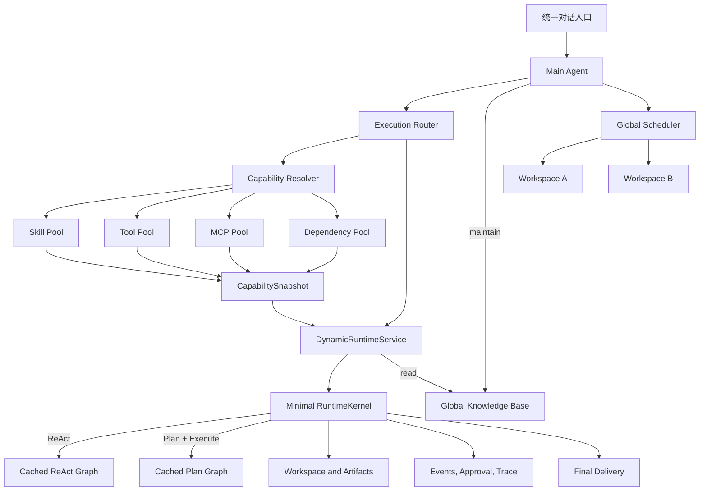

# FastAgentFactory 动态 Agent Runtime 重构设计

## 1. 决策摘要

FastAgentFactory 不再把 `AgentPackage`、制造 Agent 和进化 Agent 作为产品与运行时的核心抽象。

系统只保留一个统一对话入口，由双模式路由在每次任务中选择：

- `ReAct`：直接问答、探索、查询和短链路操作；
- `Plan + Execute`：复杂任务、多步骤交付、并行协作和持续运行。

执行能力不再从预先制造的 Package 获得，而是运行时从四个全局能力池动态选择：

- Skill 池；
- 工具池；
- MCP 池；
- 依赖池。

“Agent”只表示一次任务中的动态运行实例，不再是需要制造、发布、初始化和维护的目录包。

## 2. 重构目标

1. 用户只面对统一对话，不再切换闲聊、制造、进化或已发布 Agent 运行模式。
2. 简单任务直接进入 ReAct，复杂任务进入 Plan + Execute，并允许用户显式覆盖路由结果。
3. 主 Agent 可在 turn 或 Plan 步骤边界按需重新检索能力；每个已启动运行实例使用冻结快照，不在执行中热装卸。
4. 所有可执行依赖统一由现有依赖池解析、构建、缓存和复用。
5. 主 Agent、临时子 Agent、多 Agent 协作和群聊成员使用同一种运行实例与调度机制。
6. 会话、工作区、上下文、记忆、审批、调度、后台任务和 trace 不再依赖 Package ID。
7. 删除 AgentPackage、制造和进化形成的重复状态机、协议、存储与前端页面。
8. 新架构不保留旧运行结构的兼容分支；只迁移需要保留的用户数据。
9. 用户只与主 Agent 交互；临时 Agent 使用任务信封、结构化事件和受控工作区写入完成子任务。
10. 当前版本采用一个全局知识库，以及一个由主 Agent 管理、按工作区绑定任务的全局 Scheduler。

## 3. 非目标

- 不新增另一种名称不同但结构等价的 AgentPackage。
- 不把制造和进化隐藏到后台继续运行。
- 不把所有逻辑重新堆入现有 `factory_chat` 特殊包。
- 不保留“可编译任意 AgentPackage”的通用图装配平台；只维护产品实际需要的 ReAct 与 Plan + Execute 两个运行图。
- 不使用关键词表代替可审计的意图与策略路由。
- 不允许 Skill 或工具绕过依赖池直接修改宿主机全局环境。
- 不要求主任务开始时一次性确定全部能力；后续能力变化通过新快照和后继运行实例生效，不热修改当前实例。

## 4. 目标架构



### 4.1 核心原则

- 路由决定执行策略，不决定固定 Agent 身份。
- 能力池保存可复用能力，运行实例只保存本次任务的选择结果。
- RuntimeKernel 是唯一执行引擎，但不是 AgentPackage 编译器或通用装配平台。
- 工作区属于会话或共享工作区，不属于 AgentPackage。
- 模型属于运行时选择，不属于预制 Agent。
- 依赖环境属于依赖池，不属于 Package 实例。
- 多 Agent 是多个动态运行实例的调度关系，不是另一种运行时。
- 用户始终与唯一主 Agent 交互；临时 Agent 只是主 Agent 创建的执行实例。
- 全局知识库由所有运行实例共享读取，但只允许主 Agent 直接维护。
- 全局 Scheduler 只向主 Agent 暴露，每个定时任务必须绑定主 Agent 的一个工作区。

### 4.2 主 Agent 的定位

主 Agent 是唯一用户交互面和控制面，负责：

- 接收用户消息并选择 ReAct 或 Plan；
- 自己完成任务，或创建临时 Agent；
- 管理总体计划、消息队列、工具审批和取消传播；
- 管理多个工作区及其会话；
- 维护全局知识库和跨会话记忆；
- 创建、修改、暂停和删除绑定工作区的定时任务；
- 汇总临时 Agent 的产物并向用户交付。

主 Agent 不是 AgentPackage，也不是常驻模型进程。它是统一会话服务、路由服务和运行时控制服务对用户呈现的逻辑身份。

### 4.3 RuntimeKernel 精简边界

目标 RuntimeKernel 只负责把一个已经解析完成的 `RuntimeRequest` 交给固定运行图执行。它不负责发现 Package、读取合同、规划 Assembly、编译能力绑定或维护 Agent 身份。

保留职责：

- ReAct 与 Plan + Execute 两个固定图的构建和缓存；
- LangGraph checkpointer、store 和会话线程关联；
- 模型调用、工具循环、审批中断、取消和恢复；
- 上下文组装、压缩、记忆与知识检索接入；
- 工具网关、并发治理、结果闭合和输出压缩；
- 运行状态、流式事件、trace 和最终结果投影。

删除职责：

- AgentPackage loader、manifest、runtime contract 和 assembly spec；
- 面向任意 Package 的通用 `BindingSet`、Node Binding、Hook Binding 和 Service Binding 装配；
- Package state、Package namespace、`assembly_log` 和 Package node provider；
- 为不同 Agent 动态注册任意图结构、节点实现、wrapper 和 custom binding 的扩展体系；
- 每次会话、每次任务或每个临时 Agent 的图编译。

替代输入采用明确的数据结构，而不是通用 binding 字典：

```json
{
  "request_id": "request-id",
  "session_id": "session-id",
  "turn_id": "turn-id",
  "workspace_id": "workspace-id",
  "runtime_role": "main | temporary",
  "strategy": "react | plan_and_execute",
  "model_selection": {},
  "capability_snapshot_id": "snapshot-id",
  "approval_mode": "ask | auto | always_approval",
  "task_revision": 1
}
```

ReAct 和 Plan + Execute 的图拓扑在应用启动时构建并缓存。运行时变化的模型、Skill 提示、Tool Schema、MCP Tool、权限和工作区通过 `RuntimeRequest`、`CapabilitySnapshot` 与进程级服务注入，不通过重新编译图实现。只有图代码或图 Schema 版本变化时才重新构建图。

主 Agent 因此可以直接搭建：应用组合根创建共享服务和两个固定图；收到消息后完成路由与能力解析，再直接调用对应图。主 Agent 不需要任何 Package scaffold、manifest、assembly 或初始化阶段。

## 5. 双模式路由 Agent

### 5.1 用户可见模式

输入框提供三个选项：

| 用户选项 | 内部行为 |
|---|---|
| 自动 | 路由器选择 ReAct 或 Plan + Execute |
| 快速 | 强制使用 ReAct |
| 计划 | 强制使用 Plan + Execute |

前端不向普通用户暴露 ReAct 等实现术语时，可以使用“自动 / 快速 / 计划”；协议内部仍使用稳定枚举。

显式选择只覆盖执行策略。停止、继续、审批回复、任务纠正和消息排队等控制意图仍由统一路由识别。

### 5.2 路由输入

路由不得只读取当前一句话，至少需要：

- 当前用户消息；
- 最近会话上下文；
- 当前工作区摘要；
- 当前是否存在运行中的 turn、工具或计划；
- 已排队消息和用户控制意图；
- 是否要求明确交付物；
- 任务是否包含研究、生成、修改、验证或并行步骤；
- 用户显式策略选择。

### 5.3 路由输出

```json
{
  "strategy": "react | plan_and_execute",
  "decision_source": "auto | user",
  "intent": "task | question | control | approval | continuation",
  "reason": "可展示的简短原因",
  "capability_requirements": [],
  "needs_clarification": false
}
```

路由输出必须进入 trace，但默认不需要在对话中生成一条醒目的系统消息。

### 5.4 动态切换边界

- 自动模式可以先用 ReAct 澄清，再在下一安全检查点进入 Plan。
- 已进入 Plan 后，不因模型一次自由判断退回 ReAct；必须完成、取消或显式重建当前策略。
- 运行中的新消息进入现有消息队列，由主运行实例在安全检查点判断补充计划、纠正任务、停止任务或开启后续 turn。
- 用户显式选择“快速”或“计划”时，本 turn 不允许路由器静默覆盖。

## 6. 四个能力池

### 6.1 Skill 池

Skill 负责提供任务方法、领域规范和可复用资源，不拥有独立运行时。

最小注册信息：

```json
{
  "skill_id": "presentation-design",
  "version": "1.0.0",
  "name": "Presentation Design",
  "description": "适用任务与能力边界",
  "path": "skills/presentation-design",
  "required_tool_ids": [],
  "required_mcp_capabilities": [],
  "dependency_spec": {},
  "enabled": true
}
```

约束：

- 路由和能力解析阶段只读取 Skill 元数据。
- Skill 正文、references、templates 和 assets 在选中后懒加载。
- Skill 可以声明需要哪些工具、MCP能力和依赖，但不能复制 MCP 凭据。
- Skill 内脚本必须通过统一工具执行网关运行；不能形成旁路执行系统。
- Skill 的安装、更新、删除和版本冲突由全局 Skill 注册表管理。

### 6.2 工具池

工具池统一管理内置工具、自定义工具、Skill 脚本入口和 MCP发现工具的可执行视图。

每个工具统一声明：

- Tool ID 和版本；
- 输入输出 JSON Schema；
- 工具描述；
- 风险等级和审批策略；
- 是否允许同一 turn 内并发；
- 超时和取消能力；
- 输出投影与压缩策略；
- 依赖声明；
- 平台能力要求；
- 来源和作用域。

取消以下区别：

- Package Tool 与系统工具的不同装配路径；
- 制造阶段工具与运行阶段工具的不同执行网关；
- 为单个 AgentPackage 复制一份工具描述和权限配置。

### 6.3 MCP 池

MCP Server 全局注册一次，运行实例按需选择。

MCP 池负责：

- Server 配置和本地凭据；
- stdio、SSE 和 Streamable HTTP 生命周期；
- 工具发现与 Schema 规范化；
- 连接健康状态和错误诊断；
- MCP 工具到统一工具池视图的映射；
- 连接复用和并发限制。

约束：

- Skill 只声明需要的 MCP能力或 Server ID。
- MCP环境变量、Headers 和密钥不进入会话、Skill、trace 或可分享内容。
- 缺失 MCP 时由能力解析器选择替代能力或向用户请求配置。
- 一个 Agent 使用过的 MCP 不自动成为其他 Agent 的私有副本。

### 6.4 依赖池

保留现有本地依赖池，并将其从 AgentPackage 生命周期中解耦。

依赖池输入来源：

- 被选择的 Skill；
- 被选择的工具；
- MCP启动要求；
- 当前平台和架构。

依赖池负责：

- Python 和 npm 依赖解析；
- 环境锁和内容指纹；
- 构建缓存与复用；
- 同一环境构建去重；
- 构建队列、引用计数和回收；
- 异步进度、日志和失败诊断；
- 宿主机命令能力检查；
- macOS 与 Windows 路径兼容。

依赖池不得再读取 `contracts/dependencies.json`。新的依赖解析输入是本次能力选择形成的标准化依赖集合。

### 6.5 统一能力控制面

Skill、工具和 MCP 使用相同的注册、检索、解析、装配和审计流程，但通过不同 Adapter 转换为模型需要的内容。

```text
CapabilityRegistry
├─ SkillProvider  → prompt fragments, references, templates, assets
├─ ToolProvider   → tool schema, executor, approval policy
├─ MCPProvider    → server lifecycle, discovered tool schemas
└─ DependencyProvider → prepared runtime environment
```

统一能力描述至少包含：

```json
{
  "capability_id": "稳定内部 ID",
  "kind": "skill | tool | mcp_server | mcp_tool",
  "namespace": "不可变命名空间",
  "name": "稳定名称",
  "version": "1.0.0",
  "display_name": "可修改展示名称",
  "description": "适用场景和能力边界",
  "tags": [],
  "platforms": [],
  "dependencies": {},
  "permissions": {},
  "enabled": true,
  "content_digest": "sha256"
}
```

所有能力池实现同一组控制面操作：

- `register`；
- `index`；
- `search`；
- `inspect`；
- `resolve`；
- `activate`；
- `deactivate`；
- `health`。

主 Agent 常驻一个轻量 `capability` 工具，提供 `search`、`inspect`、`prepare` 和 `list_active`。能力池完整内容不得在启动时全部注入主 Agent。

### 6.6 动态检索与依赖解析

能力检索使用统一索引和混合检索：

```text
任务意图或 Plan 步骤
  → enabled/platform/permission/health 硬过滤
  → 稳定 ID、关键词和标签召回
  → 语义向量召回
  → 依赖成本、健康状态和历史成功证据重排
  → 返回少量候选
```

检索结果只返回 ID、类型、摘要、分数和选择理由。主 Agent 需要更多信息时再调用 `inspect`，不能把完整 Skill、工具描述和 MCP Schema 一次性塞入上下文。

CapabilityResolver 选择 Skill 后展开其依赖图：

- 必需和可选工具；
- 必需 MCP能力或 Server；
- Python、npm 和宿主命令依赖；
- 权限和平台要求。

展开后统一去重、检查循环依赖、校验权限并请求依赖池。Skill 只能声明依赖，不能自行启动 MCP、修改宿主环境或旁路注册工具。

### 6.7 稳定 ID、工具别名与前缀

内部 ID 与模型可见名称必须分离。

内部稳定 ID 示例：

```text
skill://official/presentation-design
tool://builtin/write
tool://official/image-generation
mcp://tavily/search
```

版本不进入逻辑 ID。运行快照单独记录 `resolved_version` 和 `content_digest`，避免升级能力时改变历史身份。

模型可见工具名规则：

```text
内置工具       read / write / edit / shell
全局自定义工具 tool_<namespace>_<name>
MCP 工具       mcp_<server_namespace>_<tool_name>
Skill 派生工具 skill_<skill_namespace>_<tool_name>
```

约束：

- `namespace` 在首次注册时确定，之后不可修改；修改 `display_name` 不影响名称。
- 模型别名不能包含 Agent、运行实例、工作区、安装顺序或版本号。
- 名称过长时，在注册阶段使用稳定 slug 和 capability ID 摘要生成一次，并持久化结果；运行时不得重新截断。
- 已删除别名进入 tombstone，不能立即分配给另一个能力。
- MCP Schema 变化保留原别名并更新 digest；上游工具改名视为新工具。
- MCP发现映射必须保存 `server_namespace`、`upstream_tool_name`、`model_alias`、`schema_digest` 和状态。
- 每个运行快照按 `model_alias` 稳定排序工具 Schema，避免无意义的请求前缀变化。

### 6.8 稳定提示词前缀与注入层

模型请求按固定层次构造：

```text
1. 不变的主运行时基础提示词
2. 不变的能力检索、审批、取消和工作区协议
3. ReAct 或 Plan 策略提示词
4. 临时 Agent 创建前冻结的 Skill 上下文片段
5. 工作区、记忆和当前任务上下文
6. 会话消息
```

基础提示词和控制协议必须始终位于最前方，不能因为动态能力选择而改写。Skill 按稳定 capability ID 排序注入；references、templates 和 scripts 通过能力工具懒加载，不重复追加到每轮消息。

工具描述只通过模型 tools 字段提供，不在系统提示词中重复。MCP配置本身不注入提示词，只注入已解析且冻结的 MCP 工具 Schema。

主 Agent 保持固定的核心工具集合和稳定提示词前缀。专业 Skill、扩展工具和 MCP 优先装配到“检索完成后新建的临时 Agent”，而不是持续改变主 Agent 自身前缀。

### 6.9 统一能力管理与版本发布

Skill、Tool 和 MCP 使用同一个能力管理控制面。共有字段包括：

- 是否启用；
- 稳定 ID、namespace 和当前 revision；
- 展示名称、检索描述、标签和适用场景；
- 依赖关系、平台要求和健康状态；
- 内容摘要、索引状态和修改记录。

统一管理不表示所有类型拥有相同执行配置：

- Skill 管理方法、内容、references、templates、assets 和依赖声明；
- Tool 管理可执行逻辑、Schema、权限、并发、超时和输出压缩；
- MCP Server 管理连接与服务参数；MCP发现的每个 Tool 独立管理权限、并发、描述和压缩。

所有在线修改必须经过：

```text
创建草稿
  → 语法和 Schema 检查
  → 依赖与权限分析
  → Tool 静态验证或 MCP连接发现
  → 生成新 revision
  → 增量建立索引
  → 原子发布 revision 与索引
```

不能直接覆盖 active revision。新索引或验证失败时，旧 revision 继续生效，不能产生“逻辑已更新但索引仍旧”或“索引已更新但执行逻辑仍旧”的半完成状态。

已启动临时 Agent 始终使用能力快照固定的 revision；新 revision 只进入之后创建的能力快照。安全禁用和 `deny` 属于例外：执行网关必须立即拒绝新的调用，并可按用户选择尝试取消正在运行的调用。

### 6.10 Skill 管理

Skill 支持在线管理：

- 启用或禁用；
- 名称、检索描述、标签和适用场景；
- SKILL 正文；
- references、templates 和 assets；
- 所需 Tool、MCP能力和依赖声明；
- revision、健康状态和索引状态。

Skill 本身不配置工具审批、执行并发或工具输出压缩。如果 Skill 提供可执行脚本，该脚本必须注册为工具池中的 Tool，再由 Tool 策略管理。

### 6.11 Tool 管理

Tool 支持在线编辑：

- 是否启用；
- 检索描述与模型工具描述；
- 参数名称、参数描述和输入输出 JSON Schema；
- Python 或其他受支持的执行逻辑与入口；
- 依赖、平台要求、超时和取消能力；
- 敏感参数路径；
- 审批与权限策略；
- 并发策略；
- 输出投影与压缩策略。

工具描述分为：

- `retrieval_description`：告诉 CapabilityResolver 何时选择该工具，进入能力索引；
- `model_description`：告诉模型如何调用工具，进入 Tool Schema；
- `parameter_descriptions`：解释每个参数，进入 Tool Schema并参与能力索引。

执行逻辑源码和敏感值不进入能力索引。

### 6.12 MCP Server 与 MCP Tool 管理

MCP Server 支持编辑：

- 是否启用；
- transport、command、args、cwd 或 URL；
- Headers、环境变量和安全资源引用；
-连接超时、重连策略和 Server 最大并发；
- 展示名称、检索描述和不可变 namespace。

密钥只保存到安全资源库，编辑时遮挡，不进入索引、会话或 trace。

MCP发现出的每个 Tool 独立支持：

- 是否启用；
- 上游描述与本地描述覆盖；
- 参数描述覆盖；
- 审批和风险策略；
- 是否并发、最大并发和超时；
- 输出压缩；
- 循环调用限制。

MCP重新发现时保留用户的描述和参数 override。Schema 变化生成新 revision 与 digest，但保持稳定模型别名；上游工具改名按新工具注册。

### 6.13 统一权限与审批

所有最终可执行能力都在工具层使用同一种策略：

```json
{
  "enabled": true,
  "approval": "allow | ask | deny",
  "risk_level": "low | medium | high",
  "filesystem_scope": [],
  "network_scope": [],
  "resource_scope": [],
  "sensitive_argument_paths": []
}
```

策略优先级：

```text
disabled / deny
  → 安全硬限制与资源作用域
  → Tool 或 MCP Tool 策略
  → 当前任务授权
  → 主对话输入框审批模式
```

输入框提供主对话统一审批模式：

| 模式 | 行为 |
|---|---|
| `Ask` | `allow` 直接执行，`ask` 展示审批，`deny` 拒绝 |
| `Auto` | 主 Agent 根据风险、参数、作用域、任务上下文和用户策略自动处理 `ask`；无法安全判断时仍询问用户 |
| `Always Approval` | 对未被禁用、未被 `deny` 且未越过硬性作用域的审批请求自动批准 |

协议枚举使用 `ask | auto | always_approval`。三种模式都不能覆盖：

- `enabled=false`；
- `approval=deny`；
- 文件、网络和资源作用域；
- 操作系统权限；
- 缺失凭据；
- 平台不兼容；
- 安全系统硬拒绝。

主 Agent 将输入框选择写入当前会话和新建任务信封。临时 Agent 不能更改审批模式，只能继承主 Agent 授予的有效策略。定时任务没有活动输入框，其无人值守审批模式在创建任务时由主 Agent 显式保存。

### 6.14 并发控制

Tool 与 MCP Tool 使用一致的并发模型：

```json
{
  "concurrent": true,
  "max_parallel_calls": 3,
  "serialization_key_strategy": "none | resource | custom"
}
```

- `concurrent=false`：同一运行实例内，同一工具串行执行；
- `concurrent=true`：同一模型工具批次可以并行执行多个该工具调用；
- `max_parallel_calls`：限制工具在运行实例或全局执行器中的并发上限；
- `serialization_key`：即使工具允许并发，操作同一文件、数据库或远端资源时仍按目标资源串行。

MCP Tool 的有效并发不能超过 MCP Server 容量、工具自身容量和全局工具执行容量中的最小值。

### 6.15 工具输出压缩

Tool 与 MCP Tool 使用一致的输出投影配置：

```json
{
  "max_model_chars": 20000,
  "mode": "none | deterministic | structured_json",
  "retain_raw_output": true
}
```

- 原始输出完整保存到 artifact 或 trace 引用；
- 模型只接收投影或压缩结果；
- 路径、ID、状态、错误码和后续调用需要的字段不能被压缩丢失；
- 不同 Tool action 可以拥有独立压缩策略；
- 压缩模型调用使用独立容量，不能等待当前被工具调用占用的模型 slot。

### 6.16 描述修改与增量索引

以下修改需要重建该能力及其受影响子能力的索引：

- 名称、检索描述、模型描述和参数描述；
- 标签和适用场景；
- Skill 内容摘要；
- Tool/MCP能力、平台、依赖和启用状态；
- MCP发现工具的新增、变化、弃用；
- 权限变化中会影响能力可选性的字段。

索引采用单能力增量更新，不重建整个池：

```text
发布候选 revision
  → 建立新索引记录
  → 校验 capability ID、revision 和 digest
  → 原子切换 active revision 与索引指针
```

工具逻辑源码、MCP密钥、环境变量值和用户资源值不进入向量索引。禁用能力时立即从可检索索引中过滤，但保留历史 revision 和模型别名映射用于 trace 回放。

## 7. 动态运行实例

动态运行实例是一次任务的运行快照，不作为长期产品对象保存。

```json
{
  "runtime_instance_id": "runtime-id",
  "session_id": "session-id",
  "turn_id": "turn-id",
  "strategy": "plan_and_execute",
  "skill_ids": [],
  "tool_ids": [],
  "mcp_server_ids": [],
  "dependency_environment_ids": [],
  "capability_snapshot_id": "snapshot-id",
  "model_bindings": {},
  "workspace_id": "workspace-id",
  "approval_policy": {},
  "status": "preparing | running | waiting | completed | failed | cancelled"
}
```

### 7.1 生命周期

```text
route
  → search and resolve capabilities
  → prepare dependencies and MCP
  → create immutable capability snapshot
  → build concrete runtime request
  → select cached ReAct or Plan graph
  → start runtime instance
  → complete/cancel/fail
  → release runtime resources
```

会话消息、工作区文件、交付物、trace 和用户记忆继续持久化；运行实例本身只保留审计快照，不需要重新初始化为常驻 Agent。

### 7.2 能力快照边界

- 主 Agent 可以在 ReAct 过程或 Plan 步骤边界继续检索能力。
- 临时 Agent 必须在启动前完成能力检索、依赖解析、MCP发现和 Tool Schema 固化。
- 临时 Agent 启动后，其 Skill、工具、MCP、模型可见别名和 Tool Schema 在整个生命周期内保持不变。
- 临时 Agent 发现缺少能力时，只能提交 `capability_request` 给主 Agent。
- 主 Agent 批准后，在安全检查点关闭当前子运行或等待其结束，再使用新的能力快照创建后继临时 Agent；不得热修改正在运行的临时 Agent。
- 新能力需要更高权限时，进入统一工具审批 UI。
- 依赖准备期间任务可以显示等待状态，但不能阻塞 ASGI 主事件循环。
- 每个能力快照必须保存 capability ID、版本、digest、模型别名和 Schema digest，以便历史工具调用稳定回放。

## 8. 主 Agent 与临时 Agent

主 Agent 与临时 Agent 使用同一种 `RuntimeRequest`、`DynamicRuntimeInstance` 和精简 RuntimeKernel。两者差异来自运行角色、父子关系和授权范围，不来自两套运行链路，也不需要分别编译 Agent。

### 8.1 交互原则

- 用户永远只向主 Agent 发消息。
- 主 Agent 可以自己执行，不要求所有任务必须委派。
- 临时 Agent 不创建独立用户会话，不拥有长期身份。
- 临时 Agent 不拥有跨会话记忆、私有知识库或定时任务权限。
- 临时 Agent 的工具审批显示在主对话中，并明确标注来源任务。
- 临时 Agent 的内部思考不直接堆入主对话，只投影进度、问题、审批、产物和结果。
- 委派是非阻塞操作：创建成功后主 Agent 立即取得任务句柄，可继续当前工作并主动查询状态。
- 每个委派任务创建后立即显示胶囊；胶囊从持久化任务事件和工具调用记录恢复完整活动，不依赖当前页面内存。
- 子任务完成后写入主 Agent 的持久化完成邮箱并发送前端通知；下一次主运行必须收到尚未消费的完成提醒。
- 临时 Agent 默认继承主运行冻结的模型版本和推理配置，不允许再次委派。

### 8.2 任务信封

主 Agent 必须先完成能力检索和依赖准备，再创建临时 Agent。它不把完整对话历史直接复制给临时 Agent，而是把冻结的能力快照和最小充分上下文写入任务信封：

```json
{
  "task_id": "task-id",
  "parent_runtime_instance_id": "runtime-id",
  "strategy": "react | plan_and_execute",
  "system_prompt": "由主 Agent 为此任务生成的完整系统提示词",
  "objective": "明确任务目标",
  "acceptance_criteria": [],
  "context": {},
  "skill_ids": [],
  "tool_ids": [],
  "mcp_server_ids": [],
  "capability_snapshot_id": "snapshot-id",
  "workspace_scope": "授权目录或文件集合",
  "approval_policy": {},
  "task_revision": 1
}
```

任务信封只包含完成子任务需要的对话事实、工作区信息和能力授权，避免无关历史、隐私和上下文噪声扩散。

临时 Agent 的启动顺序固定为：

```text
主 Agent 判断需要委派
  → capability.search
  → capability.inspect
  → CapabilityResolver 展开依赖图
  → 权限检查
  → 依赖池和 MCP准备
  → 生成稳定 CapabilitySnapshot
  → 创建任务信封
  → 启动临时 Agent
```

如果依赖或 MCP准备失败，不启动一个能力不完整的临时 Agent；主 Agent 应选择替代能力、向用户请求配置或明确报告阻塞原因。

### 8.3 临时 Agent 事件

临时 Agent 只通过结构化事件与主 Agent 交互：

- `progress`：阶段性进度；
- `question`：缺少关键决策；
- `approval_required`：需要用户或 Auto 模式审批；
- `artifact`：创建或修改了文件；
- `result`：完成任务；
- `failed`：任务失败；
- `cancelled`：任务取消。

临时 Agent 发出问题时，主 Agent 先检查已有上下文；只有确实需要用户决策时，才由主 Agent 向用户提问。

### 8.4 工作区写入

- 临时 Agent 使用主 Agent 当前任务绑定的工作区。
- 主 Agent 在任务信封中授予目录或文件范围。
- 新文件可写入授权目录；修改已有文件必须经过统一事务式文件变更。
- 同一文件同一时间只能有一个写入者。
- 文件锁由工作区资源池统一持有，主 Agent 与全部临时 Agent 共享；锁键使用边界校验后的规范化绝对文件路径。
- 单文件写入、文本读改写、分块写入提交和多文件事务提交都必须在文件锁内完成；多文件事务按路径稳定排序获取锁，避免交叉委派死锁。
- 文件锁只覆盖提交临界区，事务预览仍使用内容快照做乐观校验，因此不同文件可以保持并发，同一文件的过期预览会明确失败而不会覆盖新内容。
- 提交时校验文件版本；冲突由主 Agent 决定重试、合并或放弃。
- 临时 Agent 结束后不保留独立工作区，产物留在主任务工作区。

### 8.5 新消息、修订与取消

运行中的用户新消息只进入主 Agent 队列。主 Agent 判断它是补充要求、目标修改、部分停止、全部停止或无关新任务。

主 Agent 修改任务时递增 `task_revision`，向受影响的临时 Agent 传播修订或取消。旧修订返回的模型输出和结果不得写入当前消息流；已启动工具按照统一取消协议停止和清理。

### 8.6 多 Agent 增量能力

多 Agent 协作只增加：

- 父子任务关系；
- 任务信封与结果契约；
- 模型 slot 调度；
- 结构化事件；
- 工作区授权；
- 生命周期与取消传播。

不再存在：

- 已发布 Agent 才能成为子 Agent 的限制；
- 子 Agent 必须先对应一个 Package ID；
- 制造 Agent 和进化 Agent 的专用子任务类型；
- AgentPackage 实例初始化、关闭和重启。

## 9. 会话、工作区与记忆

### 9.1 会话

会话只记录：

- 会话 ID；
- 工作区 ID；
- 消息和 turn；
- 用户选择的自动/快速/计划策略；
- 当前运行实例引用；
- 模型与审批偏好。

移除 `package_id`、`evolution_package_id`、`factory mode` 等路由字段。

### 9.2 工作区

- 一个会话一个托管工作区，或多个会话共享一个用户挂载工作区；
- 工作区挂载、附件、知识库、输出和文件事件不再通过 Package Runtime 转发；
- 工作区刷新直接订阅统一文件事件；
- 删除会话不得删除用户挂载目录。

### 9.3 记忆

- 只保留用户全局记忆与工作区记忆。
- 长期个人偏好、身份和通用习惯写入用户全局记忆。
- 项目事实、约束、决策和交付物信息写入工作区记忆。
- 当前 turn 的工具输出、临时要求、失败尝试和未经确认的推断不写跨会话记忆。
- 检索时先取当前工作区记忆，再取用户全局记忆，统一去重、排序和限额后注入。
- 临时 Agent 可以读取任务授权的记忆，但只能提交候选记忆；由主 Agent 决定是否写入及写入范围。
- 记忆写入和检索不使用 AgentPackage ID。

### 9.4 全局知识库

当前版本只保留一个全局共享知识库，不区分用户、工作区、会话或临时 Agent 私有知识库。

- 所有主对话和临时 Agent 均可检索全局知识库。
- 只有主 Agent 可以直接添加、更新和删除知识。
- 临时 Agent 只能提交知识候选，避免中间结果和错误推断污染全局知识库。
- Skill 自带 references、templates 和 assets 属于 Skill 内容，不自动写入全局知识库。
- 会话附件默认只属于消息上下文；主 Agent 明确执行添加操作后才进入全局知识库。
- 后续如需更细隔离，再升级知识库作用域；本轮重构不预埋多级 namespace 兼容逻辑。

### 9.5 全局 Scheduler 与工作区绑定

系统保留一个全局 Scheduler，只向主 Agent 暴露。主 Agent 可以管理多个工作区，每个定时任务必须绑定其中一个工作区。

```json
{
  "job_id": "job-id",
  "workspace_id": "workspace-id",
  "request": "任务自然语言描述",
  "strategy": "auto | react | plan_and_execute",
  "schedule": "cron or interval",
  "timezone": "用户设置时区",
  "capability_constraints": {},
  "approval_policy": "无人值守审批策略"
}
```

触发流程：

```text
Scheduler 触发
  → 打开绑定工作区
  → 唤醒主 Agent
  → 主 Agent 重新路由 ReAct 或 Plan
  → 按需创建临时 Agent
  → 写入绑定工作区并记录独立 run
```

约束：

- 临时 Agent 不能直接创建、修改、暂停或删除定时任务，只能向主 Agent 提交建议。
- 定时任务不绑定某个临时 Agent、模型或历史运行实例。
- MCP 凭据在执行时从本地 MCP 池读取，不复制到任务记录。
- 同一主 Agent 的定时任务按工作区分组展示，每次触发形成独立运行记录。
- 删除工作区前必须显式处理绑定的定时任务，不能留下悬空目标。

## 10. 前端目标

### 10.1 保留

- 统一对话页面；
- 会话列表；
- 工作区和挂载目录；
- 附件；
- 工具调用、审批和取消；
- Plan 展示；
- 后台任务；
- 多 Agent 协作；
- Skill、工具和 MCP 管理；
- 模型池、依赖进度、知识库、定时任务和设置。

### 10.2 新增或调整

- 输入框提供“自动 / 快速 / 计划”；
- 输入框提供 `Ask / Auto / Always Approval` 统一审批模式；
- 会话内展示当前策略和已装配能力的轻量状态；
- Skill、工具或 MCP 的动态加入通过事件增量更新；
- 依赖准备展示共享构建状态和当前任务等待关系；
- 所有运行类型使用同一种停止、排队、审批和完成展示。
- 临时 Agent 以可折叠任务卡展示进度、能力、审批、产物和终态，不直接插入独立用户会话。
- 定时任务按主 Agent 工作区分组，每次触发显示独立 run。
- 全局知识库界面不展示尚不存在的多级作用域选择。
- Skill、Tool、MCP 使用统一能力管理页面，并按能力类型展示适用的编辑项。
- Tool 提供版本化逻辑、Schema、描述、权限、并发和压缩编辑器。
- MCP Server 提供服务参数和安全资源编辑器；每个 MCP Tool 提供独立描述、参数、权限、并发和压缩配置。
- 修改发布后显示 revision、验证状态和增量索引状态。

### 10.3 删除

- 制造入口和制造会话模式；
- 进化入口和进化会话模式；
- 已发布 AgentPackage 列表与详情页；
- Package 初始化、关闭、运行和重启 UI；
- Package 模型绑定、资源合同、上下文合同和调度合同编辑页；
- Package 发布确认卡片；
- 顶部 AgentPackage 切换器；
- 与 `factory_chat`、`create_agent`、`evolve_agent` 绑定的特殊空状态和提示。

## 11. 后端与运行时移除清单

以下是目标删除范围。删除前只能提取仍有通用价值的实现，不能保留原入口和兼容分支。

### 11.1 整体删除

| 当前模块 | 处理 |
|---|---|
| `agent_factory/create_agent/` | 删除制造工作流、scaffold、authoring、probe、validate、publish、stage 和制造 Skills |
| `agent_factory/evolution/` | 删除进化运行时、目标 gate、prompt、trace gate 和进化 Skills |
| `agent_factory/runtime_contracts/` | 删除 AgentPackage Manifest、合同加载、BuildPlanner 和合同注册体系 |
| `agent_factory/assembly/` | 整体删除 Package Assembly Spec 的 loader/compiler/runner |
| RuntimeKernel 通用 Pattern 装配层 | 删除只服务于任意 Package 图装配的 registry、loader、validator、通用 binding 和 provider；改为两个显式图构建器 |
| `SystemPackage/factory_chat/` | 删除内置闲聊 Package；主对话由应用组合根直接创建 |
| `SystemPackage/*/agent_package.json` 及合同 | 删除 Package 结构；可复用能力迁移到对应全局池 |

### 11.2 Frontend Bridge 删除或重写

删除以下 Package 专用模块：

- `agent_package_runtime.py`；
- `agent_package_repository.py`；
- `agent_package_configuration.py`；
- `agent_package_extensions.py`；
- `agent_package_workspace.py`；
- `agent_package_paths.py`；
- `agent_package_utils.py`；
- `runtime_adapter_agent_packages.py`；
- `system_package_runtime_handle.py`；
- Package 专用 pending run 类型和状态字典。

`runtime_adapter.py` 改为面向会话和动态运行实例，不再在构造时创建：

- `AgentPackageRuntimeManager`；
- `CreateAgentRuntime`；
- `AgentEvolutionRuntime`。

### 11.3 后端 API 删除

- `/api/create-agent/**`；
- `/api/agent-packages/**`；
- Package 发布、导入、导出、初始化和实例管理接口；
- Package 专用扩展、资源、模型覆盖、上下文和调度接口；
- AgentHub 中 AgentPackage 上传、下载和校验接口。

替代接口围绕以下资源组织：

- sessions；
- runtime instances；
- skills；
- tools；
- mcp servers；
- dependency environments；
- workspaces；
- models；
- approvals；
- background tasks。

### 11.4 协议删除

删除命令与事件：

- `select_agent_package`；
- `initialize_agent_package`；
- `shutdown_agent_package_instance`；
- `run_agent_package`；
- `send_agent_package_message`；
- `run_agent_evolution`；
- Package session 的 list/load/delete 命令；
- 制造、进化和 Package 发布专用事件。

统一替换为：

- `send_message`；
- `set_execution_preference`；
- `cancel_runtime_request`；
- `resume_interrupt`；
- `runtime_instance_*`；
- `capability_*`；
- 现有 workspace、approval、background task 事件。

### 11.5 RuntimeKernel 隐性装配遗留

以下模块即使不直接读取 `agent_package.json`，本质上仍服务于“编译任意 Package 图”，不能因为位于 RuntimeKernel 内就默认保留：

| 当前遗留 | 处理 |
|---|---|
| `patterns/registry.py`、YAML loader、通用 validator | 删除动态 Pattern 发现；ReAct 和 Plan 使用两个显式图构建器 |
| `bindings/` 中 Service、Node、Hook、Custom、OutputFormatter Binding | 删除通用绑定 DSL；替换为明确的 `RuntimeRequest` 与 `CapabilitySnapshot` |
| `state_contracts/PackageStateManager` | 删除；运行状态只允许固定 Schema 字段 |
| `state.package_state`、Package namespace、`assembly_log` | 删除，不迁移运行状态 |
| `node_providers/package.py` | 删除 Package 节点注入 |
| `extensions/` 的 AgentInstance Extension loader | 删除实例目录装载，统一走全局能力池 Resolver |
| `harness/` | 删除 Package Assembly Harness；需要的测试能力迁移为普通契约测试工具 |
| `strategies/` 通用空 Registry | 若没有独立产品调用则删除；ReAct/Plan 策略由路由协议直接表达 |
| `bookmarks/` 内存节点书签 | 若只用于 Pattern Harness 则删除；诊断证据统一进入 trace |
| `runtime_render/RenderManifest` | 删除 Package 可配置渲染清单；保留固定事件到 UI 展示模型的映射 |
| 动态 wrapper registry | 删除运行时任意注册；保留固定、可测试的执行中间件链 |

删除前必须按调用关系确认是否存在独立产品用途。不能只因名称包含 `runtime` 就保留，也不能只因代码暂时没有调用就把通用执行能力误删。

### 11.6 持久化 Agent 身份与旧协作模型

目标架构中的临时 Agent 是 RuntimeInstance，不是可搜索、可绑定、可维护的长期 Agent。以下旧模型必须处理：

- 删除 `agent_registry` 对已发布 Package 的扫描、Embedding 索引和 `agent_search_documents` 表；能力检索由 CapabilityIndexService 接管。
- 删除 `agent_search`、`agent_list`、`agent_manufacture` 和 `agent_evolve` 工具。
- 将 `agent_delegate` 重写为根据任务信封和能力需求创建临时 RuntimeInstance，不再接受 `package_id`。
- 将 `agent_team` 重写为一次任务中的多个临时 RuntimeInstance DAG，不再接受成员 Package。
- 保留 `deliver_result` 的结构化交付语义，但改为校验 parent runtime、task revision 和 workspace transaction。
- 删除后台任务中的 `parent_package_id`、`assignee_package_id`、`create_agent_session_id` 和 Package 恢复字段。
- 删除协作数据库中的 `main_agent_package_id`、`main_agent_package_session_id` 和 Package assignee 字段。
- 删除协作服务中“找 Agent → 制造 Agent → 发布 → 再搜索”的闭环。

`agent_group_system` 当前以 Package 成员、成员独立 Session 和 Package 工作区为核心，不能直接改字段继续使用：

- 删除持久化 Package 成员和 `speaker_package_id` 模型；
- 删除成员 Package Session 创建、恢复、关闭和删除逻辑；
- 如果保留群聊产品入口，只保留为主 Agent 创建多个临时 RuntimeInstance 的一种编排视图；
- 群聊记录仍属于主会话，成员运行状态属于 RuntimeInstanceStore，不再形成第二套用户会话系统。

### 11.7 旧作用域与所有权字段

必须逐个迁移以下隐性 Package/Agent 作用域，不能仅删除顶层 Package API：

| 系统 | 当前遗留 | 目标 |
|---|---|---|
| Session | `FactorySessionManager` 与 `AgentSessionManager` 并存，存在 create/evolve/package/group/worker session kind | 一个 ConversationStore；临时 Agent 不创建用户 Session |
| Workspace | `owner_package_id`、package session mount、package/runtime/extensions scope | 只按 workspace、session、attachment、artifact 表达 |
| Memory | `factory`、`agent`、`user`、`workspace` 四级作用域 | 只保留 user global 与 workspace 两级作用域 |
| Knowledge | `owner_type/owner_id` 形成 Agent 私有 namespace | 一个全局知识库和固定 namespace |
| Scheduler | `factory/agent` owner、`agent_package` target、Package Seed | 主 Agent 全局 Scheduler；Job 必须直接绑定 workspace |
| Resource Store | 以 `package_id + resource_id` 加密和定位凭据 | 以 capability revision、MCP server 或 Tool resource identity 定位 |
| Model Usage | `agent_id`、`agent_label`、`package_id` 与 create/evolve mode | 按 model、provider、runtime role、strategy、workspace 和 session 统计 |
| Trace | manifest/filter/reference 中的 `agent_id/package_id` | 使用 session、turn、request、runtime instance、parent instance、task revision、snapshot |
| Tip | `agent_package_id` 决定模型绑定 | 继承来源会话的模型选择，或使用显式 model profile |
| Background Task | Package owner、assignee 和 Package Session | parent runtime、task、workspace、request 和 task revision |

Scheduler 还存在两个绕过主 Agent 的入口，需要删除：

- `script_run` 不能作为 Scheduler 直接目标；
- `tool_call` 不能作为 Scheduler 直接目标；
- 统一目标应是“向绑定工作区的主 Agent 提交一条计划消息”，之后仍经过路由、能力解析、审批和运行链路；
- `scheduler_seed.json`、`package_seed`、确定性 Package seed job ID 和 Seed 自动应用逻辑全部删除。

### 11.8 会话与事件的重复事实源

当前同一轮对话可能同时写入：

- `FactorySessionManager` JSON；
- `AgentSessionManager` JSON；
- LangGraph checkpoint；
- `RuntimeEventJournal` JSONL；
- collaboration/background task 数据库；
- 前端 runtime snapshot。

重构后必须明确唯一事实源：

- `ConversationStore`：用户可见消息、turn、附件引用、工作区绑定和标题的唯一持久化来源；
- `RuntimeInstanceStore`：正在运行及历史 RuntimeInstance 状态、父子关系和 task revision；
- LangGraph checkpointer：只保存可恢复的图执行内部状态，不作为会话列表和聊天记录来源；
- Trace：只保存诊断和审计事实，不用于重建用户消息；
- SSE/事件流：只负责实时投影；刷新后从 ConversationStore 与 RuntimeInstanceStore 恢复，不回放另一份聊天记录。

删除 `FactorySessionManager` 与 `AgentSessionManager` 的重复 turn 模型、mode 分栏计数、active factory/agent session 双状态以及按事件日志重新拼装 transcript 的逻辑。

### 11.9 依赖池与子进程遗留

依赖池保留，但不再围绕 Package contract 和 Package 目录工作：

- 合并 `environment_system/pool.py` 与 `native_runtime/dependency_pool.py` 的重叠职责，只保留一个 `DependencyPoolService`。
- `EnvironmentResolver.ensure(package_root)` 改为接受规范化 DependencyRequest，不读取 `contracts/dependencies.json`。
- 删除 `environment.lock.json`、`base_image`、Package architecture contract 和旧 `system_packages` 兼容提示。
- 依赖环境记录以 dependency digest、平台、Python ABI 和 revision 为键，不写回工作区或能力源码目录。
- 删除以 Package 为单位启动整套 Agent 图的 `agent_runtime_bridge` stdio server。
- 删除 `NativeAgentRuntimeLauncher(package=LoadedAgentPackage)` 和 `NativeAgentRuntimeHandle.package_id` 生命周期。
- 保留通用的可观察进程执行、取消、超时、环境变量构建和 Tool 子进程隔离能力，并迁移到工具执行层或依赖池。
- 模型图、会话状态和主/临时 Agent 编排留在宿主 RuntimeKernel，不为每个 Agent 启动独立 Package Runtime 进程。

### 11.10 AgentHub、启动与打包遗留

AgentPackage 消失后，AgentHub 不能继续以另一名称保存等价 Package：

- 删除桌面端 AgentHub Package 发布、导入、下载、校验和安装逻辑；
- 删除服务端 Package registry、Package inspection、Package schema bundle、Package OSS object 和对应 worker job；
- 删除 `generate_agent_hub_package_schemas.py`；
- 删除网站 Hub Package 详情、发布中心和 Package 搜索页面；
- 暂不设计新的 CapabilityBundle，Skill、Tool 和 MCP 的远端分发需要独立协议后再建设；
- 保留官网、GitHub OAuth、管理员入口、应用 Release、更新日志、安装包上传下载、下载计数和 Updater 元数据。

启动与桌面打包同步删除：

- Tauri resources 中的 `SystemPackage`；
- Python sidecar 注入的 `AGENTFACTORY_SYSTEM_PACKAGE_ROOT`；
- `paths.system_package_root()`；
- `AGENTFACTORY_PACKAGE_ROOT`、Factory Chat/Create/Evolve extension root、Bridge Package root 等旧环境变量；
- 启动时创建 `AgentPackageRuntimeManager`、Create/Evolution Runtime、AgentGroup Package runtime 和 probe job manager 的逻辑；
- README、部署文档、架构说明和目录树中的 Package/制造/进化说明；
- 已生成安装目录和 `src-tauri/target` 中的旧 `SystemPackage` 副本，在重新打包前通过构建清理移除，不能手工当源码修改。

`.agentfactory` 作为产品数据根和 FastAgentFactory 品牌名可以保留；`FactoryView`、`FactoryFrontendEvent`、`FactoryRuntimeAdapter` 等表达旧多模式工厂语义的代码符号应分别改为 Conversation、RuntimeEvent 和 RuntimeApplicationService。重命名不能与行为迁移拆成长期两步。

### 11.11 容易遗漏的跨层历史遗留

以下遗留不一定直接 import AgentPackage，但仍携带旧身份、旧路由或旧事实源。它们必须进入删除责任矩阵，不能等到主链路删除后再逐个补洞。

| 遗留面 | 当前证据 | 目标处理 |
|---|---|---|
| URL 与页面恢复 | `FactoryView.vue`、会话导航和通知跳转仍使用 `package_id`、Package session 与 AgentGroup 路由 | 统一为 session、workspace、runtime instance；清理浏览器历史、路由 query、深链和刷新恢复中的 Package 参数 |
| 原生与站内通知 | `taskNotifications.ts` 按 Factory、AgentGroup 和 Package 目标决定跳转 | 通知目标只保存 session、turn、request、runtime instance、artifact；旧通知记录不能重新激活已删除页面 |
| 审批、暂停和取消 | pending interaction、interrupt context、后台命令和运行 scope 可能以 mode/package/session 组合定位 | 使用 request + runtime instance + tool call 唯一定位；迁移时终结旧 pending 项，不恢复旧 interrupt |
| 事件目录与投影 | `protocol_catalog.json`、`RuntimeEventJournal` hydration、前端 runtime snapshot 同时识别 factory/agent/package 事件 | 生成并校验唯一协议目录；旧事件只作为历史诊断数据，不再 hydrate 新会话状态 |
| 产物归属 | 协作交付和 Artifact metadata 使用 Package/Agent 作为 `created_by` | 改为 runtime instance、task revision 和 workspace transaction；保留显示名称只能作为历史标签 |
| 文件与附件引用 | Workspace、FilePreview、附件和 raw URL 可能携带 Package scope 或 Package 工作目录 | 建立稳定 artifact/attachment ID；迁移引用后删除 Package 路径推导，禁止用旧绝对路径兜底 |
| 审计与模型用量 | trace、usage、tip、background task 仍按 agent/package/mode 聚合 | 新记录只写 session/workspace/runtime role/strategy；旧维度进入只读 legacy metadata，不参与路由和统计默认分组 |
| 能力索引与缓存 | Agent registry embedding、工具/MCP 描述缓存和前端能力列表缓存可能在删除源码后继续命中 | 切换时提升 index/cache schema version，删除旧 namespace、向量索引、ETag 和持久化前端缓存 |
| Resource Store 加密标识 | 旧凭据以 `package_id + resource_id` 定位，加密 AAD 或主键可能包含 Package identity | 迁移时解密后以 capability revision/MCP server/Tool resource identity 重新加密并对账，禁止只改数据库外键 |
| Schema 与隐式迁移 | collaboration、memory、resource 等模块存在各自 legacy migration | 收敛到一个启动前迁移注册表；删除 import/构造函数内迁移、旧列探测和静默重建表逻辑 |
| 后台单例和监听器 | RuntimeBridge、AgentGroup observer、Scheduler worker、probe/background task listener 在启动时注册 | 组合根建立唯一生命周期 owner；删除旧 listener 后验证没有重复订阅、孤儿线程或重复 Scheduler 执行 |
| CLI、脚本与手工入口 | `test_native_e2e_manual.py`、生成 AgentHub Package Schema 脚本、部署辅助脚本可能绕过 UI 创建旧结构 | 删除旧 CLI/脚本或改为新协议；帮助文本、退出码和默认目录不得再创建 Package 数据 |
| 测试夹具与 Showcase | fake server、演示数据、快照、协议 fixture 和内置 A 股 Package 会继续固化旧接口 | 删除 Package fixture，重写为会话、能力池和临时 RuntimeInstance 场景；测试名和断言也纳入源码扫描 |
| 构建与生成物 | `src-tauri/gen`、`src-tauri/resources`、前端 `dist`、AgentHub schema bundle、`__pycache__` 可能保留已删除字符串 | 只通过标准 clean + regenerate 重建；验收扫描源码与最终产物，不能把生成物中的旧文件当源码手改 |
| 本地旧数据与备份 | `.agent_runtime`、`.agentfactory/agent_runtime`、factory/package 工作区、SQLite `.bak`、JSONL trace 和日志在源码切换后仍存在 | 迁移报告区分用户数据、诊断数据、缓存和备份；确认保留期后物理清理，禁止新运行时扫描这些目录 |
| 配置优先级与环境变量 | Package root、Factory Chat/Create/Evolve extension root、Bridge root 和旧 runtime timeout 变量分散在多个模块 | 建立新配置清单和未知旧变量告警；删除读取点、部署模板、Shell/PowerShell 设置和 Tauri 注入，不保留无效兼容变量 |
| 安全策略与权限记录 | Tool approval、权限覆盖和已批准记录可能绑定 Package tool ID | 迁移为稳定 capability/tool revision；旧批准不能自动授予语义不同的新工具，无法证明等价时回到 Ask |
| 浏览器端持久化状态 | `LAST_AGENT_SESSION`、`ACTIVE_GROUP_STORAGE_KEY`、`selectedAgentPackage`、通知 target 和 runtime preference 仍可在刷新后恢复旧 Package 页面或旧运行模式 | 为前端持久化状态建立独立 Schema 版本；只迁移语言、主题等无身份偏好，显式失效 Package 选择、群聊成员、旧通知 target、浮层位置与 pending navigation |
| AgentHub 配置与备份 | Package API 删除后，`AGENTHUB_MAX_PACKAGE_BYTES`、压缩比、归档文件数、validation poll 等配置仍存在；全库备份仍携带旧 Package 表 | 删除 Package 专属配置和部署模板；数据库迁移后再生成不含旧表的新备份，旧备份只读隔离并按保留期清理，不能被恢复到在线库 |
| OAuth 身份与授权面 | GitHub OAuth、管理员白名单和审计记录原来同时服务 Package 发布者与应用 Release 管理员 | 删除 Package publisher 权限、回跳地址和前端入口；保留管理员与桌面登录所需的最小 Scope，旧会话不能继续调用已移除发布 API |
| OSS 对象与异步 Job | 删除 Package registry 不会自动删除 incoming archive、promoted object、校验 job、幂等键和失败重试记录 | App Release 与 Package 对象使用不同 namespace 对账；先停 Package worker，再标记不可恢复，最后按保留策略删除孤儿对象和队列记录 |
| Embedding 与模型角色 | Agent registry、Memory、Knowledge 可能共享环境变量式 Embedding 配置；模型用量和默认绑定仍可能使用 Agent/Package role | 明确 Knowledge、Memory、Capability Index 的 Embedding profile 所有者和向量维数；删除 Agent registry 索引时不得误删共享向量模型，旧向量按新 index schema 重建而非直接复用 |
| Checkpoint 与模型缓存 | LangGraph checkpoint、tool schema cache、prompt cache key 和 provider prefix 可能包含 Package prompt、Package tool 顺序或旧 graph identity | 提升 graph/checkpoint/cache schema；只迁移 Conversation 消息，不恢复旧图内部状态；新前缀和工具顺序稳定后清理旧 cache namespace |
| 运行中子进程与租约 | Tool process manager、MCP stdio、依赖构建、Scheduler lease、collaboration worker lease 和 Package bridge 可能在代码切换时仍存活 | 切换前进入 drain 模式，拒绝新旧任务并等待或取消现有句柄；以 generation fencing 阻止旧进程、旧 lease 和迟到结果写入新 Store |
| 文件事务与暂存输出 | workspace transaction、staged write、tool output store 和附件上传存在 TTL 暂存目录，可能包含旧 Package workspace 路径或未提交写入 | 切换前枚举并按 transaction 状态提交、回滚或隔离；迁移后重建 allowed roots，禁止 TTL 清理器沿旧绝对路径删除新工作区文件 |
| Scheduler 租约与重复触发 | Scheduler worker、lease、run 去重键和 Seed 历史可能在新旧 worker 并存时让同一任务执行两次 | 切换时锁定唯一 Scheduler generation；迁移 job 后重建 lease/run identity，旧 worker 即使恢复也不能获取新任务或写入终态 |
| 模型选择与会话偏好 | 默认模型、角色绑定、会话 override 和临时 Agent model selection 可能仍从 Package model contract 或 `mainmodel` 角色回退 | 统一为模型池 profile + 会话偏好 + RuntimeRequest；迁移时校验被引用 profile 存在，删除 Package contract 回退和环境变量隐式默认 |
| 工作区挂载授权 | 用户挂载路径、macOS/Windows 文件选择结果、allowed roots 与历史 Package workspace mount 可能是四套记录 | 以 workspace mount record 为唯一授权事实；重新验证平台路径与可访问性，删除 Package mount 和进程环境中的重复 allowed roots，绝不复制或删除用户目录 |
| OpenAPI、CI 与发布元数据 | 类型定义删除后，生成客户端、OpenAPI snapshot、GitHub Actions、安装脚本、更新器 manifest 和 license/NOTICE 仍可能引用旧产品能力 | 将生成协议、CI 扫描、安装资源清单、更新器元数据和文档一起切换；最终安装包解包扫描必须与源码扫描同属发布门禁 |
| 搜索与展示派生数据 | 会话标题、最近使用、Showcase、首页演示、搜索索引和快捷入口可能不直接保存 Package ID，却仍展示“制造/进化/已发布 Agent”语义 | 删除旧派生数据和演示脚本，重新生成标题/索引/快捷入口；历史展示文案不能被新运行时当作任务或能力证据 |
| SystemPackage 中的全局默认值 | `SystemPackage/extensions/tool_permissions.json` 实际承载通用工具审批默认值；整目录删除会把有效安全策略一起丢掉 | 先把仍有效的默认策略迁入全局 Tool 控制面，再删除 SystemPackage；用户覆盖只在稳定 tool revision 语义等价时迁移，否则回到 Ask |
| 运行时工具别名 | `LEGACY_BUILTIN_TOOL_ALIASES` 仍在请求执行时把 `bash` 等旧 ID 转为新工具 ID | 迁移存量任务、Scheduler、审批和 trace 中可转换的工具引用；迁移完成后删除运行时别名，未知旧 ID 明确失败，不能永久保留兼容入口 |
| 字符串入口与懒加载导出 | ToolSpec entrypoint、JSON manifest、`importlib`、模块 `__getattr__` 和 provider registry 可在没有静态 import 的情况下加载旧模块 | 最终审计同时扫描源码、序列化配置和注册表；删除指向 create/evolution/Package 的 dotted path、文件入口和 provider key，并验证公开导出表不再暴露旧符号 |
| 会话占用统计与一键清理 | `ConversationStorageService` 仍分别枚举 Factory Session、Package Session 和 background-task Session，并发送旧删除命令 | 改为由 ConversationStore 的保留服务统一统计和删除；先取消关联 RuntimeInstance，再按所有权清理附件、checkpoint、tool output 和托管工作区，绝不递归删除用户挂载目录 |
| 未纳入数据账本的运行根 | 代码还会创建 `.agentfactory/attachment_uploads`、`tool_outputs`、`scheduler` 和 `create_agent_workspaces`，原机器清单只覆盖当前已存在目录 | 数据审计以“代码声明根 + 实际发现根”并集为准；即使目录当前不存在也必须有迁移/清理规则，避免升级后旧版本恢复时重新生成孤儿数据 |
| 长寿命交互工具句柄 | Browser/Playwright context、浏览器帧 WebSocket、图像生成任务等不一定登记为普通 shell/MCP 子进程 | 全部登记到 RuntimeInstance 取消树；断开前端只释放订阅而不误停任务，用户取消则关闭模型流、浏览器上下文、图像任务和事件泵，并用 generation fencing 拒绝迟到结果 |
| 内置业务 Package 的能力资产 | `a_share_market_radar`、`listed_company_researcher`、`portfolio_risk_guard` 等内置 Package 同时包含可复用工具和不可迁移的 Package 身份/锁文件 | 与用户 Package 使用同一提取规则：只迁移能独立验证的 Skill、Tool、MCP 引用和资源；删除 Package 身份、会话、运行状态和 `environment.lock.json`，不得因“内置”绕过四池注册 |
| 虚拟工作区路径协议 | `/workdir` 同时出现在 Tool 描述、运行资源和旧 Package/native path mapper 中；直接字符串替换会破坏跨平台工具契约 | 允许保留 `/workdir` 作为唯一逻辑工作区别名，但只能由一个 WorkspacePathAdapter 映射到托管或挂载目录；删除 Package 专属 mapper、cwd 推导和第二套 allowed roots |

### 11.12 第二轮审计发现的隐性遗留

第二轮审计不再只搜索 Package 名称，而是检查“谁拥有配置、谁拥有运行状态、谁能在静态 import 之外恢复旧行为”。新增发现如下：

| 遗留面 | 当前证据 | 目标处理 |
|---|---|---|
| 重复 Skill 注册链路 | `tooling/extension_registry.py`、`tooling/skills/`、`tooling/skillhub/` 与 `skillhub_gateway/` 分别承担安装、解析、运行资源和进程间访问 | 只保留一个 SkillRepository 和一个 Skill Adapter；SkillHub 仅作为外部来源适配器，安装后进入同一 revision 存储，不形成第二个运行时注册表 |
| 重复 MCP 注册链路 | `extension_registry` 保存 MCP JSON，`mcp_gateway` 暴露宿主网关，`MCPRuntimeManager` 又维护发现与客户端状态 | MCPServerRegistry 是唯一配置事实源；发现的 MCP Tool 作为其 revision 子资源保存。旧 host gateway 若只服务 Package 子进程则删除；确有隔离用途时也只能作为该 Registry 的无状态传输 Adapter |
| Tool Schema 多事实源 | builtin registry、provider discovery、ToolSpec、编译后 Schema、前端缓存和旧 Package contract 都可能描述同一工具 | ToolRegistry revision 保存唯一源定义；编译 Schema、模型别名、前端表单和索引文档均是带 source revision/digest 的派生物，不允许反向写入或独立覆盖 |
| 隐式配置优先级 | Embedding 仍可回退 `AGENTFACTORY_EMBEDDING_*`，审批策略和 Scheduler 默认值也可由环境变量静默覆盖 UI/数据库 | 建立配置权威矩阵：环境变量只负责部署基础设施和首次 bootstrap，不承载模型凭据、能力启用、审批、并发或业务默认值；运行策略只读版本化 Store 和当前请求 |
| 进程级审批信任 | `DEFAULT_TOOL_APPROVAL_TRUST_STORE` 只按 tool ID 保存在进程全局，可能把一个会话的“信任此工具”泄漏到其他会话或用户 | 删除进程级信任集合；长期批准绑定 user + capability revision + resource scope，当前轮批准绑定 runtime instance + tool call，重启不靠内存默认恢复 |
| 无归属运行数据 | Tool output 在缺少 session context 时写入 `unscoped`，Kernel 还存在 `default-agent`、`unknown-agent` 等哨兵身份 | 新写入必须携带 session、request、runtime instance 和 workspace；缺失即拒绝持久化并报告编程错误。旧哨兵记录进入人工归属或删除清单，不能迁移成新的公共桶 |
| 进程全局可变执行器 | `PROCESS_MANAGER`、`TRANSACTION_STORE`、`STAGED_WRITE_STORE`、默认 Browser runtime 等模块单例可能越过 RuntimeInstance 生命周期 | 服务实例由应用组合根唯一创建，但每个句柄必须登记 owner/generation；取消、会话删除和应用关闭都按所有权释放。全局服务可以共享，任务状态不能无 scope 共享 |
| Plan 执行器补救策略 | `executor_fallback.py` 通过 `fallback_reason` 特判 shell，模型提示仍写“package/domain tools first”；这属于旧 Package 能力不足时的补救层 | 删除 Package 优先和 executor 专用 fallback 协议；Plan 与 ReAct 使用同一 CapabilitySnapshot、Tool policy 和审批，shell 只是全局 Tool 池中的一个受控能力 |
| 旧 Prompt Binding | `model_inputs.py` 仍接收 `prompt_binding`、默认提示词仍称 generated Agent，并从 runtime state 拼接 Package-era fragment | 主 Agent 基础提示词由组合根直接提供；临时 Agent 只追加任务信封与冻结 Skill。删除 Prompt Binding 字典和从旧 state 猜测片段的路径 |
| 一次性迁移器永久驻留 | collaboration、memory、resource 等模块内置 legacy migration，切换后仍可在构造或启动时探测旧表 | 迁移只存在于独立、版本化、可重复执行的升级程序；切换版本验收后从在线 import 图删除旧解析器。保留 migration receipt，不保留旧运行读路径 |
| Capability revision 无界堆积 | Tool 源码、Skill 资源、MCP Schema、Dependency 环境和索引 revision 会在新控制面中持续增长 | 运行快照引用的 revision 必须 pin；其余按保留策略 GC。删除使用 tombstone，资源/blob/环境按引用计数回收，审计记录保留 digest 而非永久保留全部可执行副本 |
| 敏感信息派生副本 | MCP/模型密钥可能进入环境快照、子进程 argv、trace、错误、日志、前端草稿、source map 或旧备份 | 建立 secret lineage 审计：只允许 Resource Store 密文和执行瞬时内存持有明文；日志、trace、索引、事件、构建产物与迁移报告只保存资源 ID 和脱敏错误 |
| 桌面权限与构建权限残留 | 删除页面和 sidecar 路径后，Tauri capability、shell scope、CSP/connect-src、文件选择 scope 仍可能保留旧 Package/Bridge 权限 | 按新 API、Updater、工作区选择和必要 sidecar 重建最小权限清单；源码与最终安装包都要审计，不能因旧功能已不可见而保留过宽系统权限 |
| 工作区刷新旁路 | 旧 UI 依赖切换页面或运行事件顺带刷新文件树，文件变更没有唯一 workspace revision/cursor | 文件事务、Tool 写入和用户挂载目录 watcher 都发布同一 workspace revision 事件；断线后按 cursor 对账，禁止组件各自 watch 路径或靠重新进入页面纠正状态 |

### 11.13 第三轮审计发现的运行语义遗留

第三轮审计从“旧名称是否仍存在”转向“新系统的行为到底由谁决定”。以下问题即使删除全部 Package 文件也会继续造成双重权威、重复执行或跨平台差异。

| 遗留面 | 当前证据 | 目标处理 |
|---|---|---|
| 浏览器端运行策略成为事实源 | `runtimePreferences.ts` 在 `localStorage` 保存主模型、reasoning、请求超时、重试次数和并行子任务数；其中只有并行数又同步到后端 revision Store | 建立版本化 `UserRuntimePolicy`；前端缓存只保存 UI 草稿，发送 turn 时由后端解析为不可变 `RuntimePolicySnapshot`。迁移后失效旧 key，禁止浏览器默认值静默改变后端行为 |
| 模型重试与工具副作用未分层 | Kernel 使用 `max_retries` 重跑 wrapper，Scheduler 另有 `retry_policy`，但模型 attempt、工具调用和用量记录没有统一 attempt identity | `request_id + turn_id + attempt_id` 贯穿模型调用、工具调用和 usage；只允许在尚未产生外部副作用的边界自动重试。非幂等工具必须复用调用幂等键、请求用户确认或停止，不能因模型重试再次执行 |
| 附件存在多份事实 | 上传先进入 `AttachmentUploadStore`，随后 `runtime_attachments.py` 复制/解析，又写入 session state、user config、transcript attachment view，并存在 `fallback_attachments` | AttachmentStore 保存唯一文件身份、digest、所有者、解析 revision 和生命周期；turn 只引用不可变 attachment revision。解析文本是派生物，不重复塞进多个 state；暂存、已提交、解析失败、过期和删除均有终态与引用计数 |
| 上下文压缩与排队输入边界不清 | `context_system`、Kernel session、模型 token usage、附件和前端 context references 分别参与上下文；旧实现还存在本地估算、压缩后重新注入和排队消息重复进入的风险 | Conversation turn ledger 是输入事实源；压缩只生成带覆盖范围和 source revision 的摘要，不改写原消息。附件、tool result、记忆和排队消息按 ID 去重；供应商 usage 返回后更新计数，压缩策略读取统一 ContextPolicy |
| 日期与时区有多个来源 | 系统提示词使用本机 `datetime.now().astimezone()`，工具描述默认 `Asia/Shanghai`，Scheduler 还能由环境变量设置时区 | 引入单一 Clock/Timezone 服务；持久化时间统一 UTC，用户日历语义读取版本化用户时区。系统提示词、工具描述和 Scheduler 使用同一 turn 时间快照；迁移时显式处理无时区时间、DST 重复/缺失时刻 |
| Scheduler 仍携带旧执行模型 | Schema 仍允许 `factory/agent` owner、`script_run/tool_call` target、Package Seed；默认策略和 store path 仍由 `AGENTFACTORY_SCHEDULER_*` 静默决定 | Scheduler 只保存 workspace-bound main-agent message；删除 direct target、Package Seed 和旧 owner。业务默认值进入版本化 SchedulerPolicy，环境变量仅允许指定基础设施位置且必须在启动诊断中可见 |
| 模型选择与切换没有完整快照边界 | 前端保存 `mainModelProfileId`，Kernel 又按 `main/task` role 和 fallback 解析模型；模型 profile、凭据 revision、温度和限额可能在运行中变化 | `RuntimePolicySnapshot` 固化 model profile revision、credential resource revision 和 override；运行中切换只影响后继 turn/实例。删除 role fallback、`mainmodel` 和环境默认，缺少绑定时明确阻止请求 |
| SQLite 生命周期统一但 Schema 权威仍分散 | `sqlite_runtime.py` 只协调连接/WAL；collaboration、Scheduler、model usage、tip 等模块仍各自建表、迁移和维护 singleton settings | 保留统一 SQLite 连接设施，但由一个 MigrationRegistry 管理 Schema 版本与顺序；明确跨 Store 操作的事务/补偿边界。服务构造不得建表、删表或根据列差异自行迁移 |
| 派生状态可能反向成为会话事实 | tip、background task、event journal、SSE snapshot 和前端 runtime store 都保存或恢复部分消息/阶段状态 | 它们只能保存 source event ID 与派生状态；刷新一律从 ConversationStore、RuntimeInstanceStore 和 WorkspaceStore 重建。删除无法追溯 source revision 的旧投影，禁止用 tip/background task transcript 补写主对话 |
| SSE 重连缺少全局顺序契约 | 当前有 EventSource、event journal、runtime snapshot 和 workspace cursor，但没有统一规定 stream sequence、去重键与 gap recovery | 每个 runtime stream 使用单调 sequence 和稳定 event ID；前端按 cursor 幂等应用，发现 gap 时拉取权威 snapshot 后续接。网络断开只取消订阅，不改变任务状态，也不能重复展示审批、产物或完成通知 |
| 执行环境继承边界不清 | shell、MCP stdio、Skill 脚本和依赖构建分别组装 `PATH`、cwd、环境变量；完全继承宿主环境会泄密，完全隔离又会找不到 `npx` 等已安装命令 | EnvironmentResolver 统一生成显式环境投影：继承经过允许的平台 PATH/locale/proxy，凭据只从 Resource Store 按 capability 授权注入。所有子进程共享 cwd、env、取消和脱敏契约，不得各自回退默认环境 |
| 外部能力供应链没有形成发布门禁 | SkillHub Skill、自定义 Tool、MCP Schema 和依赖 wheel/npm 包都能进入运行时，但来源、digest、许可证、扫描结果和撤销状态不在同一 revision 证明中 | Capability revision 记录来源、内容 digest、依赖锁、许可证和验证收据；可执行内容发布前完成静态验证，运行时只消费已发布 revision。撤销阻止新实例使用，但不破坏已 pin 的历史审计 |
| 桌面端与 Web 端传输配置可能分叉 | Tauri 通过 Rust `backend_url` 发现动态 sidecar；开发 Web 依赖 Vite proxy；HTTP、上传下载、SSE 和 raw workspace URL 容易各自拼接地址 | 建立唯一 BackendEndpointProvider；Tauri 所有传输使用动态 sidecar 端点，Web 使用显式部署端点。禁止相对 `/api` 或固定 8000 端口在桌面 WebView 中成为隐藏 fallback |
| 模型用量与重试计费可能重复归属 | `model_pool/usage.py` 记录 provider usage，历史维度含 Agent/Package role；重试、压缩、临时 Agent 和 Scheduler 唤醒可能重复或错误归属 | usage 以 provider request ID + attempt ID 去重，归属到 session/turn/runtime instance/operation；价格是独立 revision。旧 Package 维度仅保留只读标签，不参与预算、默认统计或路由 |

### 11.14 第四轮审计发现的旁路运行链与生命周期遗留

第四轮审计沿着“哪些行为仍然可以绕开统一主对话、统一模型调度和统一生命周期”继续反查。以下模块即使完全不含 Package 名称，也会重新形成特殊会话、特殊模型调用或无法统一取消的旁路。

| 遗留面 | 当前证据 | 目标处理 |
|---|---|---|
| Tip 形成第二条对话链 | `tip_system/service.py` 拥有独立系统提示词、模型选择、同步 `model.invoke()`、消息列表和 SQLite Store；`TipPanel.vue` 又维护独立交互状态 | 删除 Tip 专用运行时、消息表、模型调用和恢复协议。保留“选中文本提问”交互时，将选区保存为不可变 ContextReference，并作为普通用户消息提交给主 Agent；回答、排队、取消、usage 和记忆仍走唯一主会话 |
| Provider 消息历史存在多套修复器 | `package_runtime/drained_checkpoint.py`、bridge `repair_incomplete_message_checkpoint()`、`context_system/compression.py` 与 `tooling/langgraph_node.py` 分别裁剪、补齐或拒绝未闭合 tool call | Conversation turn ledger 保存规范化消息与 ToolCall lifecycle；Provider Adapter 只在发请求时生成供应商格式。停止、超时和审批拒绝通过同一终态转换生成合法 ToolResult，禁止 checkpoint、压缩器和 bridge 各自修补历史 |
| 模型流与工具调用的增量解析分散 | `model_operations/service.py`、`event_normalizer.py`、provider adapter 和前端投影分别拼接 reasoning、text、tool-call chunk，并各自猜测完成边界 | 建立唯一 ModelStreamNormalizer，输出稳定的 content/reasoning/tool-call 增量与终态事件；ConversationStore 只接收规范化终态，前端只消费统一事件，不从供应商 chunk 或 checkpoint 反推消息 |
| 推理容量存在多套准入与队列 | `runtime_bridge.py` 有会话请求队列，collaboration 有 lease/poll/capacity，Tool/MCP 又有独立并发，模型压缩和图像生成还可能另占资源 | 建立统一 AdmissionController 和分资源队列，至少区分 chat model、auxiliary model、embedding、image generation、tool process、MCP 与 dependency build；实现公平性、优先级、取消、超时和背压，禁止某会话占满全部 slot 或任务持有资源等待自己 |
| 辅助模型调用绕过 RuntimeInstance | Scheduler feedback、Tip、记忆提取、上下文/工具输出压缩、Embedding 和图像生成存在直接 `invoke()` 或独立服务调用 | 所有模型操作通过 ModelExecutionCoordinator，以 `operation`、owner runtime/job、attempt、profile revision 和容量类别登记；后台维护任务可没有用户 turn，但不能没有 owner、预算、usage、取消和超时 |
| ASGI 与控制面仍可能执行阻塞工作 | 路由和 startup 调用同步 Store/bridge，SkillHub/MCP client 使用 `urllib`，依赖和文档处理使用 `subprocess.run()`，部分协作与图像逻辑使用 `time.sleep()` | API 只做校验、持久化命令和异步排队；阻塞 I/O、CPU 解析、安装、探测和外部请求进入受管 worker/executor。每个 Job 发布进度并可取消，禁止在 ASGI 主事件循环或 Scheduler 协调线程同步等待 |
| 模型角色仍携带旧固定身份 | `ModelPoolRole` 与 resolver 仍以 `main/task/compression` 选择并带 fallback；动态实例实际上需要的是运行请求和操作类型，而不是预制 Agent 角色 | 模型选择改为显式 operation requirement：main turn、temporary turn、compression、memory extraction、embedding、image generation 等；每次解析得到 profile/credential revision 快照。删除 `task`/`mainmodel` 隐式回退和缺省角色猜测 |
| 本地“用户全局”没有稳定所有者 | 文档要求 user global memory 和长期批准，但 `UserRuntimePolicy`、RuntimeRequest、Resource/Memory 记录尚未统一携带 principal identity | 当前产品明确为单本地安装主体，建立稳定 `principal_id` 并贯穿 Policy、Memory、Approval、Resource、Scheduler 与审计；它不等价于 Package/Agent ID，也不虚构多租户。未来增加账号时通过 principal 映射迁移，不把 installation-global 数据默认为任意用户共享 |
| Sidecar 重启与应用更新是强杀 | Tauri `restart_backend`/窗口关闭直接 `process.kill()`；后端 shutdown、RuntimeInstance drain、Scheduler lease 和 checkpoint flush 没有统一完成握手 | 建立应用生命周期协议：quiesce → 拒绝新任务 → 取消或收束运行实例 → flush Store/event cursor → 释放 worker/lease/process → sidecar ack → 退出。超时后才强杀并写 crash receipt；Updater 和手动重启共用该协议 |
| 前后端协议升级没有版本握手 | 前端命令、`protocol_catalog.json`、后端事件和安装包资源可能来自不同构建；更新或 sidecar 重启期间旧页面仍可发送已删除命令 | 后端暴露 protocol/schema/build revision，前端连接和 SSE 重连必须先握手；不兼容时停止发送命令并要求刷新/重启，不能 fallback 到旧命令。协议生成物必须与安装包版本形成同一发布清单 |
| 挂载目录授权缺少统一路径身份 | Workspace、mount、filesystem tool 各自 `resolve()`、`casefold()`、allowed roots 和 symlink 判断；Windows junction、macOS 大小写和挂载重连可能得出不同结果 | WorkspacePathAdapter 统一 canonical path identity、平台大小写、symlink/junction、卷标和重连校验；权限检查与文件事件都使用同一 mount revision。路径失效时进入 detached 状态，不能回退到字符串前缀或旧绝对路径 |
| 错误与终态仍按模块自由拼接 | runtime、background task、Scheduler、依赖、MCP 和 Provider 会产生不同异常文本，前端常只能显示“后台任务执行失败”或把用户取消显示为 failed | 定义稳定 RuntimeErrorEnvelope：code、category、retryability、user_message_key、diagnostic_ref、owner IDs 和 terminal status。边界层只映射一次；UI 使用本地化 message key，trace 保存诊断链，取消、超时、拒绝、依赖失败和 Provider 失败不得混为同一终态 |

### 11.15 第五轮审计发现的切换与恢复遗留

第五轮从“进程在任意时刻崩溃或重复启动后，系统能否仍然只有一个事实”反查组合根、命令入口、事件投影和动态能力边界。以下问题不会因为删除 Package 文件自然消失，必须在新运行时切换时一起解决。

| 遗留面 | 当前证据 | 目标处理 |
|---|---|---|
| 命令入口是进程内临时队列 | `RuntimeBridge` 使用 `_background_commands`、`_active_requests`、`_session_dispatch_queues`、daemon thread 和进程内 condition 保存请求；未显式提供 ID 时还会由对象地址生成 request ID | 建立持久化 CommandInbox。客户端必须提供稳定 command ID 和 request ID；服务端先原子记录 receipt，再按 session 顺序领取。重复提交返回同一 receipt/终态，不重新执行；进程退出后 queued/running 命令必须进入明确恢复或取消流程 |
| 业务状态、事件和用量分开提交 | 当前事件先写 `RuntimeEventJournal`，再记录模型用量、调用 observer，最后进入内存 history/SSE；Conversation、RuntimeInstance、后台任务和文件状态由其他 Store 独立写入 | 对同一业务终态使用事务性 Outbox：权威状态变更与待发布事件在同一数据库事务提交，SSE、通知、用量投影和诊断 journal 从 Outbox 消费。投影失败只重放投影，不能重跑模型或工具 |
| 重启后缺少统一运行态对账 | 启动只显式恢复 AgentGroup workspace transaction 和部分 background-task lease；进程内会话队列、模型流、工具句柄和 RuntimeEventJournal 中最后一个 `running` 事件没有统一 reconciler | 启动时由 RuntimeRecoveryService 对账 CommandInbox、RuntimeInstance、ToolCall、lease、workspace transaction 和 Outbox。不能续跑的旧 generation 一律结算为 interrupted/cancelled 并闭合 ToolCall；UI 只从对账后的权威状态恢复，禁止历史 process event 让任务永久显示“处理中” |
| 应用组合根没有唯一运行 generation | `event_api_server.py` 在模块 import 时创建 RuntimeBridge、AgentGroupService 等单例，并在 FastAPI startup 启动 worker；桌面端重启或多进程 Web 部署可能形成重叠实例 | 建立带租约的 ApplicationGeneration 和唯一组合根。迁移、Scheduler、Command dispatcher、Outbox publisher 各自声明 single-writer 或可安全多 worker 的领取协议；旧 sidecar/worker 即使延迟退出也因 generation fence 无法写入新状态 |
| Skill 与 MCP 元数据可直接成为模型指令 | Skill description 被拼成系统 PromptFragment，Skill body 可被加载进上下文；MCP 返回的 tool description 和参数 Schema 直接形成模型工具面 | Capability revision 必须记录来源与 trust level，并区分“可检索描述、模型指令、参数 Schema、可执行内容”。外部内容不得获得基础系统提示词同级权威；索引、展示和模型投影使用明确边界。无论描述写了什么，都不能扩大审批、资源、网络、文件和凭据权限 |
| 不可变能力快照缺少紧急撤销通道 | 目标架构允许运行实例冻结旧 capability revision，这对普通发布正确，但恶意 Skill、泄露凭据或失陷 MCP 被停用时，旧实例仍可能继续调用 | 增加独立 RevocationRegistry。普通更新不热改运行快照；安全撤销则在每次 Tool/MCP/资源解析边界检查，并主动取消受影响实例、失效凭据 lease 和依赖执行许可。撤销是可审计硬拒绝，不是把快照静默替换成新 revision |
| 跨 Store 交付缺少一个提交边界 | 文件事务、Artifact 元数据、临时 Agent result、父会话消息和完成事件由不同模块提交；中途崩溃可能出现文件已落盘但任务失败，或任务完成但产物不可打开 | 定义 DeliveryCommit：工作区 transaction commit、Artifact reference、Task/Runtime terminal state 和 Outbox event 使用同一 delivery ID。文件系统无法参与数据库事务时使用 durable intent + finalize/compensate journal，重启可幂等收束，不能靠 UI 猜测是否交付成功 |
| 诊断与派生存储缺少统一保留预算 | RuntimeEventJournal 按会话追加 JSONL；trace、日志、tool output、附件解析物、模型流诊断、索引 revision 和依赖环境各自管理或没有清理策略 | 建立 StorageLifecycleService 和引用图，按用户数据、可重建派生物、诊断、可执行缓存、备份分别设置配额、保留期、pin 和清理顺序。清理必须从权威引用出发并产生 receipt；磁盘压力不得静默删除活动快照、用户文件或迁移回滚依据 |
| 数据删除与派生索引缺少删除屏障 | 会话、附件、记忆、知识源、能力和凭据分别有派生文本、Embedding、缓存、日志与通知引用，现有清理多由各模块自行枚举 | 建立 DeletePlan 与 deletion barrier：先冻结新引用，枚举直接与派生对象，撤销运行和 lease，再按拓扑删除并对账。用户挂载文件永不作为托管数据删除；删除失败保留可恢复 tombstone，不能只删主记录留下可检索内容或密钥副本 |

第五轮新增项分别归入协议冻结、主运行时切换、四池、调度、状态迁移和物理清理单元。它们不是新增产品范围，而是保证目标架构在重启、重复请求、安全撤销和磁盘压力下仍保持单一事实源的必要条件。

### 11.16 第六轮审计发现的装载、切换与多客户端遗留

第六轮继续从“源码已经删除或 revision 已经切换，但旧行为是否仍可能被进程、安装环境、浏览器或存储引擎重新带回来”反查。以下问题不能只靠删除文件、提升业务 Schema 或刷新页面解决。

| 遗留面 | 当前证据 | 目标处理 |
|---|---|---|
| 热加载 Python Tool 与长寿命 MCP 客户端继续持有旧 revision | 自定义 Tool 通过 dotted entrypoint/importlib 装载，Python `sys.modules` 会缓存模块；MCP runtime 会持有 stdio/http client、已发现 Schema 与子进程。能力 revision 发布、停用或撤销后，仅更新 Registry 不会替换这些活对象 | CapabilityRuntimeLease 必须绑定 capability revision、resource revision、application generation 和 owner runtime。Python Tool 使用 revision 隔离的装载命名空间或独立进程，MCP client/schema/process pool 以 revision 为键；普通更新只影响新实例，安全撤销关闭旧 lease，引用归零后统一回收，禁止从进程全局模块或 client cache 解析 active revision |
| Python 安装与字节码生成物可复活已删除模块 | 当前工作树存在大量 `__pycache__`/`.pyc`，其中包含已删除的制造、进化、Package、Tip 和旧工具模块；editable install、wheel manifest、sidecar Python bundle 还可能保留旧源码或 entry point | clean 门禁必须同时删除源码树 bytecode、editable-install metadata、旧 wheel/build 清单和 sidecar bundle，并从全新环境安装最终 wheel 后扫描与导入审计。不得把“当前源码 import 失败”当作安装包已清理的证据 |
| 多窗口或多标签页形成多个命令客户端 | Web 版可同时打开多个标签页，桌面端也可能在重载前后短暂存在旧 WebView；每个客户端各自维护 EventSource、processed event IDs、pending command 和乐观 UI 状态，当前没有统一 client instance/command ownership 契约 | 每个前端连接声明 `client_instance_id`，命令仍以服务端 CommandInbox 和稳定 command ID 去重；多个客户端只能投影同一权威状态，不能各自产生新的 request ID。审批、取消和重试使用 compare-and-set receipt，失去协议 generation 的客户端只读并强制重新握手 |
| 跨 Store 迁移缺少原子切换清单 | 会话、RuntimeInstance、能力、资源、Scheduler、Memory、Knowledge、附件和索引分属不同数据库与文件根；即使每个迁移都可重复执行，中途崩溃仍可能让部分新 Store 对外、部分旧 Store 仍在线 | 建立 durable CutoverManifest，记录 source schema、target schema、code build、application generation、每个 Store 的 prepare/verify/commit 状态和 migration receipt。所有 Store prepare 与对账成功后才原子切换 active generation；失败保持旧数据只读且新组合根不得启动，不允许逐模块边启动边迁移 |
| SQLite 辅助文件、FTS shadow 与旧连接绕过主表清理 | Knowledge 使用 FTS5 virtual table，各 Store 还可能留下 `-wal`、`-shm`、旧索引、sqlite sequence、备份和仍打开的连接。删除 ORM/主表定义不会清除可检索文本，也不能证明旧进程不会把 WAL 内容重新 checkpoint 回数据库 | MigrationRegistry 必须枚举 table、virtual table、shadow table、index、trigger、view、WAL/SHM 和连接 generation；停写并 checkpoint/关闭旧连接后迁移。重建 FTS/Embedding 派生索引并以源记录数与 digest 对账，最后通过 Schema allowlist 验证不存在旧对象 |
| 干净安装 bootstrap、示例与默认资产重新播种旧结构 | `SystemPackage`、内置 A 股 Package、Showcase/fake server、部署模板、首次启动初始化和打包 resources 都可能在“无旧数据”的机器上重新创建 Package、旧工具权限或旧扩展绑定 | 全新安装与升级走同一个新组合根。Bootstrap 只能创建 principal、默认策略和必要空 Store，不得生成 AgentPackage/Factory Chat/制造工作区。示例与 Showcase 使用普通会话和能力 revision，且不得成为运行时 fallback 或数据迁移输入 |
| 宽松反序列化静默接受退役字段 | 多个命令、事件和路由仍使用原始 `dict[str, Any]` 取值；旧客户端发送 `package_id`、`mode`、旧 session scope 时，字段可能被忽略而请求继续执行，形成看似成功但归属错误的兼容路径 | 新命令、事件、配置和持久化 Schema 在边界使用 `extra=forbid` 或等价严格校验，并携带 protocol revision。退役字段返回稳定 `unsupported_protocol_field`，迁移器是唯一允许读取旧字段的组件；未知字段不得静默丢弃、猜测默认 scope 或写入公共桶 |
| 外部深链与系统集成仍可命中已删除入口 | 浏览器书签、系统通知、OAuth callback 后保存的 redirect、桌面快捷方式参数和历史自定义协议可能长期携带 Package/制造/进化页面及 query | 建立唯一 DeepLinkResolver 和允许列表。仅对可无歧义映射到普通 session/workspace/artifact 的旧链接执行一次性迁移，其余显示明确的已退役结果；通知、OAuth state 和桌面启动参数不能把旧 scope 注入新命令 |

第六轮新增项分别归入协议、组合根、能力运行时、状态迁移、物理清理和发布验收。它们的共同门禁是：删除旧源码后，旧代码、旧字段和旧身份也不能从活进程、安装介质、浏览器并发客户端、SQLite 辅助结构或首次启动模板重新进入运行链。

这些旁路必须与旧 Package 链路一起清理，而不是在主 Agent 上线后继续作为“暂时保留的小功能”。否则统一对话只会成为新的外壳，内部仍然存在多套会话、模型、取消和恢复语义。

这些项目不是可选优化。它们决定旧结构是否会在重启、升级、并发会话、网络重连或旧数据恢复后重新出现，必须分别进入执行单元和最终验收。

### 11.17 第七轮审计发现的供应商状态、依赖闭包与宿主生命周期遗留

第七轮从“去掉 Package 后，过去由 Package 目录、LangChain 消息对象和宿主进程隐式兜底的契约由谁接管”继续反查。以下六项不是新增产品功能，而是移除旧容器式边界后必须显式建立的运行契约。

| 遗留面 | 当前证据 | 目标处理 |
|---|---|---|
| 供应商续传状态混入通用消息或被规范化时丢失 | `runtime_kernel/state/messages.py` 将 `additional_kwargs` 和 `response_metadata` 原样持久化；OpenAI 兼容适配器又把 `reasoning_content` 写回这些任意字典。新 canonical Conversation 只表达用户可见内容和 ToolCall，尚未定义 reasoning signature、response continuation ID 等供应商不透明状态的保存边界 | ConversationStore 只保存供应商无关事实；Provider Adapter 使用独立、加密或受限的 `ProviderContinuationEnvelope`，按 provider request、attempt、model profile revision 和 turn 绑定并设置 TTL。它只能用于同一 Provider 的合法续传，不能进入前端、记忆、知识、能力索引或跨 Provider 请求；缺失或不兼容时明确重新构造请求，禁止把任意 `additional_kwargs` 当长期协议 |
| 能力快照没有证明完整传递依赖闭包 | `CapabilityRevision` 单独记录 resource refs 与 dependency digest，而 `CapabilitySnapshot` 目前主要冻结 selection、alias 和一个 environment ID；Skill 脚本、MCP discovered tool/schema、Tool resource、凭据 revision、依赖环境与宿主可执行文件之间的传递关系仍可能在启动实例时重新查 active 值 | 发布时解析有向依赖图并拒绝循环、悬空引用和 alias 冲突；快照冻结完整传递闭包及其 digest，包括 capability、Schema、resource/credential revision、dependency environment、MCP server/tool revision 和必要宿主 executable provenance。运行时只按闭包解析，不能从 active registry 补齐缺项；删除和 GC 以闭包引用为依据 |
| 同一原始 Tool/MCP payload 被无差别投影到多个受众 | `runtime_kernel/observability/tool_events.py` 将 arguments、output、result、error 和 observation 放入前端事件；TraceRecorder 又可持久化任意 payload，ToolOutputStore 保存完整原始结果。即使密钥字段已脱敏，个人文件内容、网页正文、模型隐藏元数据和大结果仍可能被不必要地复制给 UI、模型、trace、通知或临时 Agent | 建立 `DataProjectionPolicy`，按 model-visible、user-visible、audit-only、diagnostic-only、secret 和 artifact-reference 分类字段；每个受众从权威原始记录生成最小投影，禁止复用一个任意 payload 扇出。原始大结果只由有 owner、ACL、保留期和 digest 的 Artifact/ToolOutput 记录保存；临时 Agent 的任务信封和 trace 只能收到明确允许的投影 |
| 取消父进程不能证明子孙进程、管道与 MCP server 已退出 | `observed_process.py` 超时仅对直接 `Popen` 执行 terminate/kill；Shell ProcessManager 虽有平台 tree helper，但依赖构建、probe、Skill 脚本和 MCP stdio 并未统一使用同一进程树 owner。子进程可继承管道、继续写文件或在旧 generation 迟到回写 | 建立跨平台 `ManagedProcessTree`：POSIX 使用独立 process group/session，Windows 使用 Job Object 或等价 tree owner；所有 shell、Tool、MCP、依赖和文档处理进程必须登记 runtime/job、generation、cwd、environment digest 与 cancel deadline。取消先关闭输入和协议会话，再终止整棵树、回收管道并写 reaping receipt；未确认回收前实例不能宣告取消完成 |
| 数据库只识别 migration 版本，缺少旧程序重新写新数据的降级屏障 | 新 DynamicRuntime DB 能拒绝未知 migration version，但数据库身份尚未持久化 minimum writer build/protocol generation；Updater 回滚、用户保留旧安装包或 Web/sidecar 版本错配时，旧二进制仍可能在 Schema 表面兼容时写入旧语义 | 数据根持久化 `minimum_writer_build`、schema/protocol revision 和 active application generation；任何较旧或不匹配 writer 只能只读诊断，不能启动 worker、迁移或写业务表。回滚必须是显式 restore 流程，使用升级前一致性备份和新的 generation，禁止仅安装旧二进制直接打开已升级数据 |
| 宿主休眠、唤醒和时钟跳变没有统一恢复语义 | Scheduler 使用 APScheduler `coalesce`/`misfire_grace_time`，工具超时使用 monotonic deadline，数据库 lease 和 scheduled time 使用持久化时间。笔记本休眠或 NTP/手工改时后，各模块可能分别补跑、超时或继续持有过期 lease | Clock/TimezoneService 增加 discontinuity 检测；应用唤醒后先暂停领取新工作，统一对账 model/tool deadline、Admission lease、Scheduler run、MCP session 和 ApplicationGeneration。Scheduler 对每个 missed fire 按显式 misfire policy 生成零个或一个稳定 run ID，不形成唤醒风暴；已过期进程和 lease 结算为明确终态后才恢复 dispatcher |

第七轮新增项分别归入协议冻结、固定图 Provider 边界、四池、调度取消、状态迁移和发布验收。共同门禁是：任何过去依靠任意消息字典、目录共置、单个 PID、当前系统时钟或“安装包版本通常一致”维持的隐式假设，都必须变成可持久化、可拒绝、可恢复和可审计的显式契约。

### 11.18 第八轮审计发现的后台执行、单例、配置与流控遗留

第八轮不再按旧业务名称扫描，而是从“旧 Package Runtime 曾经替应用兜底的进程生命周期和运行参数，去掉后是否仍有明确 owner”反查。以下四项在源码中具有独立实现和故障边界，不能继续由 Python 进程退出、前端刷新或队列满时断开连接来隐式收束。

| 遗留面 | 当前证据 | 目标处理 |
|---|---|---|
| 守护线程、裸异步任务与事件泵脱离 RuntimeInstance | `runtime_bridge.py`、browser view、collaboration、knowledge ingestion、MCP、Browser 和 Tool execution 分别创建 daemon thread、`asyncio.create_task` 或 `ensure_future`；部分对象只依赖进程退出，没有统一 parent、generation、cancel deadline 和 join receipt | 应用组合根提供结构化后台执行域。每个 task/thread/event pump 必须登记 owner application generation、可选 runtime instance、资源类别和终止协议；运行取消只终止其运行子树，应用退出执行 quiesce/cancel/join 并记录未收束对象。禁止业务模块自行创建不可枚举的 daemon worker |
| 进程级服务单例跨 scope 或跨 revision 复用 | Memory/Context factory、AttachmentUploadStore、BrowserRuntime、MCP client cache、Tool approval trust、workspace transaction 与 staged-write 仍存在模块级默认实例或缓存；这些对象的初始化时机和关闭时机不受新组合根控制 | 所有有状态服务由唯一 CompositionRoot 显式构造和注入，绑定 application generation、principal、workspace 或 capability revision；模块只能保留无状态常量。禁止 getter 首次调用时悄悄建立 Store、worker、client 或带权限状态的默认实例；切换 generation 前必须 drain 并释放旧实例 |
| 运行配置来源分散且没有冻结的来源证明 | 启动时会装载 `.env`，Scheduler、Memory、Attachment、Tool output、Browser、MCP、Sidecar 等模块又在构造或调用时分别读取 `os.environ`，MCP/Shell 还会复制整个宿主环境；同一进程内无法证明一个请求实际采用哪组配置 | `ApplicationConfigResolver` 在组合根启动前解析命令行、持久化设置、部署环境和平台值，完成类型校验后生成带 build/generation/digest 的不可变配置快照及脱敏 provenance。业务服务不得再次读取环境变量；RuntimePolicySnapshot 只引用允许进入运行语义的配置 revision。子进程环境由 EnvironmentResolver 的允许列表投影，不能复制完整 `os.environ` |
| 多套流和投影各自处理慢消费者与满队列 | runtime event pipeline、每个 SSE subscriber、Browser frame queue 和前端 EventSource 分别设置容量；当前存在丢非关键事件、critical overflow、QueueFull 后移除 subscriber 等不同策略，断开后是否存在 gap 由各层自行判断 | 建立统一 `StreamFlowControlPolicy`：权威事件永不靠内存队列保存，队列只承载可重放投影；定义事件优先级、合并规则、水位、慢消费者断开原因、最后已确认 cursor 和恢复入口。Browser frame 等可丢瞬时数据与命令/审批/终态事件分流；任何 overflow 都必须产生可观测 receipt，重连从 Outbox/权威 Store 对账而不是猜测缺口 |

第八轮新增项分别归入协议与投影、应用组合根、统一调度取消和发布验收。共同门禁是：进程内“能访问到”的全局对象、线程、环境变量和队列不再被当作运行契约；每个活对象与配置值都必须能够回答由谁创建、属于哪一 generation、如何取消、如何恢复以及何时销毁。

### 11.19 第九轮审计发现的数据根发现与所有权遗留

当前审计脚本默认读取仓库根 `.agentfactory`，但这只代表一种启动方式。Tauri 正式包将数据写入平台 `app_local_data_dir`，开发态依赖仓库 cwd，旧 RuntimeContract 允许 Package 内 `.agent_runtime`，Model/Resource/Memory/Scheduler/Extension Registry 又可由环境变量改写路径，SkillHub CLI 与部分安装资源位于用户目录 `~/.skillhub`。如果迁移器只看当前 cwd，就会把“没有找到”误报成“没有旧数据”，也可能在清理外部目录时误删其他应用或用户自行安装的 Skill。

目标处理：

- 建立 `ApplicationDataRootManifest`，由桌面壳、Web 部署配置和旧版本安装元数据共同提供候选根；每个根记录 canonical path、平台、来源、owner、schema/build、只读状态和发现 receipt。
- 将根分为 application-managed、workspace-mounted、external-capability-store、diagnostic-only 和 unknown。只有 application-managed 根允许自动迁移和清理；用户挂载目录与 `~/.skillhub` 只能按稳定引用读取或迁移明确归属于 FastAgentFactory 的记录，禁止整目录删除。
- Debug、Web、正式 Tauri 和 Updater 必须通过同一个 DataRootResolver 得到唯一 active root；cwd 只能用于开发配置解析，不能成为生产数据身份。
- 迁移预演必须枚举所有已知候选根并报告 found、missing、inaccessible、duplicate、foreign 和 unknown。`missing` 不是 migrated，权限不足也不能按零项通过。
- 多个旧根指向同一 canonical 数据或同一记录时，以 digest/稳定 ID 去重；出现两个可写权威根时阻止启动并要求完成切换，不允许按“最近修改时间”猜选。

第九轮归入数据迁移、组合根和发布验收。其门禁是：任何“旧数据已迁移/已清理”的结论都必须附带被检查的数据根清单，不能只给仓库内样本数据库的统计结果。

### 11.20 第十轮审计发现的凭据根、出站网络与临时残留遗留

第十轮沿着应用边界以外的持久状态继续反查。前九轮已经覆盖配置来源、能力网络权限、存储配额和数据根，但尚未回答三个更底层的问题：谁保管解密所有凭据的根密钥、谁统一约束实际发出的 HTTP 请求、谁在进程被强制终止后认领系统临时目录中的中间产物。

| 遗留面 | 当前证据 | 目标处理 |
|---|---|---|
| Resource Store 主密钥没有版本化生命周期 | `resource_system/store.py` 直接从 `AGENTFACTORY_RESOURCE_MASTER_KEY` 读取一个字符串并派生 AES-GCM key；密文只保存 nonce/ciphertext，没有 key ID、版本、轮换状态或恢复证明。`native_runtime/launcher.py` 还会把该环境变量继续注入子进程。环境变量丢失会让全部凭据不可恢复，值被替换又无法区分“密钥错误”和“数据损坏” | 建立 `CredentialVault` 与 `KeyEnvelope`。桌面端根密钥进入 macOS Keychain/Windows Credential Manager 等平台安全存储，Web 部署使用显式 Secret Provider；密文保存 key ID、算法与 envelope revision。轮换采用可恢复的 prepare/re-encrypt/verify/activate 流程并生成 receipt，旧 key 在所有引用对账完成前只读保留。运行子进程只获得按 capability/resource lease 解出的短期值，不再继承根密钥 |
| `network_scope` 目前只是能力策略字段，不是统一出站执行边界 | Knowledge 与文档 URL loader、图像下载、SkillHub 安装、MCP/SkillHub gateway 分别直接使用 `httpx` 或 `urllib`；有的 `follow_redirects=True`，有的强制 `_NO_PROXY_OPENER`，客户端生命周期、代理、DNS/私网地址、重定向、TLS、响应体大小和取消策略不一致。这些内部下载也可能绕过 Tool/MCP 的审批与网络域限制 | 组合根提供唯一 `OutboundNetworkService`。所有模型供应商、MCP HTTP、远程知识、文档、图片、Skill 来源和应用服务按 operation class 使用显式 egress policy；统一执行 scheme/host/port/IP 与重定向逐跳校验、代理和 CA provenance、连接池、流式大小上限、超时/取消、速率与 retry budget。用户 URL 默认拒绝 loopback、link-local、云 metadata 和未授权私网，除非策略明确授权；响应先进入有 owner/digest/媒体类型/来源的受管临时对象，再交解析器 |
| 临时文件和 staging 目录不属于任何可恢复账本 | 文档解析、依赖池、SkillHub kit、Extension Registry、事务 edit 和 staged write 分别使用 `TemporaryDirectory`、`NamedTemporaryFile`、`mkdtemp` 或固定 PID 临时脚本。正常上下文退出会清理一部分，但应用崩溃、强制暂停、Updater 替换或子进程被杀后，系统 temp 与工作区 `.agentfactory-*` 残留没有 generation、owner、敏感级别和恢复状态 | 建立 `StagingAreaManager`，所有中间对象在创建前登记 application generation、runtime/job、用途、敏感级别、预计大小和最终归宿，文件权限默认最小化。启动与磁盘压力恢复只清理由 receipt 证明属于本应用且 lease 已失效的 staging；工作区事务先按 journal 恢复或回滚，不能当普通临时目录删除。系统 temp 前缀进入 DataRootManifest 的 diagnostic/ephemeral 候选，但绝不扫描或清理无所有权证明的其他文件 |

第十轮新增项分别归入四池基础设施、受管执行和迁移清理。共同门禁是：`network_scope` 必须约束真实 socket/HTTP 行为，Resource Store 的可解密性必须有跨升级的密钥证明，任何可能包含用户内容或可执行代码的临时对象都必须能回答所有者、权限、恢复动作和销毁 receipt。

### 11.21 第十一轮审计发现的执行隔离、上下文权威、预算与文件竞态遗留

第十一轮不再检查“对象归谁”，而是检查一个已经具备 owner 的对象是否仍能越过真正的安全或资源边界。新增四项如下：

| 遗留面 | 当前证据 | 目标处理 |
|---|---|---|
| 本地执行只做了审批和路径检查，没有形成执行隔离 | `native_runtime/launcher.py` 将隔离模式标记为 `native`，仍留有从 sandbox 提取资源的 TODO；Shell 直接以宿主用户通过 `subprocess.Popen` 运行并从 `os.environ` 构造环境。Dependency venv 只隔离 Python 包，不限制进程、文件、网络、CPU、内存或子孙进程。用户批准一个 Tool 也不等于批准其任意后续行为 | 建立 `ToolExecutionBoundary` 与版本化 `ExecutionProfile`。审批决定“是否允许调用”，执行边界独立决定 cwd、文件根、网络、凭据、进程树、CPU/内存/文件大小和系统调用约束。macOS、Windows、Linux 使用各自受支持的 Adapter，但输出相同 containment receipt；无法提供强隔离的平台必须明确标记 trusted-host 模式，不能把 venv、逻辑路径或“本地运行”描述成沙箱 |
| 压缩摘要和运行证据被提升为系统级指令 | `context_system/compression.py` 把模型生成的会话摘要保存为 `SystemMessage`；`model_inputs.py` 又把知识 guidance、附件/Tool 动态证据作为额外 `SystemMessage` 注入。用户、网页、知识文档、MCP/Tool 输出中的指令可能在压缩后获得比原始消息更高的权威，并跨 turn 持续 | 建立 `ContextProjectionEnvelope`，每段内容携带 source kind、source revision、trust、audience、覆盖范围和引用。只有应用拥有的基础协议可进入 system authority；Skill、Memory、Knowledge、附件、网页和 Tool/MCP 结果始终作为带边界标记的数据证据投影。摘要只能压缩事实和未完成状态，不能生成新的权限、审批结果或控制指令；重压缩必须保持来源链，可由用户纠正或删除 |
| 现有 token 记录和并发 slot 不能阻止失控任务 | 当前 `token_budget` 主要记录 Provider usage 和上下文窗口，Tool 有局部循环上限，协作有并发数；它们没有形成 principal → session → turn → runtime → operation 的可继承预算，也没有统一约束模型 token/费用、临时 Agent 数、工具调用、网络字节、运行时长、依赖构建和磁盘写入 | 定义不可变 `RuntimeBudgetSnapshot` 和分层 `BudgetLedger`。创建 RuntimeInstance 时预留预算，子任务只能获得父预算的显式子额度；AdmissionController 在模型、Tool、MCP、网络、依赖与文件写入前执行原子 reserve/commit/release。取消、失败、Provider 未返回 usage 和迟到结果均有结算规则；预算耗尽是稳定终态或可审批扩容事件，不能靠 Prompt 提醒模型自觉停止 |
| 路径授权与实际文件变更之间存在 TOCTOU 窗口 | filesystem、附件、知识导入和 mount 逻辑普遍先 `resolve(strict=False)`/检查 allowed root，再以路径执行 open、replace、unlink 或事务提交。检查后目录可被替换为 symlink/junction，挂载卷也可能重连到不同对象；字符串 canonical path 和 mount revision 不能保证操作时仍是同一文件身份 | WorkspacePathAdapter 之外增加 `AuthorizedFileHandle`/平台文件身份校验。授权记录绑定 mount revision、父目录 identity、目标相对路径和预期文件 revision；真正 open/rename/delete/commit 时重新验证且拒绝 symlink/junction 穿越。事务预览到提交必须比较文件 identity/digest，挂载重连或父目录替换使旧授权失效；禁止“检查路径后再自由使用字符串路径” |

第十一轮分别归入能力执行边界、ContextPolicy、统一准入和 Workspace 事务。共同门禁是：审批不是沙箱，SystemMessage 不是通用数据容器，统计不是预算约束，`resolve()` 也不是一次检查后永久有效的文件授权。

### 11.22 第十二轮审计发现的本地控制面、能力验证、模型修订与索引切换遗留

第十二轮从“目标架构本身已经成立后，谁还能绕过应用身份、谁会在验证阶段执行代码、哪些被快照引用的模型对象会被原地删除、哪些派生索引会混用两代配置”继续反查。新增五项如下：

| 遗留面 | 当前证据 | 目标处理 |
|---|---|---|
| 桌面 Loopback API 没有应用实例身份 | Tauri 先绑定 `127.0.0.1:0` 获取端口后立即释放，再让 Uvicorn 按端口重新绑定，存在端口占用竞态；后端 `CORSMiddleware` 同时允许任意 Origin、method、header 和 credential，API、SSE、上传下载与 workspace raw URL 没有 sidecar generation token。随机端口和 loopback 地址都不是认证，同机进程或恶意网页仍可能调用本地命令和读取用户数据 | Tauri 创建并持有预绑定 listener，生成高熵 application-generation capability token，通过受保护的进程通道交给 sidecar；前端由 Tauri command 获取端点和短期会话凭证。所有 HTTP、SSE、上传下载、Browser frame 和 raw workspace 请求统一校验 token、Origin、protocol/build 与 generation。Web 部署使用其正式认证方案，不能复用桌面 token。健康检查也必须返回并核对实例 nonce，关闭或重启后旧 token 立即失效 |
| 能力“验证/编译”会在控制面进程执行自定义代码 | `PythonEntrypointAdapter` 通过 `spec.loader.exec_module()` 导入 Tool 文件，`ToolCompiler.compile()` 在构建工具面时加载 entrypoint、risk evaluator 和 prompt 文件。模块顶层代码可在发布验证、索引或 RuntimeKernel 组合期间运行；即使实际 Tool 调用有审批和 ExecutionProfile，验证阶段仍可绕过它 | 将验证拆成纯静态验证与受管可执行探测。API/Registry/RuntimeKernel 只解析文本、AST、Schema、manifest 和 digest，不 import 或执行用户 Tool。确需导入、依赖检查或 probe 时提交 `CapabilityValidationJob`，在 ToolExecutionBoundary、ManagedProcessTree、受限网络/文件/凭据和预算下运行，输出带 source revision 的验证 receipt。失败或超时不能污染 active revision、宿主 `sys.modules` 或依赖环境 |
| 模型 Profile 与 Credential 仍是“当前行”，快照引用没有可租用历史对象 | ModelPool update 会递增 revision，但 `delete_profile()`、`delete_credential()` 直接物理删除；运行时解析器再读取当前 Store 并比较 revision。运行中修改、禁用、删除、凭据轮换或应用重启后，冻结快照可能无法重新解析；当前 `RuntimeModelHandleRegistry` 只是进程内句柄，不能证明恢复语义 | Model profile、credential 和 operation policy 使用不可变 revision、tombstone 与引用租约。RuntimePolicySnapshot 固化可恢复的 profile/credential revision；普通编辑只影响新 turn，删除在引用归零前不物理回收。安全撤销以独立 fence 终止活动调用。CredentialVault 提供按 revision 的短期 lease，恢复时若 revision 已撤销或不可解密则进入明确 blocked/cancelled 终态，禁止偷偷改用 active/default 模型 |
| Embedding 配置变化会让派生索引混代 | Knowledge 与 Memory Store 在创建时调用进程级缓存的 `get_embedding_model()`/`get_embedding_model_settings()`，向量维数来自当前 profile；绑定、模型、维数或凭据更新后只有 cache reset，现有向量、查询模型和重建任务没有统一 index generation。重建期间可能以新模型查询旧向量，或让新写入落入旧维数索引 | Knowledge、Memory 与 Capability Index 分别维护 `IndexGeneration`，冻结 source dataset revision、embedding profile/credential revision、model、dimensions、chunk/schema revision 和 digest。配置变化创建离线候选 generation；重建期间旧 generation 继续服务且新写入记录到可重放 change log。计数、抽样检索与 digest 验证后原子切换 active generation，再按引用回收旧索引。任何查询和写入都必须携带 generation，禁止按进程缓存猜测 |
| 能力草稿修改缺少并发写屏障 | 当前 Extensions API 的 MCP、Skill 与 Tool policy upsert/delete 接口接受任意 payload，没有 `expected_revision`/ETag；多个窗口、自动刷新或长时间编辑后保存会后写覆盖先写。即使目标控制面有 revision，如果编辑和删除不做 compare-and-set，审计仍无法证明用户审阅的是被发布的内容 | Capability draft、policy、MCP server config、description override、publish、activate 和 delete 全部要求 expected revision/digest，并返回稳定 conflict envelope。前端保存 base revision，冲突时展示字段级差异并要求显式重新应用；后台 discovery/health 只能写自己的派生 revision，不能覆盖用户草稿。索引发布以同一 CAS 激活，禁止 last-write-wins |

第十二轮分别归入执行单元 5、6 和 8。共同门禁是：loopback 不是认证，静态验证不能执行待验证代码，快照不能引用可被原地删除的配置行，向量索引不能靠进程缓存决定代际，revision 也不能只存在于返回对象而不参与写入竞争控制。

### 11.23 第十三轮审计发现的控制命令饥饿、命令接收原子性与事件重连竞态

第十三轮继续检查“主链已经持久化之后，控制命令和实时投影是否仍可能因为调度顺序而失效”。新增三项如下：

| 遗留面 | 当前证据 | 目标处理 |
|---|---|---|
| 取消命令与长模型请求共用执行 worker | 旧 `RuntimeBridge` 把普通消息放入线程和 session 队列，取消再通过进程内 active request 映射寻找目标；如果 dispatcher 采用相同 worker 池且 worker 全被模型/工具占用，即使取消命令排在队首也无法被执行 | CommandInbox 持久化 `command_kind`，取消命令由独立 control lane 和专用 worker 领取；control handler 只写 cancellation request、触发运行控制并立即返回，不能执行模型、依赖构建或长工具。普通工作 lane 的容量耗尽不得阻塞取消、shutdown 与租约收束 |
| Command envelope、queued receipt 与唤醒信号可能分步提交 | 如果 HTTP 先写 received receipt，再在第二事务 enqueue，或只向内存 worker 投递，进程崩溃会留下永远不领取的 received 命令；重复提交又可能创建第二次副作用 | CommandInbox 的 accept 是唯一入口，在单一事务中校验幂等 envelope、分配 queue sequence、写 queued receipt 与 Outbox。内存 wakeup 只是降低延迟，丢失后仍由持久化轮询领取；禁止恢复服务根据前端“正在处理”状态猜测命令 |
| SSE 先读取 replay、后注册订阅会漏掉窗口内事件 | 旧 `/events` 从有限 `event_history` 回放并随后加入 subscriber；cursor 不在内存窗口时仅发 snapshot，回放查询与订阅建立之间产生的新事件可能既不在 replay 结果也未进入队列 | 先注册 live subscription，再按持久化 event ID 查询 RuntimeEventStore；两路交叠事件按 event ID 去重。未知 cursor 返回明确 gap/snapshot 恢复协议；慢消费者断开后从最后确认 cursor 继续，不能用内存 history 作为事实源 |

第十三轮分别归入执行单元 5、7 和 9。共同门禁是：控制命令必须拥有独立可用的执行通道，命令被接受必须等价于已持久化可领取，SSE 的 replay 与 subscribe 必须消除丢事件窗口。

### 11.24 第十四轮审计发现的隐式协议、审批授权、凭据副本与旁路执行遗留

第十四轮不再只检查旧模块是否仍在，而是检查新主链是否沿用了旧系统中依靠名称、对象反射和进程内上下文维持的隐式契约。新增七项如下：

| 遗留面 | 当前证据 | 目标处理 |
|---|---|---|
| 事件持久性和会话游标仍靠实现约定 | `agent_factory/event_persistence.py` 以事件名是否以 `_delta` 结尾决定 durable/transient；新 `RuntimeEventStore.after_event_id_for_session()` 又把 SQLite `rowid` 当会话游标。事件重命名、数据库重建或跨 Store 导入都可能改变语义；SSE replay 只取一页，长连接还以无界 `delivered_ids` 集合去重 | 每个 typed event kind 显式声明 persistence、audience、coalescing 和 sensitivity；为 session projection 持久化正式单调 `session_sequence`。重放必须分页追到订阅建立时的高水位或返回明确 gap/snapshot，不得暴露 rowid；去重窗口必须以确认 cursor 为边界且有上限 |
| 审批没有冻结被批准的完整操作 | `ApprovalRequiredPayload` 只有 interrupt/tool/capability ID 与摘要，`ResumeInterruptPayload` 只有 interrupt ID 和决定；恢复处理器把它们直接交回图，没有协议字段证明用户看到的 capability revision、参数 digest、workspace/mount revision、policy revision 和有效期仍未变化 | 新建权威 `ApprovalRequest/ApprovalGrant` 记录并使用 CAS。批准绑定 principal、runtime/attempt/tool-call、capability revision、规范化参数 digest、资源/工作区范围、policy revision、风险结果和 expiry；执行前再次核验。任一字段变化生成新的审批，不允许复用旧 interrupt 或仅凭 UI 摘要授权 |
| 模型凭据 revision 复制明文密钥 | `ModelPoolStore` 当前行保存 `api_key`，同时将完整 `credential.model_dump_json()` 写入每一条 `model_credential_revisions.payload_json`；删除 current row 后历史 revision 仍保留明文，revision 越多副本越多 | Credential revision 只保存不含 secret 的配置与 `credential_resource_id@revision`；密钥材料只进入 `CredentialVault` 的版本化密文。迁移必须枚举 current/revision/backup/WAL 副本，重新加密并验证引用，再以安全删除和 checkpoint/备份策略收束旧明文字段 |
| Tool 分类和模型兼容性仍由硬编码名称决定 | `IMAGE_INPUT_REQUIRED_TOOL_IDS`、`ALWAYS_AVAILABLE_SYSTEM_TOOL_IDS`、`READ_ONLY_SYSTEM_TOOL_IDS` 以及 `browser_` 前缀分别控制模型可见性、系统注入、只读权限和 Browser runtime 装载；自定义或重命名 Tool 无法表达等价能力 | Tool revision 成为唯一元数据权威，显式声明 required input/output modality、runtime resources、risk effects、read-only/side-effect semantics、system availability 和 platform constraints。CapabilityResolver 基于元数据求闭包和模型兼容性；删除按 ID 集合与命名前缀分支，内置 Tool 也走同一注册协议 |
| Tool runtime resources 通过递归对象反射投影 | `build_tool_resource_context()` 对 Mapping、Pydantic model 和自定义对象递归 `model_dump()`，该结果进入 risk、approval 与 trace。新增资源对象只要含可序列化字段就可能把路径、token、连接信息或内部拓扑扩散给不需要的受众 | 每类 RuntimeResource 必须实现显式、带版本的 allowlist projection，并分别生成 risk、approval、model、audit 和 diagnostic 视图；默认未知对象拒绝投影而不是返回反射结果。Secret/resource handle 只能显示不透明 ID 与允许的状态，DataProjectionPolicy 在序列化边界强制脱敏与大小限制 |
| 路由模型调用绕过统一模型执行协调器 | `StructuredRouteAnalyzer` 直接对冻结 model handle 调用 `with_structured_output(...).ainvoke()`；它虽然写 metadata，但没有经过统一 admission、attempt、usage、budget、timeout、cancel 和 provider continuation 管理 | 路由分析定义正式 `ModelOperation=execution_routing`，与主回答、压缩、Embedding、图像等一样经 `ModelExecutionCoordinator`。路由失败和取消产生稳定 receipt；不能因它发生在 RuntimeInstance 创建前就成为不可计费、不可取消的旁路请求 |
| detached graph worker 与 checkpoint 生命周期没有完整 owner | `DynamicRuntimeService` 为了立即响应取消会启动 daemon graph worker并在主链返回后继续释放模型句柄；应用 `close()` 只推进 generation 状态，没有 join/reap receipt，也没有按 generation + attempt 隔离和回收 checkpoint namespace | detached worker 必须登记到 ApplicationGeneration 的结构化执行域，绑定 runtime/attempt/cancel deadline/checkpoint lease；quiesce、会话删除和启动恢复能枚举、cancel、join/reap。checkpoint 写入受 generation/attempt fence，迟到 worker 不能与后继 attempt 共用 namespace；超时脱离必须留下可审计收束 receipt |

第十四轮分别归入执行单元 3、5、6、7 和 9。共同门禁是：协议语义不能由字符串或数据库内部实现推断，批准必须等价于对一个不可变操作授权，revision 不能扩大明文 secret 副本，任何模型调用和后台 worker 都必须拥有统一的执行、预算、取消与恢复责任。

### 11.25 第十五轮审计发现的委派授权、交互协议、Schema、依赖锁与桌面权限遗留

第十五轮从“Package 身份全部删除以后，过去由 Package owner、LangGraph interrupt、当前包管理器状态和桌面 WebView 权限隐式提供的边界由谁接管”继续反查。以下七项此前只有相邻原则，没有独立协议、责任组件和验收门禁，必须补齐。

| 遗留面 | 当前证据 | 目标处理 |
|---|---|---|
| 子任务所有权不等于可委派权限 | `BackgroundTaskOwner` 只包含 `package_id`、`session_id` 和 `workspace_root`；任务记录使用 `parent_package_id`、`assignee_package_id`、任意 `visible_context`，控制操作主要校验 owner session。删除 Package 后若只改成 runtime ID，临时 Agent 仍可能继承父运行未明确授予的工具、凭据、文件范围或审批能力 | 定义不可变 `DelegationGrant`，绑定 principal、父子 runtime/attempt、TaskEnvelope revision、CapabilitySnapshot、workspace/mount 与 artifact 范围、预算、可转委派深度、审批归属和 expiry。有效权限必须是用户策略、父运行权限和显式委派范围的交集；临时 Agent 不能自批、扩大权限、访问兄弟任务或把 grant 转成长期身份。取消、撤销和父 revision 失效必须沿委派树传播并留下 receipt |
| 澄清、外部等待和审批仍混用通用 interrupt | 旧 `ask_user` 同时存在于后台任务 interaction、前端 interrupt message 和独立卡片；固定图又可直接输出普通 assistant clarification。新 `DynamicRuntimeService` 仍通过 interrupt payload 的 `kind/type` 文本是否包含 `approval` 来区分 `waiting_approval` 与 `waiting_external`，容易重复渲染、答复错配或把普通问题当授权 | 建立独立 `InteractionRequest/InteractionResponse` 协议，明确 `clarification`、`external_input` 和 `approval` 三类。请求冻结 owner runtime/attempt、schema/options、audience、revision、expiry 与单次响应 CAS；审批继续使用更强的 ApprovalGrant。Conversation 只记录一次用户可见问题和一次答复，前端卡片、通知和 SSE 都是同一 interaction ID 的投影，不得再从 assistant 文本或任意 interrupt 字典推断交互 |
| MCP Schema 修复没有方言和投影边界 | `normalize_mcp_schema()` 会修复外部 Schema，`schema_compiler.py` 固定以 Draft 2020-12 验证，MCP discovery 又允许额外字段；原始服务 Schema、推断方言、修复项、内部规范 Schema和不同模型供应商实际可接受的 tool schema 尚未形成一条 revision 证据链 | MCP Tool revision 同时保存 source schema digest、声明或推断的 dialect、不可变 normalization receipt、内部 canonical schema 和按 Provider Adapter 生成的 projection digest。合法 boolean schema、组合关键字和供应商子集必须显式处理；无法无损投影时阻止发布或标记能力不兼容，不能静默删字段、猜类型或让一次修复覆盖原始证据 |
| 依赖池缓存了产物但没有冻结可复现解析 | `normalize_python_requirements()` 接受未固定版本和 direct URL；`NativeDependencyPool` 在准备时执行在线 `pip wheel` 与 `npm install`，结果取决于当时 index、缓存、平台和传递依赖。`request_fingerprint` 只哈希声明，不证明两次解析得到同一依赖图 | 发布 `DependencyRevision` 前在目标平台解析完整 Python/npm 传递图，记录解释器/ABI/平台、来源 index 或 URL、精确版本、artifact hash、构建输入、许可证与验证 receipt。运行时只从已验证内容寻址池离线 materialize，不重新联网求解。源码构建、安装脚本、未锁版本和来源变化必须在受管 ValidationJob 中明确处理，不能因缓存命中或同一声明 fingerprint 被视为同一环境 |
| 内容 digest 和稳定 ID 使用多套非规范编码 | 现有模块分别使用 `json.dumps(sort_keys=True, default=str)`、截断 SHA、路径/mtime 哈希和 Python `hash()` 生成 fingerprint、ID 或模块名；对象字符串化、Unicode、数字、日期、路径与跨平台排序变化都可能让相同事实产生不同 digest，或让不同事实碰撞到同一短 ID | 建立版本化 `CanonicalEncoding`：先按严格 typed schema 归一化，再使用明确的 UTF-8、Unicode、数字、时间和二进制表示生成带 domain separation 的完整 digest。协议身份不得使用 `default=str`、进程随机 `hash()`、mtime 或无碰撞处理的截断摘要。旧 digest 只作为 migration locator 保存，不能继续作为新 revision、审批、幂等或安全比较的权威 |
| 回复语言仍可能由模块硬编码而非 turn 策略决定 | `collaboration_system/progress_summary.py` 明确要求“用中文生成”，model adapter 的澄清 fallback 和多个 Scheduler/interaction 文案也直接写中文；前端 locale 目前主要是 UI 本地状态，没有进入不可变运行策略。因此英文用户消息仍可能被内部旁路强制成中文 | 在 `RuntimePolicySnapshot` 中区分 `ui_locale` 与 `ResponseLanguagePolicy`。显式语言使用规范 BCP 47 值；自动模式按当前用户 turn 解析并冻结结果，临时 Agent 通过 TaskEnvelope 继承，后台生成物也必须使用相同 resolved language。系统错误只保存 message key/参数并由 UI 本地化；业务模块、Adapter 和 Prompt 不得各自硬编码回复语言或读取浏览器 locale 猜测模型语言 |
| Tauri WebView 仍持有后端策略之外的环境权限 | `src-tauri/capabilities/main.json` 给整个主窗口授予 `notification:default`、`process:allow-restart`、`updater:default` 和 `shell:allow-open`；这些调用不经过 RuntimeRequest、Tool approval、ApplicationGeneration 或审计 Outbox。前端脚本被注入或旧 WebView 未失效时仍可直接触发宿主操作 | 桌面 IPC 与后端 loopback 一样执行最小权限。移除窗口级通用插件权限，以窄化 Tauri command 暴露必要操作；外链、文件 reveal/save、通知、重启和更新分别校验参数允许列表、窗口/generation token、用户动作来源与审计类别。Updater 只接受签名发布清单并走 quiesce 协议；桌面 UI 便利操作不能成为 Tool/审批策略的旁路 |

第十五轮分别归入执行单元 3、4、6、7 和 11。共同门禁是：身份不能代替授权，interrupt 不能代替交互协议，Schema 修复不能抹掉原始证据，依赖声明不能代替解析锁，任意字符串化不能代替规范摘要，UI locale 不能暗中决定模型语言，WebView 权限也不能绕开统一控制面。

### 11.26 第十六轮审计发现的运行定义、共享写入、内置能力、身份迁移与前端投影遗留

第十六轮不再按旧名搜索，而是反查“名称已经去 Package 化以后，恢复同一运行、并发修改全局数据、应用升级和高速流式渲染是否仍会改变语义”。以下六项此前虽有相邻原则，但缺少独立 revision、CAS、升级或前端验收门禁。

| 遗留面 | 当前证据 | 目标处理 |
|---|---|---|
| 基础系统提示词和固定图没有运行 revision | `FileSystemPromptProvider.load()` 在解析运行上下文时直接读取 `main_agent.md`；`RuntimeRequest` 只冻结策略与能力快照，没有基础 Prompt、固定图 Schema 或执行 build revision。应用升级、审批后恢复或 checkpoint 转交到新 generation 时，同一个 runtime 可能在不留证据的情况下换一套系统约束或图语义 | 发布不可变 `RuntimeDefinitionRevision`，至少冻结 base prompt digest、Prompt renderer revision、ReAct/Plan graph schema revision、RuntimeKernel build 与协议 revision。`RuntimeRequest` 和 checkpoint lease 必须引用它；恢复只能在声明为兼容且有迁移 receipt 的定义间继续，否则将旧 attempt 收束并创建后继 runtime。读取源码文件只能用于生成 revision，运行时不得把当前磁盘内容当 active 定义 |
| 全局可变记录仍是 last-write-wins | `MemoryStoreWriter` 对 update 执行 `get → put` 而没有 expected revision；`KnowledgeCatalog.upsert_source/upsert_job` 和 `SchedulerStore.upsert_job` 使用 `on conflict do update` 覆盖当前行。多个主会话、后台提取、知识导入和设置页可并发修改同一全局事实，导致旧推断覆盖新事实、删除被复活或 Scheduler 配置静默回滚 | Memory、Knowledge source/ingestion job、Scheduler job 和其他跨会话可变记录统一增加 revision、command ID 与 expected revision CAS。模型生成的候选只能引用它读取过的 source revision；冲突必须重新检索或交给用户合并，不能自动重放旧 `put/upsert`。后台状态推进同样校验 owner job/attempt/generation，终态不能被迟到 worker 覆盖 |
| 内置能力仍由 Python Registry 形成第二权威 | `tooling/builtins/registry.py` 的 `IMPLEMENTED_BUILTIN_TOOL_IDS/get_builtin_tool_specs()`、`BuiltinToolProvider` 和旧 runtime contract builder 可在 Capability Store 之外直接发现并装配内置 Tool。若只迁移自定义能力，应用更新时仍可能绕过 draft、validation、activation、权限和索引 revision | 内置 Tool/Skill 与用户能力使用同一个 Capability Store、Adapter、验证和 activation 协议。应用发布物携带签名或 build-bound source revision，由 bootstrap/upgrade 事务发布新的系统 revision；运行时 Registry 只解析已激活 revision，不能直接把 Python catalog 当 active 集合。用户修改必须形成显式 override/fork，升级不得覆盖；安全修复和撤销保留独立、可审计的系统策略 |
| 旧本地身份和新 principal 可能分裂“用户全局” | `memory_system/scopes.py` 会在 `memory/identity.json` 生成 `memory_identity.v1` 随机 `user_id`，新 Runtime、Policy、Approval 和 Capability 协议则使用 principal。若迁移只搬记录而不冻结身份映射，同一安装可能出现两份 user-global memory、长期审批或资源 owner；未来登录账号也可能把安装主体误当成远端账号 | 建立一次性 `PrincipalMigrationMap`，以安装 identity、旧 memory user ID、可选账号 subject 和目标 canonical principal 形成不可变映射与冲突报告。当前单用户版本只选一个本地 principal；账号登录不得静默改 owner。迁移后在线运行只读 canonical principal，旧 identity 文件只作为 migration locator，不能继续生成或回退第二身份 |
| 工作区 watcher 缺少 overflow 后的权威重建 | 旧前端仍显式调用 `refreshWorkspace()`，AgentGroup 另有独立 workspace revision；目标文档虽要求 watcher 共享 cursor，但未规定 macOS/Windows watcher overflow、原子 replace、目录 rename、大小写变化、挂载断开或应用休眠后的恢复算法。单纯递增事件可能永久漏文件或重复展示 | `WorkspaceProjectionService` 维护按 workspace/mount revision 的单调 cursor 与内容快照摘要。文件事务、Tool 写入和平台 watcher 只提交规范化 change set；overflow、cursor 未知、休眠恢复或 mount identity 变化时停止增量应用并执行有边界的权威 rescan，再以 snapshot revision 原子替换投影。rename/replace/case-only rename 具有稳定文件 identity，前端不靠切页或手工 refresh 修正 |
| 前端流式事件直接驱动细粒度响应式写入 | `modelMutations.ts` 对每个 reasoning/content delta 直接执行字符串拼接，多个 mutation 模块向 transcript/assistantMessages 追加对象，snapshot hydration 又拥有另一条重建路径。高速输出时每 token 触发深层响应式更新、Markdown 重排和滚动计算，历史消息可能暂时空白；乱序 delta 与 snapshot 也可能产生重复对象 | 建立唯一、纯函数、按 event ID/session sequence 幂等的 `ConversationProjectionReducer`；live event、replay 和 snapshot 都通过同一归一化路径。流式 delta 先写有界 buffer，再按 animation frame/固定批次提交渲染模型；消息使用稳定 ID/key，Markdown 分段更新，滚动使用锚点而非反复读取全列表高度。渲染背压只能降低刷新频率，不能丢 durable delta；发现 gap 时丢弃临时 buffer 并从权威 snapshot/cursor 重建 |

第十六轮分别归入执行单元 3、4、5、6、8、9 和 11。共同门禁是：当前磁盘文件不能代替运行定义 revision，跨会话共享事实不能 last-write-wins，内置能力不能绕过统一能力 Store，旧身份只能通过一次性映射进入 canonical principal，文件 watcher 必须能从 overflow 恢复，前端渲染也不能成为第三份会话事实源。

### 11.27 第十七轮审计发现的流式草稿、内容交付、交互句柄、外部引导链、内容树与工作区生命周期遗留

第十七轮继续从用户能直接感知或触发的边界反查：即使 Package、制造和进化名词已经全部删除，模型半成品、工作区文件、Browser 控制通道、外部 Skill 安装器、跨平台内容树以及 Scheduler 是否仍可能绕开新协议。新增六项如下：

| 遗留面 | 当前证据 | 目标处理 |
|---|---|---|
| 流式 assistant 半成品没有正式生命周期 | 模型 delta 会在最终 Conversation commit 前经事件流展示；前端以当前 streaming message 拼接内容，取消、Provider 失败、进程崩溃或重放 gap 后，用户已经看到的部分回复可能消失、重复或被当成已提交消息。现有 RuntimeInstance/ConversationTurn 终态没有独立表达“本 attempt 的可见草稿如何收束” | 定义 attempt-scoped `AssistantDraft`，delta 只更新该 attempt 的临时投影并携带 sequence。成功时与 canonical assistant message 原子 finalize；用户取消时按产品策略原子转成带 cancelled 标记的可见部分或明确丢弃 receipt；失败/崩溃由 RecoveryService 收束。ToolCall 只有被正式接受后才进入权威生命周期，草稿文本不能自行成为命令或已提交事实。live、replay、snapshot 都从同一 draft/finalize 记录投影 |
| 工作区文件交付仍暴露宿主路径和同源原始内容 | `/api/workspace/raw` 根据扩展名以内联 MIME 返回任意已解析文件，`/api/workspace/native-path` 又把宿主绝对路径交给 WebView，再由前端传给 reveal/save IPC。删除 Package path mapper 后若原样保留，会继续把字符串路径当授权，还可能让 HTML/SVG/未知活跃内容在应用同源上下文打开 | 建立 `WorkspaceContentGateway`，只接受绑定 principal、workspace/mount revision、相对对象 ID、文件 revision/digest 和用途的短期引用。预览、下载、打开、reveal、save-as 分别使用窄化 operation；不向 Web/WebView 返回宿主绝对路径。主动内容使用隔离 origin/sandbox 或强制附件下载并设置 `nosniff`、明确 CSP 与 MIME allowlist；Tauri command 在后端按 opaque ref 重新解析并复核授权 |
| Browser view/page ID 被当作控制权限 | Browser WebSocket 与 close API 只凭 `view_id/page_id` 订阅帧、注入鼠标键盘事件或关闭页面；默认 Browser runtime 又是进程单例。即使桌面 loopback token 存在，也不能区分同一应用内不同 principal、session、runtime、只读观察者与可交互控制者，Web 部署更不能把随机 ID 当 ACL | 为每个 Browser context 发布 `BrowserViewLease`，冻结 principal、session、runtime/attempt、application generation、页面集合、只读/控制权限、expiry 与 revocation。帧订阅和输入控制使用不同 scope；每次输入、关闭和接管都校验 lease 并写审计事件。用户断开只释放订阅，runtime 取消撤销控制 lease 并关闭其 context，旧 generation/view ID 不能重新控制新实例 |
| SkillHub 引导安装与自更新没有可信根 | Windows 路径会从默认 URL 下载 `latest.tar.gz`，macOS/Linux 路径可下载并执行安装脚本；归档中的 metadata 还能指定后续 self-update URL。当前只做路径和单文件大小检查，没有签名、固定发布者、manifest digest、回滚保护或与 Capability revision 的来源证明；安装后的内容 digest 无法反向证明引导程序可信 | SkillHub 仅作为 Capability Source Adapter，经统一 `OutboundNetworkService` 下载签名 manifest 和内容寻址 artifact。应用发布物携带可轮换的发布者 trust root；版本、artifact digest、大小、平台和最低应用 build 都必须签名验证并防回滚。禁止远端 metadata 任意改写更新源或直接执行未验证 shell；安装/更新进入受管 ValidationJob，发布结果记录 source revision、签名 receipt 和撤销状态 |
| Skill/Tool 内容树缺少跨平台可移植契约 | 新 `SkillContentRef` 使用逻辑路径和 blob digest 是正确方向，但尚未定义 Unicode 规范化、macOS/Windows 大小写碰撞、保留名、尾随点/空格、文件/目录冲突、symlink、可执行位和同一内容树总 digest。旧 Extension Registry 的 copy 行为也可能把这些差异静默固化到不同机器 | 定义不可变 `CapabilityContentManifest`：每项包含 canonical POSIX logical path、entry kind、content digest、大小、允许的 mode/平台约束；发布时拒绝 Unicode/casefold/Windows 保留名和祖先类型冲突。symlink 默认禁止，确需支持时只能是显式、不能逃逸内容根的受审对象。完整树使用规范编码生成 tree digest，Adapter 和 Dependency materializer 只消费该 manifest，不从宿主目录重新推断结构 |
| Workspace 生命周期与 Scheduler Job 生命周期脱节 | 目标 Scheduler Job 绑定 workspace，但当前 workspace 归档/删除和 Scheduler Store 是两个独立写路径。工作区被归档、挂载断开或删除后，已领取或未来 fire 的 Job 仍可能唤醒主 Agent、回退旧 owner/cwd，或者长期重试一个永远不可用的目录 | Workspace archive/delete/mount identity 变化必须通过跨 Store command 与 Scheduler policy 原子收束：归档默认暂停并记录原因，删除建立 deletion barrier、取消 queued/leased runs 并 tombstone jobs，挂载 detached 时按明确策略等待或失败，绝不换 cwd。恢复 workspace 只能显式恢复兼容 Job revision；Scheduler fire 在领取和提交前都复核 workspace/mount revision，迟到 run 不能复活已删除工作区 |

第十七轮分别归入执行单元 3、6、7、8、9 和 11。共同门禁是：用户已经看到的流式内容必须能被权威状态解释，文件 ID 和 Browser ID 不能承担授权，外部安装源不能在统一能力发布协议之外自更新，内容树必须跨平台确定，Scheduler 也不能比它绑定的工作区活得更久。

### 11.28 第十八轮审计发现的 Browser 出站、MCP 认证、内容导入、进程锁、应用更新与发布组成遗留

第十八轮不再从旧名词反查，而是沿“外部输入如何进入、跨进程资源如何等待、升级后如何证明仍是同一套程序”逆向审计。现有原则虽覆盖了网络、凭据、迁移和安装包，但以下六处仍缺少独立 owner、状态机与验收门禁。

| 遗留面 | 当前证据 | 目标处理 |
|---|---|---|
| Browser 只校验顶层 URL，不能约束真实请求图 | `BrowserRuntime._safe_url()` 在导航前解析一次 host，并把结果缓存数分钟；随后 Chromium 自行处理 HTTP 重定向、iframe、图片/脚本等子资源、WebSocket 和 DNS 解析。`new_context(accept_downloads=True)` 与 `download.save_as()` 又直接把远端内容写入目标路径。一个初始公网 URL 因而仍可能在后续跳转或子资源阶段访问私网，Browser context 的 cookie/storage、下载和截图也没有统一的数据 owner/保留 receipt | 定义 `BrowserNetworkPolicy` 与 `BrowserContextLease`。所有 navigation、redirect、subresource、WebSocket 和 download 必须通过可证明逐跳执行的 egress enforcement（受管代理或浏览器级 request interception），每次连接复核 scheme/host/port/resolved IP，不能依赖首跳检查或 TTL 安全缓存。context 绑定 principal、runtime/attempt、workspace 与 generation；cookie/storage 视为敏感临时状态，取消、空闲、撤销和崩溃恢复均有清理 receipt。下载先进入受管 staging，经大小、类型、digest 与策略验证后再通过 Workspace transaction/Artifact Store 交付 |
| MCP 静态服务配置承担了动态认证会话 | 当前 MCP Server 只支持把 Resource revision 投影为 `environment` 或 `header`，旧 Provider 还直接保存 `env: dict[str, str]` 和 `headers: dict[str, str]`。这能表达固定 API Key，却不能正确表达 OAuth discovery、PKCE/state、access/refresh token、过期刷新、用户撤销和多 principal 隔离；若把 token 写回 Capability revision，还会污染索引、diff、快照和客户端 cache key | 静态 `MCPServerRevision` 只声明 transport、endpoint、认证方案与所需 scope；新增 principal-scoped `MCPAuthBinding` / `MCPAuthSessionLease`。OAuth state、PKCE verifier、callback nonce、access/refresh token 全部进入 CredentialVault 或短期内存 lease，不进入 Capability 内容、Snapshot、Schema、日志或索引。刷新使用单飞 CAS 与 expiry/revocation fence；401 只能触发受控刷新或明确重新授权，禁止退回匿名/旧 header。运行时客户端同时绑定 server revision、auth binding revision 和 lease expiry |
| 附件与知识目录导入缺少不可变内容树和原子发布 | 前端目录选择和拖放使用 `webkitRelativePath` / `webkitGetAsEntry()` 生成客户端相对路径，后端 `_safe_upload_relative_path()` 再逐段清洗。不同 Unicode、大小写或非法字符名称可能被清洗成同一路径；多文件上传中途失败时，也没有一份 manifest 证明哪些文件属于同一次导入、哪些已经进入解析/Embedding | 定义 `ImportedContentManifest` 与 `IngestionTransaction`。上传接收时冻结 owner、source kind、canonical logical path、原始显示名、大小、media type、content digest 和 tree digest；拒绝 Unicode/casefold/Windows 保留名、祖先类型、重复路径与配额冲突。所有 blob 先进入 transaction staging，完整校验后原子发布 source revision；失败、取消或重复 command 只能回收本 transaction 的对象。Knowledge、Attachment 与工作区导入共用该内容树协议，但分别通过明确 Adapter 生成自己的引用 |
| 跨进程文件锁是无界阻塞原语 | `exclusive_file_lock()` 在 Windows 使用阻塞式 `msvcrt.locking`、在 POSIX 使用阻塞式 `flock`，没有 owner、application generation、deadline、取消或等待诊断；Memory migration、Dependency pool 与 Skill 状态写入都可在持锁路径执行更多 I/O。旧进程、锁顺序反转、网络盘语义差异或长依赖构建可能让启动、迁移和取消永久等待 | 由组合根提供 `ManagedLockService`，发布带 owner/generation/resource/reason/acquired_at/deadline 的 `LockLease`。获取必须可取消、可超时并产生 waiting/acquired/released/expired receipt；固定锁层级，禁止持有数据库事务、Admission lease 或上层锁时等待外部网络/模型/子进程。文件锁只作为平台互斥实现，不能作为权威 owner；恢复服务根据 generation 与业务 Store 对账，不能靠删除 `.lock` 文件猜测安全性 |
| 自动更新与数据迁移不是同一可恢复事务 | 前端当前先下载 Updater，随后调用 `shutdown_backend`、`update.install()` 和 `relaunch()`；安装失败时尝试重启后端。这个流程没有持久化证明 sidecar 已 quiesce、Store 已 flush、迁移前快照可恢复、安装资产与目标 Schema 匹配，也不能区分“二进制未替换”“二进制已替换但迁移未提交”和“重启失败” | 建立持久化 `ApplicationUpdateTransaction`：verify signed asset → prepare/quiesce → flush/checkpoint → 生成 `RecoveryBundleManifest` → install → 启动新 build 只读 preflight → 数据 cutover → activate。Recovery bundle 对受管 SQLite、WAL 状态、Vault key envelope、Capability/Blob 引用和配置 provenance 记录 digest 与恢复顺序，不复制用户挂载目录。任何阶段崩溃后由启动器根据 receipt 唯一继续、回滚或进入只读恢复；旧 build 受 minimum-writer fence 约束，不能因“重启后端成功”就继续写新数据 |
| 源码、依赖锁、生成协议与平台安装包没有统一组成证明 | `package_macos.sh`、`package_windows.ps1` 与 GitHub Actions 分别安装/打包依赖，CI 仍存在 `npm install` 等可漂移步骤；`pyproject.toml`、npm/Cargo lock、Python bundle、Tauri capabilities、协议生成物、内置 Capability revision、Updater 签名和迁移版本没有被同一 manifest 绑定。源码扫描干净并不能证明 macOS/Windows 安装包是同一语义版本 | 每次发布生成并签名 `ReleaseCompositionManifest`，绑定 source tree revision、Python/npm/Cargo 锁与工具链、Runtime protocol/schema、DB migration、base prompt/graph revision、build-bound 内置 Capability revisions、Sidecar/Python bundle digest、Tauri capability、Updater 公钥与各平台 artifact digest。macOS/Windows 必须从同一 manifest 构建，允许平台 artifact 不同但语义 revision 不得分叉；CI 只能使用锁定安装和 clean workspace，并对解包产物反向核验 manifest、许可证/NOTICE、旧模块缺失和签名链 |

第十八轮分别归入执行单元 6、7、8、11 和 12。共同门禁是：Browser 的真实网络图不能绕过出站策略，MCP token 不能伪装成静态能力内容，用户导入不能靠清洗后的路径猜测身份，文件锁不能无限等待，应用更新必须同时证明二进制与数据可恢复，最终安装包必须能够反向证明由哪套源码、锁文件、协议和内置能力构成。

### 11.29 第十九轮审计发现的 MCP 双向协议、模型账本、派生上下文、日历语义与诊断边界遗留

第十九轮继续检查“旧结构删除后仍会独立发生的副作用”。这类问题不依赖 AgentPackage、制造或进化命名，甚至可能在统一主对话已经接通后才暴露：协议对端主动发起请求、供应商返回计量、摘要和记忆成为派生事实、时区规则变化、远端文件留存、诊断导出以及归档解包都需要自己的权威生命周期。

| 遗留面 | 当前证据 | 目标处理 |
|---|---|---|
| MCP 只按“发现并调用 Tool”处理，未冻结完整协议能力 | `MCPRuntimeClient` 只调用 `initialize/list_tools/call_tool`，Gateway 也只暴露工具列表和调用；但 MCP 连接还可能协商 resources、prompts、roots、logging、progress、notifications，以及由 Server 发起 sampling 或 elicitation。若只忽略这些能力，重连后的工具目录可能静默变化；若 SDK 使用默认 callback，又可能让 MCP 绕过主 Agent 的模型预算、用户交互和工作区授权 | 发布不可变 `MCPProtocolProfile`，冻结协议版本、Server/Client capability、允许的通知和反向请求类型。当前产品若只支持 Tool，必须在握手时明确拒绝其余能力，而不是静默接受；以后启用 resources/prompts 时也要发布独立 Capability revision。sampling 必须进入统一 ModelExecutionCoordinator，elicitation 映射为 typed InteractionRequest，roots 只能来自当前 Workspace lease，目录变化通知只能触发新的 discovery/validation revision，不能原地改写运行快照 |
| 模型用量与费用由前端事件回写，无法承担预算事实源 | `ModelUsageStore.record_frontend_event()` 从投影事件写独立 SQLite；重连、重放、取消、Provider 未返回 usage、retry/fallback 和 cache token 更新都可能造成重复、漏记或错误归属。它也没有证明一次用量属于哪个 generation/runtime/attempt/model revision/provider request | 后端在发起每次模型请求前创建 `ModelInvocation` 和预算 reservation，冻结 principal、runtime/attempt、operation role、模型与凭据 revision、request digest。Provider usage 形成不可变 `ModelInvocationReceipt`，以 invocation ID 和 Provider request ID 幂等 finalize；取消、超时和 usage 缺失必须记录 unknown/estimated provenance，不能伪造为 0。费用汇总、限额和前端展示只读该账本，前端事件不再写用量事实 |
| 压缩摘要与跨会话记忆提取缺少统一派生 revision | Context summary 目前以随机 message ID 插回工作消息，Memory extraction 由后台 worker 另行写入；会话消息删除/迁移、压缩策略或模型 revision 变化、记忆人工修改和隐私删除后，旧摘要/提取结果仍可能继续注入，且无法证明覆盖了哪些 source message/tool result/attachment revision | 定义 `DerivedContextRevision`，冻结派生类型、source range/对象 revision、策略与模型 revision、生成 attempt、内容 digest、有效期和 supersedes 关系。摘要、Memory candidate、知识检索 pack 都只作为可重建派生物；源消息编辑/删除、principal/workspace 变更或策略切换建立 invalidation barrier。运行快照只能引用仍有效的 revision，重建或失败不能覆盖原始 Conversation ledger |
| Scheduler Job 保存时区字符串，但没有固定日历解释版本 | Cron/interval/date trigger 运行时从宿主 `ZoneInfo` 和 APScheduler 重新解释；DST 重叠/缺口、用户修改默认时区、系统 tzdb 升级和 Job revision 更新后，同一表达式可能产生不同 fire。现有 `coalesce/misfire` 只能决定补跑，不能证明某个本地时间 occurrence 是否已经执行 | 每个 Job revision 引用不可变 `ScheduleSemanticsRevision`，包含表达式、timezone、tzdb provenance、DST fold/gap policy、misfire 与 coalesce policy。先生成稳定 `ScheduledOccurrence`（job revision + 规范 UTC instant + local representation/fold），再以 occurrence ID 领取 run；时区或 tzdb 变化必须显式重算未来 occurrence 并保留差异 receipt，不能把重复小时执行两次或把缺失小时猜成当前时间 |
| Provider 远端文件与生成资产没有 owner 和删除回执 | 统一模型协议已允许 `file_id`，多模态和图片 Provider 也可能返回临时 URL、远端上传 ID 或异步 generation job；这些对象不在本地 Attachment/Artifact Store 的引用计数和删除屏障内。取消、重试、凭据撤销或用户删除会话后，远端副本可能继续留存，临时 URL 还可能进入 trace | 建立 `ProviderObjectLease`，绑定 principal、credential/model revision、runtime/attempt、local source digest、remote opaque ID、用途、expiry 与 retention policy。远端 ID 和签名 URL 只进入受限 Vault/lease，不进入模型可见 metadata、普通 trace 或前端 cache；成功交付转成本地 Artifact 引用，取消/删除/过期触发 Provider Adapter 的 revoke/delete 并记录结果，无法删除时明确列入数据删除报告 |
| 诊断、支持包和备份可能从正在变化的文件直接拼装 | Sidecar 可读取 backend log tail，trace、runtime event、SQLite backup 和迁移报告分散存在；若未来“导出诊断”直接复制这些文件，会跨事务读到不一致状态，并把 token、绝对路径、Prompt、Tool 参数、MCP header 或用户附件内容带出。Updater recovery bundle 也不能等价为用户可分享的支持包 | 由 `DiagnosticBundleService` 从持久化高水位创建 `DiagnosticBundleManifest`，冻结 owner、时间窗、generation/build/schema、包含项、redaction policy 与每项 digest。只通过各 Store 的只读快照和 sensitivity projection 导出；默认不含消息正文、凭据、文件内容和宿主绝对路径。备份、Recovery bundle、用户数据导出和可分享诊断包使用不同 manifest/权限/保留策略，不能复用一个“全量压缩目录”实现 |
| 归档和特殊文件类型可绕过内容树路径校验 | SkillHub 与 Python bundle 会读取 tar/zip，依赖池会展开 wheel 并创建 hardlink；单纯检查规范相对路径仍不足以覆盖 tar hardlink/symlink、设备节点、FIFO、稀疏文件、Windows ADS/reparse point、macOS xattr/quarantine 和解包竞态。内容树 manifest 若在解包后才推断，也可能把危险宿主元数据当普通文件 | 所有远端归档先解析为受限 `ArchiveEntryManifest`，只允许 regular file/directory 和明确需要的平台 mode；拒绝 hardlink、symlink、device、FIFO、socket、ADS/reparse point、绝对/回退路径、重复规范路径和超配额展开。materialize 使用安全目录句柄并逐项核对 digest/size/type，再发布 `CapabilityContentManifest`；构建期 Python bundle 同样纳入 ReleaseCompositionManifest 的受信归档例外和校验 receipt，不能使用裸 `extractall()` 作为信任边界 |

第十九轮分别归入执行单元 3、4、6、7、8、11 和 12。共同门禁是：MCP 对端不能凭协议回调获得额外权限，模型计量只能由后端 invocation 账本确认，摘要/记忆/检索结果不能脱离源 revision 长期存活，Scheduler occurrence 必须在 DST 与 tzdb 变化下保持确定，Provider 远端对象和诊断导出必须进入数据生命周期，任何归档也不能绕过内容 manifest。

### 11.30 第二十轮审计发现的对象授权、错误投影、列表快照、安装身份与入口资源边界遗留

第二十轮不再继续枚举旧业务名，而是沿所有公开入口反查“已经有 principal、revision 和预算字段，是否就真的形成了强制边界”。结果表明，单用户桌面形态容易掩盖对象级越权，类型校验容易把原始输入带进错误文本，普通列表接口容易在并发写入时生成不一致快照，开发态与正式安装可能因产品身份不清共享数据根，而请求在进入 Domain Admission 之前仍可能耗尽内存或连接数。

| 遗留面 | 当前证据 | 目标处理 |
|---|---|---|
| principal 已进入命令协议，但对象级授权没有覆盖所有读写入口 | 新动态命令入口会核对 command principal 和 Conversation owner，但 Workspace、Knowledge、Scheduler、Memory、Capability、Attachment、Browser、Artifact、事件回放及旧管理路由仍有只凭可猜 ID 查询或修改的接口；`list` 也可能先读取全局记录再由前端过滤。桌面端当前只有一个本地主体并不能证明 Web 部署、第二窗口、旧通知或短期 opaque ref 不会跨 scope 读取 | 建立组合根拥有的 `AuthorizationService` 与 typed `AccessScope`。所有 get/list/search/stream/mutate/delete/export 操作必须在 Store 查询条件中同时绑定 authenticated principal、对象 owner/revision 和所需 action；临时 Agent 只能使用衰减后的 DelegationGrant。不存在“本地模式跳过授权”的第二实现，未知对象与无权限对象使用不泄露存在性的稳定公共结果，审计记录保存 decision ID 而非复制敏感对象 |
| ValidationError、异常字符串和工具错误会把原始输入或内部实现直接投影给用户 | 多个 FastAPI 路由仍使用 `detail=str(exc)` 或 `f"...{exc}"`，Pydantic ValidationError 可能包含 `input_value`，工具 Gateway、probe、watchdog 和日志又可能携带 argv、header、宿主路径、源码片段或凭据。前端若直接展示 detail，会重复此前“把后端验证堆栈原样抛出来”的体验并形成秘密泄漏 | `PublicErrorProjector` 是异常到 `RuntimeErrorEnvelope`/HTTP error 的唯一出口：只返回稳定 code、message key、字段路径、可重试性、request ID 和允许的参数；敏感字段按 Schema annotation 在异常创建前就遮蔽。完整异常只进入受限 Diagnostic record，并受 DataProjectionPolicy、保留期和访问控制约束；前端按 message key 本地化并在字段级展示，不解析 Python 类型名、堆栈或输入 repr |
| 可变列表和导出使用 offset/limit 或无高水位 limit | 会话、后台任务、发布记录、Scheduler run、Capability 列表及管理页存在 offset/limit 或单页读取；在并发创建、删除、重排或迁移时，下一页可能重复、漏项或把两个 revision 拼成一份导出。SSE 已有 session sequence，但不能代替普通集合的快照一致性 | 每个可变集合提供版本化 `CollectionCursor`，冻结 principal/scope、排序键、过滤器 digest、schema、snapshot high-watermark 和 expiry；翻页使用 keyset cursor，导出固定同一 read snapshot。revision 变化导致明确 cursor expired/conflict，不回退 offset 或从头静默拼接；前端列表 reducer 按稳定对象 ID/revision 合并，不能把“本页已加载”当权威全集 |
| 开发态、正式版、预览版和未来渠道缺少不可变 application identity | `factory_artifact_root()` 仍由 `project_root()/.agentfactory` 推导，Tauri 使用固定 bundle identifier，开发脚本、正式安装、Web 部署和可能的 beta/便携构建没有统一 product/channel/installation identity。若它们指向同一目录，测试 build、旧 sidecar、Updater 或卸载清理可能写坏正式数据；若指向不同目录，又可能被误判为迁移丢失 | 定义签名构建携带的 `ApplicationIdentity`（product ID、channel、installation ID、build、protocol/schema）并纳入 ApplicationGeneration、DataRootManifest、loopback credential、Updater transaction 和诊断。DataRootResolver 按显式部署配置选择唯一可写根；不同 channel 默认隔离，跨 channel 导入必须走只读迁移/复制事务。卸载、重装和开发启动不能凭 cwd 或 bundle 名猜测要复用或删除的数据 |
| 请求在进入 Command/RuntimeBudget 前缺少统一入口上限 | UploadFile/multipart、JSON Schema、Capability 定义、Tool output、事件 replay、Browser frame 与长连接各自有局部限制或没有限制；ASGI/JSON/multipart 解析可能在身份校验和预算预留前已经把超大 body、过深 JSON、大量字段或过多连接载入内存。归档解压配额无法覆盖这一阶段 | 在最外层建立 `IngressAdmissionPolicy`：认证前只允许极小握手预算，认证后按 principal/endpoint 限制 header/body、流式字节、文件数、字段数、JSON depth/string、并发上传、SSE/WebSocket 连接和速率。上传边读边计量并写受管 staging，超限立即终止且产生 receipt；Domain Command 只接收已验证的 ingress reference。Ingress 限额进入显式配置 provenance，不由框架默认值或单个路由硬编码 |

第二十轮分别归入执行单元 3 和 11。共同门禁是：对象 ID 不是授权，异常字符串不是公共错误协议，`limit` 不是一致列表快照，bundle 名或 cwd 不是安装身份，RuntimeBudget 也不能补救在进入运行时之前已经发生的无界请求解析。

### 11.31 第二十一轮审计发现的就绪状态、通知交付、安全审计、依赖治理、恢复导入与批量删除遗留

第二十一轮从“运维和用户操作是否还能把旧结构带回来”继续反查。新主运行链即使已经能正常执行，也不能用进程存活冒充系统就绪，不能由某个前端标签页决定通知是否已交付，不能把可清理的 trace 当安全审计账本，不能把依赖成功安装等同于供应链可接受，也不能允许恢复或批量删除绕过迁移与生命周期协议。

| 遗留面 | 当前证据 | 目标处理 |
|---|---|---|
| `/health` 和 `runtime_ready` 仍表示旧组件“活着”，没有表达新组合根是否可接单 | `web_frontend/backend/routes/runtime.py` 只检查 `sqlite_lifecycle_available()` 与旧 `RuntimeBridge.active`；Bridge 的 `runtime_ready` 只投影 adapter/checkpointer/event pipeline。它不能证明 active ApplicationGeneration、Migration/Cutover、CommandInbox/Outbox、Capability Index、Vault、模型策略和必要 worker 已完成恢复，也不能区分“核心可用但 MCP/Embedding/Updater 等可选能力降级”。部署探针或桌面启动器可能因此过早放量，或者因一个非关键外部服务失败把整个应用误判为死亡 | 定义 generation-bound `ApplicationReadinessSnapshot`，严格区分 liveness、startup、readiness 和 degraded capability。只有组合根完成 migration/cutover、generation lease、恢复对账、权威 Store 与 command/control lane 初始化后才允许接收新命令；可选依赖以带 revision、checked_at、expiry 和原因的 degraded item 表达。启动器、负载均衡、桌面启动页和诊断读取同一快照，旧 Bridge 的 ready 事件不能成为第二就绪事实源 |
| 系统通知由前端事件和 `localStorage` 决定是否已发送 | `taskNotificationEvents.ts` 从 SSE 投影推断终态，`taskNotifications.ts` 用 `seenTaskNotifications` 去重、用字符串 hash 生成原生 notification ID，并把跳转 target 保存到 `nativeNotificationTargets`。刷新、多个窗口、localStorage 清理、event replay、hash 冲突或通知 API 失败都可能造成重复、漏发、错误跳转；前端“见过事件”也不能证明 OS 已接受通知 | 权威 Outbox 在业务终态事务中创建 `NotificationIntent`，冻结 principal、audience、locale、终态 revision、dedupe key、敏感级别和 opaque DeepLink ref。桌面/网页通知 Adapter 以 CAS 领取并写 `NotificationDeliveryReceipt`（delivered/suppressed/failed/unsupported），多个窗口只能竞争同一 intent；用户偏好是后端版本化策略快照。前端 localStorage 仅可缓存展示状态，不能作为交付、去重或跳转事实源 |
| 安全审计与普通 trace/log 没有独立的保留和完整性边界 | 主应用的审批、权限决策、能力发布、凭据访问、导出和删除主要散落在 RuntimeEvent、trace 与日志；AgentHub 的 `audit_log` 只是可变 SQLite 行和任意 `detail_json`。trace 可按诊断保留期清理，日志可能轮换，任意 detail 又可能复制秘密，因此它们既不能证明谁在何种 revision 下执行了高风险动作，也不适合作为长期安全审计 | 建立 append-only `SecurityAuditLedger` 与严格 `SecurityAuditRecord`，只记录 principal/actor、action、target opaque ref/revision、Authorization/Approval decision ID、generation、result、timestamp 和允许的脱敏 metadata。写入与安全敏感业务提交通过 Outbox/同事务关联，支持顺序与完整性校验、独立保留和受控导出；trace/log/diagnostic 只能引用 audit ID，不能反向充当审计事实源。AgentHub 管理操作和本地主运行时使用同一记录语义但保持部署级 Store 隔离 |
| 依赖 revision 有 hash 和许可证方向，但没有 SBOM、漏洞状态和紧急撤销闭包 | 依赖池当前执行 `pip wheel`/`npm install` 并按声明缓存；目标 `DependencyRevision` 已要求精确图、artifact hash 和许可证，但尚未规定 SBOM 格式、advisory 数据源 revision、风险接受者、扫描时效，以及新 CVE 出现后如何阻止已缓存环境继续被新 Runtime 使用。安装成功或 hash 未变化不代表依赖仍可接受 | 每个 DependencyRevision 发布规范化 SPDX/CycloneDX SBOM，绑定直接/传递组件、artifact digest、license、构建来源和目标平台；`DependencySecurityAssessment` 冻结 advisory source revision、checked_at/expiry、严重度、例外审批与策略 revision。新 advisory 触发独立安全撤销 fence：阻止新 Snapshot，按严重度取消或隔离活动 lease，并保留历史审计；重新构建或升级必须产生新 revision，不能原地修改已发布环境 |
| 备份、Recovery bundle 或未来用户导入可能重新注入已退役 Package Schema | 文档已区分备份、诊断包和用户导出，但尚未定义“导入/恢复”作为独立不可信入口。旧 AgentHub SQLite 备份、旧桌面数据根、跨 channel bundle 或用户转移文件可能携带 Package 表、旧 principal、绝对路径、密钥副本和较低 minimum-writer 版本；若直接覆盖数据根或逐表 restore，会绕过一次性迁移并让已删除结构重新可写 | 定义 `UserDataExportManifest`、`UserDataImportManifest` 与只读 `RestoreInspection`。任何外来/旧 bundle 先进入有配额的 quarantine，验证签名或来源、Schema/build/channel、每项 digest、principal 映射、Vault envelope 和禁止对象；只通过当前 MigrationRegistry 投影允许的数据，并在候选 generation 中完成引用/数量/秘密对账后原子切换。运行进程永不直接打开外来数据库为 active Store；未知或已退役结构只产生报告，不能复制到在线 Schema |
| “清空全部会话”等批量破坏操作是先取快照再逐条删除 | `ConversationStorageService.clear()` 枚举 Factory/AgentPackage/background sessions 后循环发送删除命令；中途崩溃、取消、并发新建、单项超时或旧 session 查找失败会留下半清空状态，返回值又只有一次总结果。单对象 `DeletePlan` 与 `CollectionCursor` 不能自动证明整批目标集合和每项终态 | 定义 revisioned `BulkDestructivePlan`：以 CollectionCursor 高水位冻结目标集合、策略、principal、预览计数、用户确认/审批和 exclusion；每个目标引用自己的 DeletePlan/receipt，批次保存 queued/running/partially_completed/completed/cancelled/failed 终态与可恢复进度。重试复用同一 plan 和幂等 target key，只处理未终结项；并发新建对象不被偷偷纳入，失败项可审计重试。前端展示预览、进行中和逐项结果，不把部分成功显示成“已清空” |

第二十一轮分别归入执行单元 6、8、9 和 11。共同门禁是：进程存活不等于可接单，前端看见终态不等于通知已交付，诊断记录不等于安全审计，依赖可安装不等于供应链仍可信，恢复不是文件覆盖，批量删除也不是无状态循环。

### 11.32 第二十二轮审计发现的能力表面、检索证明、工具身份与不可信文档处理遗留

第二十二轮从“新动态装配协议自身是否已经形成闭环”反查，不再只盯旧 Package 名称。当前代码已经开始生成不可变 `CapabilitySnapshot`，但别名语义、检索证据、模型可接受表面、Provider Schema 和 ToolCall 身份仍存在契约空洞；附件与知识文件也仍可能在进入统一运行预算前触发不可信解析器。若这些边界不补齐，即使旧制造/进化代码全部删除，新运行时仍会以另一种形式出现无法启动、工具闭合错误、Provider 400、内存/解析阻塞或不可审计选择。

| 遗留面 | 当前证据 | 目标处理 |
|---|---|---|
| `CapabilitySnapshot.tool_ids` 曾同时被解释为模型别名和 capability ID | 第二十二轮检查发现 `_tool_surface()` 产出模型 alias，而快照协议曾把同一字段按 selected capability ID 校验，会让正式 resolver 构造的快照被自身拒绝。当前 `capability_snapshot.v3` 已把 `tool_ids` 固定为有序模型 alias，并用带 kind/revision/digest 的 `CapabilityToolAliasBinding` 贯通 resolver 与 Conversation 投影；尚未完成的历史清理是旧共享 Registry 和运行时猜测/fallback 路径 | RuntimeScoped Registry 只接受 Snapshot 中的 alias binding；物化、查找、审批、执行与 ToolResult 全部使用同一绑定，删除把 alias 猜成 capability ID、回查当前 active revision 或从全局 Registry 补工具的旧路径。继续以协议校验逐项对账 projection 顺序、owner、kind、revision 和 digest，稳定拒绝 collision、遗漏与多映射 |
| 能力搜索结果没有绑定一次查询的正式快照和收据 | `CapabilitySearchIndex.search()` 只返回 `CapabilitySearchMatch(capability_id, score, reason)`；resolver 虽把各能力当前 `index_revision_id` 填进 evidence，却没有冻结本次查询使用的 active IndexGeneration、高水位、查询/过滤器 digest、算法 revision、候选集合 digest 和截断原因。索引切换或并发激活时无法证明为什么当时选中或漏掉某能力，也无法确定重放是否使用了另一代索引 | 定义不可变 `CapabilitySearchReceipt`，绑定 principal/scope、requirements digest、Capability Store high-watermark、IndexGeneration、embedding/profile revision、ranking policy、候选集合 digest、返回顺序、分数 provenance、过滤/截断原因和 query time。Resolver 只消费同一 receipt 的结果并把 receipt ID/digest 纳入 Snapshot；索引切换采用候选 generation + 原子激活，过期 receipt 不得补查当前索引 |
| 动态能力选择没有可交给具体模型的表面预算 | Resolver 会接受所有 search matches 及其必需依赖，当前只检查闭包、策略和健康；没有限制工具数量、Schema bytes/tokens、Skill prompt fragments、枚举/描述大小、依赖展开量和 Provider 单请求限制。一个逻辑合法的选择可能导致上下文溢出、Provider 拒绝、前缀缓存失效或大能力独占预算；事后截断又会让 Snapshot 与模型实际看到的工具面不同 | 定义 model/profile revision 绑定的 `CapabilitySurfaceBudget` 与 `CapabilitySurfaceReceipt`，分别计量工具数、规范 Schema 大小、Provider projection 大小、Prompt token、依赖闭包和总请求前缀。排序、保留、拒绝及要求用户缩小范围必须确定且可审计；预算收敛在 Snapshot 提交前完成，禁止 Model Adapter 再静默截断。超限是稳定 resolution 结果，不是 Provider 400 或运行时 fallback |
| 普通 Tool 缺少按模型 Provider 能力生成的 Schema 投影证明 | 新 Tool Adapter 只以 Draft 2020-12 静态校验 canonical input/output Schema；文档目前只要求 MCP Tool 保存 Provider projection。实际 `bind_tools()` 仍把通用 LangChain Tool 直接交给当前模型，不同 OpenAI-compatible Provider 对 boolean schema、组合关键字、nullable、additionalProperties、名称长度和并行调用支持并不一致 | MCP 与普通 Tool 共用 `ProviderToolSchemaProjector`。每个 model profile revision 发布或运行前生成 `ProviderToolSurfaceReceipt`，绑定 canonical schema digest、Provider capability revision、投影 schema/digest、丢失性诊断和命名约束；无法保持参数语义时在能力解析阶段标记不兼容。Model Adapter 只能绑定 receipt 中已验证的投影，不得自行删关键字、重命名或把 Provider 400 当自动修复入口 |
| Provider ToolCall ID、内部 ToolCall ID 与 attempt 身份没有独立映射 | Provider adapter、RuntimeKernel 和旧 LangGraph message 都读取 `id`/`tool_call_id`，缺失时有 `call_{index}_{name}`、tool ID 或固定 Plan Tool ID 等 fallback；这些值在重试、并行同名调用、流式重组或切换 Provider 时可能碰撞。Conversation 闭合、审批、幂等、副作用 ledger 和 ToolResult 若共用该字符串，会把另一 attempt 的结果配错或误判已完成 | 定义 attempt-scoped `ToolCallIdentityMap`：内部 `tool_call_id` 由控制面创建并全局唯一，Provider call ID 只是绑定到 invocation/attempt/sequence 的不透明外部 ID；流式 chunk、审批、执行、结果和 Conversation part 全部引用内部 ID。Provider 缺失 ID 时由 Adapter 在本 attempt 内分配一次并持久化映射，禁止按 name/index 反复推导；重试创建新 attempt mapping，只有明确的幂等 operation key 可以复用副作用结果 |
| 上传附件与知识文件主要按文件名和客户端 MIME 进入解析链 | `AttachmentUploadStore` 保存浏览器 `content_type`，知识上传只按扩展名检查且未统一限制总字节；`document_processing.parse_file()` 随后在应用进程加载 Docling、Unstructured、Office、EPUB 等解析器，旧 Office 还直接启动 LibreOffice。伪造扩展名、解析炸弹、超大页数/对象图、恶意宏/嵌入对象或解析器漏洞会绕过 RuntimeBudget，阻塞控制面或污染主机；“预览主动内容隔离”和“安全解归档”不能覆盖解析阶段 | 上传先生成 `ContentInspectionManifest`：流式计算 digest/大小，以受信 sniffing 校验媒体类型、容器结构、页/条目/展开预算和风险标记，不信任客户端 MIME。解析提交 `DocumentProcessingJob`，绑定 owner、ingress ref、parser revision、ExecutionProfile、CPU/内存/时间/输出预算、ManagedProcessTree、网络禁止/允许策略和取消 receipt；高风险或不支持内容在 quarantine 中拒绝或要求显式确认。解析结果是可重建派生物，只有完整成功并校验来源 digest 后才能进入 Attachment/Knowledge/Context，不允许半解析内容可检索 |

第二十二轮新增项分别归入执行单元 3、6、7、8 和 12。共同门禁是：alias 不能同时代表两种身份，若没有 query receipt 就不能声称选择可重放，检索命中不能绕过模型表面预算，canonical Schema 不能直接冒充所有 Provider 都接受的 Schema，外部 call ID 不能承担内部幂等身份，扩展名和浏览器 MIME 也不能成为不可信文档的执行许可。

额外边界：

- FastAgentFactory 产品名、`.agentfactory` 数据根和 Factory 品牌文案不是旧架构证据，不能机械替换。
- `package` 作为 Python/Node 安装包术语、模型供应商 SDK 包或发布安装包术语可以保留；审计必须按语义判断，不能只做字符串清零。
- 历史 trace、日志和发布记录允许保留旧字段用于只读审计，但必须与新运行查询隔离，并设置明确保留期和导出/删除策略。
- 数据库备份不能随代码切换立即删除；迁移验收与用户确认完成前保持只读，之后按清理策略处理。

## 12. 前端代码移除清单

目标删除或重写范围包括：

- `AgentPackageList.vue`；
- `AgentPackageDetailView.vue`；
- `AgentPackageDetailDrawer.vue`；
- `AgentSessionPanel.vue` 中 Package 会话逻辑；
- `PublishedView.vue` 的 Package 列表；
- `PublishConfirmationPanel.vue`；
- `useAgentPackageCommands`；
- `agentPackagePresentation.ts`；
- AgentPackage API、types、store 和 runtime sync 字段；
- `FactoryView.vue` 中 Package 选择、制造和进化分支；
- AppHeader 的 Package 切换；
- Showcase fake server 中 AgentPackage 接口模拟；
- 中英文 i18n 中制造、进化、AgentPackage、已发布 Agent 和 Package 实例相关文案。

路由表删除 AgentPackage 详情、制造和进化专用页面，统一进入对话与能力管理页面。

## 13. 保留并重构的现有系统

| 现有系统 | 目标状态 |
|---|---|
| `runtime_kernel` | 大幅精简为固定双图、状态、执行控制、工具循环、上下文和可观测性核心 |
| `react_agent` / `plan_and_execute` | 保留行为，改为代码中显式构建并缓存的两个图，不再经过 Package Pattern 装配 |
| `model_pool` | 保留，运行实例按角色和能力动态选择 |
| `tooling` | 保留并收敛为统一工具池与网关 |
| `tooling/extension_registry.py` | 拆分为 Skill、MCP 和工具注册服务，不再保存 Agent 绑定文件 |
| `tooling/package_tool_spec.py` / `providers/package.py` | 删除 Package Tool 协议；自定义工具进入全局 ToolRegistry revision |
| `environment_system` / `native_runtime/dependency_pool.py` | 合并为唯一 DependencyPoolService，直接接受能力依赖集合 |
| `agent_runtime_bridge` / Package native launcher | 删除整图子进程桥；通用进程控制下沉到工具执行层 |
| `context_system` | 保留，配置来源从 Package 合同改为应用/工作区/会话设置 |
| `memory_system` | 保留，仅允许 user global 和 workspace 两级作用域 |
| `scheduler_system` | 保留为主 Agent 独有的全局 Scheduler；删除 Package Seed 和直接 script/tool target |
| `knowledge_system` | 保留一个固定 namespace 的全局知识库，删除 Agent owner 维度 |
| `collaboration_system` | 保留任务 DAG、队列、交付和取消语义，删除 Package assignee、制造和独立子 Session |
| `agent_registry` | 删除 Package Agent 索引，由 CapabilityIndexService 替代 |
| `agent_group_system` | 删除 Package 成员模型；如保留群聊 UI，则改为临时 RuntimeInstance 编排视图 |
| `resource_system` | 保留加密存储，主键从 Package 改为 capability/MCP/Tool resource identity |
| `tip_system` | 删除专用 Store、Prompt 与模型链；选中文本追问改为主会话的 ContextReference |
| `background_tasks` | 保留，统一承载依赖构建、工具和子任务状态 |
| `trace_system` | 保留，增加路由和能力装配事件 |
| 工具审批 | 保留，所有运行实例共用同一审批 UI 和策略 |

## 14. 数据迁移与清理

不迁移旧 AgentPackage 运行结构，只迁移仍有独立价值的数据。

### 14.1 必须保留

- 模型池与凭据；
- MCP全局配置与凭据；
- 已安装 Skill 内容；
- 可独立注册的自定义工具源码与权限配置；
- 依赖池环境和可验证缓存；
- 会话消息、工作区、附件和 trace；
- 用户全局记忆与工作区记忆；
- 知识库；
- 能绑定到有效工作区的定时任务配置；
- 用户挂载目录。
- AgentHub 中与应用 Release、更新日志、安装包和管理员认证有关的数据。

### 14.2 不迁移

- `agent_package.json`；
- `assembly_spec.json`；
- `contracts/*.json`；
- Package 实例状态；
- Package session 映射；
- 制造与进化工作区；
- 制造阶段状态、probe、publish decision 和 validation state；
- Package 独有模型绑定和运行资源绑定。
- Agent registry 搜索索引和 Embedding 缓存；
- Agent group 的 Package 成员和成员独立 Session；
- Package Scheduler Seed、Seed origin 和 Seed 自动应用状态；
- Package runtime checkpoint、environment lock、容器/桥接状态和进程句柄；
- RuntimeEventJournal 中可由唯一 ConversationStore 重建的重复 transcript 投影；
- model usage 中无法可靠映射到新 session/runtime 的 Package 标签。

### 14.3 可提取数据

在删除旧数据前执行一次只读清单与显式迁移：

- Package 中绑定的 Skill → 全局 Skill 注册表；
- Package 中绑定的 MCP → 保留已有全局 MCP，不复制凭据；
- Package Tool → 转换为全局工具，或归入对应 Skill；
- Package 工作区与会话 → 转换为普通会话和工作区记录；
- Package 调度任务 → 转换为主 Agent 的全局 Scheduler 任务并绑定有效工作区；
- Package 上下文设置 → 只迁移用户明确修改过且可映射的工作区/会话设置。
- Package Resource Store 中仍被全局 MCP 或 Tool 使用的凭据 → 重新加密到新 resource identity，无法确认所有者的记录进入人工检查清单；
- Package/Agent 记忆 → 只迁移能够确定用户或工作区归属的记录，不能继续保留 Agent scope；
- Package 私有知识源 → 合并到全局知识库前做 source ID 冲突和内容 digest 去重；
- Package Scheduler Job → 只有能绑定有效工作区且目标可转换为主 Agent 消息的任务才迁移；
- 模型用量和 trace → 保留历史事实，但 Package 字段只作为 `legacy_metadata`，不参与新查询和路由。

迁移完成后删除旧表、旧目录和旧协议字段，不保留运行时 fallback。

### 14.4 存储与迁移机制约束

- 建立统一 Schema 版本表和按版本顺序执行的迁移注册表，禁止各服务在构造函数或运行 builder 中隐式迁移。
- 禁止通过检测列集合不匹配后直接 `drop table` 的方式升级数据。
- 迁移必须先备份、再 dry-run、再执行、再对账；失败时停止启用新 Schema。
- ConversationStore、RuntimeInstanceStore、Capability Registry、Memory、Knowledge、Scheduler 和 Resource Store 分别声明唯一 owner，不允许多个模块写同一事实。
- 旧 checkpoint 只用于完成迁移前的安全收束，不把图内部状态转换成新的长期业务记录。
- 迁移成功标记必须包含 migration version、source digest、target digest、执行时间和结果统计。
- `docs/*` 不能继续被整体忽略；架构、迁移和验收记录必须纳入版本控制。

## 15. 新的关键服务边界

建议形成以下稳定服务，而不是继续向 `FactoryRuntimeAdapter` 聚合职责：

```text
ExecutionRouter
CapabilityResolver
CapabilityManagementService
CapabilityIndexService
SkillRegistry
ToolRegistry
MCPRegistry
DependencyPoolService
DynamicRuntimeService
RuntimeInstanceStore
WorkspaceService
ApprovalService
RuntimeEventService
GlobalKnowledgeService
WorkspaceSchedulerService
```

### 15.1 CapabilityResolver

输入：路由结果、用户请求、工作区摘要、已加载能力和策略限制。

输出：

```json
{
  "skills": [],
  "tools": [],
  "mcp_servers": [],
  "dependencies": {},
  "missing_capabilities": [],
  "approval_requirements": [],
  "selection_evidence": []
}
```

能力解析必须可审计，不允许把所有全局工具无条件暴露给模型。

### 15.2 DynamicRuntimeService

负责：

- 创建运行实例；
- 请求依赖环境；
- 根据明确的 `RuntimeRequest` 和 `CapabilitySnapshot` 选择缓存运行图；
- 启动 ReAct 或 Plan；
- 为临时 Agent 创建冻结的能力快照；
- 拒绝修改运行中临时 Agent 的能力快照；
- 统一取消、恢复、消息排队与资源回收；
- 发布运行事件和最终交付物。

它不负责 Skill 安装、MCP 配置、工具实现或依赖构建细节。

## 16. Trace 与可观测性

新增统一事件：

- `route_decided`；
- `capability_resolution_started`；
- `capability_selected`；
- `capability_attached`；
- `capability_rejected`；
- `capability_requested`；
- `capability_snapshot_created`；
- `capability_revision_published`；
- `capability_index_updated`；
- `capability_policy_changed`；
- `dependency_environment_requested`；
- `dependency_environment_ready`；
- `runtime_instance_started`；
- `temporary_agent_started`；
- `runtime_strategy_changed`；
- `runtime_instance_completed`；
- `runtime_instance_cancelled`；
- `temporary_agent_question`；
- `temporary_agent_artifact`；
- `task_revision_changed`；
- `knowledge_candidate_submitted`；
- `scheduled_workspace_run_started`；
- `scheduled_workspace_run_completed`。

事件必须携带 session、turn、runtime instance 和 request 标识，避免多个会话或子任务互相停止、覆盖或错误投影。

## 17. 可执行重构计划

### 17.1 执行原则

本次重构直接落到唯一目标架构，不保留 AgentPackage 兼容模式，也不建立新旧运行时长期并行的双栈。

“先清理旧代码”采用以下边界：

- 制造、进化、发布、AgentHub Package 和 Package 管理界面等可独立移除的链路优先整块删除；
- 当前仍承载主对话的 Package Runtime 只允许存活到精简 Kernel 和主对话直连完成，不等待全部能力管理功能建设完毕；
- 主 Agent 的直接搭建、主对话协议切换和剩余 Package Runtime 删除必须作为前置切换单元完成；
- 不允许用 Adapter、fallback、双写或旧字段回填来延长旧结构寿命；
- 每个执行单元必须同时提交代码、数据变更、前端投影、测试和审计记录，不能只完成后端或只隐藏前端入口。

执行单元的状态统一使用：

- `[ ]` 未开始；
- `[-]` 执行中；
- `[x]` 已验收；
- `[!]` 被阻断，必须记录阻断原因、影响范围和恢复条件。

任何执行单元只有在“完成条件”全部满足、审计材料已生成后，才能勾选完成并进入下一个单元。

### 17.2 顺序与门禁总表

| 顺序 | 执行单元 | 主要结果 | 进入下一单元的门禁 |
|---:|---|---|---|
| 0 | 基线与删除清单 | 可追溯的代码、数据、协议依赖图 | 所有旧入口和待迁移数据都有归属 |
| 1 | 清理独立旧链路 | 制造、进化、发布和 Package 产品面消失 | 主对话仍可启动，仓库无孤立引用 |
| 2 | 清理旧管理面 | Package 管理 UI/API/状态被删除 | 前后端不再创建新的 Package 数据 |
| 3 | 冻结新协议 | 新数据模型、事件和服务边界定稿 | 协议测试与 Schema 校验通过 |
| 4 | 精简 RuntimeKernel | 固定双图与明确 RuntimeRequest | 内核不含 Package 与通用装配抽象 |
| 5 | 直接搭建主 Agent | 主对话直连精简 Kernel，删除剩余 Package Runtime | 主对话不读取 Package 文件或 ID |
| 6 | 建立四池与动态装配 | 能力治理、检索、快照和依赖准备闭环 | revision、索引、别名和选择证据可审计 |
| 7 | 临时 Agent 与任务调度 | 委派、事件、slot、取消、修订闭环 | 子任务不拥有独立持久化身份 |
| 8 | 状态系统迁移 | 工作区、记忆、知识库、Scheduler 新边界生效 | 不再依赖 Package ID |
| 9 | 管理前端与迁移准备 | 能力管理前端和迁移程序完成但尚未启用 | 前端、迁移和恢复边界均可审计 |
| 10 | 能力数据与管理面切换 | 新能力池数据和管理前端同时接管 | 不再读取 Package 配置或旧扩展绑定 |
| 11 | 迁移对账与物理清理 | 迁移结果复核，旧表和目录删除 | 迁移报告完整且旧存储不再被读取 |
| 12 | 总体验收与发布准备 | 目标架构通过跨平台验收 | 第 18 节全部必选项通过 |

### 17.3 执行单元 0：建立基线、删除清单与迁移账本

目标不是保留旧架构，而是在删除前把影响范围一次查全，防止边删边补。

工作项：

- [x] 为后端模块、前端页面、API、事件、数据库表、文件目录、配置字段和启动命令建立旧结构清单。
- [x] 标记每一项为“直接删除”“需要提取数据”“切换时删除”三类，不允许出现“暂时兼容”。
- [x] 建立保留数据清单、迁移映射、不可迁移原因和敏感字段处理规则。
- [x] 记录当前模型、Skill、MCP、工具、会话、工作区、知识库、记忆、Scheduler 和依赖缓存的数量基线。
- [x] 固化源码搜索词、数据库检查项和文件系统检查项，作为后续清理审计脚本的输入。
- [x] 盘点旧环境变量、Tauri resources、启动时单例、后台 worker、生成脚本、README、测试夹具和打包副本。
- [x] 标出 Conversation、RuntimeInstance、checkpoint、trace、event journal 和 background task 的事实所有者及重复写入点。
- [x] 盘点 URL query、深链、系统通知目标、前端持久化缓存、审批/interrupt scope 和刷新恢复协议。
- [x] 盘点 Artifact/Attachment 的 `created_by`、文件 raw URL、模型用量、trace、tip 与后台任务中的旧归属字段。
- [x] 盘点 capability/agent 向量索引、描述缓存、ETag、生成 Schema、前端 dist、`__pycache__` 和旧测试快照的失效方式。
- [x] 盘点 Resource Store 的数据库主键、密文 AAD 与凭据重新加密路径，禁止把外键改名当成迁移完成。
- [x] 盘点 `.agent_runtime`、SQLite 备份、JSONL、日志、benchmark 和旧 Package 工作区，分别声明迁移、保留期或删除规则。
- [x] 盘点浏览器 localStorage、通知 target、最近会话、群聊选择和 runtime preference 等客户端持久化状态。
- [x] 盘点 AgentHub Package 配置、OAuth 授权、OSS namespace、异步校验 Job、全库备份和孤儿对象。
- [x] 盘点 Embedding profile、向量维数、模型角色绑定、checkpoint、provider prompt/tool cache 的迁移与失效边界。
- [x] 盘点 Tool/MCP 子进程、依赖构建、Scheduler/collaboration lease、文件事务、staged write 和上传暂存目录。
- [x] 盘点 OpenAPI/生成客户端、CI、安装脚本、Updater manifest、license/NOTICE、Showcase 和搜索派生数据。
- [x] 盘点隐藏在 SystemPackage 中的全局工具权限默认值、运行时工具别名、字符串入口点和懒加载公开导出。
- [x] 将代码声明但本机尚未生成的 `attachment_uploads`、`tool_outputs`、`scheduler`、`create_agent_workspaces` 纳入数据根账本。
- [x] 盘点 ConversationStorage 的破坏性清理拓扑、Browser/Playwright/WebSocket/图像任务句柄和 `/workdir` 虚拟路径协议。
- [x] 盘点 Skill/Tool/MCP 的重复注册表、宿主 gateway、派生 Schema 与前端缓存，明确唯一配置事实源。
- [x] 盘点环境变量业务回退、进程级审批信任、`unscoped/default-agent/unknown-agent` 哨兵身份和 executor fallback 特判。
- [x] 盘点进程全局可变执行器、Capability revision/blob/依赖环境回收、secret 派生副本和 Tauri 最小权限重建。
- [x] 盘点工作区 watcher、revision/cursor 与前端文件树刷新旁路。
- [x] 盘点浏览器端模型、超时、重试和并发设置，区分 UI 缓存、用户策略与每次运行的不可变策略快照。
- [x] 盘点模型重试、Scheduler 重试、工具副作用和 usage 记录，明确 attempt ID、幂等键与禁止自动重试边界。
- [x] 盘点附件上传、导入、解析、session state、transcript 投影和 TTL 清理的多事实源。
- [x] 盘点上下文压缩、供应商 token usage、排队消息、附件、记忆和 tool result 的去重与覆盖范围。
- [x] 盘点系统日期、工具描述日期、Scheduler 时区、环境变量默认值和 DST 行为。
- [x] 盘点 SQLite 连接协调与各模块建表/迁移/singleton settings 的分散权威。
- [x] 盘点 tip、background task、event journal、SSE snapshot 和前端 store 的派生状态恢复路径。
- [x] 盘点 SSE event ID、sequence、cursor、gap recovery 与重复审批/通知的去重契约。
- [x] 盘点 shell、MCP、Skill 和依赖构建的 PATH/cwd/env 组装与凭据传播边界。
- [x] 盘点 SkillHub、自定义 Tool、MCP 与依赖制品的来源、digest、许可证、验证和撤销记录。
- [x] 盘点 Tauri 动态 sidecar、Web 部署端点、上传下载、SSE 与 raw workspace URL 的地址权威。
- [x] 盘点 Tip 侧问、Provider 消息修复、模型流归一化和未闭合 ToolCall 的所有旁路状态机。
- [x] 盘点主会话、协作、模型、辅助模型、Embedding、图像、Tool、MCP 和依赖构建的准入队列与容量所有者。
- [x] 盘点 ASGI/startup/Scheduler 路径中的同步网络、子进程、CPU 解析和阻塞等待。
- [x] 盘点模型 operation role、安装主体 principal、Sidecar/Updater 退出握手、协议版本握手和错误终态映射。
- [x] 盘点挂载目录在 symlink、junction、大小写、卷标与断开重连条件下的统一路径身份。
- [x] 将第四轮新增旁路运行链写入机器可读责任矩阵，升级 inventory Schema，并重新验证 `unassigned_files=0`。
- [x] 盘点命令 receipt、进程内队列、事务性 Outbox、重启对账和应用 generation 的事实所有者。
- [x] 盘点 Skill/MCP 模型内容信任、能力安全撤销、跨 Store 交付提交和派生数据删除屏障。
- [x] 将第五轮切换与恢复遗留写入机器可读责任矩阵，升级 inventory Schema，并重新验证 `unassigned_files=0`。
- [x] 盘点热加载 Tool/MCP 客户端、Python 安装与字节码残留、多窗口命令客户端、跨 Store 原子切换、SQLite FTS/WAL 辅助状态、首次启动播种、严格字段校验和外部深链。
- [x] 将第六轮装载、切换与多客户端遗留写入机器可读责任矩阵，升级 inventory Schema，并重新验证 `unassigned_files=0`。
- [x] 盘点 Provider 续传状态、能力传递依赖闭包、运行数据投影受众、跨平台进程树、数据库降级 writer 和宿主休眠/唤醒恢复语义。
- [x] 将第七轮供应商状态、依赖闭包与宿主生命周期遗留写入机器可读责任矩阵，升级 inventory Schema，并重新验证 `unassigned_files=0`。
- [x] 盘点 daemon thread、裸异步任务、进程级服务单例、分散配置读取和各流独立背压策略。
- [x] 将第八轮后台执行、单例、配置 provenance 与流控遗留写入机器可读责任矩阵，升级 inventory Schema，并重新验证 `unassigned_files=0`。
- [x] 盘点仓库 `.agentfactory`、平台 app local data、旧 Package `.agent_runtime`、环境变量自定义 Store 和 `~/.skillhub` 等数据根来源及所有权边界。
- [x] 将第九轮数据根发现与所有权遗留写入机器可读责任矩阵，升级 inventory Schema，并重新验证 `unassigned_files=0`。
- [x] 盘点 Resource Store 根密钥来源、密文 key version、轮换/恢复和子进程密钥传播边界。
- [x] 盘点模型、MCP、Knowledge、文档、图片、SkillHub 与 gateway 的实际出站客户端、代理、重定向、私网访问、响应上限和取消策略。
- [x] 盘点系统 temp 与工作区 staging 的创建者、generation、敏感级别、崩溃恢复和过期清理责任。
- [x] 将第十轮凭据根、出站网络与临时残留遗留写入机器可读责任矩阵，升级 inventory Schema，并重新验证 `unassigned_files=0`。
- [x] 盘点宿主执行 containment、动态内容指令权威、分层运行预算和路径授权到实际文件操作之间的 TOCTOU 边界。
- [x] 将第十一轮执行隔离、上下文权威、预算与文件竞态遗留写入机器可读责任矩阵，升级 inventory Schema，并重新验证 `unassigned_files=0`。
- [x] 盘点桌面 loopback API 的端口占用竞态、Origin、实例认证、SSE/上传/raw URL 凭证与 sidecar generation 绑定。
- [x] 盘点 Tool 静态验证、Python import、risk evaluator 和 probe 在控制面执行待验证代码的旁路。
- [x] 盘点模型 profile/credential 的 revision、物理删除、活动租约、恢复和安全撤销边界。
- [x] 盘点 Knowledge、Memory 与 Capability Index 在 Embedding 模型或维数变化时的 generation、重建增量和原子切换。
- [x] 盘点 MCP、Skill、Tool policy 与描述编辑的 expected revision、冲突展示和发布 CAS。
- [x] 将第十二轮本地控制面、能力验证、模型修订、索引代际和并发编辑遗留写入机器可读责任矩阵，升级 inventory Schema，并重新验证 `unassigned_files=0`。
- [x] 盘点事件持久性与 session cursor、审批操作绑定、凭据 revision 明文副本、Tool 元数据硬编码、RuntimeResource 投影、路由模型旁路和 detached graph worker 生命周期。
- [x] 将第十三、十四轮控制通道、事件游标、审批绑定、凭据副本、能力元数据、资源投影、路由模型和 detached worker 遗留写入机器可读责任矩阵，升级 inventory Schema，并重新验证 `unassigned_files=0`。
- [x] 盘点临时 Agent 委派授权衰减、澄清/外部输入/审批交互、MCP Schema 方言投影、依赖解析锁、规范 digest、回复语言策略和 Tauri WebView 环境权限。
- [x] 将第十五轮委派、交互、Schema、依赖、摘要、语言和桌面 IPC 遗留写入机器可读责任矩阵，升级 inventory Schema，并重新验证 `unassigned_files=0`。
- [x] 盘点基础 Prompt/固定图 revision、全局可变记录 CAS、内置能力升级、旧本地身份映射、workspace watcher overflow 和前端高速流式投影。
- [x] 将第十六轮运行定义、共享写入、内置能力、principal 迁移、工作区重建和前端 reducer 遗留写入机器可读责任矩阵，升级 inventory Schema，并重新验证 `unassigned_files=0`。
- [x] 盘点流式 assistant 草稿、workspace raw/native path、Browser view 控制句柄、SkillHub 引导信任、跨平台内容树和 Scheduler/workspace 生命周期。
- [x] 将第十七轮草稿收束、内容交付、Browser lease、外部安装 trust root、内容 manifest 和工作区生命周期遗留写入机器可读责任矩阵，升级 inventory Schema，并重新验证 `unassigned_files=0`。
- [x] 盘点 Browser 重定向/子资源/WebSocket、MCP 动态认证、目录上传内容树、跨进程锁、Updater 数据切换和跨平台发布组成证明。
- [x] 将第十八轮 Browser 网络、MCP auth、导入事务、Lock lease、Update transaction 与 Release manifest 遗留写入机器可读责任矩阵，升级 inventory Schema，并重新验证 `unassigned_files=0`。
- [x] 盘点 MCP 双向协议能力、模型 invocation 用量账本、派生上下文 revision、Scheduler 日历解释、Provider 远端对象、诊断导出和归档特殊条目。
- [x] 将第十九轮协议回调、计量、派生状态、日历语义、远端对象、诊断快照与归档边界写入机器可读责任矩阵，升级 inventory Schema，并重新验证 `unassigned_files=0`。
- [x] 盘点对象级授权闭包、敏感错误投影、可变集合快照分页、安装 channel identity 和请求入口资源上限。
- [x] 将第二十轮 Authorization、PublicError、CollectionCursor、ApplicationIdentity 与 IngressAdmission 遗留写入机器可读责任矩阵，升级 inventory Schema，并重新验证 `unassigned_files=0`。
- [x] 盘点应用 liveness/readiness、原生通知交付、安全审计、依赖 SBOM/advisory、外来数据恢复导入和批量破坏操作的事实源与终态。
- [x] 将第二十一轮 Readiness、NotificationDelivery、SecurityAudit、DependencySecurity、RestoreInspection 与 BulkDestructivePlan 遗留写入机器可读责任矩阵，升级 inventory Schema，并重新验证 `unassigned_files=0`。
- [x] 盘点 CapabilitySnapshot alias/ID 语义、能力检索 receipt、模型工具表面预算、普通 Tool Provider Schema 投影、ToolCall 内外身份和不可信文档解析边界。
- [x] 将第二十二轮 CapabilitySurface、SearchReceipt、ProviderToolSchema、ToolCallIdentity 与 ContentInspection 遗留写入机器可读责任矩阵，升级 inventory Schema，并重新验证 `unassigned_files=0`。

完成条件：

- [x] 每个 AgentPackage、制造和进化入口都有唯一删除单元，不存在无归属代码。
- [x] 每类用户数据都有明确的保留、转换或删除决定。
- [x] 清单和迁移账本包含第四轮发现后可被机器读取，并能在最终验收时重新执行。
- [x] 所有旧路由、通知、审批、缓存、索引、生成物和加密身份都有明确 owner 与切换单元。
- [x] 审计发现的未知数据根或未知配置布局必须先分类；禁止因不符合预期目录而被统计为 0 后静默跳过。
- [x] 第四轮每个旁路运行链都有唯一执行单元、删除或重写结论与静态扫描规则。
- [x] 第五轮每个切换、恢复、撤销、交付和存储生命周期问题都有唯一执行单元与验收门禁。
- [x] 第六轮每个活对象装载、安装介质、多客户端、跨 Store 切换、SQLite 辅助结构、bootstrap 和退役字段问题都有唯一执行单元与验收门禁。
- [x] 第七轮每个 Provider 续传、能力闭包、数据投影、进程树、降级 writer 和休眠恢复问题都有唯一执行单元与验收门禁。
- [x] 第八轮每个后台执行域、进程单例、配置快照和慢消费者流控问题都有唯一执行单元与验收门禁。
- [x] 第九轮每个应用托管、挂载、外部能力、诊断和未知数据根都有发现、迁移或禁止清理的明确门禁。
- [x] 第十轮每个凭据根密钥、实际出站请求和临时 staging 对象都有唯一 owner、策略与恢复/销毁门禁。
- [x] 第十一轮每个宿主执行、动态证据、预算消费和授权文件操作都有独立于 Prompt/字符串检查的强制执行门禁。
- [x] 第十二轮每个 loopback 请求、能力验证 Job、模型 revision lease、Embedding index generation 和能力编辑 CAS 都有独立 owner 与切换门禁。
- [x] 第十三、十四轮每个控制命令、事件游标、审批授权、secret revision、能力元数据、资源投影、路由模型和 detached worker 都有唯一 owner 与切换门禁。
- [x] 第十五轮每个委派 grant、用户 interaction、Schema projection、Dependency revision、canonical digest、回复语言和桌面 IPC 权限都有唯一 owner 与切换门禁。
- [x] 第十六轮每个运行定义、共享可变记录、内置能力 source、principal alias、workspace 投影和前端流式 reducer 都有唯一 owner 与切换门禁。
- [x] 第十七轮每个 assistant draft、workspace content ref、Browser control lease、SkillHub trust root、capability content manifest 和 Scheduler/workspace 关联都有唯一 owner 与切换门禁。
- [x] 第十八轮每个 Browser 网络/数据 context、MCP auth lease、导入内容树、跨进程锁、应用更新事务和发布组成 manifest 都有唯一 owner 与切换门禁。
- [x] 第十九轮每个 MCP 协议能力、模型 invocation、派生上下文、Scheduler occurrence、Provider 远端对象、诊断 bundle 和归档 entry 都有唯一 owner 与切换门禁。
- [x] 第二十轮每个对象访问、公共错误、集合游标、安装身份和入口资源消费都有唯一 owner 与切换门禁。
- [x] 第二十一轮每个就绪状态、通知交付、安全审计、依赖安全、恢复导入和批量删除边界都有唯一 owner 与切换门禁。
- [x] 第二十二轮每个能力 alias、检索收据、模型表面预算、Provider Tool Schema、ToolCall 内外身份和不可信文档解析边界都有唯一 owner 与切换门禁。

审计产物：旧结构清单、数据基线、迁移映射、敏感数据规则、删除责任矩阵。

验收记录：`docs/refactor/legacy_inventory.json` 的已提交快照仍需在当前执行单元结束时更新；审计脚本 Schema 已提升为 `dynamic_runtime_legacy_inventory.v21`。本轮临时静态报告包含 147 个责任组件、131 类声明扫描规则（当前源码命中 127 类）、519 个责任文件，`unassigned_files=0`。第八轮单独覆盖 structured background execution、composition-root-owned services、runtime configuration provenance 和 bounded stream backpressure；第九轮补充 application data root discovery and ownership；第十轮补充 resource master key lifecycle、outbound network enforcement 和 ephemeral staging reconciliation；第十一轮补充 host execution containment、instruction/data authority、hierarchical runtime budget 与 filesystem TOCTOU；第十二轮补充 authenticated loopback control plane、isolated capability validation、model revision leasing、embedding index generations 与 capability edit CAS；第十三轮补充 control-command admission、atomic command acceptance 与 replay/subscribe race；第十四轮补充 explicit event semantics、approval operation binding、credential secret revision、capability metadata authority、runtime resource projection、router model ownership 与 detached graph lifecycle；第十五轮补充 delegated authority attenuation、typed human interaction、MCP schema dialect projection、reproducible dependency resolution、canonical digest encoding、response language policy 与 desktop IPC least privilege；第十六轮补充 runtime definition revision、shared mutable record CAS、built-in capability source lifecycle、principal identity migration、workspace event reconciliation 与 frontend stream reducer/render backpressure；第十七轮补充 attempt-scoped assistant drafts、workspace content gateway、browser view control lease、SkillHub bootstrap trust、portable capability content manifest 与 scheduler/workspace lifecycle coupling；第十八轮补充 Browser request-graph egress、MCP auth session lease、imported content manifest、managed interprocess lock、application update recovery transaction 与 release composition provenance；第十九轮补充 MCP protocol negotiation、model invocation usage ledger、derived context revisions、scheduler calendar semantics、provider remote object leases、diagnostic bundle snapshots 与 archive entry validation；第二十轮补充 principal object authorization、sensitive public error projection、snapshot pagination、installation channel identity 与 bounded ingress admission；第二十一轮补充 generation-bound readiness、durable notification delivery、security audit ledger、dependency SBOM/advisory lifecycle、quarantined restore/import 与 resumable bulk destructive plans；第二十二轮补充 capability alias identity、search receipt、model surface budget、provider Tool Schema projection、ToolCall identity mapping 与 untrusted document processing。数据清单使用 SQLite immutable read-only 统计，不读取凭据、密文和消息内容，并以代码声明根与实际发现根的并集审计。审计脚本通过 Python 语法检查并可重复生成该报告，最终迁移验收必须分别针对实际安装数据根生成报告，不能以仓库样本清单替代。

### 17.4 执行单元 1：优先删除可独立移除的旧业务链路

整块删除以下不再属于目标产品的能力：

- [ ] 删除 `agent_factory/create_agent/` 及制造阶段、probe、确认发布和制造 trace 专用逻辑。
- [ ] 删除 `agent_factory/evolution/` 及进化工作流、状态、路由和事件。
- [ ] 删除 AgentPackage 发布、AgentHub Package 上传下载和 Package 校验链路。
- [ ] 删除 AgentHub 服务端 Package registry/inspection/schema/worker 和网站 Package 发布页面，同时保护应用 Release、更新日志和管理员能力。
- [ ] 删除制造、进化、发布和已发布 Agent 的前端入口、页面、Store、API Client、协议类型和文案。
- [ ] 删除只服务于上述链路的后台任务、审批分支、通知分支和测试夹具。
- [ ] 删除上述链路的启动参数、环境变量、部署说明和演示模拟接口。
- [ ] 删除 AgentHub 的 Package 大小/压缩/校验配置、publisher 授权面、Package OSS worker job 和网站路由；应用 Release 配置必须保持独立可用。
- [ ] 删除 `agent_search`、`agent_list`、`agent_manufacture`、`agent_evolve` 及其 Agent registry 索引。
- [x] 删除 Package Scheduler Seed、Seed 自动应用和 Package Seed 文档。

静态验收记录：已删除 `scheduler_system/seeds.py`、Seed Schema/Contract/Builder/default/registry、Package runtime/native bridge 自动应用入口和四个 Seed 前端事件；运行源码扫描只允许审计脚本保留用于识别旧数据的关键词。Python compileall 与 `git diff --check` 通过。Scheduler 的旧 owner、direct target 和环境策略仍属于执行单元 8，不能据此视为 Scheduler 重构完成。

完成条件：

- [ ] 前后端均无法再创建、进化、发布、上传或下载 AgentPackage。
- [ ] 删除后不存在失效 import、路由、事件订阅、导航项和 i18n key。
- [ ] 主对话仍能通过现有承载链路启动；该临时保留不允许新增功能。
- [ ] 删除范围通过源码引用扫描和语法检查，不以注释、隐藏开关或 dead code 形式保留。

### 17.5 执行单元 2：删除 Package 管理面并阻止新增旧数据

- [ ] 删除 Package 列表、详情、选择、绑定、实例管理和 session 映射 API。
- [ ] 删除 Package 管理前端组件、详情抽屉、切换器和状态投影字段。
- [ ] 删除 Package 专属模型绑定、Skill/MCP 绑定、权限配置和工作区配置入口。
- [ ] 删除 Workspace、Resource、Tip、Model Usage、Trace 和 Background Task 中对 Package 管理面的读写入口。
- [ ] 将仍有价值的 Skill、Tool、MCP 配置入口指向全局注册表，不复制 Package 配置。
- [ ] 在数据层停止创建新的 Package、Package instance 和 Package session 记录。

完成条件：

- [ ] 任意新会话和新配置操作都不会产生 Package ID。
- [ ] UI 中不存在需要选择 AgentPackage 才能继续的流程。
- [ ] 当前主对话对旧 Runtime 的临时依赖被限制在内部边界，协议和数据不再向外扩散。

### 17.6 执行单元 3：冻结统一协议与数据模型

- [x] 定义 `ExecutionPreference`、`RouteDecision`、`CapabilitySelection`、`CapabilitySnapshot`、`RuntimeInstance`、`TaskEnvelope`、`TaskRevision` 和统一事件 Schema。
- [ ] 定义主 Agent、临时 Agent、工作区、知识候选、记忆候选和 Scheduler run 的所有权边界。
- [x] 定义 `Ask / Auto / Always Approval` 的协议值、优先级和不可绕过限制。
- [x] 定义能力 revision、索引版本、稳定 namespace、模型可见别名和 tombstone 规则。
- [ ] 冻结 `CapabilitySnapshot.tool_ids` 为有序模型 alias，并以完整 alias → capability revision 映射对账 projection；协议中不再把 alias 当 capability ID。
- [x] 定义取消、超时、审批中断、工具结果闭合和旧 revision 结果丢弃的状态机。
- [x] 定义运行 generation、lease fencing、迟到模型/工具结果拒绝和切换 drain 状态机。
- [x] 定义 `UserRuntimePolicy`、每 turn 不可变 `RuntimePolicySnapshot`、模型 profile/credential revision 和显式模型切换边界；浏览器缓存不得成为运行事实源。
- [x] 定义 request/turn/attempt/tool-call/provider-request 的关联与幂等协议，明确自动重试不能跨越非幂等副作用边界。
- [ ] 定义 `ToolCallIdentityMap`，把内部 ToolCall ID 与 Provider call ID、invocation、attempt、stream sequence 和 operation idempotency key 分离；禁止以工具名或调用索引生成跨 attempt 身份。
- [x] 定义事件 `event_id`、单调 sequence、订阅 cursor、gap recovery 和派生投影重建协议。
- [ ] 将事件 persistence、audience、coalescing 与 sensitivity 固化为 typed event metadata；为 session projection 定义独立单调 sequence，不允许以事件名后缀或 SQLite rowid 推断协议语义。
- [ ] 定义统一 `StreamFlowControlPolicy`，区分可重放权威事件、可合并进度和可丢瞬时帧，并固定容量、水位、overflow receipt、慢消费者断开与 cursor 恢复语义。
- [ ] 定义 ConversationStore、RuntimeInstanceStore、checkpoint、trace 和实时事件各自唯一的数据职责。
- [ ] 定义 AttachmentStore、ContextPolicy、Clock/TimezoneService 和 MigrationRegistry 的唯一职责。
- [x] 定义 canonical conversation message、ToolCall/ToolResult lifecycle、ModelStreamNormalizer 和 Provider Adapter 的单向投影边界。
- [ ] 定义独立 `ProviderContinuationEnvelope` 和 `DataProjectionPolicy`；canonical Conversation 不持久化任意供应商 metadata，同一原始 payload 不得无差别扇出到模型、前端、trace 和临时 Agent。
- [x] 定义 AdmissionController、ModelExecutionCoordinator、资源类别、公平队列、背压和禁止持有资源自等待的规则。
- [x] 定义稳定 principal identity、RuntimeErrorEnvelope、前后端 protocol handshake 和应用 quiesce/drain/exit 协议。
- [ ] 定义 `AccessScope/AuthorizationDecision`，所有对象 get/list/search/stream/mutate/delete/export 都在 Store 查询边界绑定 authenticated principal、owner revision 与 action，不保留本地模式免授权旁路。
- [ ] 定义 `PublicErrorProjector` 和敏感字段 annotation；公共错误只包含稳定 code、message key、字段路径、retryability、request ID 与允许参数，内部异常通过受限 diagnostic ref 关联。
- [ ] 定义版本化 `CollectionCursor`，冻结 principal/scope、排序键、过滤器 digest、Schema、snapshot high-watermark 与 expiry；禁止对并发变化集合继续使用 offset 拼接权威列表或导出。
- [ ] 定义 `IngressAdmissionPolicy`，在 JSON/multipart/stream 解析和受管 staging 前约束 body、文件数、字段数、深度、速率与连接数，并将消费归属到 principal/endpoint receipt。
- [x] 定义持久化 CommandEnvelope/CommandReceipt、幂等重放、session 顺序领取、事务性 Outbox 和投影重放协议。
- [x] 定义 ApplicationGeneration、启动恢复对账、DeliveryCommit、RevocationRecord、DeletePlan 和存储生命周期 receipt。
- [x] 定义 `client_instance_id`、多客户端命令 compare-and-set、严格未知字段拒绝和统一 DeepLinkResolver 契约。
- [x] 定义跨 Store `CutoverManifest`，包含 build/schema/generation、prepare/verify/commit 状态和原子 active generation 切换。
- [ ] 定义 `DelegationGrant`、`InteractionRequest/InteractionResponse` 和各自状态机；委派授权、澄清、外部输入与审批不得继续复用 Package owner 或任意 interrupt payload。
- [ ] 定义版本化 `CanonicalEncoding`、digest domain 和旧 digest migration locator；幂等、审批、revision 与安全比较不得各自选择序列化方式。
- [ ] 定义 `ResponseLanguagePolicy`，区分 UI locale、显式 BCP 47 语言与按 turn 冻结的自动响应语言，并规定临时 Agent 和后台模型操作的继承规则。
- [ ] 定义不可变 `RuntimeDefinitionRevision`，冻结 base prompt、Prompt renderer、固定图 Schema、RuntimeKernel build 与协议 revision，并规定跨 build/checkpoint 恢复兼容门禁。
- [ ] 定义 `PrincipalMigrationMap` 与 canonical principal alias 规则；旧 installation/memory/account identity 只能由离线迁移器读取，在线协议不得形成第二身份。
- [ ] 定义 `ConversationProjectionReducer` 的输入、event sequence、snapshot revision、临时 stream buffer 和 gap reset 协议；前端不能用组件局部状态补写会话事实。
- [ ] 定义 attempt-scoped `AssistantDraft`、delta sequence、finalize/cancel/fail/recovery 状态机；用户已看到的半成品必须能由权威记录解释，不能在刷新后无声消失或成为未提交的 canonical message。
- [ ] 定义 `MCPProtocolProfile`、`ModelInvocation/ModelInvocationReceipt`、`DerivedContextRevision`、`ScheduleSemanticsRevision/ScheduledOccurrence`、`ProviderObjectLease`、`DiagnosticBundleManifest` 和 `ArchiveEntryManifest` 的严格状态、owner、revision 与终态协议。
- [ ] 定义 `ApplicationReadinessSnapshot`、`NotificationIntent/NotificationDeliveryReceipt`、`SecurityAuditRecord`、`DependencySecurityAssessment`、`RestoreInspection/UserDataImportManifest` 和 `BulkDestructivePlan` 的严格状态、owner、revision、幂等与终态协议。
- [ ] 定义 user/workspace memory、global knowledge、workspace-bound scheduler 和 capability resource identity。
- [ ] 删除协议中 Package、manufacturing、evolution 和 package session 字段，不预留兼容字段。

静态验收记录：`agent_factory/runtime_protocol/` 已新增严格 `extra=forbid` 的命令、客户端握手、canonical message/turn、typed runtime event、ToolCall、能力 revision/index/tombstone、准入 lease、ModelOperation、Outbox、ApplicationGeneration、CutoverManifest、RevocationRecord、DeliveryCommit、DeletePlan 与统一状态迁移表。当前只完成协议定义及 Python 语法检查；Store、Router、前端和旧协议尚未切换，因此本单元完成条件保持未勾选。

完成条件：

- [ ] 所有新服务和前端状态只依赖统一 Schema。
- [ ] 状态机中的每个状态都有唯一进入条件、退出条件和终态。
- [ ] Schema 校验、协议序列化和事件关联标识检查通过。

### 17.7 执行单元 4：精简 RuntimeKernel 为固定双图执行引擎

- [ ] 盘点 RuntimeKernel 子模块并标记“执行必需”“Package 装配遗留”“未被产品使用”三类。
- [ ] 以明确的 `RuntimeRequest`、`CapabilitySnapshot` 和进程级 `RuntimeServices` 替代通用 `BindingSet`。
- [x] 将 ReAct 与 Plan + Execute 改为两个显式图构建器，在应用启动或图版本变化时构建并缓存。
- [ ] 删除通用 Pattern registry/loader/validator、Package node provider、PackageStateManager 和仅服务任意 Package 装配的 wrapper/extension 机制。
- [ ] 删除 `prompt_binding` 字典、generated Agent 默认提示和 executor 的 Package-first shell fallback；主提示词由组合根显式构造。
- [ ] 删除只服务于 Assembly Harness 的 harness、bookmark、strategy 和 RenderManifest 分支，保留能力必须有独立调用证据。
- [x] 从状态中删除 package state、Package namespace、`assembly_log` 和 Package agent config。
- [ ] 保留 checkpointer、状态、模型调用、工具循环、上下文、审批、取消、事件和 trace 等真正执行能力。
- [ ] 上下文压缩、工具调用闭合、消息排队、审批恢复和取消全部只依赖新运行协议。
- [ ] Provider 原始流只由 ModelStreamNormalizer 解析；Kernel、checkpoint、bridge 和前端不得分别修补 reasoning、tool-call 或完成边界。
- [ ] Provider continuation/signature/response ID 仅由 Provider Adapter 按 attempt 与 model revision 管理，不进入 canonical Conversation、前端事件、记忆、知识或跨 Provider 请求。
- [ ] 上下文摘要记录覆盖的消息/附件/tool-result revision；供应商 usage 返回前不写不完整的本地 token 事实，压缩后不重复注入排队消息或跨会话记忆。
- [ ] 摘要、Memory candidate 和 Knowledge retrieval pack 使用统一 `DerivedContextRevision`；冻结 source revision、策略/模型 revision、覆盖范围与 supersedes/invalidation，不把随机摘要消息当长期事实源。
- [ ] ContextProjectionEnvelope 区分应用控制指令与 Skill、Memory、Knowledge、附件、网页、Tool/MCP 证据；压缩摘要不得把不可信数据提升为 system authority。
- [ ] 主回答、路由澄清、阶段摘要、Scheduler 唤醒和临时 Agent 汇报统一读取 turn 冻结的 ResponseLanguagePolicy；Prompt、Adapter 和业务模块不硬编码回复语言。
- [ ] base prompt 和固定图只能由 `RuntimeDefinitionRevision` 解析；运行、恢复和 checkpoint 不能重新读取当前源码文件或隐式采用当前 build 的图语义。

静态实施记录：`runtime_kernel/fixed_graphs.py` 已定义固定 ReAct 与 Plan + Execute 拓扑，`dynamic_runtime/services.py` 在应用服务构造时各编译一次并缓存。固定图使用专用 `fixed_runner.py`，不经过 Pattern registry、Binding、PackageStateManager、RenderManifest、bookmark、hook、通用 wrapper 或通用节点重试器。`RuntimeState` 已移除 `agent_id`、Pattern identity、`package_state`、`assembly_log` 和旧三层 config，改为必填 runtime instance/session/workspace/strategy 与直接 system prompt。`CapabilitySnapshot.tool_ids` 是固定图工具面的唯一输入，经 `capability_state.bind_capability_snapshot()` 冻结到 RuntimeState；Answer/ToolCall 不再读取 `tool_access` Binding，也不从当前 Registry 追加 system tools。新的 `ModelOperationService` 只能按 `runtime_instance_id` 获取已注册的 `ModelSelectionSnapshot` 句柄，固定图拒绝旧 role-based 服务；旧 Package compiler、Pattern 模块和 `LegacyRoleModelOperationService` 尚待执行单元 5 随旧运行链整体物理删除，因此本单元其余完成条件保持未勾选。

完成条件：

- [ ] Kernel 的公开输入中不存在 Package ID、Package 路径、runtime contract、assembly 或通用 binding 字典。
- [ ] ReAct 与 Plan 图不会因会话、主 Agent、临时 Agent 或能力选择不同而重新编译。
- [ ] 两个图共享工具执行、审批、取消、上下文和事件语义。
- [ ] RuntimeKernel 目录中不存在仅用于“编译任意 AgentPackage”的抽象层。

### 17.8 执行单元 5：直接搭建主 Agent 并删除剩余 Package Runtime

本单元优先完成主对话去 Package 化，不等待完整的能力编辑界面和临时 Agent 调度。

- [ ] 应用组合根直接创建共享 `RuntimeServices`、缓存双图、ExecutionRouter 和 DynamicRuntimeService。
- [ ] 主 Agent 收到消息后构造明确 `RuntimeRequest`，直接选择 ReAct 或 Plan 图执行。
- [ ] `RuntimeRequest` 必须引用已发布 `RuntimeDefinitionRevision`；应用升级时对旧 queued/waiting/running runtime 执行兼容检查、收束或显式迁移，不静默换 Prompt/图。
- [ ] 主对话当前可用的全局 Tool、Skill 和 MCP 通过统一 capability reader 生成首个 `CapabilitySnapshot`，不读取 Package binding。
- [ ] 同步切换主对话 API、事件和必要前端状态，不保留调用旧 Package Runtime 的入口。
- [ ] 删除 `factory_chat` SystemPackage 及其初始化、路径、session 映射和默认 Package 配置。
- [ ] 删除 AgentPackage loader、runtime manager、contract builder、assembly loader 和 Package bindings 编译链路。
- [ ] 删除旧 Package runtime API、命令、事件、恢复逻辑、fallback 和双写。
- [ ] 建立唯一 ConversationStore；删除 Factory/Agent 两套 Session turn 模型和基于 RuntimeEventJournal 重建 transcript 的路径。
- [ ] 移除 Tauri `SystemPackage` resource、Python sidecar SystemPackage 环境变量和相关路径解析。
- [ ] 提升 graph/checkpoint/provider cache identity，禁止从旧 Package 图 checkpoint 恢复新运行；只迁移 ConversationStore 中的用户事实。
- [ ] 建立唯一 BackendEndpointProvider；Tauri HTTP、上传下载、SSE 和 workspace raw URL 都使用 Rust sidecar 动态端点，Web 端使用显式部署端点。
- [ ] 删除 Tip 专用模型链和 SQLite transcript；选中文本以 ContextReference 进入普通主会话 turn。
- [ ] 前后端连接先校验 protocol/schema/build revision，不兼容组合不得发送旧命令或恢复旧 snapshot。
- [ ] 主对话命令先进入持久化 CommandInbox，再由 dispatcher 领取；重复 command ID 不得创建第二次模型或工具执行。
- [ ] 建立 RuntimeRecoveryService；启动时对账命令、实例、ToolCall、lease、workspace transaction 和 Outbox，历史 process event 不得直接恢复 running 状态。
- [ ] 应用组合根获取唯一 ApplicationGeneration；重叠 sidecar、Web worker 或旧 dispatcher 不能越过 generation fence 写入当前状态。
- [ ] 应用组合根显式构造并持有 Memory、Context、Attachment、Browser、MCP、Tool approval、transaction 等有状态服务；删除模块级 lazy singleton 和进程级 active cache。
- [ ] `ApplicationConfigResolver` 在组合根启动前一次性解析并校验配置，生成不可变、可脱敏审计的 config revision/provenance；业务模块和运行请求不得再次读取 `.env` 或 `os.environ` 决定语义。
- [ ] 首次启动 bootstrap 只创建新组合根所需的空 Store 与默认策略，不从 SystemPackage、Showcase、示例或旧资源重新播种 Package 数据。
- [ ] 桌面端由 Tauri 持有预绑定 loopback listener 和 application-generation token；sidecar 不再“先选端口再重新绑定”，所有 API/SSE/上传/raw URL 请求都核验 token、Origin、protocol/build 和实例 nonce。

静态实施记录：`DynamicRuntimeService` 已接入 `RuntimeExecutionCommitStore`。每次执行先在事务内校验 active ApplicationGeneration、领取新的 attempt、推进 Turn 并写入 `runtime_started` Event/Outbox；图返回后再以 generation + attempt + status CAS，将 RuntimeInstance、ConversationTurn、canonical assistant/tool 消息、ToolCall、RuntimeEvent 与 Outbox 原子提交。等待审批/外部条件和 completed/failed/cancelled 均有正式状态，终态投影会为未闭合 ToolCall 生成显式失败或取消结果，迟到或重复提交不能改变权威状态。数据库迁移已新增带 `(stream_id, sequence)` 唯一约束的 `runtime_events`、后端权威 `user_runtime_policies`、command kind 控制通道索引和持久化 cancellation request，协议/Schema 已提升到 v4。该服务尚未由主后端组合根启用，取消树和旧 RuntimeBridge 切换仍未完成，因此本执行单元保持未勾选。

组合根进展：`DynamicRuntimeApplication` 已统一执行数据库迁移/allowlist 校验、ApplicationGeneration 租约获取、全部权威 Store、固定双图 ServiceSet、模型解析器与 DynamicRuntimeService 构造；初始化失败会把 generation 收束为 crashed，正常关闭经过 active → quiescing → closed。`CommandDispatcher` 只从持久化 Inbox 按 active generation 领取，并用 receipt revision CAS 写入终态；Handler 在原子绑定 Runtime 后引起的 receipt revision 变化会在终结前重新读取，避免使用领取时旧 revision。`OutboxPublisher` 通过 pending/failed → publishing → published/dead-letter 状态机投递，重启可回收悬空 publishing。

主 turn 进展：`RuntimeStartStore` 已在单一 SQLite 事务中提交 committed user message、ConversationTurn、CapabilitySnapshot、queued RuntimeInstance、`runtime_queued` RuntimeEvent、Command/Runtime Outbox、command-to-runtime 绑定和 conversation revision，并验证 principal/session/workspace/generation/message/task revision 一致。`MainTurnCommandHandler` 已从后端版本化 `UserRuntimePolicy` 解析每 turn 不可变策略，保留 command override 来源，经过 ExecutionRouter 与 CapabilitySnapshot resolver 后直接调用固定图，不读取 Package binding；同步执行被移出异步 dispatcher 事件循环。主 `event_api_server.py` 尚未改用该组合根，权威 policy API、自动路由实现、四池 capability reader、SSE Outbox sink 和恢复服务仍是当前切换门禁。

控制与投影进展：取消命令由专用 control lane 领取，不与普通模型执行共享 worker；`RuntimeCancellationStore` 先持久化 cancellation request 与 `runtime_cancelling` Event，再触发 RuntimeRunControl 和 Tool I/O cancellation hook，执行提交以 cancellation fence 拒绝迟到完成结果。queued/waiting Runtime 可直接结算 cancelled，并为未终结 ToolCall 写入明确 cancelled ToolResult。`RuntimeEventBroadcaster` 只投影事务性 Outbox，慢消费者被明确断开，重连从 `RuntimeEventStore` 的持久化 cursor 恢复；新的 API Router 已定义 protocol/schema/build/generation 握手和 session ownership 校验，但尚未接入主 FastAPI 组合根与前端。

恢复与 session 事件顺序进展：运行协议与数据库 Schema 已提升到 v5。`RuntimeEvent` 和 `runtime_events` 使用正式、每 session 单调且唯一的 `session_sequence`；v5 migration 会确定性回填旧持久事件，SSE 不再暴露 SQLite `rowid`，而是先订阅、记录持久化高水位、分页 replay，并在 live sequence 出现 gap 时从 Store 补齐。去重只比较已确认 sequence，不再维护随连接时长无界增长的 event ID 集合。`RuntimeRecoveryService` 在新 generation 激活前原子对账过期 generation：waiting approval/external 的安全 checkpoint 转交新 generation并产生 `runtime_recovered` 事件；queued/running/cancelling 以明确 cancelled Runtime、Turn、ToolResult 和 Event 收束；旧 running command 根据已附着 Runtime 终态完成，未附着 Runtime 的命令明确 rejected。恢复失败会使新 generation 进入 crashed，不会启动部分组合根。当前恢复服务尚未覆盖 Workspace transaction、DeliveryCommit 和外部进程 receipt，因此总门禁保持未勾选。

本轮新增文件与第十六轮扫描规则纳入静态责任矩阵后，临时审计结果为 441 个责任文件、`unassigned_files=0`；正式 `legacy_inventory.json` 必须在本执行单元切换完成后按最终源码与实际安装数据根重新生成，不能用该中间结果替代迁移验收。

完成条件：

- [ ] 主对话在没有任何 Package 文件和 Package ID 的条件下可以创建、运行、恢复、取消和删除。
- [ ] 自动、快速和计划三种输入偏好均直接进入精简 RuntimeKernel。
- [ ] 源码依赖扫描不存在从主对话到 Package Runtime、contract 或 assembly 的引用。
- [ ] 不存在通过 feature flag、环境变量或兼容 Adapter 重新启用旧主对话链路的路径。

### 17.9 执行单元 6：建立四池统一控制面与动态装配

- [ ] 实现统一的 register、index、search、inspect、resolve、activate、deactivate 和 health 接口。
- [ ] Skill、Tool、MCP 和 Dependency 分别通过类型 Adapter 注入，不在调用方写类型分支拼装。
- [ ] 内置 Tool/Skill 通过同一个 Capability Store 发布 build-bound source revision；删除运行时直接读取 Python builtin catalog、contract default 或硬编码 ID 集合形成 active 能力面的入口。
- [ ] 定义内置能力升级、用户 override/fork、安全撤销和冲突规则；应用升级不得覆盖用户草稿/激活选择，也不得因缺少 Store 记录回退 Registry 自动注入。
- [ ] 合并 extension registry、Skill parser/runtime、SkillHub gateway、MCP gateway/runtime 等重复权威；外部 Hub 和 host gateway 只能作为无状态 Adapter。
- [ ] 实现草稿、验证、revision、增量索引和原子发布；发布失败时旧 active revision 继续生效。
- [ ] 草稿、MCP config、Skill、Tool policy、description override、publish、activate 和 delete 全部使用 expected revision/digest CAS；冲突返回稳定错误并保留双方版本，不允许 last-write-wins。
- [ ] 实现稳定 capability ID、namespace、模型别名、MCP Tool 映射和删除 tombstone。
- [ ] Capability search 生成绑定 IndexGeneration、Store 高水位、query/candidate digest、ranking revision、返回顺序和截断原因的 `CapabilitySearchReceipt`；Snapshot 只消费同一 receipt。
- [ ] 在 Snapshot 提交前按 model/profile revision 的 `CapabilitySurfaceBudget` 收敛工具数、canonical/provider Schema、Skill prompt token、依赖闭包和总前缀；Model Adapter 不得二次静默截断。
- [ ] Tool 支持逻辑、Schema、工具描述和参数描述编辑；MCP 支持服务参数及其 Tool 覆盖配置。
- [ ] MCP Tool revision 保存 source schema、dialect、normalization receipt、canonical schema 和 Provider projection digest；不能静默修复或丢弃供应商不支持的关键字。
- [ ] MCP Tool 与普通 Tool 共用 `ProviderToolSchemaProjector` 和 `ProviderToolSurfaceReceipt`；Provider 子集无法保持参数语义时在解析阶段明确不兼容。
- [ ] MCP Server revision 只声明认证方案与 scope；principal-scoped `MCPAuthBinding` / `MCPAuthSessionLease` 管理 OAuth discovery、PKCE/state、callback、token expiry/refresh/revocation，token 不进入 Capability、Snapshot、索引、日志或客户端 cache key。
- [ ] MCP 连接冻结 `MCPProtocolProfile` 与握手 receipt；Tool 之外的 resources/prompts/roots/notifications/sampling/elicitation 必须显式支持并受统一权限控制，否则在协商阶段明确拒绝。
- [ ] Tool 与 MCP Tool 统一支持 enabled、审批、并发、序列化键、超时、输出压缩和原始输出保留策略。
- [ ] Dependency 按解析后的能力集合构建和复用环境，不阻塞 API 与事件流。
- [ ] 合并旧 Environment/Native dependency pool，实现不依赖 package root、contract 和 environment lock 文件的 DependencyRequest。
- [ ] Resource Store 从 Package 主键迁移为 capability/MCP/Tool resource identity，并保持密文迁移可审计。
- [ ] 删除 Embedding、审批、并发和 Scheduler 业务策略的环境变量回退，配置权威矩阵中不存在静默优先级。
- [ ] 删除进程级 Tool trust；持久批准绑定 user + capability revision + resource scope，单次批准绑定 runtime instance + tool call。
- [ ] 索引只包含允许检索的语义元数据，排除 Tool 源码、MCP 密钥和其他敏感内容。
- [ ] 主 Agent 严格执行“检索 → 权限解析 → 依赖准备 → MCP 健康检查 → 创建不可变快照 → 启动实例”。
- [ ] 建立稳定系统提示词分层，动态 Skill 内容只能追加在稳定前缀之后。
- [ ] EnvironmentResolver 为 shell、MCP、Skill 与依赖构建生成同一 cwd/env/cancel 契约；PATH/locale/proxy 使用允许列表投影，凭据只按 capability resource 显式注入。
- [ ] Capability revision 保存来源、digest、依赖锁、许可证、验证收据和撤销状态；未发布或已撤销 revision 不得进入新快照。
- [ ] 发布阶段解析并验证 capability 传递依赖图；`CapabilitySnapshot` 冻结 capability、Schema、resource/credential、MCP tool、dependency environment 与宿主 executable provenance 的完整闭包和 digest，运行时不得回查 active 值补齐。
- [ ] Skill/MCP 内容按 trust level 投影，明确区分检索描述、模型指令、Schema 与可执行资源；外部内容不能扩大系统权限。
- [ ] 建立 RevocationRegistry；安全撤销能够停止仍引用失陷 revision/credential 的运行实例，而普通发布仍保持快照不可变。
- [ ] CapabilityRuntimeLease 将 Python Tool module、MCP client/schema/process pool 绑定到 revision、resource revision、owner runtime 和 application generation；不存在进程全局 active revision 缓存。
- [ ] 建立 `CredentialVault` 和版本化 `KeyEnvelope`；桌面与 Web 分别通过平台安全存储或显式 Secret Provider 持有根密钥，子进程不得继承根密钥，凭据轮换必须可恢复并有 receipt。
- [ ] Model/Credential revision Store 只保存不透明 secret resource revision，不复制 `api_key`；迁移清理 current row、revision payload、WAL、备份和导出中的明文副本。
- [ ] SkillHub 及其他外部 Capability Source 只能通过签名 manifest、固定 trust root、artifact digest 和防回滚版本进入 ValidationJob；禁止执行未验证安装脚本或接受归档 metadata 任意改写更新源。
- [ ] Skill、Tool 和依赖资源使用不可变 `CapabilityContentManifest`；logical path 具有 Unicode/casefold/Windows 保留名/祖先类型冲突检查，entry kind、大小、mode、平台约束和 tree digest 完整可还原。
- [ ] 所有 tar/zip/wheel/远端 bundle 先生成受限 `ArchiveEntryManifest`；拒绝逃逸路径、重复规范路径、hardlink/symlink、设备/FIFO/socket、ADS/reparse point 和超配额展开，禁止以裸 `extractall()` 作为信任边界。
- [ ] Dependency revision 冻结目标平台完整传递图、来源、精确版本、artifact hash、构建输入、许可证和验证 receipt；运行时只离线 materialize，不按当前 index 重新解析。
- [ ] Dependency revision 发布 SPDX/CycloneDX SBOM 与 `DependencySecurityAssessment`；advisory source revision、扫描时效、风险例外和安全撤销 fence 可追溯，新 CVE 不会让已缓存环境继续无条件进入新快照。
- [ ] Tool revision 显式保存 modality、runtime resource、effect/read-only、system availability 和 platform constraint；删除基于 Tool ID 集合或命名前缀的能力分类。
- [ ] RuntimeResource 只允许通过 typed allowlist projector 生成 risk/approval/model/audit/diagnostic 视图；禁止递归反射任意 Mapping、Pydantic model 或 service object。
- [ ] 建立唯一 `OutboundNetworkService`；模型、MCP HTTP、远程 Knowledge/文档/图片、Skill 来源和内部 gateway 不得自行创建客户端或绕过 egress policy。
- [ ] 出站策略统一约束 DNS/IP、逐跳重定向、代理/CA provenance、私网与 metadata 地址、响应体大小、流式落盘、超时取消、rate limit 和 retry budget。
- [ ] Browser 使用可证明覆盖 navigation、redirect、subresource、iframe、WebSocket 与 download 的 `BrowserNetworkPolicy`；禁止用顶层 URL 预检或 DNS TTL cache 代替真实请求逐跳 enforcement。
- [ ] ToolExecutionBoundary 对 Shell、Tool、Skill 脚本、MCP stdio 和依赖构建应用显式 ExecutionProfile；审批、依赖 venv 与执行隔离是三个独立边界。
- [ ] 能力静态验证不得 import/exec 待验证 Tool；需要执行的 import、risk evaluator 和 probe 进入隔离的 CapabilityValidationJob，并产生绑定 source revision 的验证 receipt。
- [ ] 模型 profile、credential 和 operation policy 使用不可变 revision、tombstone 与引用租约；普通更新只影响后继 turn，安全撤销独立终止活动调用，运行恢复不得回退 active/default 模型。

静态实施记录：统一 Capability 协议已提升到 `dynamic_runtime.v7` / `dynamic_runtime_schema.v7`，新增 mutable `CapabilityDraft`、不可变 `CapabilityValidationReceipt` / `CapabilityRevision` / `CapabilityIndexRevision` / `CapabilityTombstone` 和独立 CAS `CapabilityActivation`。Dynamic Runtime database migration v6 新增四池共用的 draft、validation receipt、published revision、index revision、activation 与 tombstone 表；`CapabilityStore` 统一执行 namespace/ID 不复用、draft revision CAS、passed receipt 发布门禁、revision/index 不可变、active pointer 原子切换和停用后 tombstone。Store 已由唯一 `DynamicRuntimeApplication` 组合根持有，不按 Skill、Tool、MCP 或 Dependency 复制存储。`Skill/Tool/MCPServer/MCPTool/Dependency` 五类正式 Adapter 已建立 typed definition、静态 validation 和不可变 runtime projection：Tool Schema 使用 Draft 2020-12 静态校验，Tool/MCP resource binding 必须精确匹配 `CapabilityContent.resources`，MCP Tool 必须声明唯一 required MCP Server dependency，MCP Schema 保留 source dialect、canonical schema 与 Provider projection digest，Dependency graph 必须闭合、digest 匹配且无环。Adapter Registry 使用只读映射并要求五类齐全；diagnostic 通过 JSON mode 转为协议 `JsonValue` receipt。正式 `MainTurnCapabilityResolver` 已只从一次性 active Store 读快照、索引结果、policy/compatibility/health receipt、依赖闭包、Adapter projection 和已准备的 dependency environment ref 生成内容寻址 `capability_snapshot.v2`；Snapshot 内冻结每个 Adapter revision、runtime definition、Prompt fragment、tool alias、选择证据与 dependency environment revision/digest，拒绝索引越界、依赖环、stale decision、别名冲突和环境闭包不一致，不回查 Package/extension/Tool Registry。上述仅完成源码静态检查，不代表自定义 Tool、MCP 服务或依赖环境已经实际执行。当前尚未完成具体索引、policy/platform/health/environment 服务、组合根接线、第十七轮 `CapabilityContentManifest`，以及第十八轮 `MCPAuthBinding` / `MCPAuthSessionLease` 与 Browser request-graph egress；因此本单元完成条件保持未勾选。

完成条件：

- [ ] 四池使用同一控制面协议，差异只存在于 Adapter 内部。
- [ ] 修改描述或参数后只重建受影响索引，并与 revision 原子切换。
- [ ] 运行中使用旧 revision 的实例不受发布影响，新实例只获取新 active revision。
- [ ] 每次动态装配都能还原候选能力、选择证据、拒绝原因、权限决定、依赖环境和最终快照。
- [ ] 相同 revision 集合生成确定性的能力别名与工具顺序，但不触发 LangGraph 图重编译。

后续静态实施记录（覆盖上段阶段性版本描述）：协议现为 `dynamic_runtime.v9` / `dynamic_runtime_schema.v9`，`capability_snapshot.v3` 已将模型 alias 与 capability revision 身份分离。固定 ReAct/Plan 图持有的工具依赖已改为 `RuntimeScopedToolRegistry` proxy；每次执行只能从不可变 Snapshot projection 物化 `ImmutableSnapshotToolRegistry`，未知 alias、未绑定 context、revision/digest 不一致和物化表面缺失均硬失败，不再回查共享 Tool Registry。Tool/MCP Tool 分别通过显式 Projection Materializer 与基础设施 Runtime Adapter 物化，公共层保留完整 `ToolRuntimePolicy`；Registry lease 与模型 handle 一样由 graph worker 的 completion callback 最终释放，取消后 detached worker 不会使用父线程已释放的工具资源。Plan 内部 `runtime_plan` 在调用 Snapshot Registry 前被明确剔除，仍由固定图单独提供。当前只完成协议、服务接线和静态导入验证；具体 Python source/managed-process adapter、MCP session/auth lease、resource resolver、持久审批与输出存储仍须由唯一组合根显式注入，因此本执行单元完成条件仍不勾选。

补充实施记录：持久化 Capability approval grant 加入后，协议/Schema 已继续提升到 `dynamic_runtime.v10` / `dynamic_runtime_schema.v10`，Dynamic Runtime database 升级到 `dynamic_runtime_database.v8`。Grant 绑定 principal、capability revision/digest、model alias、workspace/resource scope digest 和 policy revision；ToolNode 的“信任工具”回调改由 Snapshot 注入的 grant store 处理，新运行时不再写进程级全局 trust set。Tool output compression 的模型 resolver 也已显式注入，旧全局值只留在尚未删除的旧 Compiler 默认入口。

### 17.10 执行单元 7：统一临时 Agent、调度、取消与文件写入

- [ ] 临时 Agent 仅接收最小充分 `TaskEnvelope`，不创建独立会话、记忆、知识库或 Scheduler。
- [ ] 统一 slot、公平队列、模型流、工具并发和依赖任务的资源调度语义。
- [ ] 用 AdmissionController 分别治理主/临时 chat、辅助模型、Embedding、图像、Tool、MCP 和依赖构建容量，任何任务不得持有资源等待同类资源。
- [ ] RuntimeBudgetSnapshot 与 BudgetLedger 按 principal/session/turn/runtime/operation 预留和结算 token、费用、工具调用、网络、时间、依赖构建及磁盘额度；子任务不能凭空扩大父预算。
- [ ] 所有直接模型操作经 ModelExecutionCoordinator 登记 operation、owner、attempt、profile revision、usage、timeout 和 cancel handle。
- [ ] `execution_routing` 也作为正式 ModelOperation 进入统一协调器；路由分析不得直接调用冻结 model handle 绕过 admission、usage、budget、timeout 与 cancel。
- [ ] 临时 Agent 只通过 progress、question、approval_required、artifact、result、failed、cancelled 事件汇报。
- [ ] 新用户消息进入主 Agent 队列，由主 Agent更新 `task_revision` 并决定继续、修订、取消或创建后继实例。
- [ ] 将 `agent_delegate` 和 `agent_team` 改为创建临时 RuntimeInstance，不接受 package ID；`deliver_result` 改用父运行与 revision 校验。
- [ ] 临时 RuntimeInstance 只能使用 `DelegationGrant` 中用户策略、父权限和显式任务范围的交集；不能自批、扩大权限、访问兄弟任务或把委派转成长期身份。
- [ ] 停止请求统一终止模型流、工具、子任务和引导请求，并生成协议合法的终态历史。
- [ ] ApprovalRequest/Grant 绑定 principal、runtime/attempt/tool-call、capability revision、参数 digest、workspace/mount、policy revision、风险结果与 expiry；恢复和执行均以 CAS 校验，不复用语义已变化的 interrupt。
- [ ] Tool process、MCP stdio、依赖构建、Scheduler/collaboration lease 使用统一 generation fencing；取消或切换后的迟到结果不能写入新 Store。
- [ ] 模型 attempt、工具调用和 usage 使用统一关联 ID；自动重试仅发生在无外部副作用的安全边界，非幂等调用不得重复执行。
- [ ] 每次模型调用由后端创建 `ModelInvocation`、预算 reservation 和不可变 usage receipt；前端事件不写计量事实，retry/fallback/cache token/缺失 usage 均按 invocation 幂等结算并保留 provenance。
- [ ] Provider 上传文件、远端生成 Job、临时 URL 和其他 opaque object 使用 `ProviderObjectLease`；绑定 owner/model/credential revision、expiry 与删除策略，取消和用户删除产生 revoke/delete receipt。
- [ ] Process/Browser/transaction/staged-write 等共享服务的每个句柄都具有 owner 和 generation，不存在跨会话的无 scope 可变状态。
- [ ] Browser/Playwright context、浏览器帧 WebSocket、图像生成任务和其他异步事件泵登记到同一 RuntimeInstance 取消树，不形成旁路生命周期。
- [ ] Browser frame 观察与输入控制分别使用 `BrowserViewLease` scope；lease 绑定 principal/session/runtime/attempt/generation/expiry，随机 view/page ID 不承担 ACL，旧 lease 无法关闭或控制后继 context。
- [ ] BrowserContext 同时绑定 owner 与数据 lease；cookie/storage/download/screenshot 在取消、空闲、撤销和崩溃后按敏感临时数据策略收束，download 必须经受管 staging 与 Workspace/Artifact 交付事务，不能直接写任意目标路径。
- [ ] daemon thread、裸 `create_task/ensure_future` 和各模块 dispatcher 迁入结构化后台执行域；应用退出和 generation 切换必须 quiesce、cancel、join 并产生收束 receipt。
- [ ] 取消时脱离主链的 graph worker 仍登记 generation/runtime/attempt/checkpoint lease；迟到 checkpoint 写入被 fence，关闭、删除和恢复均能 cancel/join/reap 并产生 receipt。
- [ ] SSE、模型/工具流、运行事件、Browser frame 和前端消费使用同一流控分类；慢消费者和 overflow 只能造成可恢复 gap 或明确丢弃瞬时帧，不能静默丢审批、ToolCall、产物或终态。
- [ ] API、startup 和 Scheduler 协调线程不直接执行阻塞网络、子进程、CPU 解析或 sleep；这些工作进入可观察、可取消的受管 worker。
- [ ] 附件与知识文件解析使用 `DocumentProcessingJob`，绑定 ContentInspectionManifest、parser revision、ExecutionProfile、CPU/内存/时间/输出预算、ManagedProcessTree 和取消 receipt；主进程不直接解析不可信复杂格式。
- [ ] shell、Tool、MCP、依赖构建、probe 与文档处理统一登记到跨平台 ManagedProcessTree；取消完成必须以整棵进程树和管道回收 receipt 为准。
- [ ] `ManagedLockService` 替代无界 `flock/msvcrt.locking`：LockLease 绑定 resource、owner、generation、deadline 和 cancel signal，使用统一锁层级，持锁期间禁止等待模型、网络、子进程、Admission lease 或上层锁。
- [ ] 工作区写入使用事务、版本校验、单写入者和冲突报告；旧 revision 结果禁止落盘。
- [ ] 文件、Artifact、任务结果、父会话交付与完成事件使用同一 DeliveryCommit ID，并能在崩溃后幂等 finalize 或 compensate。
- [ ] 对 workspace transaction、staged write、tool output 和附件上传暂存建立可枚举终态，切换时能够安全提交、回滚或隔离。
- [ ] `StagingAreaManager` 统一登记系统 temp、依赖 staging、Skill 下载、文档转换和工作区事务中间对象；崩溃恢复只清理由 owner/generation/lease receipt 证明可回收的残留。
- [ ] 临时 Agent 请求新能力时由主 Agent解析，并以新快照启动后继实例，不热修改当前实例。
- [ ] 澄清和外部输入使用 typed InteractionRequest 单次投影与 CAS 答复；assistant 文本、通知、卡片和 SSE 不得各自生成第二份交互事实。
- [ ] 删除临时 Agent、协作 worker 和群聊成员的独立用户 Session；内部状态只进入 RuntimeInstanceStore。

完成条件：

- [ ] 多会话、多子任务之间不存在串停、串流、串审批或状态覆盖。
- [ ] 任意取消路径都能到达 completed、failed 或 cancelled 之一，不遗留 pending interrupt 和未闭合 tool call。
- [ ] 旧 `task_revision` 的消息、产物和文件修改均不能写入当前任务。

### 17.11 执行单元 8：迁移工作区、记忆、知识库与 Scheduler 边界

- [ ] 会话绑定应用工作区或挂载工作区，不再绑定 Package 工作区。
- [ ] 跨会话记忆统一为用户全局记忆和工作区记忆；临时 Agent 只能提交候选。
- [ ] 删除 memory 的 factory/agent scope、namespace、默认 Agent runtime 和 Agent memory 自动迁移入口。
- [ ] 保留一个全局共享知识库；所有实例可检索，只有主 Agent 可直接维护。
- [ ] Attachment/Knowledge 导入在解析前执行真实媒体类型、容器结构和展开预算检查；客户端 MIME/扩展名不承担信任，半解析结果不能发布或进入索引。
- [ ] 删除 knowledge owner type/id 分区和 Agent 私有 namespace，将可保留来源去重迁移到全局 catalog。
- [ ] 保留一个由主 Agent 管理的 Scheduler；每个任务必须绑定主 Agent 的有效工作区。
- [ ] Workspace 归档、删除、mount detached 或 revision 变化会原子暂停、取消或 tombstone 关联 Scheduler Job/Run；fire 在领取和提交前复核 workspace revision，不能回退 cwd 或复活已删除工作区。
- [ ] 删除 Scheduler 的 factory/agent owner 分支、direct script/tool target 和 Package Seed，只允许唤醒绑定工作区的主 Agent。
- [ ] Scheduler 触发后创建独立 run 并唤醒主 Agent，由主 Agent决定 ReAct、Plan 或委派。
- [ ] 宿主休眠/唤醒或时钟跳变后先执行统一 reconciler；模型/工具 deadline、lease 和 missed Scheduler fire 按显式策略结算后再恢复领取。
- [ ] Scheduler Job revision 引用 `ScheduleSemanticsRevision`；timezone/tzdb、DST fold/gap、misfire/coalesce 共同生成稳定 occurrence ID，规则变化只重算未来 occurrence 并留下差异 receipt。
- [ ] Scheduler 切换采用唯一 generation，迁移 lease、run 去重键和失败计数，旧 worker 不得重复领取或补写任务。
- [ ] 审批、附件、trace、通知和后台任务移除 Package ID 关联，统一关联 session、turn、request、runtime instance 和 workspace。
- [ ] 模型用量移除 Agent/Package 分组，改为 model、provider、runtime role、strategy、workspace 和 session。
- [ ] 删除 Tip 专用 Store、Prompt、路由和模型绑定；迁移仍需保留的选区为普通 ContextReference，旧 Tip transcript 只读导出或按用户数据策略删除。
- [ ] Artifact/Attachment 归属改为 runtime instance、task revision 和 workspace transaction，并迁移所有可打开的历史引用。
- [ ] AttachmentStore 接管上传、提交、解析、引用和过期终态；turn 只保存 attachment revision 引用，解析派生物不再复制进 session/user config/transcript 多处。
- [ ] Attachment、Knowledge 目录和工作区导入共用 `ImportedContentManifest` / `IngestionTransaction`；客户端相对路径只能作为候选显示名，服务端规范化、碰撞/配额检查、逐 blob digest 和 tree digest 全部通过后才原子发布 source revision。
- [ ] ContextPolicy 接管模型上下文窗口、压缩阈值、摘要覆盖范围与记忆/附件/tool result 去重；删除 Package context contract 和浏览器端 token 事实源。
- [ ] 源消息、附件、ToolResult、Memory 或 Knowledge revision 变更/删除时建立派生数据 invalidation barrier；旧摘要、提取结果和 retrieval pack 不能继续注入或覆盖重建结果。
- [ ] Clock/TimezoneService 接管系统提示词日期、工具描述日期和 Scheduler 日历语义；时间戳统一 UTC，用户时区变化和 DST 行为可审计。
- [ ] MigrationRegistry 接管 collaboration、Scheduler、model usage、tip 等 SQLite Schema；服务构造函数不再建表、删表或隐式迁移。
- [ ] SQLite 迁移显式对账 virtual/shadow table、index、trigger、view、WAL/SHM 和活连接；Knowledge FTS/Embedding 只从迁移后的源记录重建。
- [ ] Knowledge、Memory 与 Capability Index 使用独立 `IndexGeneration`；Embedding profile、credential、model、dimensions 或 chunk/schema 变化时离线重建、追平增量、验证后原子切换，查询与写入不得混用代际。
- [ ] 权威状态变更与 RuntimeEvent 使用事务性 Outbox 同时提交；SSE、通知、usage 和诊断 journal 只能作为可重放投影。
- [ ] 通知深链、路由 query、刷新恢复和 pending approval 不再保存或解析 Package scope。
- [ ] 用户挂载工作区以 mount record 为唯一授权事实；清理 Package mount、重复 allowed roots 和旧进程环境记录时不得触碰用户目录。
- [ ] WorkspacePathAdapter 统一 symlink/junction、大小写、卷标、canonical identity 与 detached mount 状态；权限和 watcher 不得各自判断路径。
- [ ] 文件授权使用 mount revision 与平台文件 identity；open/rename/delete/事务 commit 时重新验证，阻止检查后的 symlink/junction 替换和挂载重连竞态。
- [ ] WorkspaceProjectionService 统一事务、Tool 和平台 watcher 的 change set、revision 与 cursor；overflow、未知 cursor、休眠或 mount identity 变化时执行权威 rescan 和原子 snapshot 替换。
- [ ] `WorkspaceContentGateway` 以短期 opaque content ref 提供 preview/download/open/reveal/save-as；Web/WebView 不接收宿主绝对路径，主动内容使用隔离 origin/sandbox 或附件下载及明确 MIME/CSP/nosniff 策略。
- [ ] Memory、Knowledge source/ingestion job 与 Scheduler job 的写入使用 revision + command ID + expected revision CAS；模型候选和迟到 worker 不得以 `put/upsert` 覆盖更新后的全局事实。
- [ ] user global memory、长期审批、Resource 与 Scheduler 均绑定稳定 principal；当前单用户产品不得使用无 owner 的 installation-global 公共桶。
- [ ] 通过 `PrincipalMigrationMap` 将旧 memory installation identity 一次性映射到 canonical principal；迁移完成后删除在线 `local_memory_user_id()` 生成或回退路径。
- [ ] `ApplicationDataRootManifest` 枚举桌面正式包、Web、开发态、旧 `.agent_runtime`、配置重定向 Store 和外部 SkillHub 根；每个根具有 canonical identity、owner、source、schema/build 与访问状态。
- [ ] `ApplicationIdentity` 将 product/channel/installation/build/protocol/schema 绑定到 ApplicationGeneration、DataRoot、loopback credential 与 Updater；开发、正式、预览和未来 channel 默认隔离且不靠 cwd 猜测复用。
- [ ] DataRootResolver 保证当前 generation 只有一个可写 application-managed root；workspace mount、外部 SkillHub 和其他 foreign root 永不被应用清理器递归删除。
- [ ] 对无法证明语义等价的旧工具批准记录执行失效处理，不把旧许可自动授予新 capability revision。
- [ ] 重写会话占用统计与一键清理：只从 ConversationStore 枚举，先取消关联运行，再按所有权清理托管数据，绝不删除用户挂载目录。
- [ ] 一键清理及其他批量破坏命令使用 `BulkDestructivePlan` 冻结目标高水位、预览、确认、逐项 DeletePlan/receipt 和可恢复进度；中途失败、取消或重试不能伪报全部完成，也不能把并发新建对象偷偷纳入。
- [ ] 外来备份、Recovery bundle、跨 channel 数据和用户导入先进入只读 quarantine 与 `RestoreInspection`；只允许当前 MigrationRegistry 认可的数据经 `UserDataImportManifest` 进入候选 generation，禁止直接覆盖或挂载为在线 Store。

完成条件：

- [ ] 工作区、记忆、知识和 Scheduler 的读写都能仅通过新所有权模型完成。
- [ ] 临时 Agent 无法绕过主 Agent 直接写长期状态或管理定时任务。
- [ ] 不存在悬空 workspace 引用或依赖 Package ID 的查询路径。

静态实施记录：`PolicyRuntimeClock` 已按冻结 `RuntimePolicySnapshot.timezone` 将 `RuntimeRequest.created_at` 的 UTC 时间投影为 turn-local 日期和时间；执行排队、审批恢复或应用重启不会重新读取“当前时间”改变同一 turn 的系统提示词。该实现已接入 `ComposedRuntimeLaunchContextResolver`，但 Scheduler、旧工具描述时间源和主后端组合根尚未切换，因此 Clock/TimezoneService 总项保持未勾选。

### 17.12 执行单元 9：准备能力管理前端与数据迁移

本单元只完成新协议实现和切换准备，不允许把尚未闭环的新前端或新数据结构提前对用户启用。

- [ ] 只保留一个主对话入口，输入框提供自动、快速、计划和 `Ask / Auto / Always Approval`。
- [ ] 在同一消息流中投影主 Agent 与临时 Agent 的进度、问题、审批、产物、失败和取消。
- [ ] 选中文本追问仍使用原对话输入与消息展示，不出现第二套 Tip 消息流、模型状态或取消按钮。
- [ ] 能力管理页以统一交互管理 Skill、Tool、MCP 和 Dependency，并展示 revision、健康状态和索引状态。
- [ ] Tool 与 MCP Tool 的启用、权限、并发、超时、压缩、逻辑或服务参数编辑均有清晰表单和验证反馈。
- [ ] 会话列表展示工作区归属；工作区文件在运行中通过事件实时刷新。
- [ ] 删除所有制造、进化、Package、已发布 Agent 和 Package 实例相关页面、组件、状态和文案。
- [ ] 中英文文案覆盖新协议的全部状态和错误，不直接展示后端验证对象。
- [ ] RuntimeErrorEnvelope 的 code/category 映射到中英文用户文案；诊断详情通过引用展开，不把原始异常对象当主提示。
- [ ] 前端持久化 Schema 升级并失效 Package 最近会话、群聊成员、通知 target、旧路由恢复和运行模式缓存；语言、主题等无身份偏好可迁移。
- [ ] 失效浏览器端旧模型、超时、重试和并行数 key；输入框显示后端权威策略，未保存草稿不得改变运行请求。
- [ ] SSE 消费按 event ID/sequence 幂等应用，gap 时从权威 Store 恢复；tip、后台任务和通知不保存第二份 transcript。
- [ ] 通知 UI 只投影后端 `NotificationIntent/NotificationDeliveryReceipt`；多个窗口、刷新和 event replay 不靠 localStorage 决定去重或跳转，原生通知失败、抑制与不支持均有明确状态。
- [ ] live、replay 与 snapshot 统一经过 `ConversationProjectionReducer`；不得由多个 mutation/hydration 路径分别创建 transcript、assistant message 或 stream 对象。
- [ ] content/reasoning delta 使用有界 buffer 并按 animation frame 或固定批次提交；消息 key 与滚动锚点稳定，高速输出不能造成历史消息空白、滚动跳变或重复对象。
- [ ] 前端明确区分 attempt draft 与 committed assistant message；成功、取消、失败、崩溃恢复和 snapshot hydration 都通过同一 finalize/reconcile 事件收束可见部分。
- [ ] SSE replay 分页追至订阅高水位；超过单页上限时不跳过历史事件，客户端和服务端去重窗口均有明确上限与 cursor 收束规则。
- [ ] 多窗口/多标签页只投影同一服务端状态；每个连接携带 client instance，重复审批、取消和命令不能创建新的 request。
- [ ] 编写模型与凭据、MCP、Skill、自定义工具、会话、工作区、附件、trace、记忆、知识库、Scheduler 和用户挂载目录的迁移程序。
- [ ] 从旧 Package 提取可独立注册的 Skill、Tool 和 MCP 引用，不复制凭据或 Package 私有运行状态。
- [ ] 对内置 A 股 Package 使用同一提取和删除规则，不保留特殊 Package loader、固定身份或 `environment.lock.json`。
- [ ] 预演旧工具权限、工具 ID 别名、Scheduler/审批引用的迁移；语义不等价的批准回到 Ask，无法映射的旧工具引用明确列为 skipped/failed。
- [ ] 迁移程序支持 dry-run、重复执行、失败报告和切换前备份，不创建运行时兼容读路径。
- [ ] 迁移程序使用统一版本注册表，不允许服务构造函数、Runtime builder 或启动 import 隐式执行旧迁移。
- [ ] 迁移程序生成 CutoverManifest；全部 Store prepare 与 verify 成功前不切换 active generation，失败时新组合根不能部分启动。
- [ ] 迁移预演输出所有候选数据根的 found、missing、inaccessible、duplicate、foreign 和 unknown；权限不足或路径未找到不能折算为零记录迁移成功。

完成条件：

- [ ] 前端不再需要识别运行实例来自闲聊、制造、进化或 Package。
- [ ] 所有前端命令和事件均能在统一协议中找到对应定义。
- [ ] 迁移预演能输出 migrated、skipped、deleted、failed 数量和逐项原因。
- [ ] 切换步骤、失败停止条件、备份位置和数据恢复边界均已记录。

### 17.13 执行单元 10：切换能力数据与统一管理面

主对话已在执行单元 5 完成去 Package 化。本单元只切换四池持久化数据和完整能力管理界面，不再次改造运行入口。

- [ ] 在切换前暂停能力配置写入，并等待正在发布的 revision 到达明确终态。
- [ ] 执行已预演的 Skill、Tool、MCP 和依赖配置迁移；失败时停止切换并继续使用未修改的数据备份。
- [ ] 将 CapabilityResolver、四池控制面和能力管理前端同时切换到新注册表与 revision 数据。
- [ ] 启用只使用新能力协议的管理前端，禁止回退到 Package binding 或旧 extension binding API。
- [ ] 对切换时仍在运行的实例保留其不可变快照，禁止用新 active revision 覆盖。
- [ ] 删除 Package 专属能力绑定表、配置文件、读取入口和旧扩展关联字段。
- [ ] 删除 `extension_bindings.json` 在 agent_runtime、create_agent_workspaces、factory 和 packages 中的扫描与合并逻辑。
- [ ] 将仍有效的 SystemPackage 工具权限默认值迁入全局 Tool 控制面，随后删除运行时工具别名和 Package permission scope 兼容逻辑。

完成条件：

- [ ] 新请求只从四个全局池生成 `CapabilitySnapshot`，不读取 Package 或 Agent 绑定。
- [ ] 刷新、切换会话和并发运行时，消息、任务、审批与工作区投影均由稳定 ID 正确恢复。
- [ ] 能力管理前端、后端控制面、语义索引和 active revision 指向同一数据版本。
- [ ] 源码与数据扫描不存在仍被读取的 Package capability binding 或旧 extension binding。

### 17.14 执行单元 11：迁移对账与旧存储物理清理

- [ ] 对迁移后的模型、凭据、MCP、Skill、自定义工具、会话、工作区、附件、trace、记忆、知识库、Scheduler 和挂载目录逐类对账。
- [ ] 验证可映射的 Package 会话和工作区已转换为普通会话与工作区记录。
- [ ] 对每条旧记录保留 migrated、skipped、deleted 或 failed 结果和原因。
- [ ] 确认新运行时不再读取旧存储后，删除旧表、旧列、旧索引、旧目录、旧缓存和旧制造/进化工作区。
- [ ] 清理 `.agentfactory/packages`、`agent_runtime/factory_chat`、`factory/factory_chat`、`create_agent_workspaces`、Package registry index 和旧 Bridge 数据。
- [ ] 对 `attachment_uploads`、`tool_outputs`、`scheduler`、`create_agent_workspaces` 执行引用对账和终态清理；目录当前不存在也必须记录为零项而非跳过。
- [ ] 对 `unscoped`、`default-agent`、`unknown-agent` 等哨兵归属记录执行人工映射或删除，不创建新公共身份桶。
- [ ] 生成并对账 `PrincipalMigrationMap`；旧 `memory_identity.v1`、安装 identity 和账号 subject 不得把同一主体拆成多个 canonical principal，在线代码不再读取旧 identity 作为 fallback。
- [ ] 清理旧环境变量、生成 Schema、SystemPackage 打包资源和构建输出中的过期副本。
- [ ] 清理 AgentHub Package 专属配置、数据库表/索引、publisher 会话、OSS 对象、validation job 与重试幂等键；App Release 数据逐项对账保留。
- [ ] 迁移后生成新的 AgentHub 数据库备份基线，旧全库备份只读隔离且不能被自动恢复到在线 Schema。
- [ ] 提升能力索引与前端持久化缓存版本，删除 Agent registry namespace、旧 ETag、旧路由缓存和 Package 描述向量。
- [ ] 对 Capability revision、Skill/Tool blob、MCP Schema、Dependency 环境和索引记录执行 pin/引用计数/GC 对账，运行快照引用不被误删。
- [ ] 将内置 Tool/Skill 的 Python source catalog 转换为 build-bound Capability revision，并对用户 override/fork 与系统升级 revision 分别对账；删除 runtime direct-discovery 入口。
- [ ] 为切换时 queued/waiting/running 的 RuntimeInstance 记录 `RuntimeDefinitionRevision` 处理结果；不兼容 Prompt/graph/build 只能收束或显式迁移，不能由新程序静默恢复。
- [ ] 审计环境、argv、日志、trace、错误、前端草稿、source map、备份和迁移报告中的 secret lineage，确认不存在明文派生副本。
- [ ] 建立 `DiagnosticBundleService`；从一致高水位和各 Store 只读快照生成 owner-scoped、默认脱敏的 `DiagnosticBundleManifest`，不直接压缩 live 数据根、日志目录或 Recovery bundle。
- [ ] 重建 Knowledge、Memory 与 Capability Index 的向量索引并核对 Embedding profile/维数；删除 Agent registry 索引不得删除共享模型凭据。
- [ ] 清理 `.agent_runtime`、旧日志/JSONL/benchmark、SQLite 备份和其他诊断副本时遵守已记录的保留期，不误删迁移回滚依据。
- [ ] 依据 `ApplicationDataRootManifest` 逐根清理 application-managed 数据；对 workspace mount、`~/.skillhub` 和其他 external/foreign root 只移除本应用拥有的引用或记录，不执行整根删除。
- [ ] 对 Resource Store 根密钥执行 key ID/版本迁移与逐密文解密校验；不能解密、缺少 key provenance 或处于半轮换状态的记录必须停止切换并进入明确恢复流程。
- [ ] 将系统 temp 与工作区 staging 前缀纳入 ephemeral root 对账；仅凭 PID、目录名前缀或修改时间不足以授权删除。
- [ ] 通过标准 clean/regenerate 重建 Tauri schema/resources、前端 dist 和协议目录，禁止手改生成物掩盖旧引用。
- [ ] 清理 Python `__pycache__`/`.pyc`、editable-install metadata、wheel/build manifest 和 sidecar bundle；从干净环境安装最终 wheel 后审计旧模块与 entry point 不可装载。
- [ ] SQLite Schema allowlist 不包含旧 table、virtual/shadow table、index、trigger 或 view；旧 WAL/SHM 已在关闭旧 generation 连接后安全收束。
- [ ] 按目标架构重建 Tauri capability、shell scope、CSP/connect-src 和文件选择权限；主 WebView 不再持有通用 shell/updater/process/notification 环境权限，必要操作通过窄化 command、generation token、参数允许列表和审计边界执行。
- [ ] 对旧截断 digest、mtime/path fingerprint 和 `default=str` 标识建立一次性 locator 映射；新 revision、幂等键、审批和安全比较全部使用同一 CanonicalEncoding 版本与 domain。
- [ ] 更新 OpenAPI/客户端生成物、CI、安装脚本、Updater manifest、license/NOTICE、Showcase 和搜索派生数据，并对最终安装包解包扫描旧语义。
- [ ] 扫描 ToolSpec entrypoint、JSON/YAML/TOML、懒加载 `__getattr__`、provider registry 和公开导出，确认不存在可动态加载旧模块的字符串引用。
- [ ] 再次执行迁移程序，验证不会重复创建、覆盖用户新数据或重新生成旧结构。
- [ ] 建立 StorageLifecycleService，对 trace、日志、tool output、附件派生物、索引 revision、依赖环境和备份执行有 receipt 的配额/保留期清理。
- [ ] 对会话、附件、记忆、知识、能力和凭据执行 DeletePlan/deletion barrier 对账，确认派生索引、缓存、通知和密钥副本没有成为孤儿。
- [ ] 建立 `ApplicationUpdateTransaction` 与 `RecoveryBundleManifest`，把签名安装资产、sidecar quiesce、SQLite flush/checkpoint、Vault envelope、受管 blob 引用、只读新 build preflight、数据 cutover 和 activate 串成可恢复状态机；用户挂载目录只记录引用，不复制或回滚其内容。
- [ ] 数据根写入 minimum writer build、schema/protocol revision 和 active generation；旧安装包或错配 Sidecar 只能只读诊断，回滚必须通过一致性备份恢复协议创建新 generation。
- [ ] 建立 generation-bound `ApplicationReadinessSnapshot`，区分 liveness、startup、readiness 与 degraded；只有迁移/cutover、generation lease、恢复、权威 Store 和 command/control lane 就绪后才接收新命令，旧 Bridge ready 不再参与判定。
- [ ] 建立独立 `SecurityAuditLedger`；权限/审批、能力发布、Vault 访问、导出、删除和管理操作写严格脱敏的 append-only record，trace/log/diagnostic 只引用 audit ID，不承担安全审计事实源。

完成条件：

- [ ] 迁移前后数量、标识映射、失败项和清理结果形成完整报告。
- [ ] 敏感字段未进入日志、trace、索引、会话或导出物。
- [ ] 数据库和文件系统中不存在仍被运行时读取的旧结构。

### 17.15 执行单元 12：总体验收与发布准备

- [ ] 执行第 18 节全部验收项并保存结果、日志、失败证据和修复提交。
- [ ] 完成 macOS 与 Windows 的同协议验证，平台差异只能存在于进程、路径和系统能力 Adapter。
- [ ] 验证旧数据自动迁移、全新安装、异常中断后重启和升级失败回滚边界。
- [ ] 验证重复命令、进程崩溃、重叠 sidecar/worker、安全撤销、交付中断和磁盘压力下的恢复与单一事实源。
- [ ] 验证多标签页/重载 WebView、首次安装 bootstrap、迁移中断、旧深链和热加载 capability revision 切换不会恢复旧运行语义。
- [ ] 验证 Provider continuation 隔离、能力闭包一致性、进程树取消、旧版本 writer 拒绝和系统休眠/唤醒恢复。
- [ ] 验证后台 task/thread/event pump 均可枚举收束、旧 generation 单例不可复用、配置 provenance 可还原，以及慢消费者/overflow 能按 cursor 恢复。
- [ ] 验证 macOS/Windows watcher overflow、目录 rename、原子 replace、休眠和挂载重连均通过 workspace rescan/snapshot 对账恢复。
- [ ] 验证高频 content/reasoning delta、长会话、snapshot 重载和滚动锚点不会造成历史消息空白、重复、乱序或页面跳动。
- [ ] 验证流式输出在成功、用户取消、Provider 失败、Sidecar 崩溃和 gap recovery 后均按 AssistantDraft 协议收束，不出现已展示内容无声消失、重复提交或伪造 ToolCall。
- [ ] 验证 workspace preview/download/reveal/save-as 不暴露宿主绝对路径，HTML/SVG/未知主动内容不能获得应用同源权限；Browser view 只允许持有有效 scope lease 的观察者或控制者操作。
- [ ] 验证 SkillHub 安装/更新签名、防回滚和 source revision，及 CapabilityContentManifest 在 macOS/Windows 路径规则下生成同一确定结果或明确拒绝不兼容内容。
- [ ] 验证 workspace 归档、删除、挂载断开和恢复时关联 Scheduler Job/Run 按策略原子暂停、取消、tombstone 或显式恢复，不产生孤儿唤醒。
- [ ] 验证 Browser 对公网首跳后的重定向、iframe、子资源、WebSocket、DNS 变化和下载仍执行同一 egress policy；BrowserContext 的 cookie/storage 和下载 staging 在取消/崩溃后有可审计收束。
- [ ] 验证 MCP API Key、OAuth PKCE、token 过期刷新、401、用户撤销和并发刷新均绑定正确 principal/server/auth revision，任何 token 不进入 Capability Snapshot、索引、trace 或日志。
- [ ] 验证 MCP Server 宣告 resources/prompts/roots/notifications/sampling/elicitation 时只启用 `MCPProtocolProfile` 明确允许的能力；反向模型请求、用户交互和 workspace roots 不能绕过统一协调器与审批。
- [ ] 验证目录拖放、批量附件和知识导入在 Unicode/casefold/保留名/同名清洗/中途取消/重复 command 下只发布一个确定内容树或完整回滚。
- [ ] 验证恶意 tar/zip/wheel 的路径逃逸、重复规范路径、hardlink/symlink、设备/FIFO/socket、ADS/reparse point 和解压炸弹均在 materialize 前被拒绝。
- [ ] 验证跨进程锁超时、取消、进程崩溃和锁顺序冲突不会让启动、迁移、依赖构建或关闭永久阻塞。
- [ ] 验证 Updater 在 prepare、quiesce、install、preflight、cutover 和 activate 各阶段崩溃后，均能凭持久 receipt 唯一继续、回滚或进入只读恢复。
- [ ] macOS 与 Windows 发布物均携带并通过同一 `ReleaseCompositionManifest` 反向校验；source/lock/protocol/migration/prompt/graph/内置能力/sidecar/Tauri capability/Updater key 与 artifact digest 任一漂移都阻止发布。
- [ ] 验证 retry/fallback/取消/Provider usage 缺失与 cache token 更新不会重复或漏记 `ModelInvocationReceipt`，预算和费用汇总不依赖前端事件。
- [ ] 验证会话/附件删除、凭据撤销、远端生成取消和对象过期均会收束 `ProviderObjectLease`；无法远端删除的对象进入明确的数据删除报告。
- [ ] 验证消息/附件/ToolResult/Memory/Knowledge 删除或 revision 变化会使关联 `DerivedContextRevision` 失效，旧摘要、记忆候选和检索 pack 不再注入。
- [ ] 验证 DST 重叠/缺口、默认时区修改、tzdb 升级和休眠补跑不会让同一 Scheduler occurrence 重复执行或静默丢失。
- [ ] 验证诊断包只包含 manifest 允许且经 sensitivity projection 的一致快照；默认不携带消息正文、凭据、宿主绝对路径、用户文件和远端签名 URL。
- [ ] 验证跨 principal 的对象 ID、列表、事件 cursor、opaque content ref、Browser view 和导出请求均不能读取、修改或推断其他 scope 对象；桌面单用户模式不跳过同一授权链。
- [ ] 验证 ValidationError、Tool/MCP/Provider 异常、argv/header/path 和内部堆栈只通过脱敏 PublicError 投影；前端字段错误不展示输入 repr、Python 类型名或秘密值。
- [ ] 验证并发新增、删除、重排和 revision 更新期间，所有分页列表与导出固定同一 CollectionCursor 高水位，不重复、漏项或拼接跨 revision 快照。
- [ ] 验证开发、正式、预览与不同 channel 使用明确 ApplicationIdentity 和隔离数据根；跨 channel 迁移、卸载和重装不会误写或误删其他安装数据。
- [ ] 验证超大/过深 JSON、过多 multipart 文件、慢速上传、过多 SSE/WebSocket 和未认证大请求在 Domain parsing 前被 IngressAdmission 拒绝并留下有界 receipt。
- [ ] 验证进程存活、迁移中、恢复中、核心就绪和可选能力降级分别生成正确 `ApplicationReadinessSnapshot`；探针、桌面启动页和命令接收不读取旧 Bridge ready 状态。
- [ ] 验证多个窗口、刷新、SSE replay、localStorage 清空、通知 API 失败和 notification ID 冲突都不会重复或漏记同一 `NotificationIntent`，跳转只解析有效 opaque DeepLink ref。
- [ ] 验证权限/审批、能力发布、Vault 访问、导出、删除和管理员操作均产生脱敏、顺序可校验的 `SecurityAuditRecord`；删除普通 trace/log 不会删除安全审计事实。
- [ ] 验证 Dependency SBOM 与安装环境逐组件/digest 对账，过期 assessment、未接受许可证和新 advisory 会阻止新快照或按策略撤销 lease，不能因缓存命中绕过。
- [ ] 验证旧 Package 备份、跨 channel bundle、未知 Schema、错误 Vault envelope 和篡改 manifest 只能在 quarantine 生成拒绝/迁移报告，不能成为 active Store 或复活旧表。
- [ ] 验证批量清空在并发新建、单项失败、取消、进程崩溃和幂等重试下保持固定目标集合与逐项终态，不把 partially completed 显示为 completed。
- [ ] 验证正式 resolver 构造的 CapabilitySnapshot 能按 alias 语义通过协议闭包校验；alias collision、遗漏、乱序或映射到非 Tool capability 均被稳定拒绝。
- [ ] 验证能力索引切换、并发激活和候选截断时，CapabilitySearchReceipt 与 CapabilitySurfaceReceipt 能还原查询代际、候选集、拒绝原因和模型实际工具面，Provider 不再因未预算表面收到超限请求。
- [ ] 验证普通 Tool 与 MCP Tool 对每个支持 Provider 生成可对账 Schema projection；boolean/组合/nullable/additionalProperties/命名限制无法无损表达时明确不兼容，不静默删改。
- [ ] 验证并行同名 ToolCall、流式缺失 Provider ID、模型重试和跨 Provider 后继 turn 不会发生内部 ToolCall ID 碰撞、错误审批复用、结果错配或未闭合历史。
- [ ] 验证伪造 MIME/扩展名、超大页数或对象图、恶意 Office/EPUB/PDF、解析超时和用户取消只产生隔离的 DocumentProcessingJob 终态，不阻塞控制面、不留下可检索半成品或未回收解析进程。
- [ ] CI 与本地发布脚本只使用锁定依赖和 clean workspace，解包后的安装资源、许可证/NOTICE、协议与旧模块扫描结果属于同一发布证据包。
- [ ] 验证开发仓库、macOS/Windows app local data、Web 部署自定义根、旧 Package runtime 根和外部 SkillHub 根均被发现、分类、去重并按所有权迁移或隔离。
- [ ] 更新架构文档、用户使用说明、开发说明、数据迁移说明和删除模块清单。
- [ ] 只有全部阻断级验收通过后才允许变更版本号和生成安装包。

完成条件：第 18 节不存在未处理的阻断项，且发布产物可追溯到代码版本、Schema 版本和迁移版本。

## 18. 最终验收标准

### 18.1 旧架构清理验收

- [ ] 源码搜索不存在制造、进化、AgentPackage、Package Assembly 和 `factory_chat` SystemPackage 的运行时入口。
- [ ] 后端不存在 `/api/create-agent`、`/api/agent-packages` 及其隐式别名。
- [ ] 前端不存在制造、进化、发布、已发布 Agent、Package 选择和 Package 实例页面或文案。
- [ ] 协议、事件、数据库查询和前端状态中不存在用于路由的 Package ID。
- [ ] 不存在旧 runtime fallback、双写、兼容 Adapter、feature flag 或环境变量逃生路径。
- [ ] 删除审计脚本未发现孤立 import、路由、事件订阅、表、列、目录和配置项。
- [ ] 不存在 `agent_search`、`agent_list`、`agent_manufacture`、`agent_evolve` 或接受 package ID 的 delegate/team 工具。
- [ ] AgentHub 不存在 Package registry、inspection、schema、upload、download 或 desktop import；应用 Release 和更新功能仍完整。
- [ ] Tauri、Python sidecar 和安装包不再包含 `SystemPackage` 或注入 Package root 环境变量。
- [ ] URL query、深链、系统通知、审批记录、前端缓存和刷新恢复协议不再解析 Package/Factory/Agent 旧 scope。
- [ ] 标准 clean/regenerate 后的协议目录、Tauri 生成 Schema、前端 dist 和安装资源不包含旧运行入口。
- [ ] 不存在运行时旧工具别名、Package permission scope、旧 dotted entrypoint、文件入口或懒加载导出可以重新进入被删除模块。
- [ ] 不存在重复 Skill/MCP/Tool 配置权威、Package 专用 host gateway、环境变量业务回退或 executor Package-first fallback。
- [ ] 不存在进程级 Tool trust、无 owner 的运行句柄或写入 `unscoped/default-agent/unknown-agent` 的新路径。
- [ ] 不存在 Tip 专用会话、独立模型调用、Tip SQLite transcript 或其他绕过主 ConversationStore 的交互链。
- [ ] 不存在 checkpoint、bridge、压缩器和 Tool Node 各自裁剪或补齐 Provider 消息历史的重复修复器。
- [ ] 会话清理接口不再枚举 Factory/Package 双 Session，也不会删除用户挂载目录。
- [ ] 浏览器 `localStorage` 不再作为模型、超时、重试、审批或并发策略的权威来源，旧 key 已显式失效。
- [ ] Scheduler 不再从旧环境变量读取业务默认值，也不存在 factory/agent owner、direct script/tool target 或 Package Seed。
- [ ] Python 源码树、安装 metadata、wheel、sidecar bundle 与字节码中不存在可装载的制造、进化、Package、Tip 或旧协作模块。
- [ ] 全新安装 bootstrap、Showcase、示例和默认资源不会创建 Package、Factory Chat、制造工作区或旧 extension binding。
- [ ] 新协议严格拒绝退役字段；只有离线迁移器能够读取旧 `package_id/mode/package_session` 数据。
- [ ] 不存在运行路径在模块首次调用时创建有状态单例、daemon worker 或读取 `.env/os.environ` 决定请求语义；旧环境变量只能由离线迁移或显式部署配置解析器读取。
- [ ] 不存在依赖 cwd 猜测生产数据根的路径；同一 generation 只能写一个由 DataRootResolver 明确选定且带 owner/schema/build 的 application-managed root。

### 18.2 架构与协议验收

- [ ] 运行、恢复、取消和删除任意会话均不需要 `agent_package.json`、Package ID 或 Package 路径。
- [ ] ReAct 与 Plan + Execute 由同一个 RuntimeKernel 和 DynamicRuntimeService 启动。
- [ ] 主 Agent 由应用组合根直接搭建，不经过 scaffold、manifest、assembly、contract 或 Package 初始化。
- [ ] ReAct 与 Plan 图只在应用启动或图 Schema 版本变化时构建，不按 Agent、会话、turn 或能力快照重复编译。
- [ ] RuntimeKernel 不包含通用 `BindingSet`、Package state、Package node provider 或任意 Package 图装配入口。
- [ ] RuntimeKernel 不保留无独立用途的 Harness、Bookmark、Strategy、RenderManifest 和动态 Wrapper Registry。
- [ ] 主 Agent、临时 Agent 和协作任务使用同一种 RuntimeInstance 协议。
- [ ] Skill、Tool、MCP 和 Dependency 来自全局池并使用同一控制面协议。
- [ ] 类型差异只存在于 Adapter；业务调用方不复制注册、索引、权限和生命周期逻辑。
- [ ] Tool 源定义是唯一事实源，编译 Schema、模型别名、前端表单和索引均携带同一 source revision/digest。
- [ ] CapabilitySnapshot 的 `tool_ids` 只表示有序模型 alias，alias 映射完整指向选中的 Tool/MCP Tool revision；alias 与 capability ID 不再混用或运行时猜测。
- [ ] session、turn、request、runtime instance、workspace 和 task revision 标识贯穿 API、事件、trace 与前端投影。
- [ ] 所有运行状态都有明确终态，不存在无限 pending、孤立 interrupt 或不完整 tool-call 历史。
- [ ] ConversationStore 是用户消息唯一事实源，RuntimeInstanceStore 是运行状态唯一事实源；checkpoint、trace 和 SSE 不复制其职责。
- [ ] 流式 assistant 内容先进入 attempt-scoped AssistantDraft；只有 finalize 才形成 canonical message，取消、失败与崩溃恢复后的可见部分具有唯一、可重放的收束结果。
- [ ] AttachmentStore 是附件身份与生命周期唯一事实源，ContextPolicy 是压缩与注入策略唯一事实源。
- [ ] 每个运行请求包含不可变 RuntimePolicySnapshot；模型 revision、凭据 revision、超时、重试和并发不能在运行中被前端缓存或全局设置热改。
- [ ] 每个运行请求包含不可变 RuntimeDefinitionRevision；base prompt、Prompt renderer、固定图 Schema、Kernel build 与协议 revision 在运行和恢复期间可还原且不会读取当前磁盘内容替换。
- [ ] 事件流具有稳定 event ID、单调 sequence 和 gap recovery，重连不会重复审批、产物、完成通知或消息。
- [ ] Event kind 的持久性、受众、可合并性和敏感级别来自 typed metadata；session cursor 使用正式 sequence，数据库 rowid 与事件名后缀不属于外部协议。
- [ ] SQLite Schema 只由统一 MigrationRegistry 演进，服务构造和在线请求路径不执行隐式迁移。
- [ ] Provider 原始 chunk 只经过一个 ModelStreamNormalizer；规范化消息和 ToolCall 终态可被不同 Provider Adapter 无损投影。
- [ ] ToolCallIdentityMap 为每个内部 ToolCall 提供全局唯一身份，并把 Provider call ID 限定在 invocation/attempt/stream 映射内；缺失外部 ID、并行同名调用和重试不会碰撞。
- [ ] RuntimeRequest、Policy、Memory、Approval、Resource 与 Scheduler 具有稳定 principal owner，不存在匿名全局共享桶。
- [ ] canonical principal 是用户全局数据的唯一 owner；installation identity、旧 memory identity 与账号 subject 只通过一次性 PrincipalMigrationMap 关联，不形成并行在线身份。
- [ ] 前端、后端、协议目录与 Sidecar build revision 完成握手，不兼容版本明确停止而不是走旧命令 fallback。
- [ ] CommandInbox 是命令 receipt、排队与领取的唯一事实源；相同 command ID 重试不会重复执行模型、工具或文件副作用。
- [ ] 权威状态与 RuntimeEvent 通过事务性 Outbox 原子提交；SSE、通知、usage 和诊断投影失败可重放且不会重跑业务操作。
- [ ] 启动恢复只从权威 Store 对账 queued/running/interrupted 状态，旧 RuntimeEventJournal 或前端缓存不能让任务永久停留在“处理中”。
- [ ] 同一数据根同时只有一个有效 ApplicationGeneration；重叠 sidecar、worker 和旧 generation 均无法写入当前状态。
- [ ] CutoverManifest 是跨 Store 切换的唯一权威；任何 prepare/verify 失败都不会暴露部分新 Schema 或启动部分新组合根。
- [ ] 多窗口、多标签页和 WebView 重载携带稳定 client instance；相同命令、审批或取消只能产生一个服务端 receipt 和终态。
- [ ] DeepLinkResolver 是通知、OAuth redirect、浏览器历史和桌面启动参数的唯一入口，旧 scope 不能绕过协议校验进入命令层。
- [ ] canonical Conversation 不包含任意 Provider metadata；Provider continuation 具有明确 owner、TTL、model/profile revision 和跨 Provider 硬隔离。
- [ ] DataProjectionPolicy 对 model、user、temporary runtime、audit、diagnostic 和 secret 受众生成最小投影，原始 Tool/MCP payload 不被一个通用事件对象全量扇出。
- [ ] RuntimeResource 的风险、审批、模型、审计和诊断投影均来自显式 allowlist projector；未知 service object 不会被递归序列化。
- [ ] ApplicationConfigResolver 生成带 build、generation、digest 和脱敏来源证明的不可变配置快照；组合根是全部有状态服务实例和后台执行域的唯一 owner。
- [ ] StreamFlowControlPolicy 对 SSE、模型/工具流、Browser frame 和内部投影队列定义统一分类；权威事件不会因 QueueFull 或慢消费者而不可恢复地丢失。
- [ ] Browser view/page ID 不是权限凭证；观察、输入、关闭与接管分别受 principal/runtime/generation/expiry 绑定的 BrowserViewLease 控制并可审计撤销。
- [ ] 跨进程互斥由 ManagedLockService 的可取消、有 deadline、带 generation 的 LockLease 表达；裸 `.lock` 文件、阻塞 `flock/msvcrt.locking` 和锁文件是否存在不承担业务状态或恢复判断。
- [ ] CredentialVault 根密钥具有稳定 key ID、平台/部署来源、轮换 receipt 和恢复证明；任何运行子进程、日志、环境快照或迁移报告都不包含根密钥。
- [ ] 动态证据、压缩摘要、Memory、Knowledge、附件和 Tool/MCP 输出都保留来源与 trust，不会因序列化成消息而获得基础系统协议同级权威。
- [ ] 所有摘要、Memory candidate 与 retrieval pack 均引用有效 `DerivedContextRevision`；source 变化、删除或作用域切换会建立可审计 invalidation barrier。
- [ ] 桌面 loopback 控制面要求 application-generation token、允许的 Origin、protocol/build 和实例 nonce；随机端口本身不承担认证，旧 sidecar/token 无法调用当前实例。
- [ ] DelegationGrant 和 InteractionRequest/Response 均是严格、版本化、可 CAS 的协议对象；Package/session owner 与任意 interrupt 字典不再承担授权或用户交互语义。
- [ ] revision、审批、幂等、内容寻址和安全比较共用版本化 CanonicalEncoding 与 domain-separated digest；协议中不存在依赖 `default=str`、进程随机 hash、mtime 或无碰撞处理短摘要的身份。
- [ ] UI locale 与 ResponseLanguagePolicy 是两个不同字段；同一 turn 及其临时 Agent、阶段摘要和后台模型操作使用同一个冻结响应语言。
- [ ] AccessScope/AuthorizationDecision 是全部对象读写、列表、事件流、导出和 opaque reference 解析的共同授权边界；对象 ID、本地部署模式和前端过滤均不能代替 Store 级 owner/action 约束。
- [ ] PublicErrorProjector 是内部异常到 HTTP/RuntimeErrorEnvelope 的唯一出口；公共错误不含敏感输入 repr、argv/header/path、Python 堆栈或内部类型名，完整诊断只以受限 ref 关联。
- [ ] 所有可变集合分页和导出使用绑定 principal/filter/schema/high-watermark 的 CollectionCursor；offset、单页 limit 和前端已加载集合不承担权威快照语义。
- [ ] IngressAdmission 在 JSON/multipart/stream 解析前实施显式 body/file/field/depth/rate/connection 上限，并将 staging 与拒绝结果绑定 principal/endpoint receipt。
- [ ] ApplicationReadinessSnapshot 是 liveness、startup、readiness 和 degraded 的唯一事实源；旧 Bridge ready、HTTP 200 或单个 Store 可用不能让未完成恢复的 generation 接单。
- [ ] SecurityAuditLedger 与 trace/log/diagnostic 分离；安全敏感动作具有脱敏、append-only、顺序可校验的记录，诊断清理不会破坏授权和高风险操作审计。

### 18.3 能力池与稳定性验收

- [ ] Skill、Tool 和 MCP 修改均经过草稿、验证、revision、增量索引和原子发布。
- [ ] 内置 Tool/Skill 与用户能力经过同一个 Store、Adapter、validation、activation 和索引协议；Python builtin registry 或 contract default 不能在 Store 缺项时直接注入 active 能力。
- [ ] 应用升级发布新的 build-bound 内置能力 revision，不覆盖用户 override/fork；升级冲突、安全撤销和回滚均有 receipt。
- [ ] 能力编辑、发布、启停和删除均执行 expected revision/digest CAS；多窗口或后台 discovery 不会静默覆盖用户已审阅的草稿。
- [ ] 索引失败时旧 active revision 继续服务，且不存在半发布状态。
- [ ] capability ID、namespace、模型可见别名和 MCP Tool 映射稳定持久化。
- [ ] 同一运行实例的系统提示词前缀、Tool Schema、工具别名和工具顺序保持不变。
- [ ] 主 Agent 完成检索、权限、依赖和 MCP 检查后才生成不可变 `CapabilitySnapshot`。
- [ ] 每次能力检索都产生绑定 Store 高水位、IndexGeneration、query/candidate digest、ranking revision、顺序和截断原因的 CapabilitySearchReceipt，选择证据可重放且不跨代补查。
- [ ] CapabilitySurfaceBudget 在 Snapshot 前限制并计量工具数、canonical/provider Schema、Skill prompt、依赖闭包和总前缀；模型实际看到的表面与 CapabilitySurfaceReceipt 完全一致。
- [ ] 临时 Agent 请求新能力时创建后继实例，不热修改当前实例。
- [ ] Tool 与 MCP Tool 均可独立配置启用、审批、并发、序列化、超时和输出压缩。
- [ ] Tool 的模态要求、runtime resource、effect/read-only、system availability 与平台约束均来自 revision metadata，不存在按 Tool ID 集合或名称前缀决定行为的旁路。
- [ ] Tool 逻辑、MCP 服务参数、工具描述和参数描述修改后只对新 revision 生效。
- [ ] Tool 源码、MCP 密钥和敏感配置不进入语义索引。
- [ ] 依赖环境按能力集合去重和复用，构建过程不阻塞 API、SSE 和其他运行实例。
- [ ] ASGI 主事件循环、startup 和 Scheduler 协调线程不执行同步安装、探测、外部 HTTP、子进程等待或文档解析。
- [ ] DependencyPool 不读取 Package contract、package root 或 `environment.lock.json`，且仓库只有一个依赖池实现。
- [ ] Resource Store 不以 Package ID 定位或加密凭据，迁移后的 capability resource 可正常解析且旧密文未泄露。
- [ ] SkillHub/MCP gateway 若保留，只是单一 Registry 的传输 Adapter，不持有独立配置、绑定或 active revision。
- [ ] Capability revision、源码 blob、索引和依赖环境具有 pin、保留期与引用计数 GC，不会无界增长或误删运行快照。
- [ ] Skill/Tool 内容由跨平台 `CapabilityContentManifest` 表达；Unicode、大小写、Windows 保留名、祖先类型、symlink 和 mode 差异不会在 materialize 时静默改写内容树。
- [ ] SkillHub/外部 Capability Source 的安装与更新具有签名 trust root、artifact digest、版本防回滚和 source revision receipt，不执行未验证远端脚本或 metadata 指定的新更新源。
- [ ] shell、MCP、Skill 和依赖构建使用同一个 EnvironmentResolver 投影；可发现受允许的 PATH 命令，但不会继承未授权宿主凭据。
- [ ] 外部 Skill、Tool、MCP 与依赖制品均有来源、digest、许可证、验证收据和撤销状态，运行时不消费未发布 revision。
- [ ] 外部 Skill/MCP 描述、Schema 和内容具有 trust level 与明确模型投影边界，任何内容都不能提升审批、文件、网络、资源或凭据权限。
- [ ] 安全撤销已发布 capability/credential 后，引用它的活动实例被取消或硬拒绝；普通 revision 更新仍不热修改运行快照。
- [ ] Python Tool module、MCP client、Schema 和进程池均绑定 capability revision 与 generation；发布、停用、撤销和引用归零后的回收行为可审计。
- [ ] 每个 CapabilitySnapshot 的传递依赖闭包可按 digest 对账，不存在运行时回查 active resource、credential、MCP schema 或 dependency environment 的隐式补齐。
- [ ] 所有实际出站 HTTP/socket 行为受同一个 egress policy 约束；内部 URL loader、图片下载和 Skill/MCP gateway 不能绕过 `network_scope`、私网限制、响应上限或取消。
- [ ] Shell、Tool、Skill 脚本、MCP stdio 和依赖构建均产生 ExecutionProfile/containment receipt；trusted-host 模式被明确展示，不能伪装成 sandbox。
- [ ] API、Registry 和 RuntimeKernel 不在宿主控制面 import/exec 待验证 Tool；可执行验证只发生在受管 ValidationJob 中，失败不会污染 active revision、`sys.modules` 或依赖环境。
- [ ] 模型 profile 与 credential 的冻结 revision 在运行、恢复和引用期内可解析；普通更新/删除不改变当前实例，安全撤销有独立 fence，禁止隐式回退其他模型。
- [ ] Model/Credential revision 只引用 Vault 中的 secret resource revision；current/revision/WAL/备份和导出不包含重复明文 `api_key`。
- [ ] MCP source schema、dialect、normalization receipt、canonical schema 与每个 Provider projection 可按 revision/digest 对账；不兼容 Schema 明确拒绝而非静默修补后继续。
- [ ] 普通 Tool 与 MCP Tool 均通过同一个 ProviderToolSchemaProjector 生成绑定 model/profile revision 的 Tool surface receipt；Provider 不支持的 Schema 语义在运行前明确拒绝。
- [ ] MCP 静态 Server revision 与 principal-scoped AuthBinding/AuthSessionLease 分离；OAuth PKCE/state、access/refresh token、并发刷新、expiry 和 revocation 不会污染 Capability revision、Snapshot、索引或跨用户客户端。
- [ ] MCP 协议版本、Server/Client capability 与允许的反向请求冻结在 `MCPProtocolProfile`；sampling、elicitation、roots 和 change notification 不会绕过模型协调、typed interaction、workspace lease 或 revision 发布。
- [ ] 任何归档进入 Capability/Dependency/安装资源前都经过 `ArchiveEntryManifest`；特殊文件、链接、重复规范路径和展开配额不能绕过 `CapabilityContentManifest`。
- [ ] Dependency revision 能在相同平台从 hash 验证的池中离线重建同一传递依赖图；运行时不会因 index、缓存或未固定版本变化得到另一环境。
- [ ] 每个 Dependency revision 的 SPDX/CycloneDX SBOM、许可证、artifact digest 和安全评估可对账；advisory 过期、风险策略变化或紧急撤销不能被旧缓存绕过。

### 18.4 路由、审批与运行行为验收

- [ ] 自动模式对每个 turn 产生可审计路由决定，快速和计划模式严格遵循用户显式选择。
- [ ] 主 Agent 可直接完成任务，也可检索能力并委派临时 Agent，不强制所有任务分发。
- [ ] `Ask / Auto / Always Approval` 统一控制主 Agent 和临时 Agent。
- [ ] 每次批准绑定不可变 capability revision、参数 digest、workspace/mount、policy revision、风险结果与 expiry；刷新、重放或参数变化不能复用旧 grant。
- [ ] 三种审批模式均不能越过 disabled、deny、资源作用域、系统权限、缺失凭据、平台不兼容和安全硬拒绝。
- [ ] 澄清、外部输入和审批分别使用 typed interaction/approval 状态；同一请求只出现一个卡片/通知投影和一个权威答复，不重复插入对话消息。
- [ ] 多会话和多子任务不会互相停止、覆盖流、串用审批或错误投影状态。
- [ ] 统一 AdmissionController 对 chat、辅助模型、Embedding、图像、Tool、MCP 和依赖任务提供公平准入、背压和取消，不存在持有 slot 等待自己的死锁。
- [ ] 分层 BudgetLedger 能在父子 Runtime、重试、取消、迟到 usage 和 Provider 无 usage 场景下守恒结算；预算耗尽不会继续产生未授权费用或副作用。
- [ ] `ModelInvocationReceipt` 是 token/cache usage、费用和预算结算唯一事实源；前端 replay、刷新和 projection 不能新增或修改计量记录。
- [ ] 用户消息排队后，主 Agent 能根据语义继续、修订、取消或重建任务。
- [ ] 用户停止时，模型流、工具、临时 Agent 和引导请求被统一取消，UI 显示 cancelled 而非 failed。
- [ ] 取消后不存在仍运行的 Browser/Playwright context、浏览器帧 WebSocket、图像生成任务或异步事件泵，迟到结果不能改变终态。
- [ ] Browser 帧订阅、输入和页面关闭仅接受与当前 runtime/generation 匹配的有效 lease；只读观察者、旧页面 ID 和过期 lease 不能注入交互或关闭 context。
- [ ] 取消后 shell、Tool、MCP、依赖构建和文档处理的完整子孙进程树及管道均已回收；只终止直接 PID 不算通过。
- [ ] 工具完成、超时、审批拒绝和强制取消都能生成协议合法、可继续对话的消息历史。
- [ ] 审批、幂等、副作用 ledger、ToolResult 与 Conversation part 只引用内部 ToolCall ID；Provider call ID 不能跨 attempt 复用授权或闭合另一调用。
- [ ] 旧 `task_revision` 的消息、产物和文件修改不会写回当前任务。
- [ ] 工作区文件在运行期间实时刷新，不依赖切换页面触发重新加载。
- [ ] 工作区预览、下载、打开、reveal 和 save-as 使用带 revision/digest 的 opaque content ref；Web/WebView 不接收宿主绝对路径，主动内容不能获得应用同源执行权限。
- [ ] 文件事务、Tool 写入和挂载目录 watcher 共享 workspace revision/cursor；重连可对账且不会重复或漏投影。
- [ ] watcher overflow、未知 cursor、休眠、rename/replace 与 mount identity 变化触发有界权威 rescan；增量事件恢复前不会继续应用到过期 workspace snapshot。
- [ ] 模型重试不会重复执行已产生副作用的工具；usage 以 provider request/attempt 去重且归属到正确 session、turn 和 runtime instance。
- [ ] 运行中切换模型只影响后继 turn/实例，当前实例的模型与凭据 revision 保持冻结。
- [ ] tip、background task、event journal 和前端 runtime store 只保存可追溯派生状态，不能反向补写或恢复第二份对话事实。
- [ ] 所有模型调用含明确 operation、owner、attempt、profile/credential revision、usage 和 cancel handle，不存在未计费、不可取消的旁路 `invoke()`。
- [ ] `execution_routing` 与回答、压缩、Embedding、图像等操作一样经过 ModelExecutionCoordinator；路由阶段失败、超时和取消具有可审计 receipt。
- [ ] 用户取消、超时、审批拒绝、依赖失败和 Provider 失败映射到不同稳定错误类别与正确终态；前端不再只显示通用“后台任务执行失败”。
- [ ] DeliveryCommit 在文件已写但事件未发、结果已存但 Artifact 未 finalize 等中断点均可幂等收束，不产生“显示完成但产物不可用”或未报告落盘。
- [ ] RuntimeInstance 取消和应用退出后不存在未登记的 daemon thread、裸 async task、dispatcher 或事件泵；所有后台对象都有 cancel/join/reap receipt。
- [ ] SSE 或 WebView 慢消费、断网、队列溢出后，审批、ToolCall、产物与终态可从最后确认 cursor 完整恢复；只有明确标记为瞬时的 frame/progress 允许合并或丢弃。
- [ ] SSE backlog 超过单页 replay limit 时仍能分页追至订阅高水位，去重状态有界且不会跳过订阅前的持久事件。
- [ ] 远程内容下载在重定向、DNS 变化、超大响应、慢速流、代理失败和取消时均产生明确终态，不在内存、系统 temp 或解析器中留下无 owner 内容。
- [ ] Provider 远端上传、异步生成对象与签名 URL 都有 owner-scoped lease、expiry 和删除/revoke receipt，不因会话删除、取消或凭据撤销成为不可追踪副本。
- [ ] Browser navigation、redirect、iframe、subresource、WebSocket 与 download 均受同一逐请求 egress enforcement；顶层 URL 预检、DNS TTL cache 和 Browser view lease 不能替代网络授权。
- [ ] 用户以英文、中文或显式语言偏好发起任务时，主回答、澄清、临时 Agent 汇报和阶段摘要遵循同一 ResponseLanguagePolicy，不被模块内固定中文或浏览器 UI locale 覆盖。

### 18.5 临时 Agent 与工作区验收

- [ ] 临时 Agent 只接收最小充分任务信封，不拥有独立长期身份和用户会话。
- [ ] 临时 Agent 的工具、凭据、工作区、Artifact、预算和转委派权限均来自可审计 DelegationGrant 的权限交集；不能自批、越过父权限、访问兄弟任务或扩大委派深度。
- [ ] 临时 Agent 仅通过规定的结构化事件向主 Agent 汇报。
- [ ] 临时 Agent 修改文件时受到事务、版本校验、单写入者和授权范围约束。
- [ ] 文件冲突不会静默覆盖，失败时不产生半完成工作区状态。
- [ ] 临时 Agent 不可直接写跨会话记忆、修改知识库或管理 Scheduler。
- [ ] slot、公平队列、工具并发和模型并发不会形成资源饥饿或自等待死锁。
- [ ] Dependency、Memory migration、Skill 和工作区事务争用跨进程锁时可观察、可取消、可超时；锁层级固定且持锁路径不等待外部模型、网络或子进程。
- [ ] 临时 Agent、协作 worker 和群聊成员不会创建第二套用户 Session 或 transcript。
- [ ] `/workdir` 若继续作为逻辑路径，仅由一个 WorkspacePathAdapter 跨平台解析；不存在 Package 专属 cwd、allowed roots 或第二套路径映射。
- [ ] 挂载目录在 symlink/junction、平台大小写、卷标变化和临时断开后仍使用同一 mount revision 判定授权；失效挂载不会回退到字符串路径。
- [ ] 路径检查与文件操作之间发生 symlink/junction 替换、父目录替换或挂载重连时，旧 AuthorizedFileHandle 失效且操作不会落到授权根之外。

### 18.6 知识、记忆与 Scheduler 验收

- [ ] 全局知识库可被所有运行实例检索，但只有主 Agent 能直接增删改。
- [ ] 用户全局记忆与工作区记忆按作用域写入、检索和注入，不因临时 Agent 重复污染。
- [ ] Memory Schema、namespace 和查询中不存在 factory 或 agent scope。
- [ ] 临时 Agent 提交的知识和记忆候选必须由主 Agent 决定是否持久化。
- [ ] Knowledge Catalog 和向量 namespace 不按 Agent/Package owner 分区。
- [ ] Knowledge、Memory 与 Capability Index 的每次查询和写入均绑定有效 IndexGeneration；Embedding 模型或维数切换期间不存在新旧向量混查、混写或不可追平增量。
- [ ] Memory、Knowledge source/ingestion job 与 Scheduler job 的更新均执行 expected revision CAS；并发主会话、后台 worker 和迟到结果不会静默覆盖或复活已经修改/删除的记录。
- [ ] 每个定时任务绑定主 Agent 的一个有效工作区，不存在悬空 workspace 引用。
- [ ] 工作区归档、删除、挂载 detached 或 revision 变化会按事务策略暂停、取消或 tombstone 关联 Job/Run；迟到 fire 不能回退 cwd、继续写入或复活已删除工作区。
- [ ] Scheduler 每次触发创建唯一 run，重复触发不会执行同一个 run 两次。
- [ ] Scheduler occurrence 由 Job revision、UTC instant、local representation/fold 与 `ScheduleSemanticsRevision` 唯一确定；DST/tzdb/时区变化不会静默重复或漏执行。
- [ ] 休眠、唤醒、NTP 或手工改时不会形成 Scheduler 补跑风暴、复活过期 lease 或让模型/工具永久处于 running；恢复策略产生可审计终态。
- [ ] 定时任务唤醒主 Agent 后仍经过统一路由、能力解析、审批和运行链路。
- [ ] Scheduler 不存在 direct script/tool target、Package Seed、factory/agent owner 分支。
- [ ] 系统提示词日期、工具描述日期和 Scheduler 使用同一用户时区快照；持久化时间为 UTC，DST 重复/缺失时刻有确定策略。
- [ ] 上下文压缩摘要具有明确覆盖范围和 source revision；压缩后不会重复注入附件、tool result、排队消息或已更新记忆。
- [ ] 压缩、Memory 与 Knowledge 不会持久化新的控制指令或审批结论；用户可按来源定位、纠正和删除被污染的派生内容。
- [ ] 附件、目录拖放和 Knowledge 批量导入使用不可变 ImportedContentManifest；跨平台路径碰撞、重复 command、中途取消和解析失败不会发布半棵内容树或留下可检索的孤立 chunk/vector。
- [ ] 附件和 Knowledge 文件在解析前产生 ContentInspectionManifest；真实媒体类型、容器结构、页/条目/展开预算与来源 digest 可对账，客户端 MIME/扩展名不承担信任。
- [ ] DocumentProcessingJob 在受限 ExecutionProfile 和 ManagedProcessTree 中执行复杂解析；超时、取消、解析器崩溃或恶意内容不会阻塞控制面、遗留子进程或发布半成品。

### 18.7 数据迁移验收

- [ ] 模型、凭据、MCP、Skill、自定义工具、知识库和用户挂载目录完整保留。
- [ ] 会话、工作区、附件、记忆、Scheduler 和 trace 完成迁移。
- [ ] 每类旧数据都有迁移数量、跳过数量、失败数量、删除数量和原因。
- [ ] 迁移脚本可重复执行，且不会复制记录、覆盖新数据或重新创建旧结构。
- [ ] 所有迁移由统一版本注册表执行；服务构造函数和 Runtime builder 不隐式迁移或按列差异直接删表。
- [ ] CutoverManifest 记录每个 Store 的 prepare、verify、commit 与 receipt；迁移中断后只能回到完整旧 generation 或继续同一切换，不能形成混合在线状态。
- [ ] SQLite table、virtual/shadow table、index、trigger、view、WAL/SHM 与活连接均经过 allowlist 对账；旧 FTS 文本不能被新查询命中。
- [ ] 旧制造与进化工作区只在迁移报告确认后删除。
- [ ] MCP 密钥及其他凭据未进入 Skill、索引、trace、会话、日志或导出内容。
- [ ] 模型与 Embedding 凭据不从遗留环境变量静默回退；环境、argv、source map 和迁移备份也不存在明文副本。
- [ ] Resource Store 凭据已按新 identity 重新加密并对账，不存在仅改外键但密文 AAD 仍依赖 Package ID 的记录。
- [ ] Artifact、Attachment 与可打开文件引用已迁移到稳定 ID，历史通知和会话不会指向已删除的 Package 路径。
- [ ] 附件暂存、提交、解析失败、过期和删除均已对账；解析文本只作为可重建派生物，引用中的文件 digest 与 revision 一致。
- [ ] 旧运行偏好、Scheduler 环境策略、无时区时间和模型 role fallback 均有明确迁移或失效记录。
- [ ] 未分类数据根、SQLite 备份、JSONL、日志、benchmark 与 `.agent_runtime` 均有明确保留期、迁移结果或删除记录。
- [ ] ApplicationDataRootManifest 覆盖正式桌面 app local data、Web/开发数据根、自定义 Store、旧 Package runtime 和外部 SkillHub；missing、inaccessible、duplicate、foreign 与 unknown 均有逐根结果。
- [ ] workspace mount、`~/.skillhub` 和其他 external/foreign root 未被递归删除；仅 FastAgentFactory 明确拥有的记录或引用发生变更。
- [ ] trace、日志、tool output、附件派生物、索引 revision、依赖环境和备份均受统一配额、pin、保留期与清理 receipt 管理。
- [ ] 删除会话、附件、记忆、知识、能力或凭据后，其派生索引、缓存、通知引用和密钥副本已按 DeletePlan 对账；用户挂载文件未被删除。
- [ ] Resource Store 每条密文都可按 key ID 和 envelope revision 解密验证，主密钥丢失、错配和轮换中断不会被误报为普通数据损坏或静默跳过。
- [ ] 系统 temp、工作区事务目录、依赖 staging、Skill 下载和文档转换残留均有 found/missing/in-use/recovered/deleted/foreign 结果；无所有权证明的对象未被删除。
- [ ] 模型 profile/credential 的旧 revision、tombstone、active lease 和撤销记录完成引用对账；没有运行快照指向已被物理删除或无法辨识的当前行。
- [ ] Knowledge、Memory 与 Capability Index 的 active/retired generation、Embedding profile/维数、源数据 revision 和重建 change log 全部对账，旧索引只在引用归零后回收。
- [ ] `PrincipalMigrationMap`、内置 capability source revision 和运行定义 revision 均有 migrated/skipped/conflict 结果；旧 identity、direct builtin discovery 和未版本化 Prompt 不再被在线代码读取。
- [ ] ApplicationUpdateTransaction 的 RecoveryBundleManifest 可逐项核验受管 SQLite/WAL、Vault envelope、Capability/blob 引用和配置 provenance；任一缺失或 digest 错配均阻止数据 cutover，不触碰用户挂载目录。
- [ ] Provider 远端对象、派生上下文和 Scheduler occurrence 均纳入迁移/删除对账；旧 opaque ID、摘要和日历 run 不会在新 generation 中无 owner 复活。
- [ ] 用户数据导出、Updater Recovery bundle、数据库备份和可分享诊断包具有不同 manifest、授权、脱敏与保留策略，不通过复制同一个 live 数据目录实现。
- [ ] 外来/旧备份和用户数据导入只在 quarantine 中只读检查；当前 MigrationRegistry、principal/Vault 映射与候选 generation 对账全部通过前，不会覆盖 active Store 或重新创建退役 Package 结构。
- [ ] BulkDestructivePlan 固定目标高水位并保存逐项 DeletePlan/receipt；清空会话等批量操作可恢复、可审计，部分完成不会被报告为全部完成，并发新建对象不被意外删除。

### 18.8 前端与跨平台验收

- [ ] 用户只通过统一主对话入口完成普通问答、复杂执行、委派、审批和交付。
- [ ] 输入框模式、能力管理、任务事件、工作区和后端统一协议一致。
- [ ] 中英文均覆盖新状态、验证错误、取消、审批和能力管理文案。
- [ ] macOS 与 Windows 在路径、进程、文件选择、MCP、依赖环境和取消行为上通过同一组契约验收。
- [ ] 全新安装和旧版本升级均能启动，不需要用户手动修复旧 Package 数据。
- [ ] macOS、Windows、Web 和开发态使用同一 DataRootResolver 契约；平台路径差异不产生两个同时可写的数据权威。
- [ ] 开发、正式、预览和不同发布 channel 使用明确 ApplicationIdentity；数据根、loopback credential、Updater 和卸载清理不会因 cwd、bundle 名或安装路径碰撞而跨 channel 写入或删除。
- [ ] 安装包中的版本、Schema 版本、迁移版本和更新元数据一致。
- [ ] macOS 与 Windows 安装包可由同一签名 ReleaseCompositionManifest 反向证明 source tree、依赖锁、工具链、协议/迁移、Prompt/graph、内置 Capability、Sidecar/Python bundle、Tauri capability、Updater key 和 artifact digest。
- [ ] 已升级数据根拒绝旧版本或错配 build 写入；Updater 回滚只能通过显式一致性备份恢复流程，不允许旧二进制直接打开新数据继续运行。
- [ ] Updater 的 verify、quiesce、recovery bundle、install、只读 preflight、data cutover 和 activate 具有持久状态；任一阶段崩溃后只有一个合法继续/回滚/只读恢复结果。
- [ ] 诊断包从一致 Store 高水位生成，默认不含消息正文、凭据、用户文件、宿主绝对路径或 Provider 签名 URL，并能按 manifest 校验每项来源与 digest。
- [ ] 应用关闭、重启后端和 Updater 安装均执行 quiesce/drain/flush/ack；强杀只作为有 crash receipt 的超时终止。
- [ ] 应用重启、Updater 切换和重叠 Sidecar 场景不会复用旧 generation 的 Memory/Context/Attachment/Browser/MCP 单例或后台 worker。
- [ ] Tauri 的 HTTP、上传下载、SSE 和 workspace raw URL 均从同一动态 sidecar 端点解析；Web 端不依赖该桌面端发现机制。
- [ ] macOS 与 Windows 桌面端的 sidecar 请求均携带同一实例凭证；网页 Origin、同机其他进程、旧 WebView 和旧 sidecar 不能越权访问当前本地 API。
- [ ] Tauri 主 WebView 不持有可绕过后端控制面的通用 shell、updater、process 或 notification 权限；每个宿主操作都有窄化 command、参数范围、generation 校验和审计归属。
- [ ] 系统与站内通知由后端 NotificationIntent 和平台 DeliveryReceipt 驱动；多窗口、刷新、重放和 localStorage 变化不影响交付幂等性，通知点击只使用有效 opaque DeepLink ref。
- [ ] workspace preview/download/open/reveal/save-as 只接受授权 opaque content ref；Web/WebView 不接收宿主绝对路径，HTML/SVG/未知主动内容不能获得应用同源权限或绕过下载策略。
- [ ] Browser frame、输入与关闭通道在桌面和 Web 部署中均校验同一 BrowserViewLease 契约；随机 view/page ID、旧 generation token 或只读订阅不能获得控制权。
- [ ] live、replay 与 snapshot 只通过一个 ConversationProjectionReducer 构造对话投影；高频 delta 采用有界、批量渲染，稳定消息 key 和滚动锚点不会造成历史内容空白、重复或跳动。
- [ ] AssistantDraft 在流式成功、取消、失败、崩溃和重连后具有确定 finalize/reconcile 结果；用户已看到的部分不会无声消失、重复提交或被错误恢复为完整回答。
- [ ] workspace 文件树在 watcher overflow、应用休眠和挂载重连后从权威 snapshot 恢复，不依赖切换页面或手工 refresh。
- [ ] README、部署说明、架构文档、测试夹具和展示模拟中不再描述制造、进化或 AgentPackage 工作流。
- [ ] 架构、迁移与验收文档已纳入版本控制，不受 `docs/*` 整体忽略。

### 18.9 验收记录要求

每一项勾选必须附带以下至少一种证据，禁止只写“已完成”：

- 源码或数据库静态扫描结果；
- Schema、类型或语法检查结果；
- 自动化契约测试报告；
- 前后端行为测试记录；
- macOS 或 Windows 运行 trace；
- 数据迁移前后对账报告；
- 失败注入、取消或恢复记录。

验收记录必须包含代码提交、执行环境、时间、操作者、输入条件、实际结果和关联日志位置。构建成功、HTTP 200 或页面可打开不能单独作为模型调用、流式事件、MCP、工具执行或取消链路通过的证明。

## 19. 最终产品定义

FastAgentFactory 不再是“先制造 AgentPackage，再运行 AgentPackage”的工厂。

它是一个统一的动态 Agent Runtime：

> 接收用户任务，选择 ReAct 或 Plan，从 Skill、工具、MCP 和依赖池实时组织能力，创建临时运行实例，并在同一会话与工作区完成执行、协作和交付。
