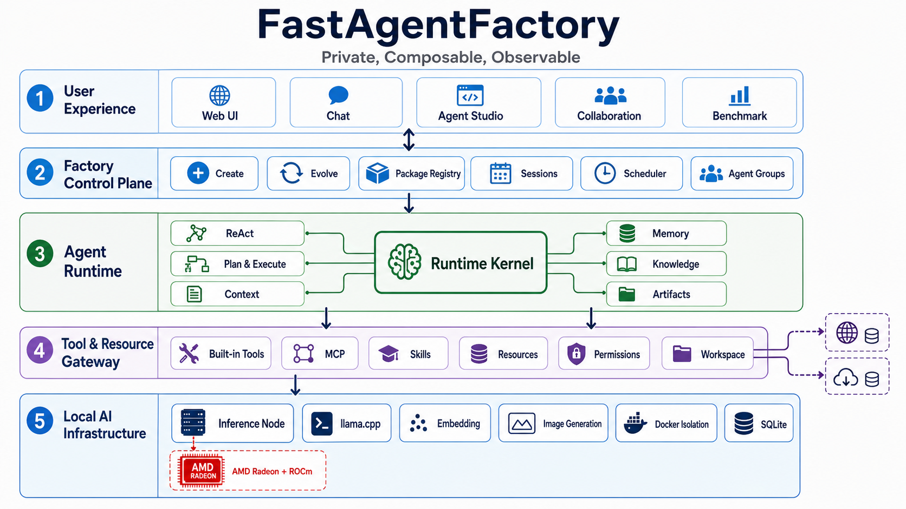

# FastAgentFactory 项目说明

## 项目定位

FastAgentFactory 是一套完全本地化、可制造、可组合、可审计的个人智能助手平台。系统把日常对话、跨会话记忆、本地知识、工具、资源、调度和工作流统一封装为 AgentPackage，并提供从制造、验证、发布、运行到进化的完整生命周期。

核心模型推理运行在 AMD Radeon GPU 与 ROCm 软件栈上。业务后端不依赖闭源 Agent 平台完成任务规划、工具调用、知识检索、多轮记忆或多 Agent 协作。

## 应用场景

### 个人知识与事务助手

用户可以挂载本地文件和知识库，由助手按需检索、引用并形成报告；也可以调用文档、网页搜索、定时任务、邮件和图片工具完成真实事务。资料、会话、记忆和交付文件均保存在受控本地工作区。

### 多 Agent 任务协作

主 Agent 根据目标选择已发布 AgentPackage、拆分子任务、并行调度子 Agent，并在交付后进行语义验收。适用于公司研究、组合风险、资料整理和跨工具工作流。

### 办公与自动化助手

Agent 可以在权限策略约束下读写工作区文件、调用邮件、网页搜索、定时任务和文档工具，完成从自然语言请求到文件交付的完整流程。

### 金融研究示例

个人智能助手可以协调三个内置 A 股专业 Agent：盘面雷达负责市场宽度、成交额与领涨结构；上市公司研究员负责行情、财务和趋势证据；持仓风险管家负责集中度、波动率、回撤、相关性和指定压力情景。主助手汇总各子任务，保存带数据来源、数据时间、异常说明和风险声明的报告，并可在用户授权后发送邮件。该示例用于展示复杂任务拆分、工具调用、多 Agent 协作和交付能力，不构成投资建议。

### 可制造的专属助手

Factory 可以从自然语言需求制造新的 AgentPackage，也可以基于运行 Trace 对现有包进行定向进化。用户不需要修改平台核心代码，即可为个人资料管理、办公自动化、研究分析或其他垂直任务配置专属助手。

## Agent 架构图

完整分层、组件职责和隔离边界见 [Agent 架构说明](AgentArchitecture.md)。

## 核心能力

### Agent 制造与进化

- 从自然语言目标生成完整 AgentPackage。
- 生成并校验 Pattern、Prompt、Tool、Skill、Knowledge、Resource 和依赖声明。
- 使用制造 Trace、工具探针和最终校验约束发布质量。
- 基于失败原因和用户目标对已发布 Agent 进行定向进化。

### 工具调用与工作流编排

- 支持 `react_agent` 与 `plan_and_execute`。
- 统一 Tool Gateway 管理 Schema、权限、资源和审计。
- 支持内置工具、MCP、Skill 和 Package 自有工具。
- 支持计划、重试、中断恢复、定时任务和文件交付。

### RAG、记忆与上下文治理

- 本地知识摄取、检索、打开和引用。
- 会话级与包级状态隔离。
- 按 Token 预算装配上下文并支持压缩。
- 记忆写入、查询和跨会话使用均有明确边界。

### 多 Agent 协作

- 主 Agent 搜索和选择子 Agent。
- 子任务具有独立会话、工作区、工具输出和交付状态。
- 调度器根据实际推理槽位提供背压。
- 子任务完成、失败或阻塞后主动恢复主 Agent。

### 权限、隐私和可观测性

- Agent 运行于逻辑隔离或独立 Docker Runtime。
- 文件系统限制在当前工作区边界内。
- Resource 值加密存储并按 Package 注入。
- Trace、工具调用、模型用量、任务状态和交付物可审计。

## 模型与本地部署

### 默认模型栈

| 用途 | 默认实现 | 运行方式 |
| --- | --- | --- |
| Chat | Qwen3.6-35B-A3B APEX GGUF | llama.cpp + ROCm/HIP |
| Embedding | BAAI/bge-m3 | Transformers + PyTorch ROCm |
| Image Generation | FLUX.1-dev Q4_0 | stable-diffusion.cpp + HIPBLAS |

模型 Profile 保存模型能力、上下文、输出上限、并发槽位、KV Cache、Flash Attention、MTP 和显存预算。推理节点提供加载、卸载、切换、容量估算、GPU 遥测和 Benchmark 接口。

### 部署拓扑

- `DEPLOY_TARGET=local`：Web、Agent Runtime 和 AMD 推理节点位于同一台 Linux/ROCm 主机，服务通过回环地址直连。
- `DEPLOY_TARGET=ssh`：Web 和 Agent Runtime 位于控制端，AMD 推理节点位于另一台主机，通过 SSH 隧道访问回环服务。

两种拓扑复用同一控制节点、模型 Profile 和 Benchmark，不维护功能降级的本机分支。详细步骤见 [部署与验收指南](Deployment.md)。

## AMD Radeon GPU 推理优化

仓库保留两套从同一 revision 构建的 llama.cpp：Official 作为不可修改的基线，AMD 版本承载项目自研 HIP Kernel。Benchmark 使用相同模型、上下文、KV Cache、采样参数和 Prompt 对两套实现进行成对测试。

当前已经记录并验证的优化包括：

- 复用同一 F32 激活的 Q8_1 临时量化结果，减少重复量化 Kernel。
- 融合 Residual Add、RMSNorm 和权重缩放，减少 Kernel 启动和中间显存往返。
- 为 RDNA3 Wave32 编写原生 Q6_K × Q8_1 MatVec Kernel。
- 通过 Kernel Catalog、Host Shape Trace 和 rocprof 证明自定义路径实际命中。
- 使用 MTP 推测解码，一次 Target 验证多个候选 Token，提升自回归生成吞吐。

在已归档的同条件五轮测试中，AMD 实现的正常服务 Decode 吞吐由 Official 的 `84.0867 tok/s` 提升至 `88.8320 tok/s`，综合提升 `5.64%`。该数值只代表归档测试环境，不承诺在其他模型、Shape、ROCm 版本或 GPU 上获得相同收益。

详细实现、对照路径和证据边界见 [推理优化说明](performance/ROCmOptimizations.md)。

## 稳定性与响应性能

- 推理容量根据实际 Slot、上下文分配和显存预算计算。
- 普通性能测试记录 Prefill、Decode、MTP、显存、功耗和 KV 前缀复用。
- 并发测试记录 QPS、聚合 TPS、错误率、TTFT P95 和请求延迟 P95。
- 算子分析使用 rocprof 与 GGML 图 Trace 归因，不把 Profiler 时间冒充正常服务性能。
- Agent Runtime 的容器、SQLite 连接、会话和工具输出采用明确隔离边界。

## 开源组件、模型和数据说明

第三方代码、模型权重和外部数据源使用不同许可证或服务条款，不能由项目代码许可证统一覆盖。完整清单和使用边界见 [README 第三方组件与许可证](../README.md#第三方组件与许可证)。

本项目不随仓库分发训练数据集。市场数据由运行时工具按请求访问第三方公开接口，用户需自行确认数据提供方的授权、频率限制和使用条款。
