# Agent 后端架构

FastAgentFactory 后端可以分为四个层次：接入层、Factory 控制面、AgentPackage 运行面和基础设施层。核心原则是把“管理哪个 Agent、哪个会话、哪些资源”与“当前 Pattern 节点如何执行”分离。

## 架构展示图

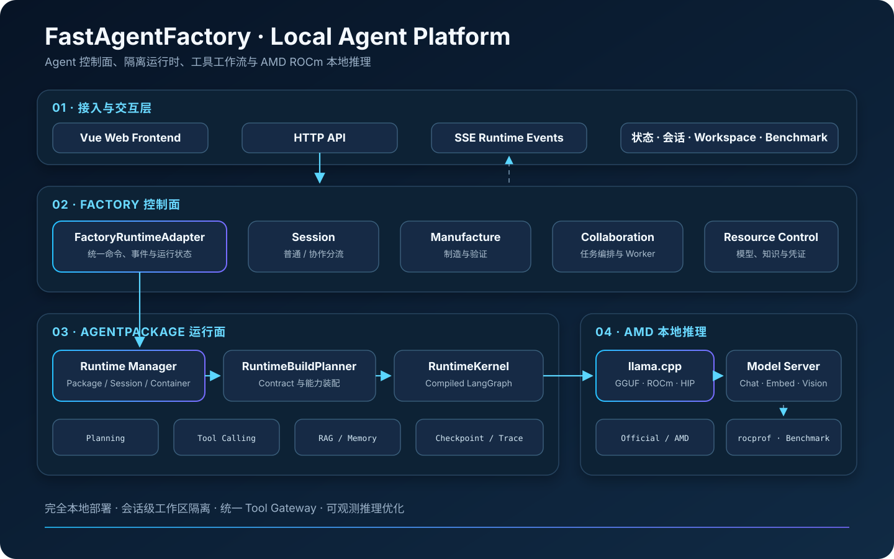

该图用于项目介绍和整体认知；下方 Mermaid 图与源码链接用于工程维护和实现核对。

## 1. 分层架构

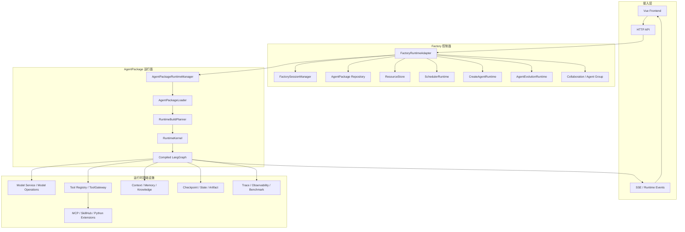

### 接入层

前端通过后端 API 发出会话、消息、包管理、Resource、Knowledge、Scheduler 和模型池命令；运行过程通过事件流返回。前端负责交互和展示，不负责拼装 RuntimeKernel，也不直接执行 Agent 工具。

### Factory 控制面

[FactoryRuntimeAdapter](../agent_factory/factory_graph/frontend_bridge/runtime_adapter.py) 是前端命令到后端运行时的统一适配入口。它通过 mixin 分派 session、AgentPackage、resource 和 scheduler 命令，并持有制造、进化与包运行管理器。

控制面的主要职责是：

- 确定当前 Factory 模式和会话；
- 选择、初始化、运行或关闭 AgentPackage；
- 管理制造与进化任务；
- 管理 Resource、Knowledge、Scheduler 和扩展；
- 把后端状态转换成统一前端事件；
- 处理取消、审批中断恢复和 shutdown。

### AgentPackage 运行面

[AgentPackageRuntimeManager](../agent_factory/factory_graph/frontend_bridge/agent_package_runtime.py) 负责加载包、准备工作区、选择 host/container backend、维护实例生命周期，并建立运行时与前端之间的事件桥。

真正的 Agent 执行由 RuntimeKernel 完成：加载 Package 后，RuntimeBuildPlanner 根据 Contract 构建服务和资源，PatternCompiler 再把 Pattern 编译为 LangGraph。

### 基础设施层

模型、工具、知识、记忆、工件、调度、状态和 Trace 以独立服务接入。它们不是 Pattern 中写死的全局单例，而是通过 Contract Builder 向当前包的 `RuntimeServices`、Tool Runtime Resources、system wrapper 或 background worker 作贡献。

## 2. 一次 AgentPackage 请求的生命周期

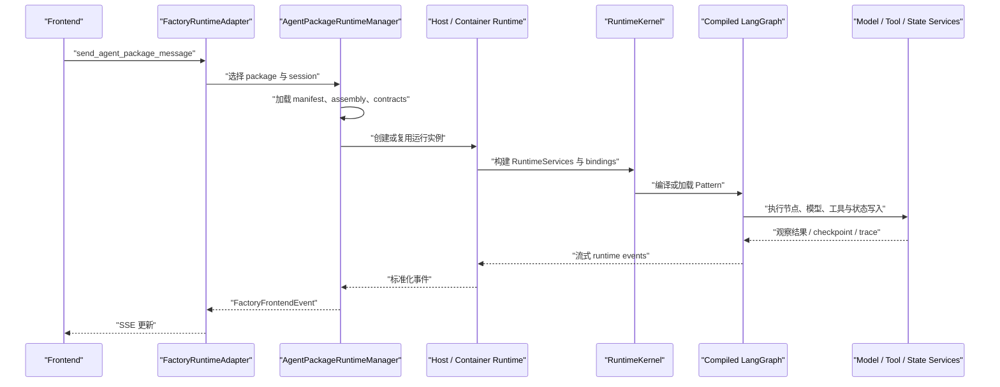

请求级用户配置会随本次运行进入 `RuntimeState.runtime_config.user_config`。模型覆盖、推理强度和协作工具范围等动态配置由节点执行时读取，而不是要求重新改写 AgentPackage。

## 3. RuntimeKernel 编译链

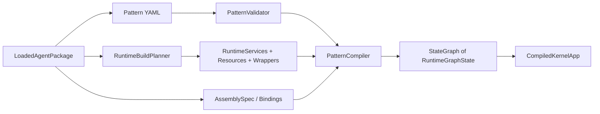

[PatternCompiler](../agent_factory/runtime_kernel/patterns/compiler.py) 会：

1. 从 PatternRegistry 取得 Pattern 并校验节点、边和实现引用；
2. 为每个 Pattern Node 筛选对应 Binding；
3. 从 NodeRegistry 解析节点实现；
4. 为节点包裹 wrapper、hook、Trace、状态校验和错误处理；
5. 把条件边映射到 LangGraph 路由；
6. 使用 Contract 提供的 checkpointer 和 memory store 编译图。

Pattern YAML 只定义拓扑和语义；模型实例、工具集合、知识库和会话持久化均由当前包的 Contract 与 Binding 注入。

## 4. 节点执行管线

每个节点不直接裸跑实现函数，而是经过 [node_runner.py](../agent_factory/runtime_kernel/patterns/node_runner.py) 的统一管线：

```mermaid
flowchart LR
    A["读取 RuntimeGraphState"] --> B["超时与完成检查"]
    B --> C["创建 Trace Span / node_entered"]
    C --> D["System Before"]
    D --> E["Pre Hooks"]
    E --> F["Node Wrappers Before"]
    F --> G["执行 Node Impl"]
    G --> H["校验 State Patch"]
    H --> I["Node Wrappers After"]
    I --> J["Post Hooks"]
    J --> K["路由、指标、Checkpoint"]
    K --> L["node_completed / 返回 Graph Patch"]
```

`NodeExecutionContext` 为节点提供当前节点 Binding、全部 Binding、RuntimeServices、图消息、RunnableConfig、LangGraph Runtime、渲染规范和事件出口。该设计允许节点实现保持稳定，同时由不同 AgentPackage 组合不同能力。

## 5. Host 与 Container 两种运行后端

普通 AgentPackage 默认进入 Docker Runtime；宿主系统包可走 Host Runtime。两者都运行同一套 Package/Contract/Kernel 语义，但隔离与资源访问方式不同。

| 维度 | Container Runtime | Host Runtime |
| --- | --- | --- |
| 适用对象 | 普通、用户制造的 AgentPackage | 受信任的系统包 |
| 文件边界 | 显式挂载 runtime、workdir、artifacts、extensions | 直接使用宿主受控路径 |
| 扩展接入 | 通过宿主 MCP/SkillHub Gateway URL | 可直接复用宿主服务 |
| 生命周期 | 由 launcher 创建、健康检查、空闲回收 | 由 system handle 管理 |
| 风险面 | 更强进程与文件隔离 | 权限更高，包范围应更严格 |

容器隔离不能替代工具审批。一个被允许访问外部系统的工具，即使运行在容器内，仍需要 Resource、风险策略和审批共同约束。

## 6. 控制流与数据流

系统中存在三类需要区分的流：

- **控制流**：前端命令、Pattern 边、节点路由、interrupt/resume、取消和 scheduler trigger。
- **模型上下文流**：会话消息、节点 Prompt、动态计划摘要、按配置检索的 Memory/Context。
- **运行数据流**：工具输入输出、知识命中、Artifact、Resource、Checkpoint、Trace 和状态 patch。

只有被模型节点显式组装的内容才进入模型上下文。运行数据存在于服务或工作区中，不代表自动注入模型。

## 7. 持久化边界

- Factory Session 保存前端会话和模式级状态。
- Agent Session/Checkpoint 保存 LangGraph 线程状态并支持恢复。
- Package State 保存 Contract 声明的业务状态 section。
- Memory Store 保存跨轮次或跨会话记忆。
- Knowledge Store 保存索引、文档元数据和检索数据。
- Artifact Store 保存交付物及引用。
- Trace Store 保存节点、工具和错误观测。
- Scheduler Store 保存 job、run 和 lease。

这些存储的生命周期不同，不应把 Trace 当聊天记录、把 Artifact 当 Memory，或把工作区文件存在视为 Knowledge 已索引。

## 8. AgentPackage、Contract 与 Binding

AgentPackage 是部署单元。Manifest 负责引用，AssemblySpec 负责执行组合，Contract 负责构建基础能力，Binding 负责把能力限制到具体节点。

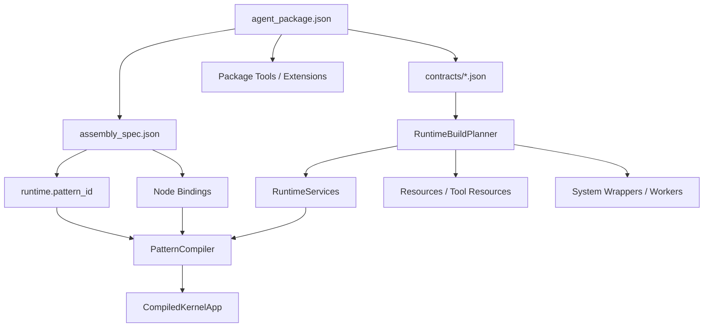

当前业务包必需声明 `session`、`resources`、`state`、`scheduler`、`knowledge`、`model`、`tools`、`memory`、`context` 和 `dependencies`。Trace 与 Artifact 是平台运行基础设施，由 RuntimeBuildPlanner 提供默认 Contract，不由普通包覆盖。

Contract 按依赖关系构建：

```text
session → resources → trace → state → artifact
→ scheduler → knowledge → model → tools
→ node_provider → memory → context → dependencies
```

这个顺序保证 Resource 先于 Tool、Artifact 先于图像模型工具、Knowledge/Scheduler 先贡献工具资源、Memory 先于 Context 装配。每个 Builder 返回 service、resource、tool runtime resource、system wrapper 或 background worker，再由 ContributionMerger 合并。

Binding 的 target 同时包含 `node_id` 与 `impl`。PatternCompiler 只把匹配 Binding 放进当前 `NodeExecutionContext`，因此同一个 `cognitive.answer` 实现可以在 planner、executor 和 final_answer 中拥有不同 Prompt、模型角色与工具权限。

关键源码：[schema.py](../agent_factory/runtime_contracts/schema.py)、[builder.py](../agent_factory/runtime_contracts/builder.py)、[assembly/schema.py](../agent_factory/assembly/schema.py)。

## 9. 两种 Agent Pattern

### `react_agent`

`react_agent` 是紧凑的对话工具循环，适合路径动态、无需独立计划状态的任务。

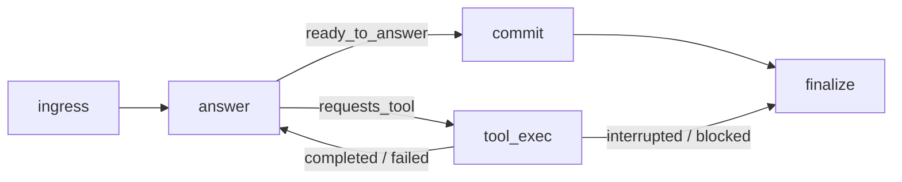

- `answer` 在每轮模型调用前动态筛选工具；
- `tool_exec` 执行工具并将 ToolMessage 返回 `answer`；
- 工具失败可让模型修正，审批中断则交给外层恢复；
- 连续性主要来自消息、ToolObservation 和 Checkpoint。

定义见 [react_agent.yaml](../agent_factory/runtime_kernel/patterns/builtins/react_agent.yaml)。

### `plan_and_execute`

`plan_and_execute` 适合需要明确计划、逐步执行和最终交付的复杂任务。

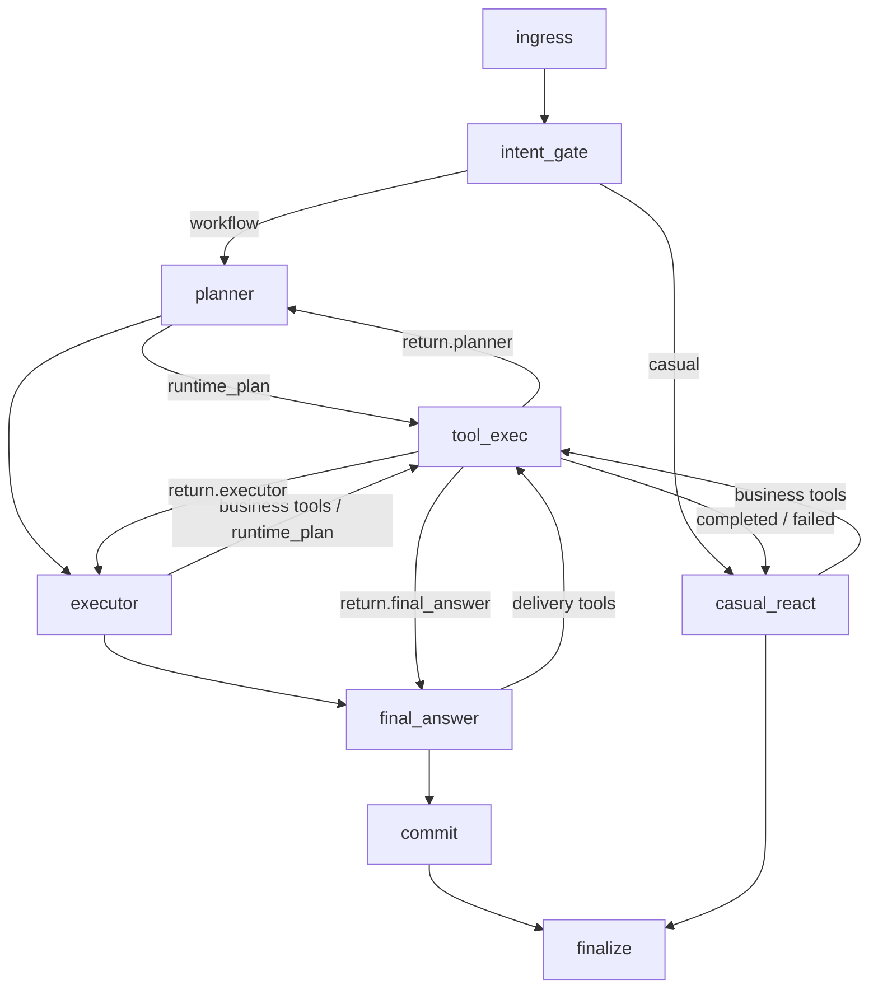

节点权限边界：

| 节点 | 工具职责 |
| --- | --- |
| `planner` | 只负责创建、查看和修订 `runtime_plan` |
| `executor` | 使用 `runtime_plan`、业务工具和允许的系统工具执行当前步骤 |
| `casual_react` | 使用普通业务工具，不得修改计划 |
| `final_answer` | 使用交付工具汇总结果，不得修改计划 |

`runtime_plan` 是 RuntimeKernel 内部工具。它由 [tool_call.py](../agent_factory/runtime_kernel/nodes/standard/tool_call.py) 与普通工具分流，再直接修改 `RuntimeState.plan`，不经过普通 ToolGateway。定义见 [plan_and_execute.yaml](../agent_factory/runtime_kernel/patterns/builtins/plan_and_execute.yaml)。

## 10. 工具动态绑定与 ToolGateway

ToolGateway 不是独立 LangGraph 节点，也不是外部微服务。`ToolCompiler.compile()` 为每个 ToolSpec 创建 Gateway，并把它捕获在 `invoke_tool` 闭包中；闭包包装成 LangChain `StructuredTool` 后进入 Registry。

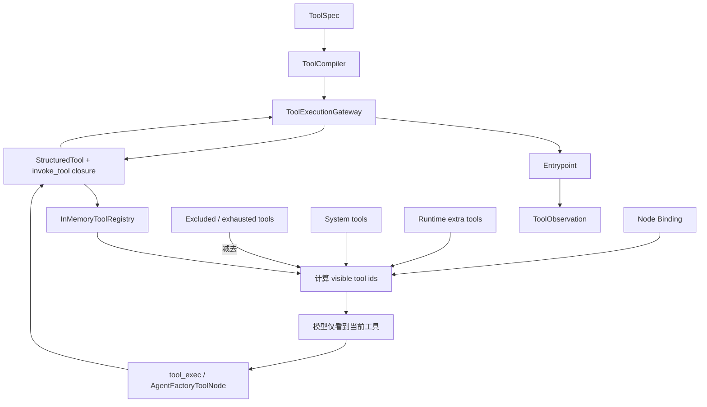

模型调用前的可见工具为：

```text
节点 Binding 允许工具
+ 运行时额外允许工具
+ 合法系统工具
- 运行时排除工具
- 循环预算耗尽工具
- Pattern 角色禁止工具
```

AIMessage 会记录 `origin_node_id`。`tool_exec` 在执行前按来源节点再次校验，避免调用 Registry 中存在但当前节点无权使用的工具。

ToolGateway 统一执行输入/输出 Schema、Resource 解析、风险评估、allow/ask/deny、审批 interrupt、entrypoint、结果投影/压缩/存储和 ToolObservation。Python、Builtin、MCP、SkillHub 与模型工具最终都进入受控 Registry；`runtime_plan` 是明确的内部例外。

关键源码：[tooling/compiler.py](../agent_factory/tooling/compiler.py)、[tooling/gateway.py](../agent_factory/tooling/gateway.py)、[answer.py](../agent_factory/runtime_kernel/nodes/standard/answer.py)。

## 11. Agent 制造架构

制造的输出是完整 AgentPackage，而不是一段 Prompt。入口会导入附件、分析任务、选择 Pattern、创建作者工作区，再由模型使用结构化作者工具生成并验证包。

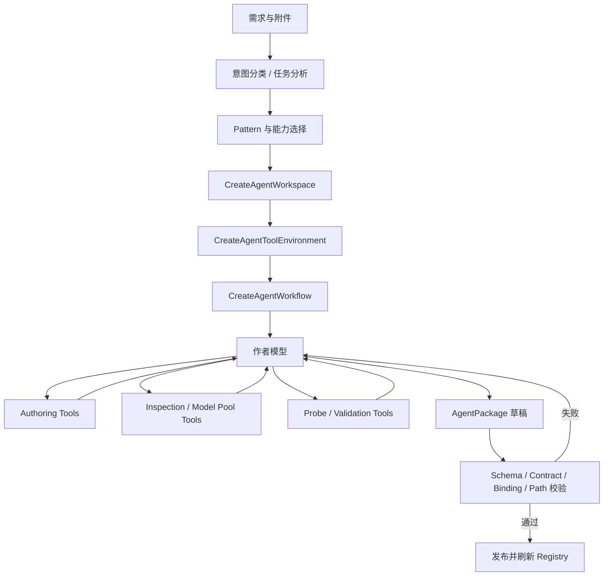

作者模型通过工具修改受控草稿，不能任意写宿主文件。制造工作流使用 Checkpointer 保存制造状态，并记录 manufacturing trace。`manufacture` 面向创建/完成 Package；`assist` 面向检查、解释和补充制造信息。

制造验证覆盖 manifest、Assembly、Contract、Pattern 引用、模型 Binding、ToolSpec、Resource requirement、路径和发布完整性。静态验证不能证明外部 API、模型 Endpoint 或 MCP Server 在线。

关键源码：[create_agent/runtime.py](../agent_factory/create_agent/runtime.py)、[create_agent/workflow.py](../agent_factory/create_agent/workflow.py)、[authoring_tool.py](../agent_factory/create_agent/authoring_tool.py)。

## 12. Agent 进化架构

进化针对已有 Package 做受控修改，不默认创建平行包。它先判断历史 Trace 是否相关，再判断目标是否确实属于 Package 层。

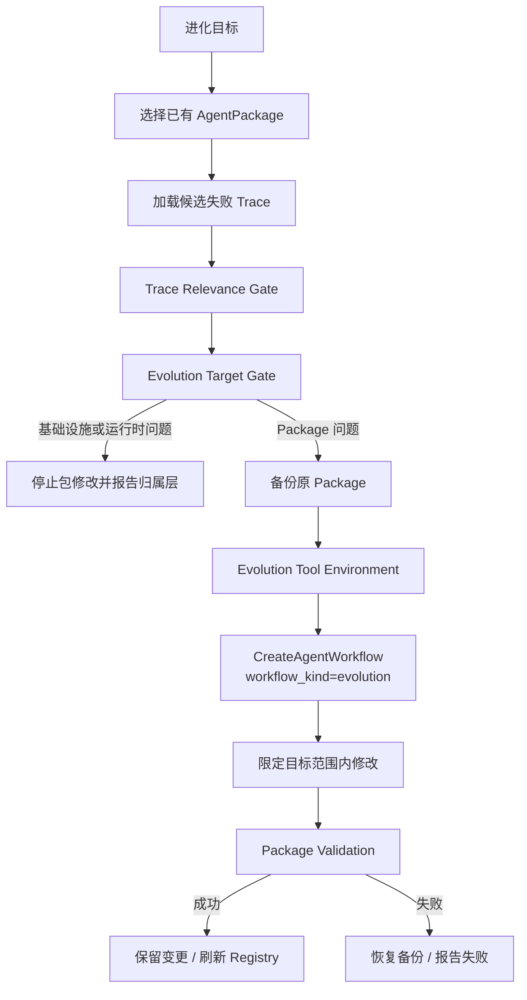

适合进化的问题包括 Prompt、节点职责、业务 Tool、Skill、知识声明、Resource requirement、Binding、Pattern 选择和输出格式。RuntimeKernel 通用缺陷、模型池/容器/网络故障、前端展示错误和外部服务故障不应通过修改业务 Package 掩盖。

Trace 只在该流程明确读取且通过相关性门控后成为进化证据，不是普通对话每轮自动注入的内容。

关键源码：[evolution/runtime.py](../agent_factory/evolution/runtime.py)、[trace_gate.py](../agent_factory/evolution/trace_gate.py)、[target_gate.py](../agent_factory/evolution/target_gate.py)。

## 13. 上下文、知识与运行数据边界

系统里“服务已构建”和“内容进入模型”是两回事：

| 数据类型 | 主要访问方式 | 默认每轮注入 |
| --- | --- | --- |
| 当前会话消息 | 模型输入投影 | 是，受窗口和压缩限制 |
| 跨会话 Memory | Context retrieval source | 仅相关候选，受预算限制 |
| Knowledge | `knowledge` 工具 search/open/read | 否 |
| Workspace / Resource | 文件工具或 Resource Resolver | 否 |
| Artifact | 工件引用或工作区检视 | 否 |
| Scheduler | scheduler 工具/API | 否 |
| Trace | 诊断、检视或进化门控 | 否 |

Context Contract 的 `max_items_total`、`max_tokens_total` 和 `per_source_limits` 只约束已注册且出现在 `source_ids` 的检索源。配置一个来源上限不会自动创建数据源，更不会让 Resource、Artifact、Knowledge、Scheduler 和 Trace 每轮各拼若干条。

## 14. 运行隔离与扩展边界

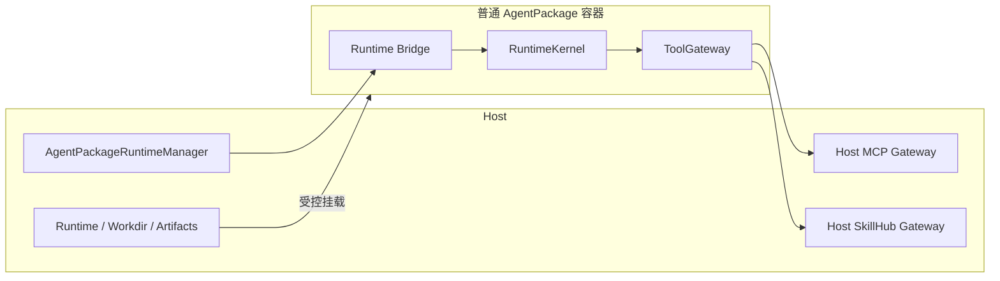

普通包使用 Docker Runtime，挂载 runtime、workdir、artifacts、extensions 和授权附件；宿主 MCP/SkillHub Gateway 向容器提供受控扩展。受信任系统包可以走 Host Runtime，但仍使用 Package/Contract/Kernel 语义。

容器隔离、节点工具权限、Gateway 审批、Resource 最小授权和 entrypoint 校验共同构成安全边界，任何单层都不能被 Prompt 约束替代。

## 15. 主要源码边界

| 子系统 | 入口 |
| --- | --- |
| 前端桥接 | [factory_graph/frontend_bridge](../agent_factory/factory_graph/frontend_bridge) |
| Package Runtime | [agent_package_runtime.py](../agent_factory/factory_graph/frontend_bridge/agent_package_runtime.py) |
| RuntimeKernel | [runtime_kernel](../agent_factory/runtime_kernel) |
| Runtime Contracts | [runtime_contracts](../agent_factory/runtime_contracts) |
| Tooling | [tooling](../agent_factory/tooling) |
| 制造 | [create_agent](../agent_factory/create_agent) |
| 进化 | [evolution](../agent_factory/evolution) |
| 协作 | [collaboration_system](../agent_factory/collaboration_system) |
| Scheduler | [scheduler_system](../agent_factory/scheduler_system) |
| Model Pool | [model_pool](../agent_factory/model_pool) |
